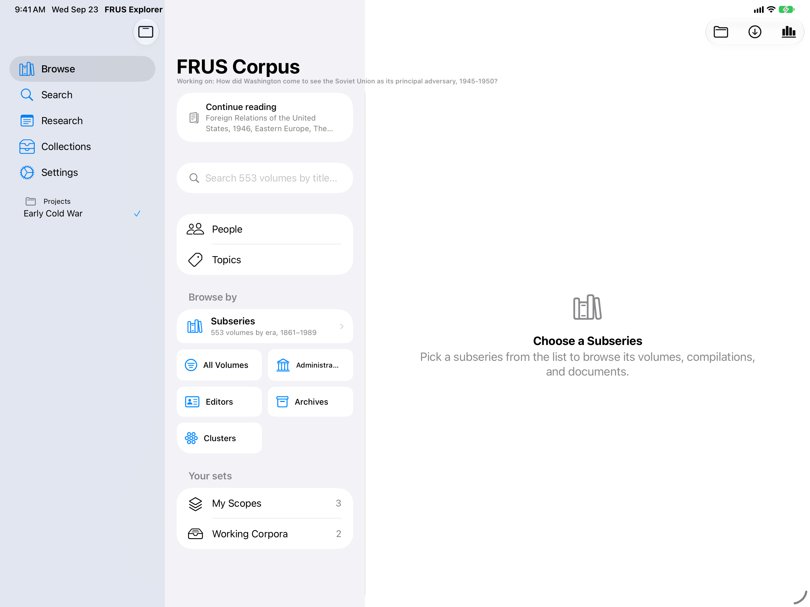
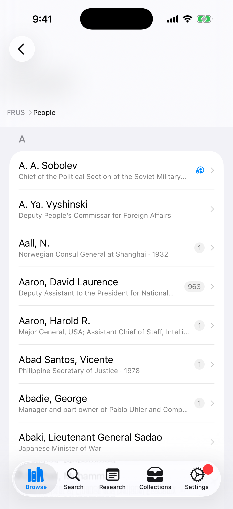
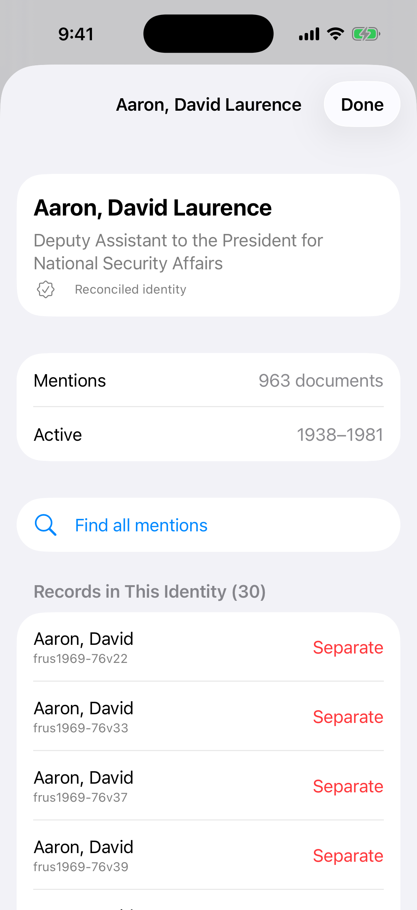
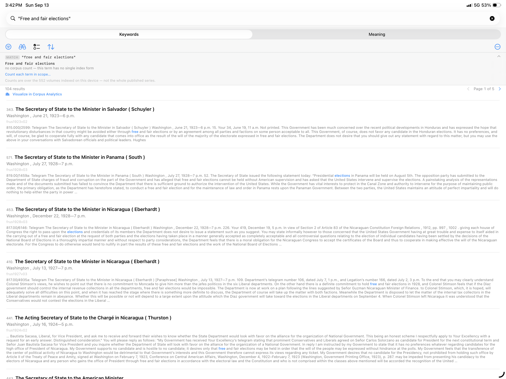
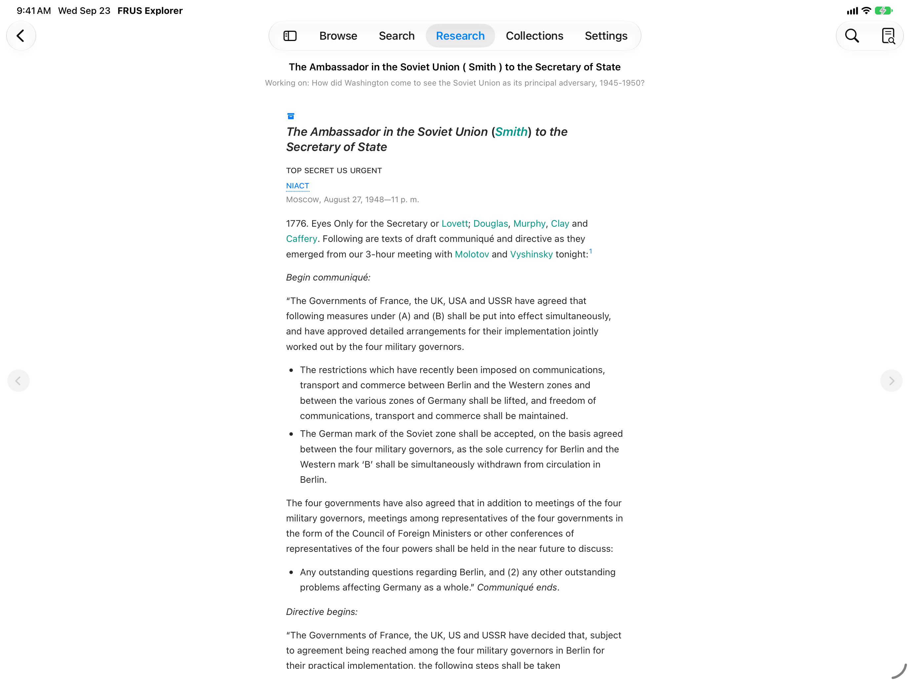
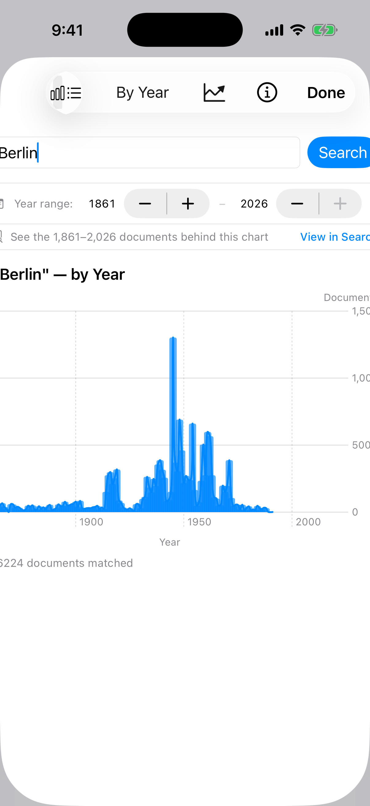
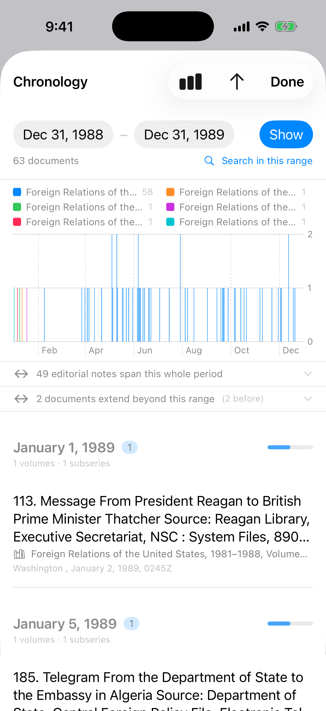

# FRUS Explorer for iPad and iPhone — User Manual

> **Foreign Relations of the United States Explorer** — *Research the official record of U.S. foreign policy since 1861*

This manual is written for a first-time user coming to FRUS Explorer for graduate-level research and teaching. It assumes you know your way around historical research — footnotes, finding aids, Zotero, Chicago style — but that you have never opened this app before. It is written for the **iPad first**, because a full-screen iPad with a keyboard is the best portable environment the app runs in; everything here also works on iPhone, and the places where the iPhone presents things differently are called out as they come up. (If you work on a Mac, there is a separate [macOS manual](macOS-User-Manual.md) covering the same features in that app's windowed interface.)

---

## Table of Contents

1. [Welcome: What FRUS Explorer Is](#1-welcome-what-frus-explorer-is)
2. [Getting Started](#2-getting-started)
3. [A First Session](#3-a-first-session)
4. [The Interface on iPad](#4-the-interface-on-ipad)
5. [Building Your Library](#5-building-your-library)
6. [Browsing the Corpus](#6-browsing-the-corpus)
7. [Searching](#7-searching)
8. [Reading Documents](#8-reading-documents)
9. [Notes, Highlights, and Tags](#9-notes-highlights-and-tags)
10. [Projects](#10-projects)
11. [Citing and Reference Managers](#11-citing-and-reference-managers)
12. [Collections: Research Packets and Course Readers](#12-collections-research-packets-and-course-readers)
13. [AI Summaries](#13-ai-summaries)
14. [Source Explorer: From Source Note to Archive](#14-source-explorer-from-source-note-to-archive)
15. [Analytics](#15-analytics)
16. [The FRUS Research Guide and About the Series](#16-the-frus-research-guide-and-about-the-series)
17. [Settings Reference](#17-settings-reference)
18. [Workflows for Research and Teaching](#18-workflows-for-research-and-teaching)
19. [Quick Reference](#19-quick-reference)

---

## 1. Welcome: What FRUS Explorer Is

*Foreign Relations of the United States* is the State Department's official documentary record of American foreign policy — more than 550 volumes published since 1861, containing declassified diplomatic cables, policy memoranda, meeting minutes, and intelligence reports. If you work on the history of U.S. foreign relations, you have almost certainly used it, whether from the printed volumes, the microfiche, or history.state.gov.

FRUS Explorer puts the entire digitized series on your iPad as a fully **offline** research tool, and then builds a research workbench around it. Concretely, it lets you:

- **Download and index** any subset of the corpus — one volume, a publication era, or all 552 volumes — for instant full-text search on your device, with no network connection needed afterward.
- **Read** documents rendered from their original TEI encoding, with footnotes, editorial notes, and cross-references intact and tappable.
- **Annotate** with research notes, colored highlights, and your own tags, all synced across your devices through iCloud.
- **Organize by project**, so the notes and collections for your dissertation chapter never mix with the ones for the course you're teaching.
- **Cite** in the State Department's recommended style, copy citations as BibTeX or RIS, and push documents straight into your **Zotero** library.
- **Build collections** — curated, ordered, sectioned sets of documents with your own connecting prose — and export them as PDF, HTML, or Word files. This is how you assemble a source packet for a seminar paper or a **course reader for your students**.
- **Trace provenance** with Source Explorer, which parses each document's archival source note and resolves it against the National Archives catalog — including the file-series and entry numbers you would quote on a pull slip at NARA.
- **Analyze at scale**: chart term frequency over 130 years, follow individual people across the whole series, map the citation network, see which archival collections each era's editors drew on, and export any chart as a publication-ready figure with its method recorded alongside.
- **Keep a defensible record** of your own work: the app can log every search you run with its scope and result count, and export that trail as a **method appendix** you can cite.

Two design commitments run through everything and are worth knowing on day one, because they will shape how you read the app's numbers:

- **Offline first.** Everything essential works without a network connection. Search, reading, annotation, analytics, and most archival resolution run entirely on your device; the series-wide reference data (the archival authority, the citation graph, the About the Series dashboards) ships inside the app.
- **Honest numbers.** When a figure covers only part of something — your indexed volumes rather than the whole series, the first 5,000 documents of a larger match, a capped candidate pool — the app says so on the surface where the number appears, and its exports record the method. For a researcher, that footnote discipline is the difference between a number you can put in a paper and one you can't.

All of your research data — notes, tags, collections, highlights, projects — syncs automatically across every device signed into the same iCloud account, so a note made on your iPad in the library is on your iPhone on the bus and on your Mac at your desk.

---

## 2. Getting Started

### 2.1 Requirements

FRUS Explorer requires **iPadOS or iOS 26 or later**. Full-text search and document rendering work on every supported device. AI summarization (Section 13) additionally requires a device with **Apple Intelligence** enabled.

### 2.2 Installation

Install FRUS Explorer from the App Store — search for "FRUS Explorer" or follow a direct link from the publisher.

### 2.3 Onboarding

The first launch walks you through a short setup. The backdrop is a **word cloud drawn from the series itself**, cycling every few seconds through four views of the vocabulary — **Concepts**, **Topics**, **Actions**, and **Sentiment** (positive words green, negative red) — with a small chip naming whichever you are looking at. The words are real: they are counted from the actual FRUS text at build time and shipped with the app, so the cloud appears before you have downloaded anything.

**Step 1 — Welcome.** A one-line introduction to the series. Tap **Get Started**.

**Step 2 — Add Volumes.** Choose how much of the corpus to download now:

| Option | Description |
|--------|-------------|
| **Corpus** | All 552 volumes in the bundled catalog (about 3.3 GB; downloading takes a while depending on your connection and free storage) |
| **Subseries** | One publication era — e.g., *1969–1976* (Nixon/Ford) or *1977–1980* (Carter) |
| **Volume** | One specific volume, chosen from a grouped picker |

Choosing *Subseries* or *Volume* opens a short list; whatever you pick, the word cloud behind the panel re-aggregates to preview that material's vocabulary — pick the 1969–76 subseries and the cloud becomes that era's language (*kissinger, nixon, soviet, capability, balance*) before you commit to the download. Estimated storage requirements appear before you confirm. If you start the download while offline, it queues and resumes once you're back online.

**Step 3 — Ready.** A confirmation that your volumes are downloading, plus a note that a starter research project named **"My Research"** has been created for you. Projects organize notes, tags, and collections around one research effort (Section 10); rename it or add more at any time. Tap **Finish** — the app opens to the Browse tab and downloads and indexes in the background while you explore.

> **How much should you download?** You can always add or remove volumes later from **Settings → Volumes & Storage**, so this choice is not binding. A reasonable start for a graduate student: download the **subseries covering your research period** now (a subseries is usually a manageable fraction of the 3.3 GB corpus), and add neighboring eras as your project's chronology firms up. If your iPad has the space, the whole corpus is the most powerful configuration — corpus-wide search and analytics sharpen with every volume you index — and you can reclaim space later with **Free Up Space** (Section 17.2). Note that a fair amount of the app works before you download anything at all: the About the Series dashboards, the archival collection authority, and the volume-level Top Subjects all ship inside the app.

### 2.4 The Embedded Browser

Wherever FRUS Explorer links to an external resource — onboarding, About, the Research Guide, Source Explorer, or a NARA Catalog lookup — the link opens in a built-in browser sheet rather than leaving the app. Dismiss the sheet (close button or a downward swipe) and you are exactly where you were, with your document or search untouched.

---

## 3. A First Session

Fifteen minutes, one document, most of the core workflow. This walkthrough assumes at least one volume has finished indexing (the banner above the tab bar tracks progress — Section 4.8).

1. **Browse to a document.** In the **Browse** tab, tap **Subseries**, then a subseries, then a volume, then a chapter, and open any document. It renders as readable prose — heading, dateline, body, footnotes — laid out for your screen. (Or just type a title into the search field at the top of the tab.)

2. **Read without clutter.** The document toolbar carries a single control: the **Research-rail toggle** (a `doc.text.magnifyingglass` button). With the rail hidden you are in **Read mode** — a clean page, where tapping near the left or right screen edge turns to the previous or next document in the volume, like paging through a book (Section 4.4).

3. **Highlight a passage.** Select a sentence with your finger or Apple Pencil. A dark pill — the **floating selection bar** — appears just below the selection. Tap one of its four **color dots** and the passage is highlighted in that color, permanently and across your devices. There is no separate highlight mode to enter or leave.

4. **Attach a note.** With text selected, tap **Note** on the same bar and type a thought. The note is saved to this document, filed under your active project, and searchable later.

5. **Open the Research rail.** Tap the rail toggle. On iPad the rail slides in as a panel beside the document; it opens with a grid of six tiles — **Cite**, **Word Cloud**, **Sources**, **Graph**, **Related**, **Share** — above expandable **Summary**, **Notes**, **Tags**, and **Collections** sections. This rail is the per-document research surface; everything you do *about* a document (rather than *in* it) starts here.

6. **Take the citation.** Tap **Cite**. The document's fully formatted citation appears in the State Department's recommended style, with **Copy Citation** and **Copy as…** BibTeX or RIS. If you connect Zotero later (Section 11.3), the **Share** tile can push the document straight into your library.

7. **Check where it came from.** Tap **Sources**. Source Explorer parses the document's archival source note — the lot file, decimal file, or presidential-library collection the original sits in — and, where it can, resolves it to the National Archives catalog record (Section 14). For an archives-bound researcher this tile alone justifies the app.

8. **Search.** Switch to the **Search** tab and run a query — try a phrase in quotes. Each result shows a highlighted snippet, the citation, and the date; tap one and the document opens scrolled to the match. Tap **Back** and your results are still there.

9. **Save what worked.** In the search actions bar, tap **•••** → **Save this search**. Saved searches keep their full filter set and sync across your devices.

That is the loop — find, read, mark, cite — and the rest of this manual is depth on each part of it, plus the tools that operate on the corpus as a whole.

---

## 4. The Interface on iPad

### 4.1 Five Tabs

FRUS Explorer is organized around five destinations. On iPad they appear as the standard iPadOS adaptive tab bar — a compact tab strip at the top of the screen that you can expand into a **sidebar** — and on iPhone as a bottom tab bar. Switching tabs preserves your place in each one, so you can move between browsing, searching, and your notes without losing your spot.

| Tab | Icon | Purpose |
|-----|------|---------|
| **Browse** | books.vertical | Navigate the corpus by subseries, volume, and document; switch your active research project; open the **Analysis Tools** menu (Chronology, Corpus Analytics, Word Cloud, Person Analytics, Cross-Reference Analytics, Archival Analytics, Semantic Analytics) |
| **Search** | magnifyingglass | Full-text search across your downloaded volumes; look up a document directly by citation |
| **Research** | note.text | Your personal workspace — all notes, highlights, and tagged documents in one place, organized by collection, tag, or highlight color, plus your reading History |
| **Collections** | tray.2 | Build, edit, and export curated sets of documents — source packets and course readers |
| **Settings** | gear | iCloud status, display preferences, downloads and storage, tags, summarization, integrations, the Research Guide, and About |

### 4.2 The Document Toolbar and the Research Rail

When a document is open, its toolbar carries a **single control**: the **Research-rail toggle** (a `doc.text.magnifyingglass` button), accent-tinted while the rail is open. Everything you do to or about a document lives in two surfaces this toggle and your text selections summon — the toolbar itself stays out of the way of reading.

**The Research rail** is the per-document research surface. On iPad it slides in as a trailing **inspector panel beside the document**, so the text and your research tools are visible at once; on iPhone it rises as a bottom sheet you can drag between medium and large heights. It opens with a **RESEARCH** header, then a **3×2 grid of tiles**:

| Tile | What it opens |
|------|---------------|
| **Cite** | The formatted citation, with Copy and Copy as… BibTeX/RIS (Section 11) |
| **Word Cloud** | A word cloud of this document (Section 15.2) |
| **Sources** | Source Explorer for this document's archival source note (Section 14) |
| **Graph** | The cross-reference graph around this document (Section 8.6) |
| **Related** | A ranked list of the documents most related to this one (Section 8.5) |
| **Share** | Zotero send, Zotero-file export, and citation sharing (Section 11) |

Below the tiles sit four expandable accordions — **Summary** (AI summaries, Section 13), **Notes**, **Tags**, and **Collections** (Sections 9 and 12) — and, at the bottom, a compact **Classification** block. On iPad the rail header also carries an **Open in New Window** icon for Stage Manager (Section 4.5).

**Classification** shows whether the app treats what you're reading as a *document* or an *editorial note*, and lets you correct it. FRUS's own tagging is occasionally wrong — a substantive document marked as an editorial note, or the reverse — and because the app trusts that tagging, the mistake reaches the type badge, search's document-type filter, counts, and exports. **Reclassify as Document…** / **Reclassify as Editorial Note…** records your correction: the body restyles immediately, every filter and badge follows it on all your devices, and the block then shows what FRUS tags it as so the disagreement stays visible. The correction is fully reversible — **Restore FRUS's Classification** here, or manage all of your corrections (with per-row Undo) under **Settings → Search → Classification Corrections…**. One caveat the confirmation dialog also states: the bundled series-analytics dashboards are computed from the published corpus and cannot see your corrections.

`[SCREENSHOT: iPad document view with the Research rail open as a trailing inspector — the RESEARCH header, the 3×2 tile grid, and the Summary/Notes/Tags/Collections accordions beside the document text]`

### 4.3 The Floating Selection Bar

Select any passage in the document body and a dark pill appears just below it with the actions that operate on a selection:

- Four **color dots** — tap one to highlight the selection in that color (Section 9.1).
- **Excerpt** — capture the selection as a verbatim quotation into a collection (Section 12.4).
- **Look Up** — run a NARA Catalog lookup on the selected text (Section 14.2).
- **Note** — attach a research note (Section 9.2).

For a selection inside a footnote, the color dots and Excerpt are disabled; Look Up and Note remain available.

### 4.4 Read Mode and Research Mode

The rail toggle switches between two ways of being in a document:

- **Read mode** — rail hidden; a clean, distraction-free page for close reading. Read mode enables **edge-tap page-turning**: invisible tap zones along the left and right screen edges move to the previous or next document in the volume, so you can read straight through a compilation without returning to the table of contents. (The zones are suppressed while the rail or any sheet is open, so a drag near the edge controls the sheet rather than turning the page.) A page-turn *replaces* the document you are reading rather than stacking another level, so however far you page, one **Back** tap leaves.
- **Research mode** — rail shown; you read and annotate with the tiles and accordions at hand.

On iPad, the **Open Documents In** setting can default newly opened documents to Research mode, since the rail sits beside the text rather than over it. On iPhone the rail never rises on its own — it is always summoned with the toggle, so the bottom sheet can't cover a document you only meant to read.

### 4.5 Working in Multiple Windows (Stage Manager)

On iPads that support Stage Manager, FRUS Explorer is a genuinely multi-window app — the closest the iPad comes to a desktop research setup:

- **Documents in their own windows.** Tap **Open in New Window** in the Research rail's header to pop the current document out, then arrange it beside other FRUS Explorer windows or other apps — two documents side by side, or a reference document beside the one you're annotating. A popped-out window reads on its own: cross-references and edge-taps navigate *inside* it, with its own Back button.
- **Tools as windows.** The **cross-reference graph**, **Source Explorer**, **Archival Neighbors**, and **Related Documents** each open as their own window rather than a sheet, so a graph or a ranked work list stays open beside the document you're reading. Tapping a result in an Archival Neighbors or Related Documents window opens that document in the main window while the list stays put — a work list you step through.
- **Windows restore.** These windows come back across relaunch with their state intact — a Related Documents window returns with its document, scope, and weight tuning.
- **Independent tabs.** Each window keeps its own tab selection: switching to Search in one window doesn't switch the others, and an action that hands you to another tab (a "Find all mentions" search from a person sheet, say) brings the right tab forward in one window only.
- **Arriving from outside.** A Spotlight result, a Handoff from another device, or an opened `.fruscollection` file lands in the window it brings forward, with that window's tab switching to match.

`[SCREENSHOT: Stage Manager on iPad — a document window beside a Related Documents window, with the main window behind]`

### 4.6 Hardware Keyboard, Trackpad, and Apple Pencil

With a keyboard or trackpad attached, the app supports standard navigation shortcuts (moving between search results and document sections) and trackpad gestures for scrolling, selecting text for highlights, and navigating back and forward — an iPad with a Magic Keyboard is a capable laptop replacement for a long reading session. **Apple Pencil** selection is precise enough for fine-grained highlighting — a single clause, or one name inside a longer sentence.

### 4.7 On iPhone

Everything in this manual works on iPhone; the presentation differs in a few consistent ways, gathered here so the rest of the manual can stay iPad-first:

- The five tabs sit in a **bottom tab bar**; Browse adds a **breadcrumb trail** at the top of the screen showing your position in the hierarchy, with a tap jumping to any earlier level. (On iPad, the sidebar and the back button cover the same navigation, so there is no breadcrumb bar.)
- The **Research rail** is a bottom sheet with medium and large heights rather than a side panel.
- Tools that open as Stage Manager windows on iPad — the graph, Related Documents, Archival Neighbors — open as **sheets**, each with a Back button so you can still step through a work list without the sheet closing on every open.
- The **Collections** editor uses a segmented Outline / Preview control instead of two side-by-side columns (Section 12.2).
- Some analytics toolbars fold their secondary controls into an **Options (•••)** menu to fit the narrow screen (Section 15.1).
- On iPhones with a Dynamic Island (iPhone 14 Pro and later), starting a download presents a **Live Activity** — a glanceable progress indicator visible from the Lock Screen and Dynamic Island, so you can track indexing without returning to the app.

### 4.8 While the App Works: Banners, Waits, and Picking Up Again

**The indexing banner.** While volumes download and index, a banner above the tab bar shows progress for the current volume and, when several are queued, your position in the queue with an estimated time. The banner tracks the whole **queue**: download a subseries and it appears once, when indexing begins, and stays until every volume is searchable — the volume named inside it changes as work moves along. When the queue finishes, the banner becomes a brief summary card ("*27 volumes ready to search*") offering to search what was added. A dot badge on the **Settings** tab marks downloaded volumes still waiting to be indexed. Tapping a name mentioned in the banner — a person discovered during indexing — can jump straight to a search for that name.

> **After an app update:** occasionally an update improves how documents are indexed and needs to rebuild the search index for volumes you already have. When that happens, indexing runs by itself right after you update — the banner explains what's happening, and your reading isn't interrupted.

**Waits are dressed honestly.** On a first launch, while iCloud pulls your research down, or during a long search, the drifting word cloud fills the otherwise-empty screen — and it clears when the wait actually ends, not on a timer. It never paints over a list you are reading. While the search index is still opening (longer the more you have downloaded), surfaces that need it say **"Preparing your index…"** rather than reporting that nothing is there.

**Picking up where you left off.** iPadOS and iOS close backgrounded apps to reclaim memory, so a relaunch is common even when you didn't quit. When it happens, the top of the Browse tab offers **Continue reading** with the last document you had open — one tap to return. Nothing opens by itself, and you can swipe the offer away. It comes from your reading history, so it survives reinstalls and follows you to another device; a document whose volume you have since removed is skipped rather than offered.

### 4.9 Discovery Tips

A few of the app's most useful controls are also its least visible — the Research-rail button is a single unlabeled glyph, and the page-turn edges are invisible by design. The first few times you reach one, a small tip appears beside it saying what it does: the Research button, the edge zones, the binoculars menu's four readings of a result set, and the fact that facet rows are filters. Each tip retires the moment you use the control it points at, and none of them block what you were doing. To bring them back after dismissing them, use **Show Tips Again** in **Settings → Reading & Search → Display**.

---

## 5. Building Your Library

Your library — which volumes are on your device, and which are indexed for search — is the foundation everything else stands on. Search, analytics, and the People browser cover exactly the volumes you have indexed, and say so.

### 5.1 Downloading Volumes

Three routes, all equivalent:

- **From the browser.** Volumes you haven't downloaded are still browsable. Opening one shows a **Download Volume** button in place of its contents; tap it and the page tracks the download live, loading the volume's contents automatically when it finishes. You can also **long-press** a volume in the list and choose **Download Volume** to queue it without opening the page.
- **From a dead end that isn't one.** Anywhere you reach a document in an undownloaded volume — a cross-reference inside another document, a citation-lookup result, a graph node — the app offers to download the volume rather than dead-ending.
- **In bulk.** **Settings → Volumes & Storage → Add Volumes → Download from GitHub…** opens the full browse list for queueing many volumes at once. (**Sideload XML File…** imports a volume file you obtained separately.)

Downloads queue; progress appears in the indexing banner (Section 4.8) and in Settings. **Options** in Volumes & Storage sets concurrent downloads and whether cellular downloads are allowed.

### 5.1a Side-Loaded Volumes

**Sideload XML File…** exists for volumes you obtained somewhere other than the published
catalog — a pre-release copy, a corrected file, a volume you archived yourself. A side-loaded
volume is a full citizen almost everywhere: it appears in Browse under its own subseries with a
real title (the app reads the volume's own TEI header, with the same parser that built the
catalog), it is searched, indexed, and browsable like any download.

Four things are deliberately different, and each is the honest consequence of the file not being
the catalog's:

- Its row in Browse carries a **Side-loaded** label, and subseries counts list side-loaded
  volumes separately — so the published count always matches the published series.
- Citations from it carry a note instead of a history.state.gov link: the app has no catalog
  record, so it **cannot confirm the document is published**, and a citation that claims less is
  safer than one that claims wrongly.
- **Check for Corrections** skips it — there is no published copy to compare against.
- Removing it is final: **the app cannot download it again.** The remove dialog says so; if you
  no longer have the file, keep the volume.

### 5.2 Indexing

Indexing is what turns a downloaded volume into a searchable one — it parses the TEI XML into the full-text index, the person index, the cross-reference table, and the date table. It runs automatically when a download completes, and the banner narrates it. **Index Remaining** (in Volumes & Storage → Storage & Index) indexes anything downloaded but not yet searchable; a **Needs Attention** section appears only when volumes were interrupted mid-index.

### 5.3 Managing Storage

**Settings → Volumes & Storage** is the single destination for the corpus on your device (Section 17.2 walks the whole pane). The essentials:

- A **Storage used** bar splits usage into XML and index, with a line saying how many volumes you hold and whether anything needs attention.
- **Free Up Space…** lists only volumes with nothing of yours attached — no notes, highlights, or tags — ordered by what you would recover, and asks before removing anything.
- **Keeping Current → Check for Corrections** compares your copies against the published ones; updating re-downloads and re-indexes a volume with your notes, highlights, tags, and summaries preserved. The Office of the Historian does occasionally correct published volumes, so this is worth running before you cite something contentious.
- Your annotations are never touched by any storage or index operation — removing a volume removes the text, not your work, and re-downloading it reattaches everything.

---

## 6. Browsing the Corpus

The **Browse** tab navigates the series by its own structure: subseries (publication eras) → volumes → chapters → documents — and, from its root, by other ways in.

[SCREENSHOT: Browse root — the search field, the People and Topics rows, and the "Browse by" tiles.]

### 6.1 The Browse Root

The root of the Browse tab opens with a **search field** over all 552 volumes — type any part of a title or a volume number (*China*, *frus1969*) and matching volumes appear immediately; tap one to open it. Below the search sit the two cross-volume indices — **People** (Section 6.5) and **Topics** (Section 6.2a) — and then a **Browse by** grid of doors into the series:

- **Subseries** — the classic era-by-era hierarchy (Section 6.1a).
- **All Volumes** — one catalog of every volume (Section 6.1b).
- **Administrations** — volumes filed by the presidency their documents cover (Section 6.1c).
- **Editors** — volumes filed by the editors named on their title pages (Section 6.1d).
- **Archives** — volumes filed by where their documents came from (Section 6.1g).
- **Clusters** — documents grouped by the language they share, computed from the text (Section 6.1h).

Below the grid, **Your sets** holds the collections you assemble yourself — **My Scopes** (Section 6.1e) and **Working Corpora** (Section 6.1f).

### 6.1a The Hierarchy

Tap **Subseries** for the era directory, then a subseries — *1969–1976*, say — to see its volumes; tap a volume for its table of contents, each document labeled with number, heading, and date. Long volume titles wrap onto a second line rather than truncating. A toggle in the Browse toolbar limits the list to **downloaded volumes only** — useful when you want to see exactly what's available offline, on a flight or in an archive basement. Subseries and volume rows now show a **document count** for every volume — even ones you haven't downloaded — alongside the publication year and the download/index badges.

### 6.1b The All Volumes Catalog

**All Volumes** lists the whole series in one place, with a search field and a control that arranges it four ways:

- **Title** — filed A–Z by each volume's *distinctive* title segment (*China, 1969–1972*), since almost every full title begins with the same series boilerplate. Early annual volumes, whose distinctive part is just a year, file under **#** at the end.
- **Published** — newest first, grouped by decade. This is the **print year** from each volume's title page, not a declassification or release date; for the early annual volumes, publication year and coverage year are roughly the same thing.
- **Era** — the subseries grouping, flattened into one list.
- **Length** — largest first, by document count.

The counts are FRUS document divs from the app's bundled index; a search inside a volume can return a few more rows, because prose sections such as prefaces are searchable but aren't numbered documents.

[SCREENSHOT: All Volumes catalog — the segmented Title/Published/Era/Length control with decade headers in Published order.]

### 6.1c Administrations

**Administrations** lists every presidency from Lincoln on, in order, with its reach — how many volumes and documents *cover* it. Coverage means the documents' own dates: a volume is filed under the administration in office when its documents were written, never by when the volume was published. A volume spanning two administrations appears under both, and the index says so up front. Administrations FRUS has not yet reached (Clinton onward) stay visible but dimmed, with the reason.

Tap an administration for its volumes, largest share of the term's documents first. Each row shows how many of that volume's documents date to the term and what share of the volume that is — and a volume that also belongs to a neighboring administration carries an inline *"Also under …"* note.

[SCREENSHOT: Administrations index with the dimmed post-corpus presidencies, and the Truman drill with per-volume shares.]

### 6.1d Editors

**Editors** is an alphabetical index (by surname) of the volume editors — the historians named on each title page. Tap an editor for their volumes in publication order. Two honest limits, both stated on the screen: 81 early volumes name no editors at all, so the index cannot reach them; and general editors of the subseries are credited on each volume's own page rather than indexed here. Where the series printed the same person's name several ways, the index merges the spellings into one entry (and says how many it merged) — the printed forms themselves are never altered, and citations keep the name exactly as the title page has it.

[SCREENSHOT: Editors index letter sections, one row showing a "spellings merged" caption.]

### 6.1e My Scopes

A **scope** is a set of volumes you assemble yourself — *Cold War Berlin*, *my dissertation's sources* — and it works across the app: Search, analytics, and word clouds can all narrow to one. **My Scopes** under Your sets lists yours, most recently edited first; scopes sync via iCloud.

You can now build scopes right in Browse:

- **Tap a scope** for its volumes; **the pencil** (or its long-press menu) opens the editor — rename it, remove volumes with the red minus, or **Add Volumes…** through the All Volumes catalog with a checkmark on each chosen volume. Removing a volume never deletes it from your device.
- **Long-press any volume row anywhere in Browse** — a subseries list, the catalog, an administration's or editor's volumes — for *Add to "«your latest scope»"*, *Add to Scope…* (existing members are checkmarked; adding one again does nothing), or *New Scope from Volume…*, which creates a scope and opens its editor.
- **Save as Scope…** in any axis volume list's toolbar captures that whole slice — the Truman administration's volumes, an editor's volumes — as a scope, with the name pre-filled.
- **Browse Within This Scope** (on a scope's long-press menu) narrows the whole subseries hierarchy to the scope's volumes, with an amber **"Browsing within: …"** banner and a one-tap ✕ to clear. The filter is honest about edge cases: a scope with nothing to show, or one deleted on another device, shows an explanation and *nothing* — never the whole corpus wearing a scope's name.

[SCREENSHOT: My Scopes list; the scope editor with red minus rows and Add Volumes; the amber "Browsing within" banner over the subseries list.]

### 6.1f Working Corpora

Where a scope is a set of *volumes*, a **working corpus** is a fixed set of *documents* — captured from a result set with **Save as Working Corpus** on Search results or the semantic map's lasso, and synced via iCloud. There is deliberately nothing to create here: a corpus is a snapshot of an actual result, and the list says where each came from, when, and — in amber — whether the capture stopped short of every match (a corpus saved before the app recorded that says "not recorded" rather than pretending completeness).

Tap a corpus for its documents, **grouped by volume in one list that always renders** — the first Browse screen that shows rows for volumes this device hasn't indexed:

- The top states coverage plainly: *"1,873 of 2,340 documents indexed on this device"*, in amber until complete.
- Documents in **indexed** volumes show their real headings and dates and open with a tap.
- Documents in volumes you don't have yet appear as gray identifiers with a **Download** (or, for a downloaded-but-unindexed volume, **Index**) button right on the row — the list never dead-ends, only the actions wait. Index a volume and its rows upgrade in place.

[SCREENSHOT: a corpus drill — the amber coverage line, an indexed volume's titled rows, and an unindexed volume's gray rows with the Download button.]

### 6.1g Archives

Nearly every FRUS document carries a printed **source note** saying which file it came from, and the **Archives** door browses the series by that archival record — two lenses, side by side:

- **Provenance Types** — ten doors for the *kinds* of files FRUS drew on: the Central Decimal File, presidential libraries, lot files, intelligence records, and so on. Each opens the volumes with documents from that kind of file, largest count first, with each volume's share of its own sourced documents.
- **Collections** — the same archival collection index the Source Explorer uses (every collection in the bundled cross-volume authority, grouped by repository, searchable), opening each collection's full record: its NARA catalog link, related collections, when the series cited it, and every citing volume — tap one to browse it without losing your place.

The two lenses sit **beside** each other on purpose: the app has no reliable mapping from a collection to a provenance type, so it shows both truthfully rather than nesting one under the other. The screen also states its limits up front — the counts describe the notes printed under documents (not every document), only about a quarter of sourced documents name a *collection* (most cite a central-file number, which is what the types lens holds), and the ~50 volumes that print no notes at all — mostly the pre-1906 annuals — can't appear here. For deeper archival analysis (era rankings, co-citation networks, central-file classes), the **Archival Analytics** tool in the Analysis menu remains the instrument.

[SCREENSHOT: the Archives axis — the Provenance Types doors with counts; the Collections lens; a collection's detail reached by push with its citing volumes.]

### 6.1h Clusters

The **Clusters** door browses the corpus the way a language model read it: 179 groups of documents whose language reads alike, computed from the text itself rather than chosen by an editor. This is the same grouping the **semantic map** (Section 15.6) draws as colored regions — here it is a browsable list, largest cluster first.

Each row shows the cluster's **label** — its four most distinctive sampled terms, such as *nanking · shanghai · hankow · chinese* — its document count, and a small **era histogram** showing when its volumes fall. Three honesty rules are printed right on the screen, and they matter: the labels are **sampled terms, not subject headings** (read them as a hint at what a group is about, never a claim about every document in it); about **28% of the corpus belongs to no cluster** and cannot be reached from this list; and the era bars reflect each **volume's coverage era**, not each document's own date.

Tap a cluster for its documents, grouped by volume in coverage order. The list pages — the largest cluster holds 38,652 documents — with **Show more** extending it and a line saying how much is shown. Documents in indexed volumes open directly; the rest appear as the usual gray rows with a **Download** or **Index** button, never a dead end. Two actions sit above the list: **See on the semantic map** opens the map zoomed to this cluster with its region card ready, and **Save as Working Corpus** captures the membership as a fixed document set (Section 6.1f) — capped at 7,500 documents, with the truncation stated when a cluster is larger.

Clusters are an **experimental, computed** view — the same "leads or noise?" question the semantic map asks. If a cluster's members read like a genuine research lead, that is worth knowing; if they read like an arbitrary pile, that is worth knowing too.

[SCREENSHOT: the Clusters index — labels, counts, era histograms; a cluster's document drill with the coverage line and Save-as-Corpus; the semantic map focused on the cluster after "See on the semantic map".]

### 6.2 Top Subjects

Every volume's page carries a **Top subjects** section — the subjects most characteristic of that volume, derived from experimental subject data and grouped by category. These are automatically detected topics, not editorial subject headings, so an occasional mistag is possible; but because the profiles ship with the app, they appear even for volumes you haven't downloaded — a fast way to size up an unfamiliar volume before committing 6 MB to it. Tap a subject to see every *other* FRUS volume covering it across the whole corpus, and navigate straight to any of them. That sheet also offers **Archival profile of these volumes**, which opens Archival Analytics (Section 15.5) on the collections those volumes draw on.

### 6.2a The Topic Index

Where Section 6.2 shows the topics *one volume* is most characteristic of, the **Topic index** lists every detected topic in the series — all 491, including the ones no volume ranks highly. Those are worth having: a topic spread thinly across two hundred volumes never reaches any single volume's top subjects, and is otherwise almost impossible to find.

Each row shows the topic, its `Category · Sub-category`, and its reach — how many documents and volumes carry it.

**Those figures describe the whole series, not your library.** A topic can reach 4,000 documents and return 60 here, because a search only reaches the volumes you have indexed. So a topic's own page shows both numbers, labeled: *Documents in the series*, *Volumes in the series*, and *Indexed on this device*. If the last one cannot be worked out it says **Not counted** rather than showing a zero, which would claim you have nothing on a topic your library may be full of.

The topic's page also lists its **Covering volumes** — complete membership across the series, including volumes you have not downloaded. Long lists preview the first few, with **Show all N volumes** to disclose the rest; tap any volume to open it in the browser.

**Find documents on this topic** runs a search filtered to that one topic. That filter is finer than the topic-area rows in the Facets panel (Section 7.5): an area such as *Warfare · General* holds about five topics, and this narrows to one. Both can be active at once, and each gets its own chip so you can remove either.

**All «area» topics** (for example *All Cold War topics*) goes back to the index narrowed to the topic's own area, so a reader who found one Cold War topic can see its neighbors without scrolling all 491. The narrowing shows above the list as a chip — *Topic area: Cold War — 5 topics* — with a ✕ to return to the full index.

Reach it three ways: **Browse ▸ Topics** (beside People), the **Browse this topic in the index** button on any topic chip's pivot sheet, or **Browse all topics** in the Subjects section of a search's Facets panel.

### 6.3 The Project Picker

A **project picker** in the Browse toolbar sets your active research context — **Global Context** (no project), any of your projects, or **Manage Projects**. Whatever is active follows you everywhere: new notes, tags, and highlights are filed under it automatically (Section 10).

### 6.4 The Analysis Tools Menu

An **Analysis Tools** menu (a chart icon) in the Browse toolbar gathers the corpus-wide tools, each opening as a sheet without losing your place in the browser: **Chronology** (Section 15.7), **Corpus Analytics** (15.1), the corpus **Word Cloud** (15.2), **Person Analytics** (15.3), **Cross-Reference Analytics** (15.4), **Archival Analytics** (15.5), and **Semantic Analytics** (15.6). (The four offline **About the Series** dashboards live in the FRUS Research Guide instead — Section 16.)

### 6.5 The People Browser

Near the top of the Browse root, below the search field, is a **People** row: a reconciled, corpus-wide index of everyone named across the volumes you've indexed — one alphabetical list, not a per-volume one.

The same person often appears across many volumes under different name forms ("Kissinger, Henry A.", "Kissinger, Henry", "Kissinger, Henry A. Laurence"). FRUS Explorer consolidates these into **one identity**, so you aren't chasing one person through a dozen entries. Each row shows the canonical name; a subtitle with **role and active years** where a volume's List of Persons supplied them (*Secretary of State · 1973–1977*); a **mention count** — the number of distinct documents referencing this identity across your indexed corpus; and a small **reconciled-identity seal** when the entry is matched to the bundled name-authority data. A search field filters by name.

Tap a person for their **detail sheet**:

- **Find all mentions** runs a person-scoped search returning every document that references this identity. (This hands off to the Search tab, replacing whatever query, filters, and results were there.)
- **Records in This Identity** lists each underlying `(volume, ref)` record folded into the person. If one is actually a different person, tap **Separate** to split it out — your correction syncs via iCloud and is reapplied whenever the index is rebuilt.
- Where the app is uncertain whether two identities are the same person, it surfaces a **"possibly the same person"** suggestion with a **Merge** action. You can also merge two people yourself — **Merge with another person…** in the detail sheet, or in a row's context menu — for the cases the deliberately cautious automatic grouping keeps apart. A confirmation names both people, and warns you when they look like genuinely different people (they match different entries in the name-authority data).
- A **Corrections** button in the People browser toolbar lists every merge and separation you've made and lets you **undo** any of them; corrections sync across your devices.
- A **Subjects** section shows chips for the detected topics characteristic of the volumes where this person is mentioned — volume-level subjects, not per-document tags, as the caption notes.
- Reconciled identities carry **VIAF** and **Wikidata** links to the external authority records where those exist — which is most of them.

> The consolidation errs on the side of keeping identities **separate** — you may occasionally see two entries for one person, but you should not see two people merged into one. Your merge/separate corrections always take precedence, and after any correction the People browser, Person Analytics, and any open person-filtered search re-resolve immediately.

**Career records.** Where a person is reconciled to the Department's own register of Principal Officers and Chiefs of Mission, the detail sheet gains a **Career** section: the posts they held, where, and the dates — Acheson's runs Assistant Secretary (1941) through Under Secretary to Secretary of State (1949–1953). Dates appear exactly as the register writes them (for early appointments, often a bare year); nothing is rounded or invented, and a note beside a post ("Left Tehran on", "Died at post") is the register's own. The register covers chiefs of mission and Department principals — 1,240 people in this release — so a person known only from a volume's text simply has no Career section.

**Volumes with no persons list.** Roughly half the corpus — 268 of 552 volumes, including every volume from the 1860s and 1880s and most from before 1930 — has no editor-published List of Persons at all. Those volumes say so. The people named in their documents are still found by searching; they simply were never gathered into a front-matter list.

To study *how* these people are mentioned over time — rankings by era, trajectories, co-mention networks — open **Person Analytics** (Section 15.3).

---

## 7. Searching

The **Search** tab is full-text search across every volume you've downloaded and indexed — ranked by relevance with the BM25 algorithm and English-language stemming, so *negotiate* also matches *negotiation* and *negotiated*. For a researcher the important properties are less the ranking than the accountability: the app shows you the exact query it ran, describes the whole result set rather than just the visible page, and can record every search you run as evidence of your method.

### 7.1 Running a Search

Type a word or phrase and tap **Search** (or press Return on a hardware keyboard). Each result shows a highlighted snippet, the document's citation, and its date; tap a result and the document opens scrolled to the matching passage — tap Back and your results are still underneath.

- **Snippet length.** Each result shows 1–10 lines of context. Set the app-wide default in **Settings → Reading & Search → Search → Result Preview**, and override it for the current list from the filter panel; the Collections *Add Documents* sheet remembers its own length separately.
- **Paging and the cap.** Results come 25 per page, with **‹ Page X of Y ›** controls in the header. Up to 1,000 matches are loaded; if a query matches more, the header says so — narrow your terms, or use **Visualize in Corpus Analytics** (Section 7.11) to chart the whole match and come back with a tighter date range. When a count matters to your argument, remember 1,000 is a floor, not a total (the method appendix records it that way — Section 17.6).
- **Sorting.** A **Sort results** menu (up-and-down arrows) reorders the list — **Relevance** (default), **Date ↑**, or **Date ↓** — so you can read a result set oldest-first without leaving the ranked view.
- **While a search runs**, the results area shows a spinner; if the wait grows noticeable, the drifting word cloud fades in behind it, showing the ambient vocabulary of the *scope* you searched (your results don't exist yet). It only ever appears on an empty waiting screen, never behind a list you're reading.

### 7.2 Search Syntax

| Syntax | Effect |
|--------|--------|
| `word1 word2` | Both words, in any order |
| `"exact phrase"` | The exact phrase |
| `word1 OR word2` | Either word |
| `-word` | Excludes documents containing the word |
| `negoti*` | Prefix wildcard: negotiate, negotiated, negotiating… |
| `NEAR("military guarantee" Europe, 30)` | Both operands within 30 words of each other |
| `=containment` | The literal word only — not *contain*, *containing*, *container* |

**Proximity (`NEAR`).** Two words merely co-occurring in the same document tells you little — a long volume can mention almost anything twice. `NEAR` asks the sharper question: did these ideas appear *together*? `NEAR("military guarantee" Europe, 30)` matches only documents where that exact phrase falls within thirty words of *Europe*. Operands may be words, phrases, or prefixes (`NEAR(militar* europ*, 20)`); the distance defaults to 10.

**Exact word (`=`).** Stemming is usually what you want, but it means a search for *containment* is really a search for *contain* — and returns shipping *containers* alongside Kennan. Prefix a word with `=` to switch stemming off for that word only. The result *count* narrows too, so a figure you quote is the figure you matched.

### 7.3 The Query Inspector

Under the search field, a strip shows the **FTS5 expression your query actually became** — the string sent to the database, not a paraphrase. Expand it to see, per term: the **index form** it was reduced to, with a warning when that is broader than what you typed (`containment` is searched as `contain`); how many documents contain the term **across everything you have indexed**; and, on request, the **exact count within your current filters** (that one runs a real query per term, so it sits behind a button). The gap between the two counts is itself information — a term common in the corpus but rare in your scope is telling you something about your scope. If you write method appendices, this expression is the line you quote.

### 7.4 Filters

The filter control narrows a search by:

- **Volume or subseries** — one or more volumes, or a whole publication era.
- **Date range** — documents dated within a span of years. (Note the interaction with facet years, Section 7.5.)
- **Person** — documents mentioning a specific reconciled identity.
- **User tag** — documents you've tagged. The tag chips refresh live: a tag created, renamed, or deleted anywhere in the app — or synced from another device — appears here immediately.
- **My Volume Scopes** — your named, reusable volume sets (Section 17.3). Each row shows an honest "N of M volumes indexed" count; applying a scope fills the volume picker with its currently *indexed* members, and a scope with no indexed members warns and applies nothing — a scope's name never silently means "the whole corpus."
- **My Working Corpora** — your saved fixed document sets (Section 7.9).
- **By Subject · Detected Topics** *(experimental)* — a two-level category picker over the automatically detected volume topics, with an "in N vols" reach count per entry. Applying one fills the volume picker with the indexed volumes where the topic is among the volume's most *characteristic* subjects — not merely mentioned.

The open-ended sections start collapsed so the panel opens at its top — but a section always opens itself when a warning stands (a scope or topic with no indexed volumes, or a working corpus this device can only partially reach).

### 7.5 Facets

Choose **Facets** from the binoculars menu for a panel that describes your **whole result set** rather than one row at a time — by year, volume, person, document type, archival provenance, and subject. Sections compute when you open them, not when you search, so the panel never slows a query you weren't going to inspect.

**Subjects are different from the other five, and the panel says so on the row.** They are detected topics from the Office of the Historian, matched by subject name and variants rather than read from the volume's own markup, and they reach about three-quarters of the corpus — so the section states how many of your matches carry a subject at all. A document with no subject row is not evidence it is not about that subject.

**Facet rows are also controls.** Tapping a year, volume, person, document-type, or subject row narrows the search, and the narrowing appears as a clearable chip above the results. Three behaviors worth knowing:

- **Choosing more than one.** Years and Volumes build a selection: tap a row once to **include** it, again to **exclude** it, a third time to clear (check mark, minus, nothing). The search doesn't re-run while you choose — tap **Apply** and the whole selection runs as one search. Excluding without including anything means *everything else in this result set*; excluding every row you included leaves you with nothing, and the app does exactly that rather than quietly widening back to the whole corpus.
- **Years count starts.** The Years section counts a document under the year it *starts* in, and filters the same way — a row reading "1948 · 7,392" gives you exactly those 7,392 documents. The **Limit by date** filter asks a different question: it keeps any document whose span *touches* your dates, so a document running December 1948 into January 1949 answers to both years there. If you use both, both apply.
- **The counts cover the whole match** — the result list is capped at 1,000 while these counts are not, and the panel says so. A truncated section reports that it was truncated; a shown total is never a partial one wearing a complete label.

**Archival provenance is descriptive only** — it tells you how the match is sourced, not a filter you can apply. It isn't a dead end, though: **Open archival profile of these results** opens Archival Analytics ranking the collections behind all the volumes your matches sit in (whole volumes, not the matches themselves — Section 15.5).

Each section carries its own sort order and page-size controls. Years, document type, and provenance open showing everything (those lists have natural ceilings); Volumes and People open at the top 25, because a common-term search can span 552 volumes and more than sixteen thousand people — past a hundred rows those two grow a filter field (accents and capitals ignored, so `agustsson` finds Ágústsson). Alphabetical sorting puts most people in last-name order, since FRUS records names as "Last, First."

### 7.6 Four Ways to Read a Result Set

The **binoculars** button in the search actions bar offers four readings of the same search, plus the facet sheet:

- **List** — the ordinary ranked list.
- **Timeline** — the matches placed by date, for tracing how a topic developed across a span of years.
- **Concordance** — every occurrence of your term lined up *on the term itself*, so a page of hits reads as usage rather than as a list. If you've used corpus-linguistics tools, this is the KWIC view.
- **Collocates** — the words that keep company with your term, ranked against a corpus-wide reference (described with the Word Cloud's kindred **Distinctive** mode, Section 15.2).

They do not all count the same thing, and each panel names the set it used: the concordance shows **this page**; the timeline and collocates cover the results retained for this search; **Facets** reads the whole match. When you are about to quote a number, that distinction *is* the number.

### 7.7 Checklist Review Mode

Working systematically through a few hundred matches — deciding which to actually read — is a triage task, and **Checklist Mode** turns the list into a shrinking to-do list. Tap the **Checklist** button (☑︎) in the search actions bar; with it on, a result disappears the moment you **open it** by any route, or when you mark it reviewed explicitly (swipe the row → **Reviewed**, or long-press → **Mark Reviewed**). A subtle "N reviewed hidden" banner counts what you've cleared, and an **All Results Reviewed** message appears when nothing is left. Turn the toggle off to bring everything back.

Checklist Mode is a per-session working aid: it isn't saved, resets on relaunch, and re-anchors when you start a new search (the same document can appear in unrelated searches). It never changes your reading history or the underlying result set — only what the list shows.

### 7.8 Saved Searches

**•••** → **Save this search** stores the current query *and its complete filter state* — person filter, tag selections, volume scope, project scope, whether front matter was included. **Saved searches** in the same menu lists and re-runs them; they sync across your devices. A saved search can also drive a *smart collection* (Section 12.10).

Once you have run a saved search, the app watches it for you: when the index has grown so that the search now matches more than it did at your last run, its row shows a **NEW** capsule and an exact **"+N since last run"** count. Re-running the search clears the badge — on every device, since your last run syncs with the search. The iPad sidebar's Saved Searches shortcuts carry the same capsule. A search you have never run shows no badge (there is nothing to compare against), and results *disappearing* — say, after removing a volume — is deliberately not flagged as "new".

### 7.9 Working Corpora

A **working corpus** is a fixed set of documents you capture once and then work inside. Run a search, then choose **Save as Working Corpus…** from the **•••** menu: the current results are frozen as a named set. Apply it from the search filters (**My Working Corpora**) and every later search runs only inside it.

The point is reproducibility. A query's results drift as you index more volumes or as your terms evolve; a working corpus does not. A count taken inside it means the same thing next month — which is what makes it quotable in a chapter. Corpora sync whole to your other devices, and every screen that shows one states how much of it is indexed here ("142 of 267 documents indexed on this device"), so the set means the same thing everywhere even where fewer volumes are downloaded. Manage them in **Settings → Research → Working Corpora**; you can also capture one graphically, by lassoing a region of the semantic map (Section 15.6).

### 7.10 Find by Citation

**•••** → **Find by citation** opens **Citation Lookup**: paste or type any citation string — `FRUS 1969–1976, Volume I, Document 42`, a Chicago footnote, an abbreviated form, or one of the app's own formatted citations — and the app parses it and jumps to that document, even in a volume you haven't browsed before. This is the fastest way to run down a footnote from a monograph you're reading, and the fastest way to *check* one (Section 11.4 has more, including the pre-1906 volumes' quirk).

### 7.11 From Search to Chart and Back

Whenever a search returns results, the app offers **Visualize in Corpus Analytics**: your terms and any date filter are handed to Analytics pre-seeded, so you can chart the term's distribution across the corpus (Section 15.1). The relationship runs both ways — tapping a point on an Analytics chart offers **View in Search**, opening the Search tab filtered to that term and period so you can read the documents behind the data point. Moving fluidly between the chart and the documents is the intended rhythm.

---

## 8. Reading Documents

Tapping any document — from Browse, Search, Research, a Collection, or a citation — opens the document view: the original TEI-encoded text rendered as readable prose, with headings, datelines, paragraphs, footnotes, editorial notes, and cross-references as the State Department published them.

### 8.1 Navigating Within a Document

Footnote markers and cross-reference links are tappable: a footnote marker scrolls to (or pops up) its note text; a cross-reference jumps to the referenced document if it's in your corpus, or offers to download the volume if not. Linked **person names** open the person's index entry, and glossary terms open the volume's Terms & Abbreviations entry.

**Footnote numbers are the volume's own.** A marker shows the number as printed — including the symbols some nineteenth-century volumes use (`*`, `†`, `‡`) and the numbers that run continuously across a printed page rather than restarting at 1 in each document, which is the norm before roughly 1930. The list at the foot of the document repeats those same numbers. This matters when you are checking a citation: a note cited as *FRUS 1915, p. 442 n. 47* is the note the app labels 47.

A document's **source note** — the archival provenance statement the volume prints unnumbered above the text — carries an archive-box mark (▤) instead of a number, because it has none in the original. Tap it to read the note, or open **Sources** (Section 14) to resolve it against the National Archives catalog.

**A cross-reference to a footnote lands on that footnote.** FRUS editors often point not at a document but at a particular note inside one — most often a note in a *different* document. Following one opens that document and scrolls to the note itself, briefly tinting it so you can see which of the entries was meant, rather than dropping you at the top of the document to hunt for it.

### 8.2 Cross-References That Cannot Be Followed

Not every printed reference has somewhere to go: occasionally a volume cites a page, document, or volume that does not exist in the digital corpus. References that a corpus-wide validation dataset confirms cannot be followed render in **muted gray with a dotted underline and a small dagger (†)** rather than posing as working links — the printed text itself is preserved. Tapping one opens an **Unresolved Reference** sheet explaining why it can't be followed and what its apparent destination is. (The corpus-wide list of these is exportable — Section 17.6.)

### 8.3 Where Navigation Takes You

The app is deliberate about keeping your working context when you follow links; the rules are consistent once seen:

- **Following a cross-reference keeps you where you are reading.** From a document opened out of search results, the target opens on the Search tab and Back returns to the document the link was in — your results are still underneath. The same holds in Browse and inside the Chronology, Citation Lookup, and cross-reference-graph sheets.
- **Edge-tap page-turns replace** what you are reading rather than stacking, so paging deep through a volume still costs a single Back tap to leave.
- **Related Documents and Archival Neighbors lists stay open.** Opening a document from either list opens it *inside that context* with a Back button to the ranked list — so stepping through a work list doesn't mean re-opening and re-scrolling the list each time. (Under Stage Manager they are their own windows and the list simply stays put — Section 4.5.)
- **Analytics sheets hand you off.** Tapping a document or volume in Cross-Reference Analytics closes that sheet and takes you to what you tapped — you are leaving a tool. Inside the Chronology, Citation Lookup, and graph sheets, navigation happens *within* the sheet — you are reading inside one. Both are deliberate.

### 8.4 Display Preferences

**Settings → Reading & Search → Display** sets document text size and reading defaults (including turning **Edge-Tap Page Turn** off, if you keep triggering it). The same pane holds the global **Chart Colors** default used by the Chronology and Corpus Analytics distribution charts (Section 15.1).

### 8.5 Related Documents

A cross-reference tells you what a document *cites*; **Related Documents** tells you what belongs *near* it. Tap the **Related** tile in the Research rail for a ranked list of the indexed documents most related to the one you're reading, scored along seven signals:

| Signal | What it connects |
|--------|------------------|
| **Archival provenance** | Documents drawn from the same lot file, decimal file, or archival collection |
| **Cross-references** | Documents this one cites, and documents that cite it |
| **Close in date** | Documents written around the same time |
| **Corpus proximity** | How closely the FRUS editors placed the two — same chapter or compilation, printed side by side, or (across volumes) the same publication era |
| **Shared people** | Documents mentioning the same reconciled identities |
| **Shared topics** | Documents carrying the same detected topics, weighted so a rare topic counts for more than a common one |
| **Semantic similarity** | *Experimental, and off until you move its slider.* Documents whose language reads alike, whether or not they share words |

Each row shows the document's header, volume, and dateline, plus small **"why related" chips** naming the signals that contributed, strongest first. A chip states only what its signal can honestly report: **cited 3×** for cross-references; for archival provenance, the container and its size — **Lot 54 D 270 · 1 of 1,063** — because sharing a six-document lot file is a finding and sharing one of seven thousand is a filing-cabinet coincidence. (Those two signals *find* candidates rather than scoring them, so no percentage is shown for them; date, corpus proximity, shared people, shared topics, and semantic similarity report percentages, which for them are real measures.) A shared-topics chip names the topics themselves — **topics: Berlin blockade, Economic sanctions** — most distinctive first, because two documents sharing *Berlin blockade* is a finding and two sharing *War* is not.

- **Scope** narrows the candidate pool — **This volume**, **This subseries**, or **All volumes**; an empty scoped list invites widening back out.
- **Adjust weights** exposes a slider per signal; release one and the list re-ranks immediately. Your tuning is remembered and seeds the next Related Documents you open, and **Reset** returns every slider to its default. Your tuning records only the sliders you actually move, so a signal you leave alone follows the app's default even after that default changes — which is how the shared-topics default reached readers who had already tuned something else.

  **Shared topics** is live and weighted below the editorial signals on purpose: detected topics are matched by name and variants, recall-oriented, and a few are wrong. **Semantic similarity** is experimental and starts at zero; drag it above zero to include it.
- Footers are honest: one counts how many more documents qualify than the list shows; another appears when the candidate pool itself was cut on a very large archival container — *"Ranked from the first 120 of 1,063 documents that share this anchor's archival container"* — and narrowing the scope is what reaches the rest.

On an iPad with Stage Manager the list opens as its own persistent window (Section 4.5); on iPhone, as a sheet with a Done button.

### 8.6 The Cross-Reference Graph

FRUS documents constantly reference one another — a memo responds to a cable; a meeting record cites an earlier policy paper. The app indexes these relationships and draws them as an interactive **network graph**, arranged chronologically. Open it from the **Graph** tile in the Research rail; under Stage Manager it is its own window, elsewhere a full-screen sheet.

Each node is a document, positioned left-to-right by date; arrows point from the citing document to the cited one; larger nodes are more connected. A **legend** and an info (ⓘ) popover explain every encoding, so meaning never depends on color alone.

- **Inbound citations are complete, whatever you have downloaded.** The app ships the corpus-wide list of every cross-volume citation — 8,628 of them, into 5,740 documents from 184 volumes — so a document cited by six others across the series shows six inbound arrows even if you hold only two of those volumes. Citing documents from volumes you haven't downloaded appear as nodes without titles, with a banner counting them; download a volume and its nodes fill in. (Same-volume citations were always complete: if you can read a document, you have its volume.)
- **Teal nodes are the editors' archival citations** — material a footnote pointed to but FRUS did not print, so the walk ends there; there is no document behind one. They come in three kinds: State Department **lot files**, **presidential-library collections**, and the **central files cited by decimal number** (`681.8229/8–2950`) — the usual citation practice in the earlier volumes, and still most archival footnotes in the volumes covering the 1950s. Tapping a lot-file or library node opens the collection's record (Section 14.6); a central-file node is labeled by the number alone, with no subject beside it — the filing schedule was renumbered in 1950, and the app will not guess which meaning applies. A citation that could not be matched to a known collection is left off rather than drawn as a guess.
- **Degree** shows 1, 2, or 3 hops from the focus document; a sparse graph auto-expands to 2 hops and says so.
- A segmented **List / Graph** control (on iPhone; a toggled side panel on iPad) switches between the canvas and a scrollable reference list of the same connections — the non-visual companion, and what VoiceOver reads.
- **Gestures**: tap a node to select it, pinch to zoom, two-finger drag to pan; long-press a node for *Recenter Graph*, *Open in Main Window*, and *Archival Neighbors…* (Section 14.4).
- Nodes in undownloaded volumes are drawn distinctly; selecting one offers the download, and the graph updates when indexing finishes. References confirmed unresolvable (Section 8.2) are excluded rather than drawn as dead ends, and page-number references ("see p. 427") resolve to their true target documents.

For the same network at corpus scale — most-cited documents, degree distributions, volume-to-volume heat matrices, PageRank landmarks — see **Cross-Reference Analytics** (Section 15.4).

---

## 9. Notes, Highlights, and Tags

Your annotations are a personal layer of analysis over the primary sources — and they are working data, not marginalia: notes are full-text searchable, tags drive filters and collections, and highlights can travel into your exports as marked passages and verbatim excerpts. Everything syncs via iCloud.

### 9.1 Highlights

Select a passage (finger or Apple Pencil) and tap one of the four **color dots** on the floating selection bar — yellow, green, blue, or pink. The highlight appears immediately as a colored overlay in the text. There is no highlight mode to enter; selection *is* the gesture. Highlights survive re-renders and display-preference changes because their positions are tracked by stable text offsets, not on-screen coordinates.

Many researchers assign meanings to the colors — evidence for chapter 2 in yellow, historiographic leads in green — and the Research tab's **By Highlight Color** grouping (9.4) then works as a filing system. Highlights on a document can later be annotated inline in exports, or frozen as quotable **excerpts** in a collection (Section 12.4).

### 9.2 Research Notes

Attach a free-form note from the floating selection bar's **Note** (with a passage selected) or from the **Notes** accordion in the Research rail. Notes are filed under your active project (Section 10), appear in the rail for that document, are gathered across your whole library in the Research tab, and are indexed for search — so a later search can match text that appears only in your own notes. In collection exports, notes render as clearly separated **"Research Note"** blocks after the document body: your voice, kept typographically distinct from the document's own footnotes.

### 9.3 Tags

Open the **Tags** accordion in the Research rail to apply custom labels you define yourself — "Berlin Crisis," "needs follow-up," "key source," "week 6 reading." Tags are global (not per-project) and cut across volumes, which makes them the natural way to gather material for a theme or a syllabus week regardless of where it sits in the series. In the tag picker, the **New Tag** field sits at the top of the sheet, and a tag you create pins to the top with a **New** badge until the sheet closes; the sheet's title names exactly which document you're tagging. Manage the full list — names, colors, renames, merges, deletions — in **Settings → Research → Tags**, where each row shows what is attached so the cost of a delete is visible before you choose it.

### 9.4 The Research Tab

The **Research** tab is the single workspace for everything you've marked. Its root screen is a category list:

- **All Research Documents** — every document you've annotated in any way (note, tag, collection membership, or highlight)
- **History** — everything you've *read*, as opposed to marked up (9.5)
- **By Collection** — documents grouped by the collections containing them
- **By Tag** — grouped by your tags
- **By Highlight Color** — grouped by which highlight colors appear in them

Tap a category to see the matching documents; tapping one opens it in the document view on the Browse tab, scrolled to the relevant note or highlight.

### 9.5 History: Your Research Trail

**Research → History** is the record of your work: every document you have opened, every search you have run, and every collection you have exported — newest first, in three sections. It is the same screen on iPad, iPhone, and Mac, so a trail that started on one device is legible on the others. For a graduate student this is more than a convenience: it is the raw material of a methods statement (see the method appendix, Section 17.6).

- **Project scope** filters to *All Projects*, *Not in a Project*, or one project by name. An entry is filed under whichever project was active *when it was recorded* — switching projects later re-files nothing — so this is the control for reconstructing what you actually read while writing one paper.
- **Search history…** is a free-text filter over what is loaded: it matches a visited document's title, volume id, and document id; a search's query text; an export's collection name and format.
- **Delete** — swipe or long-press a row to remove that one entry. Deletions sync, and there is no undo.
- **Collections Exported**, the third section, records what left the app — format, document count, collection name — because nothing else remembers an export happened. It matters most for the Zotero web send, which writes into your live Zotero library: this row is the app's only memory of it. These rows are records, not shortcuts; delete is their only action.
- Long lists load 500 entries per section, with **Show More** and an honest header ("Showing 500 of 12,904") while anything is unloaded. The search field filters what is *loaded*, so Show More widens what a search can reach.

If the sections stay empty, check **Settings → Research → Research Sessions**: with **Log Research Sessions** off nothing new is recorded, and History says so (Section 17.5).

---

## 10. Projects

### 10.1 One Project per Paper or Course

A **project** is a named research effort — a seminar paper, a dissertation chapter, a course you're teaching — that keeps its material distinct. Whatever project is active when you create a note, apply a tag, or make a highlight determines where that material files; your history is likewise recorded against the active project. The practical payoff comes months later: the Research tab filtered to one project shows only that paper's material, and the method appendix can be narrowed to exactly the searches run under it.

Onboarding creates a first project named **"My Research"**; rename it or add more at any time. **Global Context** — no active project — is always available for reading that belongs to nothing in particular.

### 10.2 Creating, Switching, and Managing

The **project picker** in the Browse toolbar (Section 6.3) is the everyday control: it shows your current context and switches instantly. **Manage Projects** in the same picker — or **Settings → Research → Projects** — is where you create, rename, **merge**, and delete projects, and give each a name and an optional research question or description. The active project's **Project Home** lives in the Research tab.

### 10.3 Filtering Your Research by Project

In the Research tab, filter notes, tags, and highlights to a specific project when you're deep in one effort and don't want the others cluttering the view. The Collections list can likewise be scoped to the active project (Section 12.2), and Search can filter by project scope.

### 10.4 Leads

**Project Home** suggests documents related to the ones you have already gathered under the project, ranked by the same signals as Related Documents (Section 8.5). Each lead shows the document's header, how many of your project's documents it relates to, and a few lines of what it actually says — its summary if it has one, otherwise its opening text — so you can judge it without opening it. A lead whose volume isn't indexed on this device shows the header alone. Leads are the closest thing the app has to a research assistant: gather ten documents under a project and it will tell you what else belongs in the pile.

Beside the Collections section header sits **Plan a Visit** — create-or-open for the project's **Archive Visit** (Section 14.8). A new plan seeds from the project's engaged documents (the same set that seeds the leads engine) with the research question as the inquiry's topic sentence; thereafter the button opens the existing plan, and **Re-seed from Project** in the plan's menu pulls in new engaged documents on request — never automatically.

---

## 11. Citing and Reference Managers

FRUS Explorer formats citations to the State Department's own recommended style for the series, and separates the *citation itself* from *sending the document somewhere*.

### 11.1 The Cite Tile

From any open document, tap **Cite** in the Research rail: the fully formatted citation, with **Copy Citation** and **Copy as…** BibTeX or RIS. Paste into a footnote and move on.

### 11.2 The Share Tile

**Share** gathers the send actions:

- **Send to Zotero Library** — pushes this document straight into your Zotero library over the Web API, carrying its tags and your research notes (appears once a Zotero account is connected — 11.3).
- **Export Zotero file (BibTeX / RIS)** — shares a reference-manager file via the system share sheet.
- **Share Citation** — opens the share sheet with one message combining the formatted citation *and* its canonical `history.state.gov` link, so a colleague or student can read the citation and open the original online with one tap. Works with Messages, Mail, Notes, AirDrop, and third-party apps — this is the quickest way to point a student at a specific document.

### 11.3 Connecting Zotero

**Settings → System → Connections → Zotero.** Tap **Create a Zotero API key** to open zotero.org with a new key pre-configured with the access the app needs, paste the key in, and tap **Connect**. The key is verified, stored in your device Keychain (and synced via iCloud Keychain), and the screen shows who you're connected as; **Disconnect** removes it any time. Once connected, both single documents (the Share tile) and whole collections (Section 12.10) can be pushed into your library over the Web API — where they sync to all your Zotero clients, including the Zotero iOS app. As the settings screen notes, the Web-API send is the only way to get FRUS annotations into Zotero on iPad and iPhone; without a connected account, collection export falls back to producing an RIS file for desktop import.

### 11.4 Citation Lookup, in Both Directions

**Find by citation** (Search tab → **•••**) parses any citation string — history.state.gov style, Chicago footnote or bibliography forms, informal abbreviations like *FRUS 1955–57, vol. XIV, doc. 23* — and opens the matching document directly. It round-trips the app's own citations: copy a citation from one document, paste it back, and it resolves to that document.

One quirk worth knowing for early Americanists: the pre-1906 *Papers Relating to Foreign Affairs* volumes carry only the **print year** in their citations (e.g. 1864) rather than a coverage year, and the volume title ("First Session … Part II") is what pins down the exact part — so paste the full citation rather than just the year.

> **For teaching:** citation lookup is a grading tool. A student's FRUS footnote pasted into lookup either resolves to a real document or it doesn't — and when it does, you're one tap from the text they cited.

---

## 12. Collections: Research Packets and Course Readers

A **collection** is a curated, authored set of documents — the source base for a paper, a briefing packet, an annotated bibliography, or a **course reader** with your own sectioning and commentary. For anyone who teaches, this chapter is the heart of the app: a collection can carry section headings, connecting prose, verbatim excerpts, generated scholarly apparatus, and a title page, and export as a clean PDF, web page, or Word file your students can read.

Collections work in two halves, and the split keeps you honest about where decisions live:

- The **manager** is the editorial place — *what's in* and *how it's composed*: which documents, in what order, interleaved with what headings and prose, showing how much of each document.
- **Export** is purely for *sharing* — by export time every content decision already lives on the collection, so the export sheet is just format + destination.

### 12.1 The Manager on iPad

Open the **Collections** tab and tap **New Collection**. The editor is its own screen, and every edit **saves as you go** — there is no Save button; navigate back when done. (Backing out of a brand-new collection you never touched discards it.)

On iPad the manager keeps **two permanent columns** — the **Contents** outline and the **live preview** — with settings summoned on demand: the **⚙ Collection** toolbar button opens the **Collection settings** sheet (name, private working note, title-page front matter, composition presets and settings, and the smart-collection link), and each document row's **⚙ Configure** pill opens *that document's* settings (12.6). On iPhone, a segmented control switches between **Outline** and **Preview**, with a **Collection settings** row at the top of the outline opening the same settings on its own screen.

- **Which collections you see.** The manager lists every collection across all your projects by default; with a project active, a banner offers **Scope to "\<project\>"** and **Show All** brings the rest back (a per-session choice).
- **Duplicate** (long-press a collection in the list) makes a fully independent copy — documents, sections, prose, overrides, composition — so you can try a different arrangement without disturbing the original.
- **Reordering**: drag rows; the order you set is the order of every export. **Sort by Date** offers two modes — **Across the Whole Collection** (a global chronology) or **Within Each Section** (documents sort only inside their heading's section, so your sectioning survives). Headings, prose, and excerpts stay where you placed them either way.
- **Reading from a collection**: long-press a row and choose **Open Document** (tapping the row opens its settings instead).

### 12.2 Adding Documents

Two routes:

- **While reading**: open the **Collections** accordion in any document's Research rail and add the document to a collection.
- **From the editor**: **Add Documents…** opens a picker with four ways in:
  - **Search** the full text of your indexed volumes — each result shows a matched-text snippet and the archival source note so you can judge it before adding, with its own snippet-length control.
  - **Browse** any volume's document list, with Select All for whole volumes and a Download button for volumes you don't have.
  - **Citations** — paste footnotes, a bibliography, or history.state.gov links, and each line resolves to its document, with ambiguous and unmatched lines flagged for review and a running **"N of M resolved"** count. This is the fastest way to turn an existing syllabus or a monograph's note apparatus into a collection.
  - **Tags** — every document carrying a tag of yours (tagged directly or through a research note).

Selections append in the order you picked them; adding a document already present is allowed, and repeats show a subtle **Also in collection** badge. Finishing confirms with **"Added N documents."**

### 12.3 Section Headings and Prose

From the manager's **add** menu, insert editorial structure anywhere in the order (the same menu also offers **Add to Archive Visit…**, which seeds a plan from the collection's documents — Section 14.8; it stays disabled until the collection has documents):

- **Section headings** group the documents beneath them ("Opening Moves", "The Crisis Deepens") and become headings in the export and its table of contents. Sections **nest to three levels** — parts containing chapters containing sub-sections. Long-press a heading for **Indent** / **Outdent** (plus **Rename**, **Delete Heading Only** — contents stay, sub-headings move up a level — and **Delete Section**, which removes everything in it after confirming). Rows indent to show structure; each heading's chevron collapses its section while you work (display only); dragging a heading moves its **entire section as one block**. Exports mirror the nesting with stepped heading sizes and an indented table of contents.
- **Prose blocks** are your connecting commentary, written in a rich-text editor — bold, italic, underline, color, and hyperlinks from the formatting bar above the keyboard — and preserved through every export. This is where a course reader's head-of-section framing lives.

### 12.4 Excerpts

An **excerpt** is a frozen verbatim quotation from a document, rendered in every export as a styled block quote with an automatic source citation (and the source highlight's color as an accent bar). Because the excerpt stores the exact passage, it renders even when the source volume isn't downloaded. Three ways to create one: **Add Highlighted Passages…** from the add menu (pick from your highlights on the collection's documents, several at once); select a passage while reading and tap **Excerpt** on the floating selection bar; or tap **Insert as Excerpt** on any highlight row in a document's inspector. Excerpt rows move and delete like prose blocks, but the quoted text itself is never edited — it stays exactly as the source prints it.

### 12.5 Apparatus Blocks

The add menu's **Apparatus** submenu inserts five kinds of *generated* scholarly apparatus. You never write their content — each block is computed from the collection's membership at every export and in the live preview, so it always reflects the current contents (smart collections included):

- **Bibliography** — one full citation per document, deduplicated, in series order.
- **Chronology** — the documents in date order, each date at its true precision ("1969" for a year-only document, never a fabricated day), undated documents in a trailing group.
- **Sources & Archives** — the archival collections the documents were drawn from, grouped with citing documents beneath and linked to the NARA Catalog where resolved. In a teaching reader this quietly models good archival practice for students.
- **Persons Index** — the people mentioned across the collection, using the same cross-volume identities as the People browser (in collections of four or more documents, only people appearing in at least two).
- **Thematic Index** — your tags mapped to the documents carrying them.

A chronology inserts at the top, the rest at the end — but every block is an ordinary row you can drag anywhere, delete, or insert more than once. A block with nothing to list prints a single explanatory line rather than an empty section.

### 12.6 The Per-Document Inspector

Each document row is a scannable report — title, volume, date, and status chips reflecting its configuration — and **tapping the row** (or its **⚙ Configure** pill on iPad) opens the **inspector**: everything the app knows about that document, and every control shaping what it contributes to the export:

- **Body depth** — Default / Full / Summary only / Index, overriding the collection default for this one document.
- **Research notes** — a checkbox per note chooses which travel into the export (all checked means all, including future notes); **New Note…** writes one inline.
- **Headnote** — an editable **Key takeaway** card printing a short italic abstract *above* the document's full body (distinct from *Summary only*, which replaces the body). **Generate** seeds it with an on-device AI summary, **Edit** rewrites it in your words, **Regenerate** drafts afresh; a chip records where the text came from — **AI draft**, **AI · edited**, or **Yours** — and exports honour it: an AI-written headnote carries the "AI-generated · Apple Intelligence" attribution, one you wrote or edited does not. For a course reader, a one-line headnote you wrote is often worth more than a page of introduction.
- **Export overrides** — per-document **Highlights**, **Research notes**, **Source note**, **Footnotes**, **Summary prompt**, and **Related documents**, each Default / On / Off. *Default* inherits the section's setting where its heading sets one, else the collection composition — overrides are the exception, not a second settings sheet to maintain.
- **Per-highlight selection** — checkboxes choose which highlighted passages are annotated when highlights are on.
- **Related documents** — when on, exports append a short **"See also:"** line citing the documents this one cross-references *that are also in this collection* (never the full fan-out).

**Section defaults**: long-press a heading → **Section Defaults…** applies the same controls to every document in that section. The effective value anywhere is always the most specific: the document's own override, else its section's default, else the collection composition.

### 12.7 Composition Settings and Presets

Composition is **saved on the collection** — it always exports the same way, in any format, without re-choosing. In the **Collection settings** surface:

- **Default body depth** — full text, **AI summary only** (Section 13), or a compact **index/outline** (citation, date, notes — no body).
- **Include footnotes** and **Include source note** — two independent toggles.
- **Table-of-contents label style** — formatted citation, or header and dateline.
- **Include highlights** — annotates your highlights inline: colored `<mark>` spans in HTML, background shading in PDF, highlighted runs in DOCX (whose limited palette renders blue as cyan and pink as magenta).
- **Include research notes** — notes render below each document's body (deselect individual notes in the inspector).
- **Include word cloud** — prepend a frequency overview (PDF and HTML).
- **Summary prompt** — which prompt to use when the body depth is summary-only.
- **Headnotes** — the collection-wide default for the Key takeaway cards (12.6).

**Presets.** Four one-tap presets at the top of the Composition section set all of the above for a common kind of artifact:

| Preset | What it builds |
|--------|----------------|
| **Teaching reader** | Full document text with each document's source note, a header-and-dateline table of contents, and a **Persons Index** and **Chronology** appended — built for close reading in a classroom |
| **Briefing packet** | **AI summaries** in place of full text, with a concept word-cloud overview — a fast, skimmable read |
| **Source dossier** | A compact index/outline body, footnotes and highlights off, citation-style table of contents — an archival finding aid |
| **Scholarly edition** | Full text, citation-style table of contents, and the complete apparatus (Bibliography, Chronology, Sources & Archives, Persons Index, Thematic Index) |

Applying a preset overwrites the composition fields but is **non-destructive**: it adds any apparatus blocks it calls for without removing ones you've placed, and never touches your documents, sections, or prose. It's a starting point — adjust anything afterward.

### 12.8 Front Matter

A collection can carry title-page material, edited alongside the name: a **subtitle**, an **author line** (the field suggests your active project's name as a placeholder — used only if you type it), an **introduction** written in the same rich-text editor as prose blocks and rendered as the opening prose after the table of contents, and an optional **colophon** — a closing line noting the collection was compiled with FRUS Explorer, with its document and volume counts. All optional. (A further option here, **Append the query log**, attaches your project's method appendix to the export — off by default, and see Section 17.6 before switching it on.)

### 12.9 Live Preview

The preview renders the collection exactly as its HTML export, updating as you edit — on iPad in the second column, on iPhone behind the Preview segment. PDF and Word carry the same content with their own pagination. Large collections initially render the first 20 documents, with a **Render All** bar stating the true total. A document whose volume isn't downloaded appears as a **citation card**; a bar counts the missing volumes and offers **Download**, and the cards swap for full documents when the volumes arrive.

### 12.10 Export

Tap **Export**. A one-line summary of how the collection is composed sits at the top so you can confirm at a glance; below it, a grid of format cards:

| Format | Best for |
|--------|----------|
| **PDF** | Print-ready output with consistent pagination — the format to post to your course site |
| **HTML** | Web-viewable output preserving rich formatting and links |
| **Word** | Editable `.docx` for Word, Pages, or Google Docs — section headings become real Word headings |
| **BibTeX** | A `.bib` file (one `@incollection` record per document) for LaTeX and JabRef |
| **RIS** | A `.ris` file for Zotero, EndNote, and other reference managers |
| **.fruscollection** | A native, *editable* copy of the collection for a colleague or student who has the app (below) |

- **Send to Zotero Library**, below the grid, pushes the whole collection into your connected Zotero library over the Web API, with tags and research notes; with no account connected it falls back to an RIS file for desktop import.
- **Sharing an editable collection.** A `.fruscollection` file carries the collection's *source* — document references, composition, sections, prose — not a rendered document. A recipient opens it into their own FRUS Explorer as a live, editable collection, and because documents travel as references, the app offers to download any volumes they lack. **Your research notes are not included unless you switch on Include my research notes** (off by default). The file format is forward-compatible: a collection using no newer features is written in a form older app versions open unchanged; one that uses newer features (nested sections, front matter) needs a current version, and older apps show a clear "file can't be read" error.
- **Importing.** **Import Collection…** on the Collections screen, or simply open a `.fruscollection` from Files, Mail, or AirDrop. Opening the same file again re-surfaces the collection it created rather than importing a duplicate.
- **Smart collections.** A collection linked to a saved search resolves its membership from that search at export time — self-updating, but not hand-editable. **Create Static Snapshot** (context menu) captures the current results as an ordinary collection you can then section, annotate, and share.

After export, the system share sheet appears — save to Files, print, AirDrop, or send anywhere your device supports.

### 12.11 The Excerpt Check

Before a collection exports, **every stored excerpt is checked against the document it cites**. An excerpt is a frozen quotation, captured whenever you captured it, and volumes get reindexed, removed, and re-downloaded in between.

The check is a deterministic comparison, not a judgement. It forgives everything about presentation — line breaks, curly versus straight quotes, soft hyphens, capitalisation, and elisions marked with an ellipsis (whose fragments must still appear in order) — and forgives nothing about wording. A paraphrase does not pass.

It warns; it never blocks. A quotation from a volume you have since removed cannot be checked at all, and the export says so rather than calling it wrong: being unable to verify something is not the same as finding it false. If you hand a reader to students, this check is your proofreader of record for every quotation in it.

---

## 13. AI Summaries

FRUS Explorer can generate concise summaries of long documents entirely **on-device**, using Apple Intelligence — no document text leaves your device. Treat them as what they are: a reading aid and a triage tool, never a substitute for the document, and the app labels them accordingly wherever they appear in something you export.

### 13.1 Summarizing a Document

Open the **Summary** accordion in the Research rail and tap **Summarize this Document**. The summary is saved automatically and indexed for full-text search — so a later search can match text that appears only in a summary. Generation takes a few moments on first use for a given document; unusually long documents are summarized in sections and recombined automatically, so even a treaty text completes rather than failing.

### 13.2 Prompts

The app ships a standard summarization prompt, and **Settings → Research → Summarization** is where you create your own — a prompt tuned to extract names and dates, or one that briefs a document against your specific research question. Choose which prompt to use when generating, and manage saved prompts in the same pane.

### 13.3 Summaries in Exports

Choosing **Summary only** as a collection's body depth (Section 12.7) generates summaries on demand for any included document that lacks one for the selected prompt — a compact briefing-style export. Every generated summary in an exported collection — a summary-only body or an AI-drafted headnote — is labeled as AI-generated content attributed to Apple Intelligence, in HTML, PDF, DOCX, and the live preview alike, so readers of your artifact always know which passages a model wrote. (A headnote you wrote or edited yourself carries no such label — the attribution follows the true author.)

### 13.4 Background Summarization

To summarize a large set without sitting through it, open **Settings → Research → Summarization**, turn on background summarization, and pick a scope: a subseries, a volume, a tag, a saved search, a date range, or one of your volume scopes (the picker shows how many of the scope's volumes are downloaded, and Start stays disabled until at least one is). The app works through the queue conservatively — it is deliberately cautious about battery and heat, continues for a period after you leave the app, and reports progress through the Settings screen (and a Live Activity on supported iPhones).

Honest expectations: **a large scope takes hours**, and Apple Intelligence generates one summary at a time internally. The count reported is summaries actually written, not documents attempted — a finished run says *"497 summarized, 3 failed"* rather than claiming completion, and a re-run over a finished scope says *"Nothing to summarize"* rather than showing zero. While a very long document is being processed in sections, the progress line names the document and the part it is on (*"d39 — part 12 of 131"*), so you can tell a long document from a stuck one. Documents that already have a summary for the chosen prompt are skipped and reported separately.

---

## 14. Source Explorer: From Source Note to Archive

Every FRUS document was selected from original archival material, and each carries a **source note** naming exactly where the original sits — a State Department central-file number, a lot file, a presidential-library folder, a NARA record group. **Source Explorer** turns those notes into navigable archival information: what the citation means, where the records physically are, what to quote on a pull slip, and which other documents in your library came from the same box.

If your research will ever take you to College Park or a presidential library, this is the part of the app to learn well — it does much of an archive trip's paperwork before you travel (a worked plan is in Section 18.3).

**Coverage.** Source notes are extracted for **every era of the series**, including the modern volumes (roughly 1955 onward) that encode the note inside the document heading rather than as a standalone note. If a document has a source note in the published volume, FRUS Explorer has it.

### 14.1 Opening It

Tap the **Sources** tile in a document's Research rail. Source Explorer shows the parsed source-note information and a direct link to the corresponding record in the **NARA online catalog**, opened in the embedded browser. An info (ⓘ) popover explains how to read an archival source note — worth a first read if archival citation forms are new to you.

### 14.2 What Resolves, and How

Source Explorer classifies each note and applies the most precise resolution available for its type — and where a type cannot be pinned to a specific catalog record, it links to the correct finding aid rather than guessing:

- **State Department decimal files (1910–1963)** route to the period-specific NARA finding aid, with the relevant filing-manual PDF where applicable.
- **Post-1963 central files** (subject-numeric designators like `POL 27 VIET S`) run a NARA Catalog search pre-scoped to the right parent description.
- **Pre-1910 Central Files** — 1906–1910 Numerical File rolls and the pre-1906 country-arranged diplomatic series, back through the 19th century — resolve from a **bundled index, no API key required**. For a pre-1906 document that prints the post's own **despatch serial** above its text (*No. 74*), the digitized-records section repeats it as a second handle for the rolls: the microfilm images are browsed by eye, and the serial sits on them beside the date. It is the post's own numbering, not a NARA identifier, and it resolves to no catalog record — about one pre-1906 document in ten carries one.
- **Lot files** resolve through the NARA Catalog (an API key helps — 14.7). When a lot resolves against the bundled index, the record is identified the way NARA itself does: the **File Series** containing it, and the **HMS/MLR Entry** number(s) — the identifier NARA staff ask researchers to quote, alongside the lot number, when requesting the originals; a note under the record says exactly that. Where the entry numbers describe the enclosing series rather than the specific file unit, they're labeled **HMS/MLR Entry (series)** with a caption saying so. And where a class of lot resolutions was found unreliable (some presidential-library staff files once resolved to wrong records), those lots are treated as unresolved and routed to the live lookup instead of showing a confident wrong link.
- **Presidential libraries** are answered first from a **bundled catalog** of the National Archives' own description of all eleven libraries' holdings — collections and series, with catalog links — no key, no network. Measured across the series, that answers a little under half of all presidential-library citations. Where FRUS cites something NARA divides differently (FRUS cites the Johnson *Country File*; NARA holds seven regional country-file series), the collection is named and the note says plainly that the series is not pinned, rather than picking one. When the bundle answers, no live keyword search is run beside it — an exact match shown next to unconstrained keyword hits would be indistinguishable from them.
- **Paris Peace Conference citations** (`Paris Peace Conf. 180.03401/101`) look like State decimal files and are not: they are **Record Group 256**, the records of the American Commission to Negotiate Peace. All 1,547 of them resolve offline to that record group, its decimal-file series, and NARA's index, classification manual, and key. The panel does *not* claim which microfilm roll holds your document — the roll ranges overlap — and says so, pointing you at NARA's index instead.
- **Named file series** (`Roosevelt Papers`, `J.C.S. Files`, `Moscow Embassy Files`): where the volume's own front-matter Sources section states where the series is held, that destination is shown **with the editors' sentence quoted beneath it**, so the claim is checkable rather than asserted. Joint Chiefs files resolve to RG 218, SWNCC files to RG 353, and any `<City> Embassy | Legation | Consulate | Post Files` to RG 84, the Foreign Service posts' own records. Where the evidence doesn't support a destination — including a few series whose name means different records in different years — none is offered.
- **Repositories outside the National Archives** — the Library of Congress Manuscript Division, the National Defense University, the Army's Center of Military History, the Hoover Institution, the Minnesota Historical Society, and a tail of university libraries — get no catalog query, because the catalog has no record of them. Instead the panel names the institution, says what it holds and where, and links to its finding aids. Two repositories no longer exist under the names FRUS printed, which is worth knowing before you search: the **Naval Historical Center** is now the **Naval History and Heritage Command** (redesignated 1 December 2008, Navy Archives at the Washington Navy Yard), and the **U.S. Army Military History Institute** is now the **U.S. Army Heritage and Education Center** at Carlisle Barracks. Searching under the printed names finds nothing, so the panel says so outright.
- **CIA records** link to the CREST page; foreign-archive and previously-published notes display their parsed citation.

**Free-text lookup.** Select any text in a document body — a lot number, a decimal identifier, an archival keyword — and tap **Look Up** on the floating selection bar for a NARA Catalog query pre-populated with your selection, with a choice of search strategies. When your selection is inside a footnote, the lookup reads the whole footnote and offers any archival citations it recognizes there under **Detected in This Footnote** — handy when the citation you want spans more than you selected.

### 14.3 Classification Chips

When a source note records the original document's classification markings (*"Secret; Nodis"*, or *"No classification marking"*), the app separates them from the archival citation and shows them as a quiet capsule chip — in Source Explorer, next to the source footnote in the reading view, and on search results. The chip is historical metadata about how the record was originally handled, not a property of the published, declassified text — a distinction students in particular should hear once.

### 14.4 Archival Neighbors

Below the resolution, Source Explorer lists the other indexed documents citing the **same archival source** — the same lot file, decimal file, record-group series, library collection, or CIA job number — so you can read a document alongside the rest of its box. The section always appears once a note is parsed, with an honest empty state: *empty means no other document in your indexed volumes cites this source* (indexing more volumes may surface some), never that parsing failed.

The same list is reachable without opening Source Explorer — long-press a cross-reference-graph node, a search result, or a document in a volume's list and choose **Archival Neighbors**. Under Stage Manager it opens as its own window that stays put while you read through the neighbors (Section 4.5). A **scope control** — This volume / This subseries / All indexed volumes — narrows or widens the list; a document opens at All indexed volumes (cross-corpus reach is the point), and whichever surface you arrive from, the same source at the same scope returns the same set.

### 14.5 A Volume's Sources Section

Recent volumes list, in their front matter, the archival collections their editors consulted for the whole volume. Open a volume's **Sources** section in the browser: an "About These Sources" note, then a nested **Archival Collections** outline (record groups, lot files, named collections), with a separate **Published Sources** section for the bibliography of books and printed collections. Entries inherit context from their parent headings — a sub-file listed under a record group knows its record group — so even deep entries resolve, with catalog links and the same HMS/MLR identifiers as the per-document view.

(The early-1950s volumes wrote their sources as alternating name-and-description paragraphs rather than an outline; the app reads them as the collection lists they are — 526 collections across those volumes, each shown with the editors' description beneath its name and resolving like any other. A repository heading like `Dwight D. Eisenhower Library, Abilene, Kansas` groups the collections beneath it against the bundled library catalog; book lists stay book lists.)

Each recognized entry carries an **Archival Neighbors** affordance that tells the truth about your local index: no count where the parser could not key the entry; a subdued **0** where a keyed entry matches nothing you've indexed (still tappable — more indexing may surface matches); a **count badge** opening the neighbor list where there are matches. Where an entry matches the bundled cross-volume **collection authority**, a **Collection · cited in N volumes** control opens the full collection record (14.6).

### 14.6 Archival Collections Across the Series

FRUS Explorer ships a corpus-wide authority of the **~4,400 archival collections** FRUS editors cite — each with its canonical name, the variant forms volumes actually print, its NARA catalog record where one resolved offline, and every citing volume. **Browse Archival Collections** (in Source Explorer's Archival Collection section) opens the whole authority, searchable and grouped by repository, with each collection's sub-series one disclosure away.

A **Collection** record shows two kinds of counts, deliberately distinct: the *series-wide* citing-volume list comes from the bundled authority and is independent of what you have downloaded, while **In Your Library** figures are always computed from your own indexed volumes ("N documents in M of your indexed volumes"), with an Archival Neighbors action for the local documents. Below that, three sections answer questions the citing-volume list alone cannot:

- **Related Collections** — the collections cited alongside this one in the same volumes' source lists, ranked by *overlap coefficient* (the shared count divided by the smaller citing-volume list, so the handful of umbrella records doesn't head every list in the series — on raw shared count, the "Central Files" cluster, cited in 157 volumes, would top roughly one collection in three). Each row states the shared-volume count, draws a small meter, and opens that collection's own record — so you can follow a paper circuit, S/S–NSC files to Presidential Correspondence to the Whitman File, without going back to the list. Two thresholds keep it honest: a collection needs at least two citing volumes to have a list, and a related collection at least two shared — one shared volume is a coincidence of compilation, not a neighborhood.
- **Cited Over Time** — the citing volumes on a coverage-era axis, with a sentence generated from the chart itself: *enters the record with the 1948–1950 volumes, peaks across the 1958–1968 volumes, fades after the 1969–1976 volumes*. The sentence claims only what the bars show — a collection cited once per era has no peak and is not given one, and one still at its height in the last era shown does not "fade."
- **Divided at NARA** — a FRUS citation names a *lot file*, and the National Archives later distributed some lots across several catalog series; the citation cannot say which series holds a given document. Where the bundled index knows a lot was divided, this section lists **every** claiming series with its NAID, record group, coverage dates, and HMS/MLR entry numbers, and notes that the single catalog link above points at just one of them. Offline; no key involved. If you're about to request a divided lot at College Park, this section is the difference between one pull slip and the right several.

### 14.7 The NARA API Key

A free API key from the National Archives (**Settings → System → Connections → NARA Catalog**; the card links to where you get one) lets Source Explorer enrich lot-file lookups — and the presidential-library citations the bundled catalog cannot answer — with live catalog data. Everything else — central files, decimal files, pre-1910, Paris Peace Conference, named series, outside-NARA repositories, CIA — works with no key at all. The key is stored in your keychain and syncs to your devices via iCloud Keychain.

### 14.8 The Archive Visit Packet

Everything this chapter teaches document by document, the **Archive Visit** assembles in one pass — and since it is a saved plan, keeps assembling as your library grows. An Archive Visit is a persistent, synced research plan: documents seed it, the app derives **research targets** from their source notes and footnotes, and you prioritize, annotate, and export from the plan. Reach your plans from the **Research tab ▸ Archive Visits** (beside Project Home), and seed them from four surfaces: **Project Home ▸ Plan a Visit** (create-or-open — a new plan seeds from the project's engaged documents; Section 10.4), a collection's add menu ▸ **Add to Archive Visit…** (Section 12.3), **Source Explorer**'s section menu (per document, with a three-way choice: its archival source, its unprinted references, or both — the reference count shown before you choose), and **Archival Neighbors** (add the documents shown, as archival sources). A collection's detail page adds at the unit grain — **Add the N citing documents to an Archive Visit…** seeds every indexed document drawn from that unit, the count stated before anything is written.

The plan editor is a **target list**: targets grouped by repository with each repository's visit-planning links in the header, grouped inside by your own **priority tiers** (create, rename, reorder, and delete any number — deleting a tier moves its targets to Unprioritized and removes nothing), each row expandable to its verbatim seeding contexts. A **Documents** tab lists the seeds with their two contribution switches; a stored target whose key no longer derives from the seeds is kept and labeled, never deleted. Exclusions, tiers, and notes travel to the exported packet.

The packet is organized around **research targets** — the archival units you would actually ask an archivist about: a central-file class (`762.00`), a lot file, a library collection. Each target itemizes the documents that seeded it **by claim**, kept deliberately apart: documents *published from* the file (with the file or folder designation their source note cites), and footnotes that *cite* the file without FRUS printing from it (quoted verbatim, with a note when the file was inherited from a preceding footnote's "*Ibid.*"). The two counts never merge into one number, because they are different kinds of evidence. Every seeding links to its document on history.state.gov.

What the packet delivers, grouped by repository:

1. **Visit-planning links** — each repository's own visit-planning and finding-aid pages, every link carrying the date it was last checked.
2. **The target list** — one row per target with the consultation metadata: the records line staff ask you to quote (record group · entry number · series title · NAID · years, with the catalog link); an access line wherever NARA records a restriction — for a lot NARA divided across several catalog series, the line names the worst *measured* status, the series it belongs to, and how many claimant series carry no recorded status, because a divided lot has more than one answer; a per-document marker wherever a cited record is digitized or filmed and must be read in that form instead of pulled; and, on central-file targets, NARA's own rule that central-file citations carry no box number.
3. **The advance inquiry** — a draft email per facility, with the confirmed address and inquiry email for College Park and your project's research question as the editable topic sentence. Citations the app could not resolve appear as **help-me-locate lists quoting each citation verbatim** — source notes and footnote citations each under their own ask, because NARA's own advice is that poorly described records are resolved by writing ahead, not at the reading-room desk — and a divided lot becomes a **question for the archivist**, which is what it is. Each facility's draft has its own **Copy** in the Options menu, ready to paste into an email. Presidential-library material gets a confirm-before-you-travel prompt with each library's pages instead of a drafted letter — at collection grain the packet cannot name a series, and it never implies a precision the data lacks.

A **coverage report** closes every export: how many targets resolved, how far the footnote scan reached (on a pre-1946 reading list an empty footnote channel is the filing practice, not a gap — lot files and presidential libraries are post-war practice), the digitized-substitute denominators, and how much of the restriction picture is actually measured.

The **Options** menu can also scope the export to a **single repository** — a self-contained artifact for one archivist, with the coverage report still describing the whole plan — and can append NARA's citation forms for your packet's series types ("Citing Foreign Affairs Records", quoted verbatim and attributed as NARA's; your publisher's rules govern). The appendix is off by default.

Two honesty rules run through every section: an institutional fact nobody has verified is **omitted, never printed undated**, and availability is never promised — the packet says "confirm with staff" where confirmation is the truth. **Share** exports the packet as plain text (the inquiry drafts survive pasting into a mail client); **Share as PDF** exports the same text paginated for printing. The packet is generated in English by design — its letters address U.S. archives staff and its quotations are NARA's own words.

[SCREENSHOT: the Archive Visit sheet — a generated packet with a target's two claim lists visible, the Options menu open showing the repository scope, and the Share buttons.]

---

## 15. Analytics

Reading documents one at a time is half the app; the other half reads the corpus as a whole. Each analytics surface answers a different kind of question:

| Surface | The question it answers |
|---------|------------------------|
| **Corpus Analytics** (15.1) | How often does this *term* appear, when, and where in the series? |
| **Word Cloud** (15.2) | What vocabulary characterizes this body of material? |
| **Person Analytics** (15.3) | Who dominates the record, when, and alongside whom? |
| **Cross-Reference Analytics** (15.4) | Which documents does the series itself keep citing? |
| **Archival Analytics** (15.5) | Which bodies of records did the editors draw on, era by era? |
| **Semantic Analytics** (15.6) | Which documents *read* alike, regardless of metadata? |
| **Chronology** (15.7) | What are the actual documents from this span of dates? |

All open from the Browse tab's **Analysis Tools** menu. Except where noted (Archival Analytics' Collections mode, and the About the Series dashboards), analytics read **your local index** — they cover the volumes you have indexed, sharpen as you add more, and say what they cover. Every chart can leave the app as a citable figure or as data with its method attached (15.8) — which is what makes these usable in a seminar paper rather than just interesting to look at. Every chart is also an **Audio Graph**: with VoiceOver on, the rotor's Audio Graphs action plays the series as sound and steps through its axes and data points — the same numbers the chart draws, not a summary of them.

### 15.1 Corpus Analytics

Corpus Analytics charts how often terms appear across your indexed corpus — the fastest way to see when a topic rose or fell in official attention, or to compare two terms against each other. Open it from Analysis Tools, by tapping any word in a word cloud, or via the **Visualize in Corpus Analytics** handoff from a search.

Enter one or more terms (the full search syntax applies, including quoted phrases) and chart them:

- **Group by** — Decade, Year, Month, Day, **Subseries**, or **By Volume**. The time dimensions chart frequency over time; Subseries and By Volume break the same query down by where in the corpus it appears. On a Subseries or By Volume chart, tapping a bar drills into a Search scoped to that slice.
- **Stacked color** — the By Year and By Decade charts color each bar by the volumes contributing the matches, with a legend naming each and the rest folding into a gray "Other" — so you can see *which part of the corpus* drives a term in any period. The number of distinct colors before the fold is configurable (6–12, default 8) from the **Chart colors** menu, with a global default in Settings → Display.
- **Raw count or % of documents** — on the By Year and By Decade axes, a normalization toggle divides each period's matches by the number of documents the series published in that period. Because the corpus is far larger in some eras than others, a term can show a rising raw count while its *share* is falling; the normalized view separates "the series grew" from "this topic grew." Quote the normalized number in a paper unless you have a reason not to.
- **Documents or Occurrences** — a **Measure** picker on the same two axes. *Documents* counts each matching document once; *Occurrences* counts every mention (by word stem, as the axis label notes). The two can move in opposite directions, and the difference is a finding: searching `"Article 43"`, documents fall from 34 in 1948 to 11 in 1949 while occurrences *rise* 77 to 92 — one 1949 document discusses it 54 times. A topic concentrating, not disappearing. The picker is disabled **with a stated reason** wherever no honest count exists: exact-word (`=`) searches, phrases, wildcards, proximity queries, and multi-term comparisons. Occurrences and % of documents are mutually exclusive — occurrences divided by documents is a rate, not a share.
- **Scope and years** — a **Scope** bar (whole corpus, a subseries, a volume, one of your **My Volume Scopes**, or a **By Detected Topic** facet — each entry with an honest "N of M indexed" count, and disabled when nothing is indexed) and a **year-range** bar narrow every figure; an **Administration** preset sets the year range to a president's term in one tap. The identical scope bar serves Person and Cross-Reference Analytics, and Search shares the same volume scoping — so a chart and a reading list can cover the identical corpus subset.
- **To the documents** — tap a point or segment and **View in Search** opens the Search tab pre-filtered to that term and period. Never quote a spike you haven't read into.

On iPhone, the secondary controls (Measure, Values, Fit line, Chart colors, Export) fold into an **Options (•••)** menu; on iPad they sit inline in the toolbar.

### 15.2 Word Cloud

Where Analytics charts one term over time, a **word cloud** shows the most frequent terms in a body of material at a glance — and, in its more scholarly mode, the terms most *distinctive* of it. Open one for nearly any scope: a document (the rail's Word Cloud tile), a volume or subseries (context menu in the browser), a collection, a tag, a saved search, one of your volume scopes, a date range (via Chronology's **Word Cloud for this range**), or the whole corpus.

- **Two views.** A packed spiral cloud sizes terms by weight; a **List** view ranks the same terms with exact counts — and is what VoiceOver reads.
- **Frequency or Distinctive.** *Frequency* sizes words by how often they appear here — which, for most FRUS material, surfaces the vocabulary every volume shares. **Distinctive** compares this scope against a bundled reference of the whole corpus and sizes each word by how much *more* it is used here than across the series, using log-likelihood **keyness**, the corpus-linguistics standard. A line under the control states what the ranking could see — how many of the scope's words were eligible, and the corpus frequency below which a word is *unpriced* (a rare word scores as though the corpus never used it, so a high score on one deserves care). Distinctive shows both a log-likelihood score and an effect size, which answer different questions (the ⓘ popover explains); it lists only words used *more* here than corpus-wide; words occurring fewer than three times in the scope are never ranked; and it is unavailable for the People/Places/Organizations lenses, where no corpus baseline exists. If your word-cloud settings count words differently from the reference (turning off **Hide common diplomatic words** is the usual cause), Distinctive steps aside with an explanation rather than ranking against a mismatched baseline.
- **Lenses.** Chips narrow the cloud to a kind of term: All terms, People / Places / Organizations (recognized on-device), Topics / Actions / Descriptors (nouns / verbs / adjectives), Concepts (abstract ideas like *sovereignty* or *deterrence*), or Sentiment (positively and negatively charged words, green and red). A scope without enough of a given kind of term says so rather than showing a near-empty cloud.
- **Act on a term.** Tap any word to chart it in Corpus Analytics — the fastest way to tell a passing mention from a sustained concern. The word's menu also offers a scoped chart (within this volume/subseries), **Search for this term**, and **hide** — from just this cloud, in all clouds, or in this lens only (persistent lists managed in Settings → Research → Word Cloud). You can also **compare** the scope against another (corpus, a collection, or a tag) side by side, and **export** the cloud as PNG, PDF, or CSV (15.8).
- **Collocates.** The Search tab's **Collocates** reading (Section 7.6) is this machinery pointed the other way: not *does X appear near Y* but *what appears near X*. It collects the words within a chosen window (±5 to ±50) of every match across your whole result set and ranks them against the same corpus reference, showing each word's concentration near your term, both raw counts, and whether the reference is deep enough to price it. **Rank by** switches between *Evidence* (log-likelihood) and *Concentration* (the multiple) — they genuinely disagree, and which you want depends on the question.
- **Tuning and appearance.** Settings → Research → Word Cloud sets minimum word length and count, plural-merging, the classification-marking and diplomatic-boilerplate filters, and your hidden-word lists; an **Appearance** section sets font and packing density (device-local preferences).

A corpus-wide cloud reads every indexed document, and on a full library that takes several minutes — the cloud says so, and you can leave the screen and come back. Volume and narrower clouds are quick.

### 15.3 Person Analytics

Person Analytics turns the People browser's reconciled identities (Section 6.5) into data: who is mentioned, when, and alongside whom. A **Trends / Network** picker splits the surface:

**Trends** is two collapsible sections, each with its own controls:

- **Most-Mentioned People** — a ranking of the people named in the most documents within your year range, switchable between chart and table. Who dominated the record under Truman versus détente is one tap of the Administration preset apart.
- **Mention Trajectories** — add up to five people as chips and plot their mention counts side by side over time (per-year or per-decade; raw counts or share of documents). With exactly two people selected, a **Relationship dynamics** chart appears: how many documents name *both* in each period — a proxy for when their dealings intensified.

**Network** draws a **co-mention ego-network**: a focus person at the center, surrounded by the people most often mentioned in the same documents, connection strength reflected in the graph. Re-center on anyone to walk the orbit.

Both modes honour the shared Scope bar; the year range governs the Trends charts, while the Network is narrowed by scope alone. All of it reads your local index and sharpens as you index more. Note for anyone quoting numbers: Person Analytics counts mentions over *dated* documents only, so its absolute counts are not directly comparable with Corpus Analytics — the CSV export says so (15.8).

### 15.4 Cross-Reference Analytics

Where the per-document graph (Section 8.6) shows one document's neighborhood, Cross-Reference Analytics stands back to the whole citation network of your indexed corpus — four collapsible sections:

- **Most-Referenced Documents** — ranked by inbound citations (in-degree); chart or table. A fast way to surface the memos and decisions a whole era kept coming back to.
- **Citation Degree Distribution** — a histogram of citation counts: a handful of heavily-cited landmarks, a long tail. An Out-degree toggle overlays how many references documents *make*.
- **Volume Citation Heat Matrix** — the most-connected volumes as a grid, each cell shaded by how many cross-references run from one volume to another — which volumes lean on which.
- **Landmark Documents (Influence)** — an offline **PageRank** ranking, weighting a citation more heavily when it comes from a document that is itself well-cited. The very highest-influence landmarks are frequently in volumes you *haven't* downloaded; the list names them from the manifest ("Document N — *volume title*") with a download hint rather than an opaque key.

A **Scope** bar, **year-range** bar, and **Administration** preset narrow the analysis. The figures are **source-anchored**: a citation is counted and filtered by its *citing* document's volume and date, with the cited target unrestricted — so a heavily-cited foundational document stays visible in the rankings even when it sits outside your slice. (The heat matrix is the exception, filtering on both endpoints.) The document-level figures include same-volume citations; page-number references resolve to their true targets; references confirmed unresolvable are excluded, and a caption discloses how many. A caption also notes how much of the network your current index resolves — these views grow richer with every volume.

### 15.5 Archival Analytics

Corpus Analytics tracks terms and Person Analytics tracks people; **Archival Analytics** tracks *where the documents came from*. Clustered across the whole series, the source notes answer a question the volumes never state directly: which bodies of records each era's editors actually worked in. A **Collections · Network · Flows · Your Library** picker splits the surface into four modes.

**Collections** is corpus-wide and needs nothing downloaded — it reads the bundled archival authority, so it works on a fresh install. Its controls:

- **Scope** narrows the mode to a volume set — a subseries, a volume, a saved scope, a detected topic, or (via the **Administration** chip) one president's volumes. One thing to know: unlike every other analytics surface, this mode's figures come from bundled corpus-wide data, so a scope covers the **whole series** — "the 1969–1976 subseries" means all of it, not the part you hold. Two doors open a scope for you from questions you were already asking: **Open archival profile of these results** in the search Facets sheet, and **Archival profile of these volumes** on a volume's Top subjects. Both scope by *whole volumes*, and say so.
- **Era** — five spans of the years the volumes *cover*: Through 1947, 1948–1960, 1961–1968, 1969–1976, 1977–1992.
- **Show** — **Named collections** (a body of records with a custodian, like the Johnson Library's National Security File) or **Central-file classes** (a subject heading inside State's filing system, like `763.72` for the European War or `POL 27 VIET S`). Different kinds of thing, never mixed in one chart. Classes rank at one depth — decimal numbers stand for themselves, subject-numeric designators group to category and number (`POL 27`), with **Inside these families** opening any grouped row to the exact designators a pull slip needs. Where the bundled schedule covers the era (through 1949), a decimal class reads in words — `793.94` as *China and Japan* — with the number kept, because the number is what a pull slip needs; outside that era the key stays bare, deliberately: the classification was renumbered in 1950, and a confident wrong gloss on an archival citation is worse than a plain number you can look up.
- **Count by** — **Documents** (published documents drawn from a unit), **Volumes** (volumes that drew on it at all), or **Unprinted pointers** (editorial footnotes pointing at material FRUS did *not* print). All three are correct and give different answers — one lot file supplies 1,063 documents to five volumes, another 624 to ninety-eight. Unprinted pointers is a genuinely different body of evidence, never added to the other two: roughly a thousand collections that supplied documents have no pointers, and about a hundred and eighty appear *only* under pointers. On the classes lens the same count carries a stated caveat — most central-file citations name the file the citing document itself came from, about three in five, so they are counted but are not movement between archives.
- The **Central Files umbrella** chip: the State Department's central files are cited by 157 volumes and supply over seventeen thousand documents — more than twice the next-largest collection — so its bar would flatten every other one. It is hidden by default, the chart states how many it withheld in the era you're viewing, and one tap shows it.

Above the chart, a line gives the era's own denominator — how many source notes its volumes carry, and how much of that the drawn rows account for (often a small share, and that asymmetry between eras is a finding about the series, not a gap in the app). Bars are colored by **who holds the records** — Department of State, State lot files, presidential libraries, other institutions — and read across the eras a real historical change appears: State's own files lead the 1950s, the Kennedy and Johnson national security files overtake them in the 1960s, and by the 1970s Nixon's NSC Files supply more than three times what the State central files of the same years do. The documentary record of American foreign relations moves out of the Department and into the White House. Bars are live: a collection opens its full record (Section 14.6), a file number opens Archival Neighbors for that class, and **Show all N units in this era** lifts the twelve-row display cap.

**Your Library** asks the same question about *your* volumes, counted from your own index: the provenance composition of every source note you've indexed, the same composition split by era, and your most-cited collections (tapping a row opens Archival Neighbors). The footer states your indexed-volume count against the series total, and that these are *source notes*, not documents.

**Network** puts one collection at the center and arranges everything co-cited with it in four quadrants by custodian, distance encoding link strength against three dashed guide rings. The layout is deterministic — the same collection always draws the same picture, so two people comparing screens are comparing the same thing. **Link strength** switches between shared volumes and shared documents (different questions, both worth asking); a slider hides weak links; each quadrant draws at most its six strongest partners, with the panel stating how many were held back. The **Central Files** chip can expand that one umbrella circle into the actual decimal classes or subject-numeric groups co-cited with your focus, drawn as rounded squares inside a dashed outline — the shape is the point: a class is a heading inside a filing system, not a body of records, and the two are never drawn alike. Tap a wedge to isolate a custodian; tap a node for what the link is made of; pinch to zoom, drag to pan, double-tap to reset.

**Flows** asks: when an editor annotated one published document by pointing at another, which archive did the pointer lead to? Choose a **Focus** collection and the view becomes a fan — the focus on the left, destinations on the right, ribbons thickened by reference count. Read one thing before reading a ribbon: **about 95% of these references are footnotes** — a ribbon says *the editors, annotating material from this collection, sent the reader to material from that one*, not that the two archives cite each other; the caveat block states the exact share, computed from the data. A **References** picker switches between two bodies of evidence — **Between printed documents**, and **To unprinted material** (footnotes naming material FRUS did not print, read from three kinds of citation: lot files, presidential-library collections, and the central-file numbers the earlier volumes cite by — the channel whose absence once kept those decades nearly invisible here. Most central-file citations point at the citing document's own file rather than another — about three in five, and closer to three in four before 1946 — so they are counted where a class is ranked but never drawn as movement between archives; the ⓘ states the shares). **Outgoing / Incoming** flips the fan (the two are not mirror images — the heaviest pair in the series runs 449 references one way and 317 the other); nothing is silently dropped (the tail folds into a dashed block that states its size and opens to the full list); coverage is uneven and the gap is itself the finding — only 254 of 552 volumes contribute references, because the cross-reference style these are harvested from postdates 1945.

Every Collections and Your Library card offers **View as table** and an **Export** menu; Network and Flows export data only (their drawings are hand-rendered, and no figure path has been proven against them). The CSV carries a `#`-commented method block — era, unit, weight, your indexed-volume count, app version, date — followed by the caveats that make the numbers readable, including what the Central Files filter withheld and why the three weights count different populations.

### 15.6 Semantic Analytics

Semantic Analytics tracks none of the above: it measures how the *language* sits. Every document in the series — all 314,483 — is placed on a single map by the shape of its wording, so documents that read alike land near each other whether or not they share a volume, a date, or a citation. Regions are named by the vocabulary that distinguishes them, so you can read the map before you touch it. The placements come from an experimental machine reading of the text — treat the map as a hypothesis generator, not a finding.

- **Color by** Regions, Era, Downloaded (what is on this device), or **Provenance** — the last showing each volume's plurality source-note category, with carefully stated caveats: it is a volume-level plurality (for 73 of 522 covered volumes the winner holds under half the notes), 55 volumes are "won" by *Other/Unclassified* (meaning the parser could not classify their notes), and volumes resting on ten notes or fewer take their own gray *Too few source notes* color rather than being folded in.
- **Tap a point** to see which document it is; open it if its volume is on this device.
- **Lasso** a region (the toolbar toggle) and keep everything inside it as a **working corpus** to search within (Section 7.9) — the capture card states how much of the selection this device can actually search, because the map draws all 552 volumes and your index holds fewer.
- **Pick two poles** — tap a document, *Axis: from here*; tap another, *…to here* — and the plane re-projects onto the axis between those two documents' volumes, with the vertical axis becoming each volume's coverage year: left-to-right for your axis, up-and-down for time.
- **Scope** (the same chip as everywhere else) does *not* shrink the map: the rest of the corpus stays in gray while the documents in scope keep their color — so what you are reading is where that segment falls in a layout it played no part in producing. A subseries that lands in one place is a different finding from one that scatters. Mind the grain: every scope resolves to **whole volumes**, so scoping to a detected topic lights every document in the volumes carrying that tag, not the documents about the topic — the line under the chip says "every document in N volumes" for exactly this reason.
- **Two cautions, stated in the window itself**: the plane preserves *local* similarity only — neighboring points are meaningfully alike, but distance and direction between far-apart regions mean nothing — and the model was not measured on nineteenth-century prose, so placements in the earliest volumes are a declared unknown.

### 15.7 Chronology

Chronology is the corpus by date: pick a range and read every indexed document that falls within it, grouped into date sections — the complement to Search (which needs a term) and Analytics (which returns counts). Open it from Analysis Tools.

- **Choosing a range.** Set From and To and tap Show. Sections auto-coarsen as the range widens — days, then months, then years — and a document is never shown more precisely than its own date supports; each section carries the date's precision (day/month/year) and certainty (exact vs. approximate) from the TEI source. The **document list caps at 5,000**, but the distribution chart still reflects the whole range, and the summary line reports the true total and says when the list is capped.
- **The distribution chart.** A stacked bar chart colored by volume, its legend doubling as a per-volume filter, each volume under a concise label (*Southeast Asia · 1969-76 v20*). Two companion sections keep it honest: **Spans this period** collects wide-span documents (mostly editorial notes) rather than smearing them across the chart, and **Extends beyond this range** reports documents whose uncertain dates reach past your window.
- **Acting on the range.** Tap any document to read it. **Search in this range** hands the range to Search as a date filter; **Word Cloud for this range** builds a cloud from the range's documents (up to the same 5,000-document cap).

### 15.8 Exporting a Chart for Publication

Every analytics chart can leave the app as a **figure** (PNG or PDF) or as the **data behind it** (CSV) — and both carry a methods statement, so a figure you publish two years from now still says what it counted. This is the export path to use for anything headed into a paper, a talk, or a syllabus.

- **Where.** Corpus Analytics carries an **Export** menu in the toolbar on iPad (inside Options ••• on iPhone); Person and Cross-Reference Analytics put an Export button in each section's controls row, so it is always unambiguous which chart you are exporting. Word clouds export from their Options menu on the same terms.
- **What.** The **CSV is the complete artifact**: a `#`-commented preamble naming the figure, your terms, the grouping, the scope, the year range, the value mode, the app version, and the export date — followed by the full method and caveats, then the table. Spreadsheet and statistics tools skip `#` lines automatically, so the numbers open cleanly while the method travels with them. The **PNG** is a 1,200-point-wide plate at 2×; the **PDF** is the same plate as vector art, sharp at any size in a typeset page.
- **Before you publish a figure alone**: the figure's caption strip is deliberately short, and the caveats that qualify the numbers — the dating rule, the fact that counts cover only the volumes indexed on *your* device, what a percentage is a percentage *of* — live in the CSV. The figure says so in small type at its foot. Submit the pair together; the CSV is where a referee finds your method.
- **Not every chart offers a figure** — some are deliberately data-only because a picture would be less honest than the numbers: Corpus Analytics offers figures on the time axes but not By Subseries or By Volume; Landmark Documents is CSV-only; the Person Network graph doesn't export; Archival Analytics' Network and Flows export data only. A word-cloud CSV records the scope, the document count, the stop lists, your tuning — and how many words you hid by hand, since that is an editorial choice a reader could not otherwise infer; a **Distinctive** cloud's CSV carries keyness columns and names the measure, so the file can't be mistaken for a frequency ranking once it leaves the app.
- **Two numeric footnotes**: Person Analytics counts mentions over dated documents only (not comparable with Corpus Analytics' absolute counts), and in % of documents mode a period with no corpus total is dropped from the chart but listed with an empty share in the CSV — so you see the gap rather than wonder about it.
- Files are named for the chart and dated (`FRUS-Analytics-Berlin-By-Year-2026-07-24.csv`), and the share sheet lets you save, AirDrop, or send them anywhere.

---

## 16. The FRUS Research Guide and About the Series

The **FRUS Research Guide** is a standalone, in-app guide to historical research methodology: how to approach the series as a primary source, how to frame a research question against it, how to cite rigorously, and how to work with declassified diplomatic records. If you are teaching with the app, the Guide doubles as assignable methods reading; if the series is newer to you than the app is, start here.

Open it from **Settings → System → About → FRUS Research Guide**. It reads as a sheet at your own pace, and contextual links into it also appear where guidance is most useful — Source Explorer links to an explanation of record groups while you're looking at one, for instance.

### 16.1 About the Series — Four Offline Dashboards

Alongside the methodology chapters, the Guide carries **About the Series**: four interactive dashboards portraying the series *itself* — how it's produced, what it covers, where its documents come from. They are entirely offline, drawing only on bundled metadata, so they render before you've downloaded a single volume; for a graduate seminar on the historiography of the series, they are lecture material ready-made.

- **Production & Timeliness** — how promptly FRUS reaches print: a publication-lag scatter (each volume by print year against the years it took to publish), overlaid with the **evolving timeliness-target step line** — no formal target before 1961, then 15 years (the 1961 presidential directive), 20 (1972), and 30 (the 1985 directive, codified by the 1991 statute) — plus volumes-per-year bars and the series' cumulative growth curve.
- **Geographic Emphasis** — every volume's editorial place tags resolved to the State Department's six regional bureaus, charted as a stacked share over time: watch emphasis shift from Europe and the Western Hemisphere toward the postwar diversification into Asia, the Near East, and Africa. With overall regional totals and the most-covered countries.
- **Archival Sourcing** — the provenance mix over coverage decades: the central decimal file giving way to lot files, presidential libraries, and the Central Foreign Policy File; overall composition and note density beside it. A **Categories** filter hides categories with the shares re-basing to what's shown; a **Which collections carried this scope** ranking below the charts names the individual bodies of records the in-scope volumes drew on (reading the archival authority — a different population from the charts above, as its caption says — with State's central files withheld and their size stated, because one undifferentiated record would flatten every other bar).
- **Administration Profiles** — whose foreign policy the series documents: each dated document attributed to the administration in office when its events took place (Nixon and Ford distinct; Cleveland's two terms separate), with documents per administration and volumes per administration-year colored by party, coverage spans, and per-administration volume lists with each volume's share. An **Include editorial notes** toggle folds in the range-dated editorial-note documents (attributed by any overlap, so counts are not mutually exclusive — a stated caveat).

**Shared controls**: a **Scope** control (whole series, a subseries, one of your volume scopes — counted at manifest grain here, downloaded or not, since these dashboards read bundled data — or a detected topic), an editable **year range** (with sensible defaults per dashboard), a per-chart **View as table** pop-up (a native Table on iPad) with **Copy** as CSV, and a per-chart **Export** menu offering CSV and figures with the same methods discipline as Section 15.8. Each dashboard carries an **About these figures** note stating exactly what it measures and its limits.

---

## 17. Settings Reference

The **Settings** tab opens with your iCloud sync status, a **Search Settings** field (which matches more than row names — "stop words" finds Word Cloud, "api key" finds Connections, "erase" finds Data & Recovery), and four groups. An **iCloud Sync** section at the top holds the **Sync Settings Across Devices** toggle, which mirrors your word-cloud filters and stop lists, citation style, default document mode, and research-logging preference to your other devices — off by default; genuinely device-local preferences (the indexing Live Activity switch, Word Cloud appearance) stay local either way.

### 17.1 The Settings Map

| Group | Pane | What it holds |
|-------|------|---------------|
| **Library** | **Volumes & Storage** | The whole corpus on your device: what you have, what to add, what it costs, and the search index (17.2) |
| **Research** | **Projects** | Active-project picker, Project Home, and the management list (Section 10) |
| | **Tags** | Create, rename, merge, delete — each row shows what's attached before you delete |
| | **Volume Scopes** | Named, reusable volume sets (17.3) |
| | **Working Corpora** | Your saved fixed document sets, each row showing local coverage and how it was captured (Section 7.9) |
| | **Summarization** | Apple Intelligence availability, prompts, and background batch runs (Section 13) |
| | **Word Cloud** | Filtering criteria with a live sample, and the hidden-words editors (15.2) |
| | **Notes** | Recent notes, with All Notes opening the full filterable list |
| | **Research Sessions** | What the app records about your reading, whether it records, and deletion (17.5) |
| **Reading & Search** | **Display** | Text size, Chart Colors default, citation style, reading defaults including Edge-Tap Page Turn, and Show Tips Again |
| | **Search** | Default scope, default document type, and result snippet length |
| **System** | **Connections** | NARA Catalog and Zotero (17.4) |
| | **Data & Recovery** | Getting your work out, diagnostics, and recovery (17.6) |
| | **About** | Version, what FRUS is, the Research Guide, attribution, legal notices |

### 17.2 Volumes & Storage

Opens with a **Storage used** bar split into XML and index, and a status line. Then, in the order you're likely to need them: **Active Downloads** (with per-transfer Cancel); **Add Volumes** (Download from GitHub…, Sideload XML File…); **Downloaded Volumes** (per-volume re-index and remove); **Needs Attention** (only when volumes were interrupted mid-index); **Keeping Current** (Check for Corrections; Refresh Available List — updating preserves your notes, highlights, tags, and summaries); **Storage & Index** (**Free Up Space…**, which lists only volumes with nothing of yours attached, ordered by what you'd recover, and asks first; **Index Remaining**; **Rebuild From Scratch** — none of the three touches notes, highlights, or tags); **Advanced** (index health, Check Integrity, the Spotlight index); and **Options** (concurrent downloads, cellular downloads, the indexing Live Activity).

**Compacting the index.** The search index doesn't shrink on its own: reindexing frees rows inside the database file but the file keeps its size. When the reclaimable space is worth it, the usage bar says so — *"3.5 GB of this is free space left by reindexing"* — and offers **Compact Database**. Search is unavailable while it runs (usually seconds); nothing you have written is touched; and the offer appears only when there's room to do it safely, since the rewrite needs space for a second copy before replacing the first.

### 17.3 Volume Scopes

A **volume scope** is a named, reusable set of volumes — every volume covering a crisis, a region, an administration, or a course syllabus — defined once and applied anywhere the app scopes work: the Search filters, the Corpus / Person / Cross-Reference Analytics scope menus, a Word Cloud, and (at manifest grain, downloaded or not) the About the Series dashboards. Scopes sync via iCloud.

Manage them in **Settings → Research → Volume Scopes**. The editor picks members from the whole manifest, grouped by subseries, with per-subseries Add All / Remove All, a title filter, and an honest footer ("N volumes selected · M indexed" — undownloaded members stay in the scope and take effect once indexed). The **Add Volumes By…** menu adds members in bulk by facet — **Subject…** (detected topics), **Person…** (volumes where a person is mentioned — indexed volumes only, since mentions come from your index), **Manifest Tag…**, or **Coverage Years / Editor…**. Facets only ever *add* members, never remove them. Back in the list, each row shows its live coverage; long-press for a Word Cloud of the scope's indexed volumes.

Applying a scope anywhere is a **snapshot**: it copies the scope's currently-indexed members into the target's volume picker, so later edits to the scope don't retroactively change a search until you re-apply it. Wherever a scope has no indexed members yet, the app says so rather than quietly running unscoped under the scope's name.

### 17.4 Connections

Two outside services, neither required — each card shows its connection state at a glance, and both keys live in your keychain, syncing to your devices via iCloud Keychain. **NARA Catalog**: a free API key that lets Source Explorer resolve lot files and the presidential-library citations the bundled catalog can't answer (Section 14.7). **Zotero**: your Zotero account connection for the Web-API sends (Section 11.3).

### 17.5 Research Sessions

**Settings → Research → Research Sessions** is where you see what the app records about your work, decide whether it records, and delete it.

**Log Research Sessions** governs the whole research trail — the documents you open, the text of the searches you run, and the collections you export. There is one record of each, shared by the History screen, a project's Recents, and the Session Log. Turning it off stops all of that recording — and because History and Recents are built from the record the switch governs, they thin out and eventually empty while it's off; that is the switch working, not a fault. Anything recorded before stays until you delete it.

**Session Log** shows the record as sessions, newest first (sessions aren't stored; they're derived from event times, a 30-minute gap starting a new one). **Delete Recorded Sessions…** clears the whole trail — documents opened, searches run, collections exported — leaving notes, highlights, tags, and collections untouched. Single entries delete from the History screen.

### 17.6 Data & Recovery

**Settings → System → Data & Recovery** answers three questions: how do I get my work out, what does the app think is wrong, and how do I put it back together.

**Contents** lists what the app holds — notes, tags, highlights, collections, prompts, projects, archive visit plans, and your research trail as three counts — so an export or a reset has a visible size before you commit.

**Export as JSON** writes one file with your notes, tags, highlights, collections, custom prompts, projects, and archive visit plans (each plan whole: its seeds, tiers, and per-target notes), together with your whole research trail: every document you opened, every search you ran *with its result count*, every collection you exported. The trail is not optional, deliberately — a search that returned nothing is evidence, and an export that dropped it could not stand as a record of how you worked. Each entry carries the project active when it was recorded, so a file exported mid-project reads back as the method behind it. **Export Notes as Markdown** writes one file per note, Obsidian-compatible — the bridge to a Zettelkasten or note-graph workflow. AI summaries are excluded by default (a toggle includes them), and each included summary records who wrote it — the model, the model then edited by you, or you. Because the JSON contains the text of every search you ran, look before you share it.

**Export Query Log as a Method Appendix** writes the same trail as a methods statement rather than as data: a Markdown table you can paste into a paper, and a CSV to re-derive from. Each row is one search with the scope it ran under, how many volumes were indexed at the time, and what it returned.

The reason to keep it is the zeros. *"I searched for this and found nothing"* is an assertion; the same sentence with a date, a scope, and a denominator is evidence — the only form of it a reader can check. Counts that hit the app's row ceiling are written as **"at least 1,000"** on iPad and iPhone (the ceiling is 7,500 on a Mac, and one synced trail can hold both), never as the bare number — a ceiling-capped fetch is a floor, not a total. The CSV carries a `count_basis` column saying which each row is, because a spreadsheet will otherwise sum a column of floors into a number nobody measured. Searches recorded before the app kept this detail print marked *"as reported"* rather than being dropped.

A collection can carry the same appendix, narrowed to the project it was exported under — the **Append the query log** option in its Title Page & Introduction settings. It is off by default, because the appendix contains the text of every search you ran under that project, which is exactly the thing not to attach to a shared PDF by accident.

**Reports → Broken Cross-References** exports the corpus-wide list of unresolvable cross-references (Section 8.2) as CSV or JSON. **Diagnostics** holds the redacted iCloud **Sync Log** (event types, timing, and error codes only — never your content) and the **iCloud Schema** status. **Recovery** is a ladder ordered by cost, each rung stating what it deletes:

| Rung | What it does | What it deletes |
|------|--------------|-----------------|
| **Fix iCloud Sync** | Clears the local copy so the app re-downloads from iCloud | Nothing — iCloud is untouched |
| **Reset This Device** | Clears downloaded volumes and the search index | Volumes and index only; iCloud data survives |
| **Erase Everything…** | Its own screen, behind two confirmations | Every note, tag, collection, project, and recorded session — plus saved searches, working corpora, volume scopes, archive visit plans, leads, and person-identity and document-classification corrections — on every device |

---

## 18. Workflows for Research and Teaching

Everything above is reference; this chapter is recipes — the features assembled into the shapes graduate work actually takes. Each step names the section that documents it.

### 18.1 A Seminar Paper, Start to Finish

1. **Create a project** named for the paper and make it active (Section 10). Everything you mark from here files under it.
2. **Download the era** — the subseries covering your period, from onboarding or Settings → Volumes & Storage (Section 5).
3. **Map the terrain before searching.** Skim the relevant volumes' **Top subjects** (6.2), run the era's **word cloud** in Distinctive mode (15.2) to see what vocabulary sets it apart, and open **Chronology** (15.7) over your months to read what was actually crossing the wire.
4. **Search deliberately.** Use phrases and `NEAR` rather than bags of words (7.2); read the **Query Inspector** once per query so you know what actually ran (7.3); open **Facets** to see the whole match before reading page one (7.5).
5. **Triage with Checklist Mode** (7.7) — work the result set down to what you'll actually read.
6. **Mark as you read**: highlights by color scheme, notes for anything you'd want to find in three months, a tag per emerging theme (Section 9).
7. **Build the collection** as your working source base (Section 12), and let **Leads** (10.4) suggest what the pile is missing.
8. **Cite as you write**: the Cite tile per footnote, or Send to Zotero and let Zotero do the formatting (Section 11).
9. **Keep the receipts**: your searches are being recorded (17.5), and the **method appendix** (17.6) is ready if the paper needs to defend its source base — or if the seminar asks how you searched.

### 18.2 Reproducible Claims for a Thesis or Dissertation

Quantitative or quasi-quantitative claims about the record ("mentions of X collapse after 1963") need to survive a committee. The tools that make them defensible:

- **Fix the denominator.** Capture a **working corpus** (7.9) before you start counting; counts inside it mean the same thing next month regardless of what you download later.
- **Chart shares, not raw counts**, where eras differ in size — the **% of documents** toggle (15.1) — and check the **Documents vs. Occurrences** distinction before calling a topic dead (the `"Article 43"` example in 15.1 is the cautionary tale).
- **Export the CSV beside every figure** (15.8). The CSV carries the method block a referee will ask for; the figure alone does not.
- **Mind the stated gaps**: analytics cover your indexed volumes and say so; capped counts are floors (`count_basis` in the method appendix); Person Analytics and Corpus Analytics count different populations.
- **Export the method appendix** (17.6) when you write the methodology section — especially for the searches that found *nothing*, which are findings only if you can state their scope and date.

### 18.3 Preparing an Archive Visit

Before travel to College Park or a presidential library:

1. **Build the Archive Visit** (14.8): from Project Home tap **Plan a Visit**, or seed a plan from a collection's add menu (**Add to Archive Visit…**), Source Explorer, or Archival Neighbors. This automates what used to be this recipe's first six steps — the plan resolves every source note and footnote citation into research targets with the RG / entry / series / NAID lines staff ask you to quote, lets you prioritize them into your own tiers, drafts the advance inquiries, and marks restricted series and mandatory substitutes on the targets and documents they belong to.
2. Add a **NARA API key** first (14.7) so lot-file lookups run at full precision before the packet is built.
3. Read the packet's **Access restrictions** chapter before booking anything — a fully restricted series can change whether the trip is worth taking, and the advance-inquiry draft is where to raise it.
4. Send the **advance inquiry** well ahead (the checklist says how far), including the help-me-locate items — NARA's own guidance is that poorly described records are resolved by writing ahead, not at the reading-room desk.
5. For anything you want to dig into beyond the packet: **Divided at NARA** (14.6) lists every claiming series for a divided lot; **Archival Neighbors** (14.4) shows what else came from the same boxes; **Unprinted pointers** in Archival Analytics (15.5) maps what the editors cited but did not print; and **Where These Records Are** (14.2) covers holdings outside NARA.
6. Build a **Source dossier** collection (12.7) of your target documents and export it — a finding aid you can carry into the reading room, with each document's source note attached; the packet's target list (shared as PDF) rides beside it.

### 18.4 Building a Course Reader

1. **Create a collection**; add documents by search, by browsing, or — fastest from an existing syllabus — by pasting its citations into the **Citations** tab of Add Documents (12.2).
2. **Section it by week or theme** with nested headings (12.3), and write short **prose blocks** framing each section.
3. **Excerpt** the passages you want discussion to center on (12.4) — they render as styled block quotes with automatic citations.
4. Apply the **Teaching reader** preset (12.7): full text with source notes, a header-and-dateline table of contents, and a Persons Index and Chronology appended.
5. Add **headnotes** (12.6) — a one-line Key takeaway above each document. Write them yourself or seed them with AI and edit; exports attribute AI-drafted text explicitly, so your reader is honest about authorship.
6. Add **front matter** (12.8): a subtitle, your name, an introduction.
7. **Check the preview** (12.9), then **export PDF** for the course site or **Word** if you want to restyle it (12.10). The **excerpt check** (12.11) verifies every quotation against its source on the way out.

### 18.5 Sharing With Students and Colleagues

- **A single document**: the Share tile's **Share Citation** sends the formatted citation plus its history.state.gov link — recipients need nothing installed (11.2).
- **A reading list into Zotero**: export the collection as RIS, or push it over the Web API if the group shares a library (12.10).
- **A live, editable collection**: export **.fruscollection** and send it — a student or colleague with the app opens it as their own editable copy, is offered any volumes they lack, and never sees your research notes unless you explicitly included them (12.10). For a class assignment, this means each student can receive the same document set and annotate it independently.
- **A figure for slides**: any analytics chart exports as PNG at slide-friendly resolution (15.8).

### 18.6 Analytics in the Classroom

Ready-made demonstrations that need nothing but the app and a screen:

- **The shape of official attention**: chart a term by year, toggle % of documents, and tap into the documents behind the spike (15.1) — a live lesson in why raw counts mislead.
- **Who the record orbits**: Person Analytics' Network mode around a secretary of state; trajectories comparing two rivals; the relationship-dynamics chart for a pair (15.3).
- **How the archive itself changed**: Archival Analytics' era rankings — the documentary record moving from the State Department's central files into the White House's national security files (15.5) — is a historiography seminar in one chart.
- **What the series keeps citing**: Cross-Reference Analytics' landmarks — the memos an era kept coming back to (15.4).
- **The series as a publishing project**: the About the Series dashboards (16.1) — publication lag against the statutory targets, geographic emphasis over time — work offline, mid-lecture, with nothing downloaded.

---

## 19. Quick Reference

### 19.1 Where Do I…?

| To do this… | Go here |
|-------------|---------|
| Highlight a passage | Select text → a color dot on the floating selection bar |
| Attach a note to a passage | Select text → **Note** on the floating selection bar |
| Capture a quotation for a collection | Select text → **Excerpt** |
| Look up selected text in the NARA catalog | Select text → **Look Up** |
| Tag a document | Research rail → **Tags** accordion |
| Add a document to a collection | Research rail → **Collections** accordion |
| Get a citation / BibTeX / RIS | Research rail → **Cite** tile |
| Plan an archive visit | Research tab → **Archive Visits**; seed from Project Home, a collection, Source Explorer, or Archival Neighbors (14.8) |
| Send a document to Zotero | Research rail → **Share** tile |
| Summarize a document | Research rail → **Summary** accordion |
| See a document's archival source | Research rail → **Sources** tile |
| See what cites this document | Research rail → **Graph** tile |
| Find similar documents | Research rail → **Related** tile |
| Open a document in its own window (iPad) | Research rail header → **Open in New Window** |
| Find a document from a footnote | Search tab → **•••** → **Find by citation** |
| Freeze a result set to work inside | Search tab → **•••** → **Save as Working Corpus…** |
| Switch research projects | Browse toolbar → project picker |
| Open any analytics surface | Browse toolbar → **Analysis Tools** menu |
| Manage volumes and storage | Settings → **Volumes & Storage** |
| Export your research data or method appendix | Settings → System → **Data & Recovery** |

### 19.2 Touch Gestures

| Gesture | Where | Effect |
|---------|-------|--------|
| Tap | Search result, document list row, graph node | Open the item |
| Tap and hold (long-press) | Document text | Begin a text selection for highlighting or copying |
| Tap near screen edge | Document body, Read mode | Previous (left) or next (right) document in the volume |
| Swipe down | Sheets (citation, export options, embedded browser…) | Dismiss |
| Pinch | Cross-reference graph, analytics charts, semantic map | Zoom |
| Two-finger drag | Cross-reference graph | Pan |
| Drag | Charts, collection document list | Pan the view, or reorder a list item |
| Swipe left on a row | Lists (saved searches, notes, collection items) | Reveal quick actions such as delete |

---

*FRUS Explorer is an independent research tool and is not affiliated with or endorsed by the U.S. Department of State. The underlying FRUS document series is in the public domain.*
