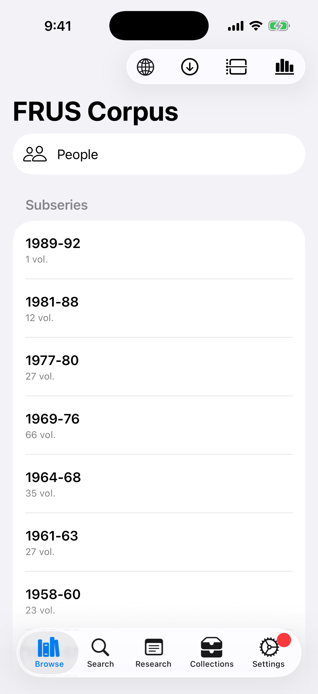
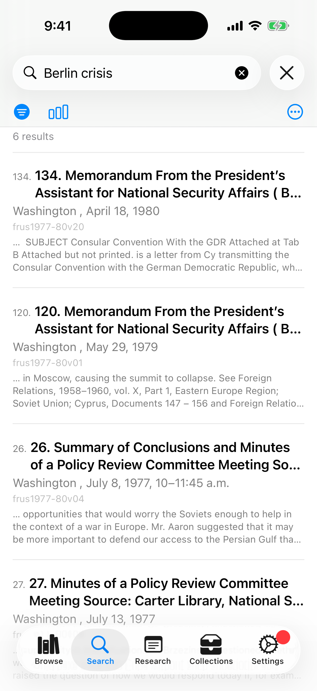
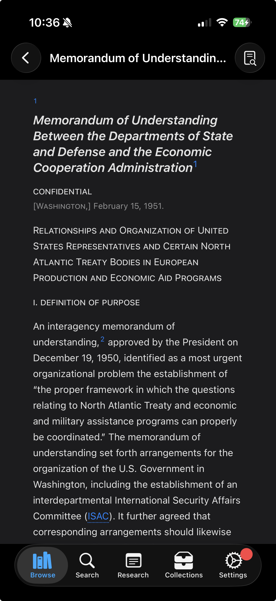

# FRUS Explorer for iOS and iPadOS — User Manual

> **Foreign Relations of the United States Explorer** — *Research the official record of U.S. foreign policy since 1861*

---

## Table of Contents

1. [Introduction](#1-introduction)
2. [Installation and First Launch](#2-installation-and-first-launch)
3. [The Main Interface](#3-the-main-interface)
4. [Browsing the Corpus](#4-browsing-the-corpus)
5. [Searching Documents](#5-searching-documents)
6. [Reading Documents](#6-reading-documents)
   - [6.5 Related Documents](#65-related-documents)
7. [Annotating and Tagging](#7-annotating-and-tagging)
8. [Cross-Reference Graph](#8-cross-reference-graph)
   - [8.1 Cross-Reference Analytics](#81-cross-reference-analytics)
9. [Citation Lookup](#9-citation-lookup)
10. [Collections and Export](#10-collections-and-export)
11. [AI Summarization](#11-ai-summarization)
12. [Source Explorer](#12-source-explorer)
13. [Corpus Analytics](#13-corpus-analytics)
    - [13.6 Person Analytics](#136-person-analytics)
    - [13.7 Exporting a Chart for Publication](#137-exporting-a-chart-for-publication)
14. [Chronology](#14-chronology)
15. [Research Projects](#15-research-projects)
16. [Settings](#16-settings)
17. [iPad-Specific Features](#17-ipad-specific-features)
18. [Touch Gestures Reference](#18-touch-gestures-reference)
19. [The FRUS Research Guide](#19-the-frus-research-guide)
    - [19.1 About the Series — Series Analytics](#191-about-the-series--series-analytics)

---

## 1. Introduction

FRUS Explorer brings the complete *Foreign Relations of the United States* documentary series to your iPhone and iPad as a fully offline, searchable research tool. The series — published since 1861 and now comprising more than 560 volumes — is the official declassified record of American foreign policy: diplomatic cables, policy memos, meeting transcripts, and intelligence reports from every era of U.S. history.

FRUS Explorer lets you:

- **Download and index** any subset of the corpus for instant full-text search, right on your device.
- **Read** documents in their original TEI-encoded form, with footnotes, editorial notes, and cross-references fully rendered for the iPhone and iPad screen.
- **Annotate** with research notes, inline highlights, and custom tags — all of which sync across your devices.
- **Summarize** long documents on-device using Apple Intelligence.
- **Export** curated collections of documents as formatted PDF, HTML, or Word (DOCX) documents, ready to share or print.
- **Cite** correctly using the State Department's recommended citation style, and share citations directly from the document view.
- **Discover related documents** — from any document, open a ranked **Related Documents** list connecting it to the rest of your indexed corpus by archival provenance, cross-references, date, volume, and shared people, with an adjustable weight for each signal.
**Working corpora.** A **working corpus** is a fixed set of documents you define once and then work inside. Run a search, then **Save as Working Corpus** to capture those results as a named set; apply it from the search filters to search only within it. The set is fixed at capture, which is what makes counts taken inside it reproducible — re-running the query later may find different documents, but the corpus will not change. It syncs whole to your other devices, and every screen that shows one states how much of it is indexed here ("142 of 267 documents indexed on this device"), so a corpus means the same thing everywhere even where fewer of its volumes are downloaded. Manage them in Settings → Working Corpora.

- **Scope your work** with named, reusable **volume scopes** — define a set of volumes once and apply it to searches, analytics, a word cloud, and the series dashboards.
- **Visualize** how documents reference one another through an interactive, touch-friendly network graph, and study the citation network at the corpus scale with **Cross-Reference Analytics** — most-referenced documents, degree distributions, volume-to-volume heat matrices, and PageRank influence landmarks.
- **Analyze** term frequency across the corpus with interactive charts (as raw counts or as a share of the corpus), study how individual people are mentioned over time and how they connect with **Person Analytics**, and jump fluidly between a chart and a search.
- **Browse by date** with the Chronology view — read every document from any span of years, grouped and charted by date.
- **Understand the series itself** through the offline **About the Series** dashboards in the Research Guide — publication timeliness, geographic emphasis, archival sourcing, and per-administration coverage, all readable before you download a single volume.

All of your research data — notes, tags, collections, highlights, and projects — syncs automatically across every device signed into the same iCloud account, so you can start reading on your iPhone and pick up exactly where you left off on your iPad.

This manual covers FRUS Explorer on iPhone and iPad from the ground up. No familiarity with any other version of the app is assumed.

---

## 2. Installation and First Launch

### System Requirements

FRUS Explorer requires iOS or iPadOS 26 or later. Full-text search and document rendering work on all supported devices; AI summarization (Section 11) additionally requires a device with Apple Intelligence enabled.

### Installation

Install FRUS Explorer from the App Store. Search for "FRUS Explorer" or follow a direct link from the publisher.

`[SCREENSHOT: App Store page showing FRUS Explorer with Get/Install button]`

### Onboarding

The first time you launch FRUS Explorer, a short onboarding flow walks you through initial setup.

Onboarding is now a **word cloud** drawn from the series itself, with the controls floating
above it in a compact panel. The cloud cycles every few seconds through four views of the
vocabulary — **Concepts**, **Topics**, **Actions**, and **Sentiment** (positive words green,
negative red) — and a small chip in the corner names whichever you are looking at.

The words are real: they are counted from the actual FRUS text at build time and shipped
with the app, so the cloud appears **before you have downloaded anything**. That is what
makes step 2 useful rather than decorative — pick *A Subseries* and choose 1969–76, and the
cloud becomes that era's vocabulary (*kissinger, nixon, soviet, capability, balance*)
before you commit to the download.

**Step 1 — Welcome**

A one-line introduction to the series, with **Get Started**.

`[SCREENSHOT: Onboarding Welcome — docked panel over the animated word cloud, iPhone]`

**Step 2 — Add Volumes**

Choose how much of the corpus to download to your device now, using the segmented control. You can always add or remove volumes later from **Settings → Volumes & Storage**.

Choosing *A Subseries* or *A Single Volume* opens a short list above the panel; *Corpus* opens
none, leaving the cloud unobstructed. Whatever you pick, the cloud behind the panel
re-aggregates to preview it.

| Option | Description |
|--------|-------------|
| **Entire Corpus** | All 560+ published volumes (several GB; downloading may take a while depending on your connection and how much free storage your device has) |
| **A Subseries** | One publication era, e.g., *1969–1976* (Nixon/Ford) or *1977–1980* (Carter) |
| **A Single Volume** | One specific volume chosen from a grouped picker |

`[SCREENSHOT: Onboarding Add Volumes — segmented control, subseries sheet, cloud showing the chosen era, iPhone]`

Estimated storage requirements appear before you confirm — useful on space-constrained iPhones. If you start the download while offline, it queues automatically and resumes once you're back online.

**Step 3 — Ready**

Optionally create your first research project — give it a name and a research question. Projects help you organize notes, tags, and collections around a single research effort (see Section 15). You can skip this step and create projects later.

`[SCREENSHOT: Onboarding "Ready" screen with optional project creation form]`

Tap **Finish**. FRUS Explorer opens to the Browse tab and begins downloading and indexing your selected volumes in the background — you can keep using the app while this happens.

### The Embedded Browser

Wherever FRUS Explorer shows a link to an external resource — onboarding, the About screen, the Research Guide, education content, Source Explorer, or NARA Catalog Lookup — it opens in a built-in browser sheet rather than leaving the app. This keeps you in your research session: dismiss the sheet with the close button or a downward swipe to return exactly where you were.

`[SCREENSHOT: Embedded browser sheet showing a history.state.gov page with a Done button]`

---

## 3. The Main Interface

FRUS Explorer on iPhone and iPad is organized around a **tab bar** with five tabs. Each tab is a self-contained area of the app; switching tabs preserves your place in each one, so you can move freely between browsing, searching, and your research workspace without losing your spot.

`[SCREENSHOT: iPhone tab bar showing Browse, Search, Research, Collections, Settings]`

| Tab | Icon | Purpose |
|-----|------|---------|
| **Browse** | books.vertical | Navigate the corpus by subseries, volume, and document; switch your active research project; open the **Analysis Tools** menu (Chronology, Corpus Analytics, Word Cloud, Person Analytics, Cross-Reference Analytics) |
| **Search** | magnifyingglass | Full-text search across your downloaded volumes; look up a document directly by citation |
| **Research** | note.text | Your personal research workspace — all notes, highlights, and tagged documents in one place, organized by collection, tag, or highlight color |
| **Collections** | tray.2 | Build, edit, and export curated sets of documents |
| **Settings** | gear | iCloud status, display preferences, downloads and storage, tags, summarization, integrations, the Research Guide, and About |

### 3.1 The Indexing Banner

When volumes are downloading or being indexed for search, a banner appears just above the tab bar. It shows progress for the current volume (and, when several are queued, your position in the queue and an estimated time to completion). Tapping a name mentioned in the banner — such as a person discovered while indexing — can jump you straight to a search for that name.

The banner tracks the whole **queue**, not one volume at a time: download a subseries and it appears once, when indexing begins, and stays until every volume you downloaded is ready to search. The volume named inside it changes as work moves along; the banner itself does not come and go.

`[SCREENSHOT: Indexing banner above the tab bar showing progress for a volume]`

When the whole queue finishes, the banner becomes a brief summary card — "*27 volumes ready to search*" after a subseries, or the volume's title when you indexed just one — offering to search what was added. A small dot badge also appears on the **Browse** tab whenever downloaded volumes are still waiting to be indexed.

> **After a big update:** occasionally an app update improves how documents are indexed and needs to rebuild the search index for volumes you already have. When that happens, indexing runs by itself right after you update — the banner explains what's happening and your reading isn't interrupted. (The current update does this to rebuild the cross-reference index; see Section 8.)

`[SCREENSHOT: Indexing summary card with "Search this volume" action]`

The same word cloud fills two other waits. On the first launch after installing, and on a launch where iCloud is still pulling your research down, it appears full-screen behind the wordmark instead of a blank window — and it clears when the wait actually ends, not on a timer. It never appears over onboarding, and never over a list you are reading.

### 3.2 Live Activity (iPhone 14 Pro and later)

On iPhones with a Dynamic Island, starting a download presents a **Live Activity** — a persistent, glanceable progress indicator that stays visible from the Lock Screen, the Dynamic Island, and other apps, so you can track indexing progress without returning to FRUS Explorer.

`[SCREENSHOT: Dynamic Island showing FRUS Explorer indexing progress]`

`[SCREENSHOT: Lock Screen Live Activity card showing volume download progress]`

### 3.3 The Research Rail Toggle

When you open a document for reading, the toolbar carries a **single control**: the **Research-rail toggle** (a `doc.text.magnifyingglass` button), which becomes accent-tinted while the rail is open. The many separate annotation, citation, and AI actions that once crowded this toolbar have moved into the **Research rail** and the **floating selection bar** described below; returning to where you came from is the ordinary navigation back button.

**The Research rail** is the per-document research surface. On **iPad** it slides in as the trailing `.inspector` panel beside the document; on **iPhone** it rises as a **bottom sheet** with medium and large detents and a drag indicator. It opens with a **RESEARCH** header, then a **3×2 grid of tiles** — **Cite**, **Word Cloud**, **Sources**, **Graph**, **Related**, and **Share** — above expandable **Summary**, **Notes**, **Tags**, and **Collections** accordions. On iPad the rail header also carries an **Open in New Window** icon for Stage Manager (Section 17.2).

**The floating selection bar** is a dark pill that appears just below a passage you select in the document body. It offers four **colour dots** (tap one to highlight the selection in that colour), **Excerpt**, **Look Up** (a NARA catalog lookup for the selection), and **Note**. (For a selection inside a footnote, the colour dots and Excerpt are disabled.)

Every action that used to live in the document toolbar now has one of these homes:

| Former toolbar action | Where it lives now |
|-----------------------|--------------------|
| **Add Research Note** | The floating selection bar's **Note** (on a selection), or the rail's **Notes** accordion |
| **Create Highlight** | Select text and tap one of the four **colour dots** on the floating selection bar (there is no separate highlight mode — see Section 7.2) |
| **Add Selection as Excerpt** | The floating selection bar's **Excerpt** |
| Look a selection up in NARA | The floating selection bar's **Look Up** |
| **Tag Document** | The rail's **Tags** accordion |
| **Add to Collection** | The rail's **Collections** accordion |
| **Summarize with AI** | The rail's **Summary** accordion — **Summarize this Document** |
| **Citation** | The rail's **Cite** tile (its sheet also has a **Copy Citation** button) — Section 9.3 |
| **Share** | The rail's **Share** tile (Section 9.3) |
| **Word Cloud** | The rail's **Word Cloud** tile (Section 13.4) |
| **Cross-References** graph | The rail's **Graph** tile (opens the cross-reference graph; Section 8) |
| **Related Documents** | The rail's **Related** tile (Section 6.5) |
| **Source Explorer** | The rail's **Sources** tile (opens Source Explorer; Section 12) |
| **Open in New Window** | The rail header's new-window icon (iPad Stage Manager, Section 17.2) |

Showing the rail is **Research mode**; hiding it is a distraction-free **Read mode** (Section 6.2).

`[SCREENSHOT: Document view with the Research rail open — the RESEARCH header, the 3×2 tile grid, and the Summary/Notes/Tags/Collections accordions]`

---

### 3.4 Discovery Tips

A few of the app's most useful controls are also its least visible — the Research-rail button is a single unlabelled glyph, and the page-turn edges are invisible by design. The first few times you reach one, a small tip appears beside it saying what it does: the Research button and what is behind it, the edge zones, the binoculars menu's four readings of a result set, and the fact that facet rows are filters. Each tip retires the moment you use the control it points at, and none of them block what you were doing.

If you dismissed them and want them back, use **Show Tips Again** in **Settings → Reading & Search → Display**.

## 4. Browsing the Corpus

The **Browse** tab is where you navigate the FRUS corpus by its natural structure: subseries (publication eras), volumes, and individual documents.

### 4.1 Navigating the Hierarchy

Tap a subseries — for example, *1969–1976* — to see the volumes published within it. Tap a volume to see its table of contents: the documents it contains, each labeled with its document number, heading, and date. Volume and chapter screens give the screen a **two-line navigation title**, so a long volume title wraps onto a second line rather than truncating.

`[SCREENSHOT: Volume table of contents showing a list of documents with dates]`

On iPhone, a **breadcrumb trail** at the top of the screen shows your current position in the hierarchy and lets you jump back to any earlier level with a tap. Browse uses standard push navigation on every device, so on iPad there is no breadcrumb bar — the tab sidebar and the back button handle the same navigation.

`[SCREENSHOT: Breadcrumb trail on iPhone showing Subseries > Volume > Document]`

Volumes you haven't downloaded yet are still browsable. Opening one shows a **Download Volume** button on its page (in place of the contents); tap it and the page tracks the download live, loading the volume's contents automatically when it finishes — no need to leave and come back. You can also long-press the volume in the list and choose **Download Volume** to queue it without opening the page. (See Settings → Volumes & Storage for managing downloads in bulk.) Anywhere you reach a document in an undownloaded volume — including a cross-reference inside another document — the app offers to download the volume rather than dead-ending.

Every volume's page also carries a **Top subjects** section — the subjects most characteristic of that volume, derived from experimental subject data and grouped by category. These are automatically detected topics, not editorial subject headings, so an occasional mistag is possible. Because these profiles ship with the app, they appear even for volumes you haven't downloaded. Tap a subject to see the *other* FRUS volumes covering the same subject across the whole corpus — including ones you haven't downloaded — and navigate straight to any of them.

`[SCREENSHOT: Volume page showing the Top subjects section grouped by category, with the list of other volumes covering a tapped subject]`

### 4.2 Filtering to Downloaded Volumes

A toggle in the Browse toolbar limits the list to volumes you've already downloaded — handy when you want to browse only what's available offline, such as on a flight or in the field.

`[SCREENSHOT: Browse toolbar with the "Downloaded only" filter toggle highlighted]`

### 4.3 Switching Research Projects

A **project picker** in the Browse toolbar lets you set your active research context. Tap it to choose:

- **Global Context** — no active project; notes, tags, and highlights you create are not associated with any particular project
- Any of your existing projects, shown with a checkmark beside the active one
- **Manage Projects** — opens the full project management screen (see Section 15)

`[SCREENSHOT: Project picker menu open, showing Global Context and a list of projects with checkmarks]`

Whatever project is active follows you throughout the app — new notes, tags, and highlights you create are automatically associated with it, and your Research tab can be filtered to show only that project's material.

### 4.4 Jumping to Analytics and Chronology

An **Analysis Tools** menu (a chart icon) in the Browse toolbar gathers the corpus-wide tools so they open as sheets without leaving your place in the browser:

- **Chronology** — opens the **Chronology** browser (see Section 14) to read every document within a date range.
- **Corpus Analytics** — opens **Corpus Analytics** (see Section 13) to explore term-frequency trends.
- The corpus **Word Cloud** — opens a frequency word cloud for the whole corpus (see Section 13.4).
- **Person Analytics** — opens the **Person Analytics** surface (see Section 13.6) to study how individual people are mentioned over time and how they connect.
- **Cross-Reference Analytics** — opens the **Cross-Reference Analytics** surface (see Section 8.1) for a corpus-wide view of the citation network.

Grouping these destinations under one always-reachable menu replaces the separate toolbar buttons used previously (which on iPad could collapse into an unreliable "•••" overflow). (The four offline **About the Series** dashboards — publication timeliness, geographic emphasis, archival sourcing, and administration profiles — live in the FRUS Research Guide instead; see Section 19.1.)

`[SCREENSHOT: Browse toolbar showing the Analysis Tools menu (SF Symbol: chart.bar.xaxis) open with Chronology, Corpus Analytics, Word Cloud, Person Analytics, and Cross-Reference Analytics entries]`

### 4.5 The People Browser

At the very top of the Browse screen, above the subseries list, is a **People** row. Tap it to open a reconciled, corpus-wide index of everyone named across the volumes you've indexed — a single alphabetical list rather than a per-volume one.

The same person often appears across many volumes under slightly different name forms ("Kissinger, Henry A.", "Kissinger, Henry", "Kissinger, Henry A. Laurence"). FRUS Explorer consolidates these into **one identity** so you don't have to chase the same person through a dozen separate entries. Each row shows:

- the person's **canonical name**;
- a subtitle combining their **role** and **active years** (e.g. *Secretary of State · 1973–1977*) where the volume's List of Persons supplied them;
- a **mention count** badge — the number of distinct documents that reference this identity across the whole corpus;
- a small **reconciled-identity** seal when the entry has been matched to the bundled name-authority data.

Use the **search field** at the top to filter the list by name.

Tap a person to open their **detail sheet**:

- **Find all mentions** runs a person-scoped search returning every document that references this identity (see Section 5).
- **Records in This Identity** lists each underlying `(volume, ref)` record that was folded into this person. If one of them is actually a different person, swipe or tap **Separate** to split it out — your correction syncs across your devices via iCloud and is reapplied whenever the index is rebuilt.
- When the app is uncertain whether two identities are the same person, it surfaces a **"possibly the same person"** suggestion with a **Merge** action so you can confirm.
- **Merge with another person…** lets you combine two people into one identity yourself — for the cases the app's cautious automatic grouping kept apart. It's available here in the detail sheet and in a person row's context menu in the list; a confirmation names both people, and warns you when they look like genuinely different people (they match different entries in the bundled name-authority data).
- Reconciled identities that carry an authority id show a **View on VIAF** link to the external authority record.
- A **Subjects** section shows chips for the detected topics characteristic of the volumes where this person is mentioned — weighted toward the volumes that mention them most. As the caption under the chips notes, these are volume-level subjects, not per-document tags. Tap a chip to see every FRUS volume covering that subject and navigate straight to any of them.

> The consolidation is deliberately cautious: when in doubt it keeps identities **separate** (so you may occasionally see two entries for one person) rather than merging two different people. Your merge/separate corrections always take precedence.

A **Corrections** button in the People browser toolbar lists every merge and separation you've made and lets you **undo** any of them; corrections sync across your devices via iCloud.

To study *how* these reconciled people are mentioned over time — most-mentioned by era, mention trajectories, and co-mention networks — open **Person Analytics** from the Browse tab's Analysis Tools menu (Section 13.6).

---

## 5. Searching Documents

The **Search** tab provides full-text search across every volume you've downloaded and indexed, powered by the same search engine used for the State Department's own archive — ranked by relevance using the BM25 algorithm with English-language stemming (so searching for "negotiate" also matches "negotiation," "negotiated," and so on).

### 5.1 Basic Search

Type a word or phrase into the search field and results appear as you type, each showing a highlighted snippet of matching text, the document's citation, and its date. Tap a result to open the document, scrolled to the matching passage.

You can control how much context each snippet shows — anywhere from **1 to 10 lines**. Set the app-wide default in **Settings → Reading & Search → Search → Result Preview**, and override it for just this list from the **Result Preview** section of the filter panel (Section 5.6). The length you choose here is remembered separately from the one used in the Collections *Add Documents* sheet (Section 10.1), so each surface keeps its own preferred snippet length.

Results are shown a page at a time — 25 per page, with **‹ Page X of Y ›** controls in the results header — so a large result set stays fast to scroll. Up to 1,000 matches are loaded; if a query matches more, the header says so, and you can narrow your terms or use **Visualize in Corpus Analytics** (Section 5.8) to chart and tighten the result set.

**While a search runs**, the results area shows a spinner — and if the wait lasts longer than a moment, the drifting word cloud (Section 3.1) fades in behind it, showing the common vocabulary of whatever you scoped the search to. Quick searches never show it; only a search long enough to notice grows a backdrop. The words are the *scope's* ambient vocabulary, not your results — those don't exist yet — which is why the cloud only ever appears on an empty waiting screen and never behind a list you're reading.

A **Sort results** menu (the up-and-down arrows) in the actions bar below the search field reorders the list — **Relevance** (the default), **Date ↑**, or **Date ↓** — so you can read a result set oldest-first or newest-first without leaving the ranked view. The icon fills in whenever a non-default order is active.

### 5.2 Search Syntax

The search field supports a small query syntax for more precise results:

| Syntax | Effect |
|--------|--------|
| `word1 word2` | Matches documents containing both words (in any order) |
| `"exact phrase"` | Matches the exact phrase |
| `word1 OR word2` | Matches documents containing either word |
| `-word` | Excludes documents containing that word |
| `NEAR("military guarantee" Europe, 30)` | Both terms within 30 words of each other |
| `=containment` | The literal word only — not *contain*, *containing*, *container* |

**Proximity search (`NEAR`).** Two words appearing in the same document tells you very little — a long volume can mention almost anything twice. `NEAR` asks the sharper question: did these ideas appear *together*? `NEAR("military guarantee" Europe, 30)` matches only documents where that exact phrase falls within thirty words of *Europe*. Operands may be words, exact phrases, or prefixes (`NEAR(militar* europ*, 20)`), and the distance is optional — it defaults to 10.

**Exact-word search (`=`).** Search is stemmed, which is usually what you want: *negotiate* also finds *negotiated*. But it means a search for **containment** is really a search for *contain*, and returns *container* and *containing* alongside it. Prefix a word with `=` to switch that off for that word only.

`[SCREENSHOT: Search field showing a phrase query in quotes with matching results]`

### 5.3 The Query Inspector

Under the search field is a strip showing the **FTS5 expression your query actually became** — the string that went to the database, not a paraphrase of it. Tap the chevron to expand it and see, for each term: the **index form** it was reduced to, with a warning when that is broader than what you typed (`containment` is searched as `contain`); how many documents contain it **across everything you have indexed**, which is free to compute; and, on request, the **exact count within your current filters**, which runs a real query per term and so sits behind a button.

Both counts are shown because the gap between them is information: a term that is common in the corpus but rare in your scope is telling you something about your scope.

### 5.4 Four Ways to Read a Search Result Set

The **binoculars** button in the search actions bar offers four readings of the same search, plus the facet sheet. **List** is the ordinary ranked list. **Timeline** places the matches by date (Section 5.7). **Concordance** lines every occurrence of your term up on the term itself, so a page of hits reads as usage rather than as a list. **Collocates** ranks the words that keep company with your term (Section 13.4). The button fills in whenever a reading other than List is active, so you can always see which control changed the screen.

They do not all count the same thing, and each panel names the set it used: the concordance shows **this page**; the timeline and collocates cover the results retained for this search; **Facets** reads the whole match, before any narrowing. When you are about to quote a number, that distinction *is* the number.

### 5.5 Facets

Choose **Facets** from the binoculars menu to open a sheet that describes your whole result set rather than one row at a time — by year, volume, person, document type, and archival provenance. Sections compute when you open them, not when you search, so the panel never slows down a query you were not going to inspect.

Facet rows are also controls. Tapping a year, volume, person, or document-type row **narrows the search**, and the narrowing appears as a clearable chip above the results. Three things the panel is careful about:

- The counts describe the **whole match**, not the page you are looking at. The result list is capped while these counts are not, and the panel says so.
- **Archival provenance is descriptive only.** It tells you how the match is sourced; it is not a filter, and the panel states how much of the match it can speak for rather than implying it covers all of it.
- A truncated section reports that it was truncated. A shown total is never a partial one wearing a complete label.

### 5.6 Filters

Tap the filter control to narrow your search by:

- **Volume or subseries** — restrict to one or more specific volumes
- **Date range** — restrict to documents dated within a span of years
- **Person** — restrict to documents mentioning a specific indexed person
- **User tag** — restrict to documents you've tagged. The tag chips refresh **live**: create, rename, or delete a tag anywhere in the app (for example while writing a research note, or a change synced from another device) and it appears or updates here immediately, without closing and reopening the filter.

Two further sections scope a search by *sets* of volumes:

- **My Volume Scopes** — your named, reusable volume sets (see Section 16.1). Each row shows an honest "N of M volumes indexed" count; applying a scope fills the volume picker with its currently **indexed** members. A scope with no indexed members warns — *"No volumes of '\<name\>' are indexed yet — download and index its volumes first"* — and applies nothing, so a scope's label never silently means "the whole corpus."
- **By Subject · Detected Topics** *(experimental)* — tap **Filter by detected topic…** for a two-level picker: categories that expand into sub-categories, each with an "in N vols" reach count (the first entry, **All of \<category\>**, applies the whole broad category). Applying one fills the volume picker with the indexed volumes where that topic is among the volume's most *characteristic* detected topics — not merely mentioned. As the picker itself says, these are automatically detected topics, not editorial subject headings, and may include mistags.

The four open-ended sections — **My Working Corpora**, **My Volume Scopes**, **By Subject · Detected Topics**, and **User tags** — start collapsed, so the panel opens at the top rather than mid-scroll. Two things a disclosure is never allowed to hide: a section opens itself while a warning stands (applying a scope or topic with no indexed volumes), and the working-corpus section opens itself, naming the corpus and how it was captured on its own collapsed label, whenever this device can reach only part of the corpus you applied.

The filter panel also carries a **Result Preview** control that sets how many lines of context this results list shows for each match (see Section 5.1).

`[SCREENSHOT: Search filter sheet showing the My Volume Scopes section with "N of M volumes indexed" rows and the By Subject · Detected Topics section, above the volume, date range, person, and user-tag filters]`

### 5.7 Timeline View

Toggle **Timeline** from the actions bar below the search field to see your search results arranged chronologically along a timeline rather than as a ranked list — useful for tracing how a topic developed over a span of years.

`[SCREENSHOT: Search results in Timeline view, documents arranged along a date axis]`

### 5.8 Visualizing a Search in Corpus Analytics

Whenever a search returns results, FRUS Explorer offers to **Visualize in Corpus Analytics** — tapping this hands your search terms and any active date-range filter to the Analytics tab, pre-seeded so you can immediately chart the term's distribution across the corpus (see Section 13.3). When a search returns more results than can be displayed in full, the same handoff also carries the existing guidance about narrowing your date range before returning to search with a tighter result set.

`[SCREENSHOT: Search results banner offering "Visualize in Corpus Analytics"]`

### 5.9 Saving Searches

Tap the save icon to store your current query and filters for quick reuse later. Saved searches appear in a dedicated list accessible from the Search tab and sync across your devices via iCloud.

`[SCREENSHOT: Saved searches list]`

### 5.10 Finding a Document by Citation

Tap the citation-lookup button (a magnifying glass over quotation marks) in the Search toolbar to open **Citation Lookup** — paste or type a citation string (e.g., `FRUS 1969–1976, Volume I, Document 42`) and FRUS Explorer parses it and jumps directly to that document, even in a volume you haven't browsed to before. See Section 9 for more on citations.

`[SCREENSHOT: Citation Lookup sheet with a pasted citation string and a "Go" button]`

### 5.11 Checklist Review Mode

When you're working systematically through a long result set — deciding which of a few hundred matches to read — **Checklist Mode** turns the list into a shrinking to-do list. Tap the **Checklist** button (the ☑︎ checklist icon) in the search actions bar, just right of the timeline button; it's enabled once a search has results, and highlights while the mode is on.

With it on, a result disappears from the list as soon as you **open it** by any route, or when you explicitly mark it reviewed — **swipe the row** and tap **Reviewed**, or long-press it and choose **Mark Reviewed**. A subtle **"N reviewed hidden"** banner shows how many you've cleared, and when nothing is left an **All Results Reviewed** message appears. Turn the toggle off to bring every result back.

Checklist Mode is a per-session working aid: it isn't saved, it resets when you relaunch, and starting a new search re-anchors it (clearing the previous query's reviewed marks, since the same document can appear in unrelated searches). It never changes your reading history or the underlying result set — only what the list shows.

`[SCREENSHOT: Search results in Checklist Mode — the "N reviewed hidden" banner above a partially-reviewed list]`

`[SCREENSHOT: The All Results Reviewed empty state after every result has been marked reviewed]`

---

## 6. Reading Documents

Tapping any document — from Browse, Search, Research, or a Collection — opens it in the document view, where the original TEI-encoded text is rendered as readable, well-formatted prose: headings, datelines, paragraphs, footnotes, editorial notes, and cross-reference links all appear as the State Department originally published them, adapted for your screen.

 <!-- TODO Phase E: re-capture for Research rail -->

### 6.1 Navigating Within a Document

Footnote markers and cross-reference links are tappable. Tapping a footnote marker scrolls to (or pops up) its note text; tapping a cross-reference link jumps to the referenced document if it's in your downloaded corpus, or offers to look it up otherwise.

Not every printed reference has somewhere to go: occasionally a volume cites a page, document, or volume that does not exist in the digital corpus. Cross-references that a corpus-wide validation dataset confirms cannot be followed render in **muted grey with a dotted underline and a small dagger marker** rather than looking like working links — the printed text itself is preserved. Tapping one opens an **Unresolved Reference** sheet explaining why the reference can't be followed and what its apparent destination is. Valid references look and behave exactly as before.

`[SCREENSHOT: Document body showing an unresolvable cross-reference in muted grey with a dotted underline and dagger marker, with the Unresolved Reference sheet open]`

### 6.2 Read Mode and Research Mode

The **Research-rail toggle** in the document toolbar (Section 3.3) switches between two modes:

- **Read mode** — the rail is hidden, giving a clean, distraction-free view of the document body, ideal for close reading. Read mode also enables **edge-tap page-turning** (see 6.3).
- **Research mode** — the rail is shown: on **iPad** it's the trailing `.inspector` panel beside the document; on **iPhone** it's a bottom sheet you can drag between medium and large detents. You read and annotate the document with the rail's tiles and accordions at hand.

There is no separate Read/Research switch — the single rail toggle is the whole control, and an accent tint on the button tells you the rail (and so Research mode) is showing. On **iPhone** the rail is always summoned with this toggle — it never rises on its own when you open a document, so the bottom sheet can't cover a document you only meant to read. (On iPad, the **Open Documents In** setting can default new documents to Research mode, since there the rail is a side panel that sits beside the text rather than over it.)

`[SCREENSHOT: The document with the Research rail open (Research mode) beside the same document with the rail hidden (Read mode)]`

### 6.3 Edge-Tap Page-Turning (Read Mode)

While in Read mode, invisible tap zones along the left and right edges of the screen let you move to the previous or next document in the volume — much like turning pages in an e-book reader. Tap near the left edge to go back one document, or near the right edge to advance to the next one. This lets you read straight through a volume without returning to the table of contents or using the back button. (These tap zones are suppressed whenever the Research rail — or any other sheet — is open, so a drag near the edge controls the sheet rather than turning the page.)

`[SCREENSHOT: Document view in Read mode with annotated edge-tap zones for previous/next navigation]`

### 6.4 Display Preferences

Adjust font size, line spacing, and other reading preferences from **Settings → Reading & Search → Display** (see Section 16). The same Display screen holds a **Chart Colors** stepper that sets the global default for how many distinctly coloured source volumes the Chronology and Corpus Analytics distribution charts show before the rest fold into a grey "Other" series (range 6–12, default 8). Either chart can override this for itself with its own **Chart colors** toolbar menu (Sections 13.1 and 14.2).

### 6.5 Related Documents

A cross-reference tells you what a document *cites*; **Related Documents** tells you what belongs *near* it. Tap the **Related** tile in the Research rail (Section 3.3) to see a ranked list of the indexed documents most related to the one you're reading, scored along five signals:

| Signal | What it connects |
|--------|------------------|
| **Archival provenance** | Documents drawn from the same lot file, decimal file, or archival collection |
| **Cross-references** | Documents this one cites, and documents that cite it |
| **Close in date** | Documents written around the same time |
| **Corpus proximity** | How closely the FRUS editors placed the two documents: in the same chapter or compilation, printed side by side, or — across volumes — in the same publication era |
| **Shared people** | Documents mentioning the same people |

Each row shows the document's header, volume, and dateline, plus small **"why related" icon chips** naming the signals that contributed to its ranking, strongest first. A chip states whatever its signal can honestly report: **cited 3×** for cross-references, and for archival provenance the container and how big it is — **Lot 54 D 270 · 1 of 1,063** — because sharing a six-document lot file is a finding and sharing one of seven thousand is a filing-cabinet coincidence; because those two *find* candidates rather than scoring them and a percentage there would mean nothing; date, corpus proximity, and shared people report a percentage, which for them is a real measure. Tap a row to open the document.

- **Scope.** A segmented control at the top narrows the candidate pool — **This volume**, **This subseries**, or **All volumes**. A scoped list that comes up empty invites switching back to All volumes.
- **Adjust weights.** Expand **Adjust weights** for a slider per signal. Release a slider and the list re-ranks immediately; your tuning is remembered and becomes the starting point the next time you open Related Documents. A sixth slider, **Shared topics**, is visible but disabled for now — as its caption says, it becomes available when detected-topic document data ships (experimental).
- When more documents qualify than the list shows, a footer reports how many more are related and suggests raising a weight or narrowing the scope to refine.

On iPhone (and iPads without Stage Manager) the list opens as a sheet with a **Done** button. On an iPad with Stage Manager it opens as its **own window** that stays open as you jump to results — a work list you can step through beside the document — and it restores across relaunch with its document, scope, and weights intact (see Section 17.2).

`[SCREENSHOT: Related Documents sheet on iPhone — the scope segmented control and the Adjust weights sliders above the ranked list with why-related icon chips]`

---

## 7. Annotating and Tagging

FRUS Explorer's research tools let you build a personal layer of analysis on top of the primary-source text — notes, highlights, and tags — all of which sync across your devices via iCloud.

### 7.1 Research Notes

To attach a free-form note to the current document, tap **Note** on the floating selection bar after selecting a passage (Section 3.3), or open the **Notes** accordion in the Research rail and add one there. Notes appear in the rail's Notes accordion and are collected across your whole library in the **Research** tab.

`[SCREENSHOT: The Research rail's Notes accordion showing a research note attached to a document]`

If you have an active research project, new notes are automatically associated with it; from Global Context, notes aren't tied to any particular project.

### 7.2 Highlights

There is no separate "highlight mode" to enter. Select a passage of text with your finger (or Apple Pencil on iPad) and the **floating selection bar** — a dark pill — appears just below it; tap one of its four **colour dots** — yellow, green, blue, or pink — to highlight the selection in that colour. Highlights appear as colored overlays directly in the text, are visible immediately, and survive document re-renders (such as display-preference changes) because their positions are tracked by stable text offsets rather than on-screen coordinates.

`[SCREENSHOT: Document body with yellow and blue highlights visible inline]`

`[SCREENSHOT: The floating selection bar below a text selection, showing its four colour dots, Excerpt, Look Up, and Note]`

Highlights you create can be annotated inline when you export a collection that contains the highlighted document — see Section 10.4.

### 7.3 Tags

Open the **Tags** accordion in the Research rail (Section 3.3) to apply one or more custom tags — short labels you define yourself (e.g., "Berlin Crisis," "needs follow-up," "key source"). Manage your full tag list, including colors and names, from **Settings → Research → Tags**. Tags let you build cross-cutting collections of documents that share a theme, regardless of which volume they come from.

In the tag picker, the **New Tag** field sits at the **top** of the sheet, so creating a tag never means scrolling past a long list; a tag you create there pins to the top with a **New** badge until the sheet closes. The sheet's title — **Tags - Doc N** (or the document's id) — names exactly which document you're tagging.

`[SCREENSHOT: Tag picker sheet titled "Tags - Doc 42" with the New Tag field at the top and a just-created tag pinned with a New badge]`

### 7.4 The Research Tab

The **Research** tab is your single workspace for everything you've annotated. Its root screen is a category list you browse by:

- **All Research Documents** — every document you've annotated in any way (a note, a tag, a collection, or a highlight)
- **History** — everything you've *read*, as opposed to everything you've marked up (see Section 7.5)
- **By Collection** — documents grouped by the collections that contain them
- **By Tag** — documents grouped by the custom tags you've applied
- **By Highlight Color** — documents grouped by which highlight color appears in them

`[SCREENSHOT: Research tab category list showing Project Home, All Research Documents, History, By Collection, By Tag, and By Highlight Color sections]`

Tap any category to open the matching documents; tapping one opens it directly in the document view, scrolled to the relevant note or highlight. Navigation here is a simple push-and-back flow, so the back button always returns you to the category list.

### 7.5 History

**Research → History** is your research trail: every document you have opened, every search you have run, and every collection you have exported, newest first, in three sections. Until now this existed only on the Mac; it is the same screen on both, so a trail that started on your iPad is legible on your Mac and the reverse.

It has three controls:

- **Project scope** — *All Projects*, *Not in a Project*, or a specific project by name. A history entry is filed under whichever project was active *when it was recorded*; switching projects later does not re-file anything retroactively. This is the control to reach for when you want to reconstruct what you actually read while working on one paper.
- **Search history…** — a free-text filter over what is loaded. It matches a visited document's title, its volume id, and its document id; for searches, the query text; for exports, the collection's name and the format.
- **Delete** — swipe a row left, or long-press it, to remove that one entry. Deletions sync, and there is no undo.

**Collections Exported** is the third section. It records what left the app — the format, how many documents, and the collection's name where it was known — because nothing else in the app remembers that an export happened. It matters most for the Zotero web send, which puts items into your live Zotero library: this row is the app's only memory of it. These rows are records, not shortcuts, so tapping one does nothing; delete is the only action.

`[SCREENSHOT: iPhone History screen showing the project scope picker, the search field, and a Documents Visited section with two rows]`

**On long lists**, each section loads its most recent 500 entries and a **Show More** button appears at the end when there are more. While a section is showing less than everything, its header says so — "Showing 500 of 12,904" — so a filtered list is never mistaken for the whole trail. Note that the search field filters what is *loaded*: on a very long history, **Show More** widens what a search can reach.

**Searches on iPhone and iPad.** Search recording currently happens on the Mac; searches you run there appear here once iCloud syncs. Searches run on iPhone or iPad do not yet produce entries in this list.

**If both sections stay empty**, check **Settings → Research → Research Sessions**: with **Log Research Sessions** off, nothing new is recorded, and History says so beneath the first section.

---

## 8. Cross-Reference Graph

Many FRUS documents reference one another — a memo might respond to a cable, or a meeting record might cite an earlier policy paper. FRUS Explorer indexes these relationships and visualizes them as an interactive **network graph**, arranged chronologically so you can see the order in which references were written.

Page-number cross-references — the kind that print as "see p. 427" and point at a printed page rather than a document number — resolve to the correct target document, so they appear as ordinary links in the graph (and feed the corpus-wide analytics in Section 8.1) rather than dead-ending. **The first launch after this update rebuilds the cross-reference index one more time** — the rebuild also repairs a long-standing defect where some *cross-volume* page references pointed at the wrong document in graphs and analytics. It happens automatically in the background, and your reading isn't interrupted. (See the indexing banner in Section 3.1 and Index Health in Section 16.) References the corpus-wide validation dataset marks as unresolvable (Section 6.1) are excluded from the graph and its analytics rather than drawn as dead-end nodes.

Open the graph from the **Graph** tile in the Research rail (Section 3.3). It opens full-screen (a sheet on iPad). Each node is a document, positioned left-to-right by date; arrows point from the citing document to the cited one, and larger nodes are more connected. A **legend** and an **info** button (ⓘ) explain the color, size, and direction encodings so meaning never depends on color alone.

`[SCREENSHOT: Cross-reference graph on iPhone showing nodes arranged along a date axis with direction arrows and a legend — the rail's Graph tile (SF Symbol: point.3.connected.trianglepath.dotted) labeled]`

**Reference list vs. canvas.** On iPhone, a segmented **List / Graph** control switches between the visual canvas and a scrollable reference list of the same connections (on iPad and Mac the list is a side panel you toggle). Selecting a node shows its details; tapping opens the document.

**Degree.** A degree control shows 1, 2, or 3 hops from the focus document. When a document has very few direct references, the graph auto-expands to 2 hops and says so.

**Touch interactions:**

| Gesture | Effect |
|---------|--------|
| Tap node | Select; show its title and details |
| Long-press node | Context menu: *Recenter Graph*, *Open Document*, *Archival Neighbors* |
| Pinch | Zoom |
| Two-finger drag | Pan |

Nodes in volumes you haven't downloaded are shown distinctly; selecting one offers to download the volume, and the graph updates once indexing finishes.

### 8.1 Cross-Reference Analytics

Where the graph above shows the neighborhood around *one* document, **Cross-Reference Analytics** stands back to show the whole citation network of your indexed corpus at once. Open it from the **Analysis Tools** menu in the Browse tab toolbar (Section 4.4); it appears as a scrolling dashboard of four **collapsible chart sections** — tap a section's heading to expand or collapse it (your choice is remembered) so you can focus on one at a time. Each is computed entirely on-device from your local index, and the two sections with their own controls host them right in the section (not a shared toolbar):

- **Most-Referenced Documents** — the documents other documents cite most often, ranked by their inbound-citation count (*in-degree*), as a bar chart you can switch to a table with this section's **chart / table** toggle. Tap any document to open it — a fast way to surface the memos, decisions, and policy papers a whole era kept coming back to.
- **Citation Degree Distribution** — a histogram of how many documents have each inbound-citation count: a handful of heavily-cited landmarks and a long tail. This section's **Out-degree** toggle overlays the out-degree distribution, so you can compare how many references documents *make* against how many they *receive*.
- **Volume Citation Heat Matrix** — the most-connected volumes laid out as a grid, each cell shaded by how many cross-references run from one volume to another. It reveals which volumes lean on which — a Berlin volume citing an earlier Germany volume, say.
- **Landmark Documents (Influence)** — the corpus's most *influential* documents by an offline PageRank score, which weights a citation more heavily when it comes from a document that is itself well-cited. Note that the very highest-influence landmarks are frequently documents in volumes you **haven't downloaded** yet — the list shows those with a manifest-derived "Document N — *volume title*" and a "in a volume you haven't downloaded" hint, rather than an opaque key; download that volume to open the document. (Non-document citation targets — unresolved page and front-matter references, footnote anchors, and back-of-book index entries — are no longer ranked as landmarks.) Each entry is tappable.

Because these views are corpus-wide, they grow richer the more volumes you index; a caption notes how much of the network is currently resolved. When any known-unresolvable references (Section 6.1) fall within your current scope, the caption also discloses that "N unresolvable references are excluded from this analysis".

**Scoping the network.** A **Scope** bar and a **year-range** bar sit above the dashboard. Scope narrows the analysis to a single subseries or volume (or the whole corpus) — and the menu also offers your **My Volume Scopes** and a **By Detected Topic** facet, described with the identical Corpus Analytics scope bar in Section 13.1; the year range limits it to a span of years — to focus on a decade, set the range to that decade, or use the **Administration** preset menu to set the year range to a president's term in one tap. These figures are **source-anchored**: a cross-reference is counted and filtered by its *citing* (source) document's volume and date, while the cited target is left unrestricted. That keeps a heavily-cited foundational document visible in the rankings even when it sits outside your current slice, and it avoids collapsing the graph (many citation targets — editorial notes, unresolved page references — are undated). The volume-to-volume heat matrix is the exception: it filters on *both* endpoints' volumes plus the source date.

The three document-level figures — most-referenced, the degree distribution, and PageRank — also count **same-volume citations** (a document citing another in the same volume), including page references resolved at index time. These were previously dropped, so counts and rankings are correspondingly higher; the heat matrix still excludes them by definition, since it plots links *between* volumes.

`[SCREENSHOT: Cross-Reference Analytics on iPhone showing the most-referenced documents ranking, the degree-distribution histogram, the volume heat matrix, and the PageRank landmark list]`

---

## 9. Citation Lookup

FRUS Explorer formats citations to match the State Department's own recommended style for the series, and gives you several ways to use them.

### 9.1 Viewing a Citation

From any open document, tap the **Cite** tile in the Research rail (Section 3.3) to see the fully formatted citation string, ready to read or screenshot.

`[SCREENSHOT: Citation popover showing a formatted FRUS citation string]`

### 9.2 Looking Up a Document by Citation

From the Search tab, tap the citation-lookup button to open **Citation Lookup**: paste or type any citation string and FRUS Explorer parses it — recognizing volume, document number, subseries, and other common citation formats — and opens the matching document directly, even one you haven't browsed to before. This includes the app's **own** formatted citations: copy a citation from one document and paste it back into lookup and it resolves to that same document. For the pre-1906 *Papers Relating to Foreign Affairs* volumes — whose citations carry only the print year (e.g. 1864) rather than a coverage year — the volume title ("First Session … Part II") is what pins down the exact part, so paste the full citation rather than just the year.

`[SCREENSHOT: Citation Lookup sheet parsing a pasted citation and showing a matched document]`

### 9.3 Copying and Sharing Citations

The Research rail separates the *citation itself* from *sending the document somewhere*:

- The **Cite** tile is for the reference text — it opens the formatted citation, with a **Copy Citation** button and **Copy as…** BibTeX or RIS.
- The **Share** tile (in the rail's tile grid) gathers the export and send actions:
  - **Send to Zotero Library** — pushes this document straight into your Zotero library over the Web API, with its tags and research notes (appears only when a Zotero account is connected; see Section 16).
  - **Export Zotero file (BibTeX / RIS)** — shares a Zotero-importable file via the system share sheet.
  - **Share Citation** — opens the share sheet with a single message combining the formatted citation *and* its canonical `history.state.gov` link, so whoever receives it can read the citation and open the original source online with one tap (works with Messages, Mail, Notes, AirDrop, third-party apps, and more).

`[SCREENSHOT: The Research rail's Share menu showing Send to Zotero Library, Export Zotero file, and Share Citation]`

---

## 10. Collections: Manager and Export

A **collection** is a curated, authored set of documents — for a research paper, a teaching unit, a briefing packet, or your own organized reading list. Collections work in two halves:

- The **manager** is the editorial place. It's where you decide *what's in* the collection and *how it's composed*: which documents, in what order, interleaved with your own section headings and prose, and how much of each document to show.
- **Export** is purely for *sharing*. By the time you export, every decision about the content already lives on the collection — export only chooses a **format** and a **destination**.

Everything in Sections 10.1–10.5 happens in the manager; 10.6 covers export.

### 10.1 The Collection Manager

Open the **Collections** tab and tap **New Collection**. The editor opens as its own screen (not a pop-up sheet), with the document list front and center. Every edit **saves as you go** — there is no Save button; just navigate back when you're done. (Backing out of a brand-new collection you never touched discards it.)

- On **iPhone**, the collection's name, description, and smart-collection link live in a collapsible **Details** group above the document list (expanded automatically for a new collection), and **Composition** in a collapsible group below it. A collection-level **note** — a private working note for yourself, not part of any export — lives in the Details area as well, but stays collapsed to a compact **Add a note** button until you tap it or it already holds text, so it doesn't clutter the editor when unused.
- On **iPad**, name, description, and composition live in a **details panel** you can show or hide from the toolbar, leaving the full width for the document list; the collection note collapses to the same **Add a note** affordance there.

**Duplicating a collection.** Long-press a collection in the list and choose **Duplicate** for a fully independent copy — every document, section heading, prose block, per-document override, and composition setting comes along — so you can try a different arrangement or composition without disturbing the original.

**Which collections you see.** By default the manager lists **every** collection, across all of your projects. When you have an active project, a banner at the top of the list notes this and offers **Scope to “\<project\>”** to narrow the list to just that project's collections; **Show All** brings the rest back. This scope choice is per-session — reopening the manager returns to showing everything.

Each document entry shows its **title, document number, volume, and date** once its volume is indexed. Add documents by opening the **Collections** accordion in an open document's Research rail (Section 3.3), or — without leaving the editor — tap **Add Documents…** for a picker with four ways in: **Search** the full text of your indexed volumes — each result shows a matched-text **snippet preview** and the archival source note so you can judge it before adding, with a snippet-length control (offering **Follow global** plus 1–10 lines) that this sheet remembers independently of the main Search list; **Browse** any volume's document list (with a Download button for volumes you don't have yet, and Select All for whole volumes); **Citations** — paste footnotes, a bibliography, or history.state.gov links, and each line is resolved to its document, with ambiguous and unmatched lines clearly flagged for review; and **Tags**, which gathers every document carrying a tag of yours (whether tagged directly or through a research note). Selections from all four tabs are appended to the end of the list in the order you picked them; adding a document that's already in the collection is allowed, and repeats show a subtle **Also in collection** badge. The **Citations** tab shows a running **"N of M resolved"** count (and how many lines still need review) as it matches your pasted references, and finishing an add briefly confirms with an **"Added N documents"** message so you know it landed.

`[SCREENSHOT: Collection manager showing a mix of documents, a section heading, and a prose block with reorder handles]`

Drag to reorder entries; the order you choose is the order they appear in every export. **Sort by Date** orders documents by their individual dates from the index (falling back to the volume's date range for unindexed volumes), leaving your section headings and prose blocks where you placed them. It offers two modes from the toolbar:

- **Across the Whole Collection** — a global sort: every document is ordered by date regardless of which section it sits in.
- **Within Each Section** — documents sort by date only *inside* each heading's section, never crossing a heading, so your sectioning survives the sort.

### 10.2 Section Headings, Prose, and Excerpts

A collection isn't limited to a flat list of documents. From the manager's **add** menu you can insert three kinds of editorial entry and place them anywhere in the order:

- **Section headings** — titles that group the documents beneath them into sections (e.g. "Opening Moves", "The Crisis Deepens"). They appear as headings in the export and in its table of contents.
- **Prose blocks** — your own connecting commentary, written in a **rich-text editor**: **bold**, *italic*, underline, and colour are all supported, applied from the **formatting toolbar that appears above the keyboard** (with a **Link** button for attaching a URL to selected text — links become real hyperlinks in HTML and Word exports). Your formatting is preserved through export.
- **Excerpts** — frozen verbatim quotations from a document, rendered in every export as a styled block quote with an automatic source citation (and the source highlight's colour as an accent bar). An excerpt keeps the exact passage you captured, so it renders even when the source volume isn't downloaded.

**Three ways to create an excerpt.** (1) Choose **Add Highlighted Passages…** from the add menu to pick from your highlights on the collection's documents, several at a time. (2) While reading any document, select a passage and tap **Excerpt** on the floating selection bar (Section 3.3), then choose the collection. (3) Open a document entry's **inspector** (10.3) and tap **Insert as Excerpt** on any highlight row. However created, excerpt rows move and delete like prose blocks; the quoted text itself is never edited — it stays exactly as the source prints it.

**Apparatus blocks.** The add menu's **Apparatus** submenu inserts five kinds of *generated* scholarly apparatus. Unlike prose or excerpts, you never write their content — each block is computed from the collection's documents at every export and in the live preview, so it always reflects the current membership (smart collections included):

- **Bibliography** — one full citation per document, deduplicated and sorted in series order (volume, then document number).
- **Chronology** — the documents in date order, each date shown at its true precision ("1969" for a year-only document, never a fabricated day), with undated documents in a trailing *Undated* group.
- **Sources & Archives** — the archival collections the documents were drawn from (from their source notes), grouped by collection with the citing documents listed beneath, and linked to the NARA Catalog where the collection is resolved.
- **Persons Index** — the people mentioned across the collection, using the same cross-volume identities as the People browser; in collections of four or more documents, only people mentioned in at least two documents are listed.
- **Thematic Index** — your tags (applied directly or through research notes) mapped to the collection documents that carry them.

A chronology is inserted at the top (front matter), the rest at the end (back matter) — but every block is an ordinary row you can drag anywhere, delete, or insert more than once. In a **smart collection** the documents come from the saved search, so blocks always render at those default positions — chronology first, the rest at the end — computed from the full result set. Blocks render in all three rich formats (PDF, HTML, DOCX) as titled sections listed in the table of contents; a block with nothing to list prints a single explanatory line rather than an empty section.

**Nested sections.** Sections can nest up to **three levels** — a part containing chapters containing sub-sections. Long-press a heading for its context menu and choose **Indent** or **Outdent** to change its level (the menu also offers **Rename**, **Delete Heading Only** — its contents stay and any sub-headings move up a level — and **Delete Section**, which removes the heading *and* everything in it, after confirming). Rows in the list indent to show the structure, and each heading has a **chevron** to collapse or expand its section while you work (a display convenience only — it never changes the collection). When you drag a heading in edit mode, its **entire section moves with it** as one block; documents still move one row at a time. Exports mirror the nesting: stepped heading sizes and an indented, nested table of contents in every format.

**Front matter.** A collection can also carry title-page and introductory material, edited alongside the name: a **subtitle** and an **author line** (the author field suggests your active project's name as a placeholder — it's only used if you type it), an **introduction** written in the same rich-text editor as prose blocks and rendered as the opening prose of the body — after the table of contents, before the first document — and an optional **colophon** — a closing line noting the collection was compiled with FRUS Explorer, with its document and volume counts. On iPhone these live in the **Details** group; on iPad, in the details panel. All are optional — leave them blank and your exports look exactly as before.

Headings, prose, and excerpts turn a collection from a document list into an authored reader; nesting and front matter turn the reader into a publication.

### 10.3 The Inspector: Per-Document Control Surface

Each **document row** in the collection is now a scannable **report**: its title, volume, date, and small status chips (body depth, note count, "Highlights off", "Headnote", "See also") that reflect how it's configured — all editing lives in the inspector. **Tap anywhere on a document row** (not just the small **ⓘ** button) to open its **inspector**. Its title bar shows the **collection's own name**, and a **Collection** section pinned at the top keeps the collection-wide settings — description, subtitle, author line, colophon, and the export-composition defaults — reachable while a single document is focused. Below that, it gathers everything the app knows about that document in one place — your research notes and highlights, the tags you've applied, its AI summaries, its archival source note, and its cross-reference count — and it is where you **shape what that one document contributes to the export**:

- **Body depth** — the per-document body-depth override (Default / Full / Summary only / Index) now lives here, at the top of the export overrides, as the parent setting the others refine.
- **Research notes** — a checkbox for each of the document's notes selects which travel into the export; leaving them all checked means **all** (including notes you add later), and unchecking every note turns notes off for the document. A **New Note…** action writes one inline. This mirrors the per-highlight selection below.
- **Headnote** — an editable **Key takeaway** card that prints a short italic abstract *above* the document's full body (different from the *Summary only* body depth, which replaces the body). Tap **Generate** to seed it with an on-device AI summary of the document, **Edit** to rewrite it in your own words, or **Regenerate** for a fresh AI draft. A small chip shows where the text came from — **AI draft**, **AI · edited**, or **Yours** — and exports honour it: an AI-written headnote carries the "AI-generated · Apple Intelligence" attribution, while one you wrote or edited does not. Whether a document shows a headnote at all follows the collection's **Headnotes** default (10.4), which each document can override Default / On / Off. (Generate and Regenerate need the document's volume indexed and Apple Intelligence available; a headnote you type yourself needs neither.)
- **Export overrides** — per-document **Highlights**, **Research notes**, **Source note**, **Footnotes**, **Summary prompt**, and **Related documents** controls, each **Default / On / Off**. *Default* inherits the section's setting when its heading sets one, else the collection's composition — so overrides are the exception, not a second settings sheet to maintain. Every one of these settings — footnotes included — applies to all three rich export formats (PDF, HTML, Word) and the live preview.
- **Per-highlight selection** — each highlight row has a checkbox; when highlights apply to this document, only checked passages are annotated. Leaving everything checked means "all, including future highlights"; unchecking every passage turns highlights off for the document.
- **Excerpts** — every highlight row offers **Insert as Excerpt**, and an "Excerpts in This Collection" list shows the quotations this document already contributes.
- **Related documents** — when turned on, exports append a small **"See also:"** line after the document, citing the documents it cross-references *that are also in this collection* (never the full cross-reference fan-out, so the line stays meaningful inside your artifact).

**Section defaults.** Long-press a section heading and choose **Section Defaults…** (or tap its ⓘ) for the same controls applied to every document in that section — the effective value for any document is always the most specific one: its own override, else its section's default, else the collection composition.

**Document · Composition (iPad).** On iPad, where the inspector stays open as a side column, a **Document · Composition** segmented control at its top flips the whole panel between *this document's* controls (everything above) and the *collection's* composition settings (10.4) — so you can adjust a collection-wide default and a single document without closing anything. On iPhone the inspector is a pushed screen and on the Mac a trailing column; both keep the collection settings in a pinned **Collection** section instead of the toggle.

Research notes attached to a document still render as trailing **"Research Note"** blocks after the document body in every format — they are your voice, kept typographically separate from the document's own footnotes.

`[SCREENSHOT: A document's Key takeaway headnote card in the inspector — the italic abstract with Edit and Regenerate actions and an "AI draft" provenance chip]`

### 10.4 Composition Settings

Composition settings are **saved on the collection** and edited in the manager's **Composition** section — so a collection always exports the same way, in any format, without re-choosing anything:

- **Default body depth** — full document text, an **AI summary only** (see Section 11), or a compact **index/outline** (citation, date, and notes, no body).
- **Include footnotes** and **Include source note** — two independent toggles (they used to be one three-way choice): keep or drop each document's footnotes, and separately append its archival "Source:" line. "All footnotes *and* the source note" is now expressible.
- **Table-of-contents label style** — list each document by its formatted citation, or by its header and dateline.
- **Include highlights** — when on, highlights you've made on the included documents are annotated inline in the export: coloured `<mark>` spans in HTML, background shading in PDF, and highlighted runs in DOCX (DOCX's limited palette renders blue as cyan and pink as magenta — the closest named colours).
- **Include research notes** — show your attached notes below each document's body. Research notes now export **by default** when notes are enabled; to leave specific notes out, deselect them in the entry inspector (10.3).
- **Include word cloud** — prepend a frequency overview (PDF and HTML).
- **Summary prompt** — which summarization prompt to use when the body depth is "summary only".
- **Headnotes** — the collection-wide default for whether each document shows a **Key takeaway** headnote above its body (10.3). Any document can override it in the inspector.

**Presets.** At the top of the **Composition** section, four **one-tap presets** set all of the fields above at once for a common kind of artifact:

- **Teaching reader** — full document text with each document's source note, a header-and-dateline table of contents, and a **Persons Index** and **Chronology** appended; built for close reading in a classroom.
- **Briefing packet** — **AI summaries** in place of full document text, with a concept **word cloud** overview, for a fast, skimmable read.
- **Source dossier** — a compact **index/outline** body with footnotes and highlights off and a citation-style table of contents; an archival finding aid.
- **Scholarly edition** — full text with a citation-style table of contents and the **complete apparatus** (Bibliography, Chronology, Sources & Archives, Persons Index, Thematic Index); a publication-quality edition.

Applying a preset overwrites the composition fields but is **non-destructive**: it *adds* any apparatus blocks it calls for without removing ones you've already placed, and never touches your documents, sections, or prose. It's a starting point — adjust any setting afterward.

`[SCREENSHOT: The Composition section's four one-tap presets — Teaching reader, Briefing packet, Source dossier, Scholarly edition]`

**Per-entry and per-section overrides.** The default body depth is exactly that — a default. Any single document can override it (a mostly-summary reader with two documents shown in full), and any **section heading** can set a depth for all the documents beneath it. The effective depth is the most specific one that applies: the document's own override, else its section's, else the collection default. Highlights, research notes, source notes, footnotes, and the summary prompt override the same way — from the document inspector and the heading's **Section Defaults** (see 10.3).

### 10.5 Live Preview

While you compose, a **live preview** shows the collection rendered exactly as its HTML export, updating as you edit:

- On **iPad**, the manager is **two roomy columns** — the **Contents** outline and the **live preview** — side by side. Settings are summoned on demand rather than living in a permanent column: the **⚙ Collection** toolbar button opens a **Collection settings** sheet (the presets, the three composition groups, and the title-page front matter), and each document row's **⚙ Configure** pill opens *that document's* settings as a sheet (10.3).
- On **iPhone**, switch between **Outline** and **Preview** with the segmented control at the top of the editor. In **Outline**, a **Collection settings** row at the top opens the collection's settings (presets, composition, and front matter) on its own screen, and each document row is a **disclosure** (a chevron, ⌄) that drills into that document's settings — so the outline stays uncluttered.

`[SCREENSHOT: iPad Composer in two columns — the Contents outline (rows with labeled override chips and a ⚙ Configure pill) beside the live Preview]`

The preview shows the **HTML export**; PDF and Word exports carry the same content, but their pagination differs. To keep editing responsive, large collections initially render only the **first 20 documents** — a bar above the preview says how many there are in total and offers **Render All** when you want everything. A document whose volume isn't downloaded appears as a **citation card** in the preview; a bar above the page counts the missing volumes and offers a **Download** button, and the preview swaps the cards for the full documents automatically once the volumes arrive.

### 10.6 Export

Tap **Export** and share. Because composition is already set, this sheet is just format + destination. A one-line **summary of how the collection is composed** (for example, "Exports an AI summary of each document, with headnotes, your notes, and a word-cloud overview") sits at the top so you can confirm the settings at a glance; below it, a **grid of format cards** — each with a short descriptor — lets you pick one, and the primary button reads **Export {Format}** for the card you chose. To change the composition, return to the manager's **Composition** section.

| Format | Best for |
|--------|----------|
| **PDF** | Print-ready output with consistent pagination — renders section headings and rich prose |
| **HTML** | Web-viewable output that preserves rich formatting — renders section headings and prose |
| **Word** | Editable `.docx` for Word, Pages, or Google Docs — section headings become Word headings (they appear in Word's table of contents) and prose keeps its formatting |
| **BibTeX** | A `.bib` file (one `@incollection` record per document) for LaTeX and reference managers such as JabRef |
| **RIS** | A `.ris` file for Zotero, EndNote, and other reference managers — a plain file (the **Send to Zotero Library** row below does the account-based Web-API sync) |
| **.fruscollection** | A native **`.fruscollection`** file — an *editable* copy of the collection you can hand to a colleague (see below) |

**Send to Zotero.** Below the format grid, a separate **Send to Zotero Library** row handles account-based reference-manager export. If you've connected a Zotero account (Section 16), it pushes the whole collection into your library over the Web API, carrying your tags and research notes; with no account it falls back to producing an **RIS file** for import into Zotero desktop (File → Import).

**Sharing an editable collection (`.fruscollection`).** Choosing the FRUS Collection format saves a small file that carries the collection's *source* — its document references, composition, section headings, and prose — not a rendered document. A colleague opens it right back into their own FRUS Explorer as a live, editable collection; because documents travel as references, the app offers to download any volumes they don't already have. Your research notes are **not** included unless you turn on the **Include my research notes** switch (off by default). The file format upgrades itself automatically: a collection that uses no newer features (nested sections, front matter) is written in the original format that **older versions of the app open unchanged**. Once a collection uses newer features, versions of the app older than this one can no longer open the file (they show a clear "file can't be read" error — ask your colleague to update); future versions will always open today's files, degrading gracefully where needed.

**Importing.** Bring a shared collection in with **Import Collection…** on the Collections screen, or simply open a `.fruscollection` file — from Files, an email attachment, or AirDrop — and FRUS Explorer switches to the Collections tab with the import added. Opening the same file again re-surfaces the collection it created rather than importing a duplicate (use **Import Collection…** if you want a second, independent copy). If a file can't be read, an alert explains why.

**Snapshotting a smart collection.** A *smart* collection — one linked to a saved search — resolves its documents from that search at export time, so its contents aren't fixed and can't be hand-edited. Choose **Create Static Snapshot** (from the collection's context menu) to capture the current results as a new, ordinary collection you can then edit, section, annotate, and share as a `.fruscollection`.

`[SCREENSHOT: Export sheet showing the 2×3 format-card grid (PDF selected with an accent border), the separate Send to Zotero Library row, and the Export PDF button]`

Once exported, the system share sheet appears so you can save the file, print it, or send it anywhere your device supports.

---

**Before a collection exports, every stored excerpt is checked against the document it cites.** An
excerpt is a frozen quotation, captured whenever you captured it, and volumes get reindexed,
removed and re-downloaded in between.

The check is a deterministic comparison, not a judgement. It forgives everything about
presentation — line breaks, curly versus straight quotes, soft hyphens, capitalisation, and
elisions marked with an ellipsis, whose fragments must still appear in order — and forgives
nothing about wording. A paraphrase does not pass.

It warns; it never blocks. A quotation from a volume you have since removed cannot be checked at
all, and the export says so rather than calling it wrong: being unable to verify something is not
the same as finding it false.

## 11. AI Summarization

FRUS Explorer can generate concise summaries of long documents entirely **on-device**, using Apple's on-device AI (Apple Intelligence) — no document text ever leaves your device for this purpose.

### 11.1 Summarizing a Document

Open the **Summary** accordion in the Research rail (Section 3.3) and tap **Summarize this Document**. A summary is generated (this can take a few moments on first use for a given document) and displayed alongside the original text. Summaries are saved automatically and indexed for full-text search, so a later search can match text that appears only in a summary.

`[SCREENSHOT: The Research rail's Summary accordion showing a generated AI summary of the open document]`

### 11.2 Summarization Prompts

FRUS Explorer ships with a standard summarization prompt, and you can create your own from **Settings → Research → Summarization** — for example, a prompt tuned to extract names and dates, or one that produces a brief for a specific kind of research question. Choose which prompt to use when generating a summary, and manage your saved prompts from the same Settings screen.

`[SCREENSHOT: Summarization prompt picker and prompt management screen]`

### 11.3 Summaries in Exports

When building a collection export, choosing **Summary only** as the body depth (Section 10.4) generates summaries on demand for any included document that doesn't already have one for the selected prompt — producing a compact briefing-style export instead of a full-text one. Every generated summary in an exported collection — a summary-only body or a headnote — is labelled as AI-generated content attributed to Apple Intelligence (in HTML, PDF, DOCX, and the live preview alike), so readers of the artifact always know which passages a model wrote.

### 11.4 Summarizing Many Documents in the Background

To summarize a large set of documents without sitting through them one at a time, open **Settings → Research → Summarization** and turn on **background summarization**, then pick a scope — an entire subseries, a single volume, a user tag, a saved search, a date range, or one of your saved volume scopes (**My Volume Scopes**, Section 16.1; the picker shows how many of the scope's volumes are downloaded, and Start stays disabled until at least one member volume is downloaded). FRUS Explorer works through the queue conservatively, including for a period after you leave the app, and reports progress through a Live Activity (on supported iPhones) and the Settings screen. It's deliberately cautious about battery and heat, so a large batch may span several sessions; documents that already have a summary for the chosen prompt are skipped and reported separately, so a re-run over a finished scope says *"Nothing to summarize"* rather than showing zero. Very long documents are handled automatically — they're summarized in sections and recombined, so even an unusually long policy paper completes rather than failing, and while that happens the progress line names the document and the section it is on (*"d39 — part 12 of 131"*) so you can tell a long document from a stuck one.

A large scope honestly takes hours. The count you see is summaries actually written, not documents attempted: if some fail, the run reports *"Finished — 497 summarized, 3 failed"* rather than claiming completion. The concurrency setting is remembered between runs, but note that Apple Intelligence generates one summary at a time internally — and once a run continues in the background, iOS processes documents one at a time regardless of the setting.

> **Note:** Background summarization is opt-in and runs only while the device has capacity; it is not a guaranteed-immediate operation. For a single document, summarizing it from the Research rail's **Summary** accordion (Section 11.1) is always the fastest path.

---

## 12. Source Explorer

Every FRUS document is drawn from original archival material, and each carries a **source note** describing exactly where it came from — which National Archives record group, collection, and box, for instance. **Source Explorer** turns those source notes into a navigable view of the underlying archival record.

**Coverage.** Source notes are extracted for **every era of the series**, including the modern volumes (roughly 1955 onward) that encode the note inside the document heading rather than as a standalone note — a form earlier releases of the app missed entirely. If a document has a source note in the published volume, FRUS Explorer has it.

Open Source Explorer from the **Sources** tile in the Research rail (Section 3.3). It displays the parsed source-note information and offers a direct link to look the corresponding record up in the **National Archives (NARA) online catalog**, opened in FRUS Explorer's embedded browser. An **info** button (ⓘ) in the toolbar opens a popover explaining what the view shows and how to read an archival source note.

`[SCREENSHOT: Source Explorer view showing parsed archival source information with a NARA catalog link]`

Source Explorer picks the most precise resolution available for each note type: State Department decimal files route to the right period-specific NARA finding aid; lot files resolve through the NARA Catalog; presidential-library citations resolve against **the National Archives' own description of each library, bundled with the app** — naming the NARA collection, and the series within it where the citation pins one — and otherwise link to the appropriate finding aid; CIA citations link to the CREST page; and **pre-1910 Central Files** — 1906–1910 Numerical File rolls and pre-1906 country-arranged diplomatic series (across the full pre-1906 range, including 19th-century documents such as an 1863 despatch) — resolve from a **bundled index with no API key required**.

**File series and HMS/MLR entry numbers.** When a lot file resolves through the bundled index, the **NARA Catalog Record** section names the record and — where the record describes a file *unit* — its enclosing **File Series**, and lists the **HMS/MLR Entry** number(s): the identifier NARA staff ask researchers to quote, alongside the lot number, when requesting the original records (a note under the record says exactly that). When only the parent series' identifiers are known, they're labeled **HMS/MLR Entry (series)** with a caption noting they identify the enclosing file series, not the specific file unit. The same identifiers appear beneath resolved lot-file entries in a volume's **Sources** list (below). And where a class of lot resolutions was found to be unreliable — some presidential-library staff files previously resolved to the wrong catalog records — those lots are now treated as unresolved and routed to the live catalog lookup instead of showing a confident wrong link.

`[SCREENSHOT: Source Explorer's NARA Catalog Record section showing the File Series line and the HMS/MLR Entry number with its citation note]`

**Classification chips.** When a source note records the original document's classification markings (e.g. *"Secret; Nodis"* or *"No classification marking"*), FRUS Explorer separates them from the archival citation and shows them as a quiet **capsule chip** — in Source Explorer beside the raw note, next to the source footnote in the reading view, and on search result rows. The chip is historical metadata about the record as it was originally handled, not a property of the published (declassified) text.

**Documents from This Collection.** Below the resolution, Source Explorer lists other indexed documents that cite the same archival source (the same lot file, central decimal file, record-group series, or presidential-library collection), so you can read a document alongside its archival neighbors. The section is always shown once a source note is parsed, with a loading state and an honest empty state: *empty means no other document in your indexed volumes cites this source* — indexing more volumes may surface some — never that the app failed to parse the note.

The same **Archival Neighbors** list is reachable without opening Source Explorer: long-press a node in the cross-reference graph, a search result, or a document in the volume's document list, and choose **Archival Neighbors**; the volume sources list also offers it per source entry. On an iPad with Stage Manager, Archival Neighbors opens as its **own window** that stays open beside the document as you read through the neighbors, and restores across relaunch (see Section 17.2); elsewhere it's a sheet.

**Scope the neighbor list.** The Archival Neighbors sheet carries a scope control — **This volume**, **This subseries**, and **All indexed volumes** — so you can narrow a large cross-corpus list to just the volume (or subseries) you are reading, or widen it back out. A document opens at **All indexed volumes**, because the cross-corpus reach is the point of neighbors; a volume front-matter source entry opens scoped to **This volume**. Whichever surface you reach a given archival source from — a document, a search result, a graph node, or a Sources entry — the *same* scope returns the *same* set of other documents (a document view excludes the document you started from; the others have nothing to exclude). Collection and sub-series records span the whole series and so are always shown across all indexed volumes. Switching scope re-runs the query in place; a scoped list that comes up empty invites switching back to **All indexed volumes**.

`[SCREENSHOT: Source Explorer on iPhone showing the resolved source link and the "Documents from This Collection" list of archival neighbors]`

**Volume Sources list.** Recent volumes list, in their front matter, the archival collections their editors consulted. Open a volume's **Sources** section from the browser to see that list as an "About These Sources" note followed by a nested **Archival Collections** outline (a separate **Published Sources** section lists the bibliography — books and printed collections, which are deliberately not treated as archival collections). Entries inherit context from their parent headings — a sub-file listed under a record group knows its record group — so even deep outline entries resolve. Each collection that resolves to a National Archives record — a record group or a lot file — shows a **catalog link** (the columns icon) that opens the record in the embedded browser.

**Volumes that list their sources as paragraphs.** The early-1950s volumes do not write that outline as a list. They alternate a collection name with a paragraph describing it — `CFM Files, Lot M 88`, then "Consolidated master collection of the records of conferences of heads of state…" — and fourteen volumes' Sources sections used to read as undifferentiated prose because of it. They are now read as the collection lists they are: **526 collections**, each shown with the editors' description beneath its name and each resolving like any other. Where such a list names a repository — `Dwight D. Eisenhower Library, Abilene, Kansas` — that row becomes the heading for the collections beneath it, and those resolve against the bundled presidential-library catalog. Book lists stay book lists: a volume listing published works in the same paragraph form keeps them under **Published Sources**.

Each recognized entry also carries an **Archival Neighbors** affordance in one of three states, so the row tells the truth about your local index: an entry the parser could not key shows no count; a keyed entry with **no matching documents** shows a subdued **0** (meaning *no documents in your indexed volumes cite this collection* — it stays tappable, and indexing more volumes may surface matches); and a keyed entry with matches shows a **count badge** that opens the neighbor list. Because the opened list can retry with the collection's known alias forms, it may occasionally find *more* documents than the badge predicted. Where an entry matches the app's bundled cross-volume **collection authority**, a **Collection · cited in N volumes** control opens the full collection view described below; entries the authority does not track keep the simpler cited-in-volumes list. This is volume-level provenance, complementing the per-document Archival Neighbors above.

**Archival collections across the series.** FRUS Explorer ships a corpus-wide authority of the ~4,400 archival collections FRUS editors cite — each with its canonical name, the variant forms volumes actually print, its National Archives catalog record where one resolved offline, and every citing volume. The **Collection** view shows all of this plus two kinds of counts, deliberately distinct: the *series-wide* citing-volume list comes from the bundled authority and is independent of what you have downloaded, while **In Your Library** counts are always computed from *your own indexed volumes* ("N documents in M of your indexed volumes"). An **Archival Neighbors** action lists those local documents. You reach a Collection view from a matching entry in a volume's Sources list, or from Source Explorer when a document's source note matches a tracked collection — and **Browse Archival Collections** (in Source Explorer's Archival Collection section) opens a searchable list of the whole authority, grouped by repository, with each collection's sub-series one disclosure away.

**Presidential libraries, without a key.** A presidential-library citation is first matched against the bundled catalog of what each library holds. Where it matches, Source Explorer names the **NARA collection** — and the **series** inside it when the citation identifies one unambiguously — with a link to the catalog record, and no network call or API key is involved. Measured across the series, that answers a little under half of all presidential-library citations. Where the citation names something the National Archives divides differently (FRUS cites the Johnson *Country File*; NARA holds seven regional country-file series), the collection is still named and the note says plainly that the series is not pinned, rather than picking one. When the bundled catalog answers, the live keyword search is **not** also run — showing an exact collection beside unconstrained keyword hits would leave you unable to tell which was which.

**Where These Records Are.** Some FRUS citations name repositories the National Archives does not administer — the Library of Congress Manuscript Division, the National Defense University, the Army's Center of Military History, the Hoover Institution at Stanford, the Minnesota Historical Society, and a tail of university libraries. The catalog has no record of these, so no query is issued for them. Instead the panel names the holding institution, says what it holds and where, and links to its finding aids.

Two of them no longer exist under the names FRUS printed, which is worth knowing before you search for them. A citation to the **Naval Historical Center** means what is now the **Naval History and Heritage Command** — redesignated on 1 December 2008, with the Navy Archives at the Washington Navy Yard. A citation to the **U.S. Army Military History Institute** means the **U.S. Army Heritage and Education Center** at Carlisle Barracks. Searching either under the printed name finds nothing, so the panel says so outright.

**Where This Series Is Held.** A citation like `Roosevelt Papers` or `Leahy Papers` is the *entire* source note — no lot number, no record group, no repository. Where a volume's own front-matter Sources section states where such a series is held, Source Explorer shows that destination **together with the editors' sentence**, so the claim is checkable rather than asserted: `frus1943` prints "Roosevelt Papers — The papers of President Franklin D. Roosevelt, deposited in the Franklin D. Roosevelt Library at Hyde Park," and that is what the panel quotes. Joint Chiefs files resolve to Record Group 218, SWNCC files to RG 353, and any `<City> Embassy | Legation | Consulate | Post Files` to RG 84, the Foreign Service posts' own records. Where the evidence does not support a destination — including a few series whose name means different records in different years — none is offered.

**Paris Peace Conference citations.** A note reading `Paris Peace Conf. 180.03401/101` looks like a State Department decimal file and is not: these are **Record Group 256**, the records of the American Commission to Negotiate Peace. All 1,547 of them now resolve offline to that record group, to the series holding the Conference's own decimal file, and to NARA's index, classification manual and key for it. The panel does **not** claim which microfilm roll holds your document — the roll ranges overlap and cannot be told apart from the catalog — and says so, pointing you at NARA's index instead.

`[SCREENSHOT: Source Explorer on iPhone showing "Where These Records Are" for a Naval Historical Center citation, with the current institution name and the redesignation note]`

If you have a NARA API key configured (see **Settings → System → Connections**), Source Explorer can enrich lot-file lookups — and the presidential-library citations the bundled catalog cannot answer — with live catalog data. Central-file, decimal-file, pre-1910, Paris Peace Conference, named-series, outside-NARA, and CIA resolution all work without a key.

---

## 13. Corpus Analytics

**Corpus Analytics** charts how often terms appear across the FRUS corpus over time — a quick way to spot when a topic rose or fell in official attention, or to compare how two terms trend against each other.

Open Analytics from the chart-icon button in the Browse tab toolbar (Section 4.4), by tapping a word in a **Word Cloud** (Section 13.4), or via the Search handoff described below.

### 13.1 Running an Analysis

Enter one or more terms and an optional date range, then tap to chart their frequency across the indexed corpus. Choose a **dimension** — Decade, Year, Month, Day, **Subseries**, or **By Volume**: the time dimensions chart frequency over time, while Subseries and By Volume break the same query down by where in the corpus it appears (omitting any subseries or volume where the term never occurs). The **Subseries** grouping uses the same publication-era buckets as the Corpus Browser, so early annual, conference, and supplement volumes bucket consistently between the two. On a Subseries or By Volume chart, tapping a bar drills into a Search scoped to that subseries or volume. The **By Year** and **By Decade** charts colour-code each bar by the volumes contributing the matches — the most-represented source volumes each get a colour, the rest fold into a grey "Other", and a legend below names each volume with its count — so you can see at a glance *which* part of the corpus is driving a term in any period (the same encoding the Chronology graph uses). These two charts also offer a **normalization** toggle — **Raw count** or **% of documents** — that reads a term as a *share of the corpus* in each period rather than a raw tally: dividing each period's matches by the number of documents FRUS actually published in that year or decade, so a spike is corrected for periods that simply contain more documents. (The toggle is offered only on By Year and By Decade, the axes that have a meaningful per-period corpus total.) Those same two charts offer a **Measure** picker — **Documents** or **Occurrences**. Documents counts each matching document once however many times your term appears in it; Occurrences counts every mention, by word stem (so `containment` counts `container` too, as the axis label notes). The two can move in opposite directions: searching `"Article 43"`, documents fall from 34 in 1948 to 11 in 1949 while occurrences *rise* 77 to 92, because one 1949 document discusses it 54 times — a topic concentrating rather than disappearing. The picker is disabled **with a stated reason** where no honest count exists: exact-word (`=word`) searches, phrases, wildcards, proximity searches, and queries with more than one term (including a comparison). Occurrences and **% of documents** are mutually exclusive, since occurrences divided by documents is a rate rather than a share. The number of distinctly coloured volumes before the "Other" fold is **configurable** (6–12, default 8): a **Chart colors** menu in the Analytics toolbar sets it for this view, and a global **Chart Colors** default lives in **Settings → Reading & Search → Display** (see Section 6.4). A **Scope** bar and a **year-range** bar above the chart let you narrow every figure to a subseries or volume (the same scope Search uses, so a chart and your searches can cover the identical corpus subset) and to a span of years, without re-entering your term; an **Administration** preset menu sets the year range to a president's term in one tap. The Scope menu also lists **My Volume Scopes** — your named volume sets (Section 16.1), each with an honest "N of M indexed" count and disabled with "none indexed yet" when no member is indexed, since analytics can only chart indexed volumes — and a **By Detected Topic** submenu (experimental) that scopes the analysis to the indexed volumes where a detected-topic category or sub-category is characteristic, with the same honest counts. The identical scope bar serves Person Analytics (13.6) and Cross-Reference Analytics (8.1). An **info** button (ⓘ) in the toolbar opens a popover explaining what the chart shows and how to read it. On iPhone, the secondary toolbar controls — **Group by** (dimension), **Measure** (documents vs. occurrences), **Values** (raw count vs. %), **Fit line**, and **Chart colors** — are folded into a single **Options (•••)** menu so they don't crowd the narrow toolbar (the chart/table view picker stays inline); on iPad they remain inline.

Committing a term puts the keyboard away, so the chart you just asked for is the thing on screen; you can also dismiss the keyboard by dragging the chart area.

### 13.2 From a Chart to a Search

Tap a point or segment on the chart to **View in Search** — this opens the Search tab with that term and the corresponding year range pre-filled as a date filter, letting you read the actual documents driving that data point.

`[SCREENSHOT: Analytics chart with a "View in Search" action on a selected data point]`

### 13.3 From a Search to a Chart

The relationship runs both ways: whenever a search returns results, Search offers **Visualize in Corpus Analytics** (Section 5.8) — tapping it opens Analytics pre-seeded with your search terms and date filter, so you can chart the term's distribution. When a search returns more matches than can be shown in full, the handoff additionally guides you to narrow your date range before returning to a more focused search.

### 13.4 Word Cloud

Where Analytics charts one term over time, a **Word Cloud** shows the most frequent terms in a body of material at a glance. You can open one for almost any scope: a single **document** (the **Word Cloud** tile in the Research rail; see Section 3.3), a **volume** or **subseries** (the context menu in the browser), a **collection**, a **user tag**, a **saved search**, a custom **volume scope** (long-press its row in Settings → Research → Volume Scopes; available once at least one member volume is indexed — see Section 16.1), a **date range**, or the whole **corpus**. An **info** button (ⓘ) in the toolbar opens a popover explaining what the cloud shows and how to read it.

`[SCREENSHOT: Word cloud for a volume on iPhone, with the lens bar above a packed spiral of sized terms]`

- **From a date range, via Chronology.** To build a date-range cloud on iPhone and iPad, open the **Chronology** browser (Section 14) for the span you want and tap **Word Cloud for this range** (a cloud icon) in its toolbar; the cloud is built from the documents in that date range. From a date-range cloud you can jump back the other way: its options menu (the "•••" / ellipsis menu in the toolbar) offers **View in Chronology**, which reopens the Chronology browser for the same range. (This item appears only for a date-range cloud.)

- **Two views.** A packed **spiral cloud** sizes each term by frequency (and rotates some terms to pack more in); a **List** view ranks the same terms with a weight bar and exact counts. The List view is also what VoiceOver reads, so the cloud is fully accessible.
- **Frequency or Distinctive.** A **Size words by** control under the lens chips chooses what the sizes mean. **Frequency** sizes each word by how often it appears here — which, for most FRUS material, surfaces the vocabulary every volume shares. **Distinctive** compares this scope against a bundled reference of the whole corpus and sizes each word by how much *more* it is used here than across the series, using log-likelihood **keyness**, the corpus-linguistics standard. A line under the control states what the ranking could see: how many of this scope's words were eligible, and the corpus frequency below which a word is *unpriced* — a rare word scores as though the corpus never used it, so a high score on one deserves care. Distinctive shows both a log-likelihood score and an effect size, and they answer different questions — see the ⓘ popover. Distinctive lists only words used **more** here than corpus-wide; a word this scope conspicuously avoids is a real finding it does not show. Words occurring fewer than three times in the scope are never ranked. Distinctive is unavailable for the People / Places / Organizations lenses (names are not counted corpus-wide, so there is no baseline), and it steps aside with an explanation if your settings count words differently from the reference — turning off **Hide common diplomatic words** is the usual cause, and the message names it.
- **Lenses.** A bar of lens chips narrows the cloud to a kind of term: **All terms**, **People / Places / Organizations** (recognised on-device), **Topics / Actions / Descriptors** (nouns / verbs / adjectives), **Concepts** (abstract ideas like *sovereignty* or *deterrence*), or **Sentiment** (positively- and negatively-charged words, coloured green and red). If a scope doesn't contain enough of a given kind of term, the cloud says so instead of showing a near-empty result.
- **Act on a term.** Tap any word to chart how often it appears across the whole corpus in **Corpus Analytics** (Section 13) — a fast way to tell whether a term that caught your eye was a passing mention or a sustained concern over the life of the series. The handoff is corpus-wide for every cloud; for a **volume** or **subseries** cloud the word's options menu adds **Analyze within this volume / this subseries** for a chart scoped to just that material. That menu also offers **Search for this term**, and lets you **hide** a word — from **just this cloud** (a temporary hide: the word returns the next time the cloud is generated), **in all word clouds**, or only **in this lens** (the two persistent lists are managed afterwards in Settings → Research → Word Cloud; a **Show N hidden words** control on the cloud restores all of them at once) — switch lenses, **compare** the scope against another (corpus, a collection, or a tag) side by side, and **export** the cloud as a PNG image, a PDF, or a CSV of terms, counts, and shares — see Section 13.7, which also explains what the export records about how the cloud was built. A **Distinctive** export carries keyness columns (the score, the effect size, and both raw counts) rather than occurrences, and its provenance names the measure, so a file cannot be mistaken for a frequency ranking once it leaves the app.
- **Collocates (Search).** A **Collocates** panel answers the inverse question — not *does X appear near Y* but **what appears near X**. It collects the words within a chosen window (±5 to ±50) of every match across your whole result set, not just the page, and ranks them against the same bundled corpus reference the word cloud's Distinctive mode uses. Each row shows how much more often the word appears near your term than across the corpus, both raw counts, and whether the corpus reference is deep enough to price it. **Rank by** switches between *Evidence* (log-likelihood) and *Concentration* (the multiple) — they genuinely disagree, and which one you want depends on the question. A line above the list states how many matches in how many documents the scan read, and says so plainly when a budget stopped it short.
- **Tuning.** Settings → Research → **Word Cloud** lets you set minimum word length and occurrence count, toggle plural-merging and the classification-marking / diplomatic-boilerplate filters, and maintain your own **hidden-word lists** (global, or per lens) — useful for trimming a recurring false positive without affecting other lenses.
- **Appearance.** An **Appearance** section in Settings → Research → **Word Cloud** controls how the cloud is drawn. A **font** picker chooses the typeface — **Rounded** (the default, original look), **Default**, **Serif**, or **Monospaced** — and a **density** picker — **Compact**, **Balanced** (default), or **Airy** — sets how tightly words pack (Compact fits more terms; Airy spaces them out for legibility). These are **device-local** preferences (they are not synced via iCloud) and apply everywhere a cloud is drawn: the interactive cloud, the side-by-side comparison columns, and PNG / PDF / collection-image exports.

Corpus- and subseries-wide clouds can take a moment the first time; on iPhone they're precomputed in the background and cached, so reopening them is instant.

### 13.6 Person Analytics

Where Corpus Analytics tracks *terms*, **Person Analytics** tracks *people* — how often the reconciled identities in the People browser (Section 4.5) are mentioned across the corpus, how that changed over time, and how they connect to one another. Open it from the **Analysis Tools** menu in the Browse tab toolbar (Section 4.4). A top-level **Trends / Network** picker splits the surface into two:

**Trends** is a scrolling dashboard of two **collapsible chart sections** — tap a section's heading to expand or collapse it (your choice is remembered) so you can focus on one chart at a time. Each section carries **its own controls**, right beneath its heading, so it's always clear which chart a control affects:

- **Most-Mentioned People** — a ranking of the people named in the most documents within the year range you've set, so you can see who dominated the record in a given period. Its **chart / table** toggle lives in this section.
- **Mention Trajectories** — search for people and add up to **five**, each as a chip, to plot their mention counts side by side over time and compare how their prominence rose and fell. This section's controls — a **By decade** toggle (per-year vs. per-decade buckets) and a **Values** toggle (raw counts vs. share of documents) — govern this chart (and the relationship chart below it). When you've selected exactly *two* people, an additional **Relationship dynamics** chart appears showing their **co-mention** count over time: how many documents name *both* of them in each period.

Only the top-level **Trends / Network** picker remains in the toolbar.

**Network** takes the full screen for a **co-mention ego-network graph**: a focus person at the centre, surrounded by the people most often mentioned in the same documents, with the strength of each connection reflected in the graph. It defaults to the top-ranked person and lets you re-centre on anyone, turning the raw mention data into a map of who moved in whose orbit.

All of these views read your local index directly and honour the **Scope** bar (whole corpus, a subseries, a single volume, one of your **My Volume Scopes**, or a **By Detected Topic** facet — see Section 13.1) and the **year-range** filter you set above them, so you can focus the rankings, trajectories, relationship charts, and network on one project's material; they sharpen as you index more of the corpus.

`[SCREENSHOT: Person Analytics on iPhone in Trends mode showing the most-mentioned-by-era ranking and a multi-person mention-trajectory comparison]`

`[SCREENSHOT: Person Analytics on iPhone in Network mode showing a co-mention ego-network graph around a focus person]`

### 13.7 Exporting a Chart for Publication

Every analytics chart can leave the app as a **figure** (PNG or PDF) or as the **data behind it** (CSV) — and both carry a short methods statement, so a figure you publish two years from now still says what it counted.

**Where the control is.** In **Corpus Analytics** the **Export** menu sits in the toolbar on iPad; on iPhone it folds into the **Options (•••)** menu under an *Export* heading, alongside Group by and Values. **Person Analytics** and **Cross-Reference Analytics** show several charts at once, so each *section* carries its own **Export** button in the controls row beneath its heading — it is always unambiguous which chart you are exporting. Every menu offers **Chart data (CSV)…**, and most also offer **Figure (PNG)…** and **Figure (PDF)…**.

**What each format is for.** The **CSV** is the complete artifact: a `#`-commented preamble naming the figure, your terms, the grouping, the scope, the year range, the value mode, the app version and the export date — followed by the full method and caveats, and then the table itself. Most spreadsheet and statistics tools skip `#` lines automatically, so the numbers open cleanly while the method travels with them. The **PNG** is a 1,200-point-wide plate on a white background at 2× resolution; the **PDF** is the same plate as vector art, so it stays sharp at any size in a typeset page.

**Read this before you publish a figure alone.** A figure's caption strip is deliberately short — the title, then one line of scope, year range, value mode, app version and date. The caveats that qualify the numbers — the dating rule and its volume-start-year fallback, the fact that counts cover only the volumes indexed on *your* device rather than the whole series, what a percentage is a percentage *of* — live in the **CSV**. The figure says so in small type at its foot. If you are submitting a figure for publication, export the CSV alongside it and keep the pair together; that file is where a reader (or a referee) finds your method.

**Not every chart offers a figure.** Some are deliberately data-only, because a picture of them would be less honest than the numbers: **Corpus Analytics** offers figures on the time axes (Decade, Year, Month, Day) but not on **By Subseries** or **By Volume**, where the PNG and PDF items appear greyed out; **Cross-Reference Analytics** offers CSV only for **Landmark Documents (Influence)**, which is a ranked table rather than a chart; and the Person **Relationship dynamics** series has its own **Export relationship CSV** button. The Person **Network** graph cannot be exported.

**Two things worth knowing about the numbers.** Person Analytics counts mentions over *dated* documents only, with no volume-start-year fallback, so its absolute counts are not directly comparable with Corpus Analytics — the CSV says so. And in **% of documents** mode, Corpus Analytics silently drops any period with no corpus total from the chart; the CSV still lists that period, with an empty share, so you can see the gap rather than wonder about it.

**Where the file goes.** Tapping an export writes the file and offers the standard **share sheet** — save to Files, AirDrop it, mail it, or open it in another app. Files are named for the chart and stamped with the date, e.g. `FRUS-Analytics-Berlin-By-Year-2026-07-24.csv`, so repeat exports of the same chart stay distinguishable. If an export fails, the app says so rather than doing nothing.

**Word clouds export too.** A cloud's **Options (•••)** menu offers **CSV…**, **Image (PNG)…**, and **PDF…** on the same terms. Its CSV ranks every visible term with its count and its share of the words counted in the scope, above a preamble that records the scope, how many documents it covered, which stop lists were applied, your tuning settings — and, importantly, **how many words you hid by hand**, since that is an editorial choice a reader could not otherwise infer. A cloud is not dated material, so it carries no dating rule or year range. Cloud files are named `FRUS-WordCloud-…`.

`[SCREENSHOT: The Export menu open on an iPhone Corpus Analytics chart, showing Chart data (CSV), Figure (PNG), and Figure (PDF)]`

`[SCREENSHOT: An exported PNG figure with its caption strip naming the scope, year range, app version, and export date]`

---

## 14. Chronology

The **Chronology** browser lets you pick a date range and read every indexed document that falls within it, grouped into date sections — a corpus-wide complement to Search and Analytics. Where Analytics charts how often a *term* appears over time, Chronology shows you the actual *documents* from a span of dates, whatever their subject.

Open it from the **Analysis Tools** menu in the Browse tab toolbar (Section 4.4); it slides up as a sheet. An **info** button (ⓘ) in the Chronology toolbar opens a popover explaining what the view shows and how to read it.

A **Word Cloud for this range** button (a cloud icon) in the toolbar builds a word cloud from the documents in the date range currently displayed (drawing on the same documents as the list below, up to the same 5,000-document cap; see Section 13.4). It is disabled when the range contains no documents.

### 14.1 Choosing a Range

Set the **From** and **To** dates and tap **Show**. FRUS Explorer loads every document whose date interval overlaps the range and groups them into sections that auto-coarsen as the range widens — days for short ranges, months for multi-year ranges, years for very wide ranges. A document is never shown more precisely than its own date supports, and each section carries the document's date precision (day / month / year) and certainty (exact vs. approximate) from the TEI source. Very wide ranges can match far more documents than the list shows: the **document list is capped at 5,000**, but the distribution chart (Section 14.2) still reflects the **whole range**. The summary line reports the true total and says when the list is capped, so you can narrow the range to browse every document.

### 14.2 The Distribution Chart

A stacked bar chart above the list shows the document distribution, colored by volume, with a tappable legend that doubles as a per-volume filter. Each volume appears under a **concise, distinct label** — its topic plus a compact period/volume tag (e.g. *Southeast Asia · 1969-76 v20*) rather than its full title — so series are easy to tell apart. The number of distinctly coloured volumes before the rest fold into a grey "Other" series is **configurable** (6–12, default 8): a **Chart colors** menu in the Chronology toolbar sets it for this view, and a global **Chart Colors** default lives in **Settings → Reading & Search → Display** (see Section 6.4). The chart is **anchored to the exact range you picked**, so it represents your chosen window rather than stretching to the uncertainty bounds of imprecise dates, and for very wide ranges it shows the **complete distribution** even when the document list below is capped (Section 14.1). Two companion sections keep the chart honest:

- **Spans this period** — wide-span documents (mostly editorial notes covering a whole multi-year range) are listed separately rather than smeared across the chart.
- **Extends beyond this range** — documents whose uncertain date reaches before or after your range are reported here, each annotated with the direction it overflows.

`[SCREENSHOT: Chronology distribution chart on iPhone with the legend and the "extends beyond this range" section visible]`

### 14.3 Reading and Searching the Range

Tap any document to open it. Dense date sections collapse to a preview with a "Show all N" expander. **Search in this range** hands the date range to Search as a filter so you can add keyword criteria over the same span.

---

## 15. Research Projects

**Projects** let you organize your notes, tags, highlights, and collections around a specific research effort — a paper, a course, a long-term interest — keeping that material separate from your general reading.

### 15.1 Creating and Managing Projects

Open **Manage Projects** from the project picker in the Browse tab toolbar (Section 4.3), or create your first project during onboarding. Give each project a name and an optional research question or description; you can edit these at any time.

`[SCREENSHOT: Project management screen showing a list of projects with edit and delete actions]`

### 15.2 Switching Active Projects

The project picker in the Browse toolbar shows your current context — either **Global Context** (no project) or the name of your active project — and lets you switch instantly. Whatever is active when you create a note, apply a tag, or make a highlight determines which project (if any) that material is filed under.

`[SCREENSHOT: Project picker showing the active project with a checkmark]`

### 15.3 Filtering Your Research by Project

In the **Research** tab, you can filter your notes, tags, and highlights to show only material associated with a specific project — useful when you're deep in one research effort and don't want material from other projects cluttering the view.

> **Note:** On iOS and iPadOS the project picker in the Browse tab is the everyday way to switch and manage projects — project context is treated as part of your active browsing and research session. The same management screen is also reachable from **Settings → Research → Projects**.

---

### 15.4 Leads

Project Home suggests documents related to the ones you have already gathered under this project, ranked by the same signals as Related Documents (Section 6.5). Each row shows the document's header, how many of your project's documents it is related to, and a few lines of what it actually says — its summary if it has one, otherwise its opening text — so you can judge a lead without opening it. A lead whose volume is not indexed on this device shows the header alone.

## 16. Settings

The **Settings** tab gathers every app-wide preference. It opens with your iCloud sync status, a
search field, and then four groups — **Library**, **Research**, **Reading & Search**, and
**System** — each holding the destinations that belong to it.

Type in **Search Settings** to filter the list. The field matches more than row names: "stop
words" finds Word Cloud, "api key" finds Connections, "erase" finds Data & Recovery.

`[SCREENSHOT: Settings on iPhone — the iCloud Sync section at the top, the Search Settings field, and the Library / Research / Reading & Search / System groups]`

At the very top, above the groups, an **iCloud Sync** section shows your sync status and the
**Sync Settings Across Devices** toggle. That toggle mirrors your word-cloud filters and stop
lists, citation style, default document mode, and research-logging preference to your other
devices that have it enabled. It is off by default — turning it on adopts your existing iCloud
settings; leaving it off keeps this device's settings separate. Genuinely device-local
preferences stay local either way: **Show Indexing Live Activity**, and the Word Cloud's
**Appearance** choices.

| Group | Pane | What it holds |
|-------|------|---------------|
| **Library** | **Volumes & Storage** | One destination for the whole corpus on your device: what you have, what to add, what it costs, and the search index. See Section 16.1. |
| **Research** | **Projects** | Your research projects — the active-project picker, Project Home, and the list where you rename, merge and delete them (Section 15). |
| | **Tags** | Create, rename, merge and delete your custom tags. Each row shows what is attached, so the cost of a delete is visible before you choose it. |
| | **Volume Scopes** | Named, reusable volume sets (Section 16.2). |
| | **Working Corpora** | Your saved working corpora — fixed document sets captured from a search. Each row shows how much of the set is indexed on this device and how it was captured, including whether the search that produced it was capped. |
| | **Summarization** | Apple Intelligence availability, your standard and custom prompts, and **New Batch Run…**, which opens the run sheet. |
| | **Word Cloud** | Filtering criteria, a live sample of what your settings keep, the "Keeps N of M terms" line, and one hidden-words editor scoped either to every cloud or to a single lens (Section 13.4). |
| | **Notes** | Your five most recent research notes, with **All Notes** opening the full list with project, tag and text filters. |
| | **Research Sessions** | What the app records about your reading, whether to record it, and how to delete it (Section 16.4). |
| **Reading & Search** | **Display** | Document text size, the **Chart Colors** default (6–12, default 8) for the Chronology and Corpus Analytics charts, citation style, and reading defaults including **Edge-Tap Page Turn**. **Discovery Tips → Show Tips Again** brings back the tips that point out easy-to-miss controls (Section 3.4). |
| | **Search** | Default search scope, default document type, and how many lines of context each result shows. |
| **System** | **Connections** | The two outside services — the NARA Catalog and Zotero (Section 16.3). |
| | **Data & Recovery** | Getting your work out, finding out what the app thinks is wrong, and putting it back together (Section 16.5). |
| | **About** | Version, what FRUS is, resources including the **FRUS Research Guide** (Section 19), attribution, and the full legal notices. |

### 16.1 Volumes & Storage

Everything about the corpus on your device lives behind one row. It opens with a **Storage used**
bar broken into XML and index, and a line telling you how many of the available volumes you have
and whether anything needs attention.

Below that, in the order you are likely to need them:

- **Active Downloads** — appears while transfers are running, with a **Cancel** per transfer.
- **Add Volumes** — **Download from GitHub…** opens the full browse list; **Sideload XML File…**
  imports a volume file you have obtained separately.
- **Downloaded Volumes** — the first few, then **Show all** for the complete list, where you can
  re-index or remove an individual volume.
- **Needs Attention** — shown only when volumes were interrupted mid-index.
- **Keeping Current** — **Check for Corrections** compares your copies against the published ones;
  **Refresh Available List** asks again without reopening Settings. Updating re-downloads and
  re-indexes a volume; your notes, highlights, tags and summaries are preserved.
- **Storage & Index** — **Free Up Space…** opens a sheet listing only volumes with nothing
  attached, ordered by what you would recover; it asks before removing anything. **Index
  Remaining** indexes what is downloaded but not yet searchable. **Rebuild From Scratch** deletes
  and re-parses the whole index. Notes, highlights and tags are never affected by any of the three.
- **Advanced** — index health and an on-demand **Check Integrity**, the Spotlight index, and
  **Show Indexing Live Activity**.

**Compacting the index.** The search index does not shrink on its own. When volumes are reindexed the
old rows are freed inside the database file but the file keeps its size, so after a few reindexes a
large part of it can be empty space. Where that is worth reclaiming, the usage bar says so — *"3.5 GB
of this is free space left by reindexing"* — and offers **Compact Database**.

Compacting rewrites the index to give the space back. Searching is unavailable while it runs — usually
a few seconds, longer on a large library — and nothing you have written is touched. The offer appears
only when there is enough free space to do it safely, because the rewrite needs room for a second copy
before it can replace the first; where there is not, the pane says how much would be needed rather than
hiding the number.

`[SCREENSHOT: Settings → Volumes & Storage — the storage bar and the Downloaded Volumes, Keeping Current, and Storage & Index sections]`

### 16.2 Volume Scopes

A **volume scope** is a named, reusable set of volumes — every volume covering a crisis, a region, or an administration — that you define once and then apply anywhere the app scopes a search or an analysis: the Search filters (Section 5.6), the Corpus, Person, and Cross-Reference Analytics scope menus (Section 13.1), a Word Cloud launched straight from the scope's row (Section 13.4), and — at manifest grain, downloaded or not — the About the Series dashboards (Section 19.1). Scopes sync to your other devices via iCloud.

Manage them in **Settings → Research → Volume Scopes**. Tap **New Scope…** to open the editor:

- Name the scope, then pick members from the **whole manifest**, grouped by subseries — a scope may deliberately include volumes you haven't downloaded (a footer counts "N volumes selected · M indexed"; undownloaded members stay in the scope and take effect once indexed). Each subseries header offers **Add All** / **Remove All**, indexed volumes carry an **Indexed** badge, and a search field filters the list by title.
- The **Add Volumes By…** menu adds volumes in bulk by four facets — **Subject…** (detected topics), **Person…** (the volumes where a person you pick is mentioned — indexed volumes only, since mentions come from your index), **Manifest Tag…** (the Office of the Historian's volume tags), and **Coverage Years / Editor…** (every volume whose document coverage intersects a year range, optionally narrowed by editor name — or, leaving both years blank, every volume with a matching editor regardless of coverage dates). Facets always **add** to the selection — they never remove volumes you've already picked.

Back in the list, each scope's row shows "N of M volumes indexed" (or a "none indexed yet" warning). Tap a row to edit the scope, swipe left and confirm to delete it, and long-press for a **Word Cloud** built from its indexed volumes (Section 13.4). Deleting a scope does not affect searches already run with it.

`[SCREENSHOT: Settings → Research → Volume Scopes — the scope list with "N of M volumes indexed" rows, and the editor showing the subseries-grouped volume picker with the Add Volumes By… facet menu open]`

### 16.3 Connections

**Settings → System → Connections** holds the two outside services the app can use. Neither is
required — the app works without both — and each card shows at a glance whether it is connected
before you open it. Both keys are held in your keychain and travel with iCloud Keychain to your
other devices.

**NARA Catalog.** A free API key from the National Archives, used by Source Explorer to resolve
lot files, and the Presidential Library records the bundled library catalog cannot answer
(Section 12). Open the card, follow **Get a free key from NARA**, and paste it in. Without a key,
Source Explorer still works — it falls back to the strategies that need no key, which now include
most presidential-library citations.

**Zotero.** Connecting your Zotero account, so **Send to Zotero Library** (Sections 9.3 and 10.6) can push documents and whole collections — with your tags and research notes — straight into your library over the Zotero Web API, where they sync to all your devices including the Zotero iOS app (as the screen notes, this is the only way to get FRUS annotations into Zotero on iPhone and iPad).

Setup takes a minute: open the Zotero card, tap **Create a Zotero API key** to open zotero.org with a new key pre-configured with the access FRUS Explorer needs, paste the key into the field, and tap **Connect**. The app verifies the key, shows who you're **Connected as**, and stores the key securely in the device Keychain; **Disconnect** removes it at any time. Without a connected account, the collection export sheet's Zotero row falls back to producing an RIS file for import into Zotero desktop (Section 10.6).

`[SCREENSHOT: Settings → System → Connections — the two service cards showing connected/not-connected state, and the Zotero editor with the Create a Zotero API key link and the Connected as state]`

### 16.4 Research Sessions

The app can keep a record of your research trail. **Settings → Research → Research Sessions** is
where you see what it keeps, decide whether it keeps it, and delete it.

**Log Research Sessions** governs the recording — despite the name, all of it. That means the
documents you open, the text of the searches you run, and the collections you export. There is one
record of each, and it is the same record the **History** screen, a project's **Recently Read** and
**Recent Searches** cards, and its **Documents Visited** and **Searches Run** counts are built from.
All of it is kept on this device and, if iCloud sync is on, in your private iCloud database.

Turning it off stops every part of that recording. One consequence is worth knowing in advance:
because History and Recents are built from the record the switch governs, they will thin out and
eventually be empty while the switch is off. That is the switch working, not a fault. Anything
recorded before you turned it off stays until you delete it.

**Session Log** shows how much has been recorded and opens the whole thing — sessions newest
first, each expanding to what you did in it. Sessions are not stored anywhere: they are worked out
from the times of those records, with a gap of 30 minutes starting a new one. A session that is
still within that 30 minutes reads **Ongoing**. Long trails load their most recent activity first,
with a **Show More** button and a line saying how much is not shown.

**Delete Recorded Sessions…** clears the whole record of your work — every document you opened,
every search you ran, every collection you exported — because that is what the sessions are made
of. Your notes, highlights, tags and collections are not touched. You can also delete single
entries from the **History** screen (Section 7.5) rather than all of it.

`[SCREENSHOT: Settings → Research → Research Sessions — the Log Research Sessions switch, the Session Log row with its counts, and Delete Recorded Sessions…]`

### 16.5 Data & Recovery

**Settings → System → Data & Recovery** answers three questions: how do I get my work out, what
does the app think is wrong, and how do I put it back together.

**Contents** lists what the app is holding — research notes, tags and assignments, highlights,
collections, custom prompts, projects, and your research trail as three counts (**Documents
Visited**, **Searches Executed**, **Collections Exported**) — with a count against each, so an
export or a reset has a visible size before you commit to it.

**Export as JSON** writes a single file containing your notes, tags, highlights, collections,
custom prompts and projects, together with your whole research trail: every document you opened,
every search you ran *with the number of results it returned*, and every collection you exported.
The trail is not optional, and that is deliberate — a search you ran that returned nothing is
evidence, and an export that dropped it could not stand as a record of how you worked. Each entry
carries the project that was active when it was recorded, so a file exported mid-project can be
read back as the method behind it. **Export Notes as Markdown** writes one file per note,
Obsidian-compatible. Generated AI summaries are excluded by default and can be included with a
toggle, since that output can be large. Each included summary records who wrote it — the model, the
model then edited by you, or you — so the file you hand to another tool never presents machine text
and your own writing as the same thing.

Because the JSON file contains the text of every search you ran, look before you share it — the
same reason the Contents list shows you the size of the trail first. To empty the trail rather
than export it, use **Delete Recorded Sessions…** in Settings → Research → Research Sessions
(Section 16.4).

**Reports → Broken Cross-References** is the corpus-wide list of cross-references that do not
resolve, available as CSV or JSON (Section 6.1).

**Diagnostics → Sync Log** summarizes itself on its row — "Last event 12:04 · no errors today" —
and opens a local, on-device, **redacted** log of recent iCloud sync events. It records **only**
event types, timing, error codes, and the names of the app's own record types and fields when
iCloud rejects one: never record or account identifiers, and nothing about the content of your
notes, tags or collections. The log stays on the device and is not synced. Use **Copy**,
**Export…** or **Clear Log**.

When a failure cannot be described any further than "something went wrong", the row says so —
"2 errors today, 1 with no detail". That is a real distinction rather than a hedge: an error the
app could describe names what iCloud objected to and is usually actionable, while one it could
not is worth reporting with **Export…** attached.

**Diagnostics → iCloud Schema** answers a question the Sync Log cannot: whether iCloud has been
told about everything this version of the app saves. iCloud will not accept a kind of record it
has not been taught, so a version that adds one has to have that addition published before those
records can upload. The row says **Up to date** or **Update pending**; the screen behind it
explains what that means for your data, lists anything outstanding, and offers **Copy Report** for
a bug report. An "Update pending" is a problem with the app rather than with your account — there
is nothing to do from here except report it, and everything else keeps syncing meanwhile. The row
appears only when iCloud sync is running on this device.

**Recovery** is a ladder, ordered by what it costs you, and each rung says so on its own row:

| Rung | What it does | What it deletes |
|------|--------------|-----------------|
| **Fix iCloud Sync** | Clears the local copy so the app re-downloads from iCloud | Nothing — nothing in iCloud is touched |
| **Reset This Device** | Clears downloaded volumes and the search index | Volumes and index only; your iCloud data survives |
| **Erase Everything…** | Its own screen, behind two confirmations | Every note, tag, collection, project and recorded session, on every device |

`[SCREENSHOT: Settings → System → Data & Recovery — the Contents counts, the export rows, and the Recovery ladder with its three labelled rungs]`

---

**Export Query Log as a Method Appendix** writes the same trail as a methods statement rather than
as data: a Markdown table you can paste into a paper, and a CSV to re-derive from. Each row is one
search with the scope it ran under, how many volumes were indexed at the time, and what it
returned.

The reason to keep it is the zeros. *"I searched for this and found nothing"* is an assertion; the
same sentence with a date, a scope and a denominator is evidence, and it is the only form of it a
reader can check.

Counts that hit the app's row ceiling are written as **"at least 7,500"**, never as 7,500 — a
ceiling-capped fetch is a floor, not a total. The CSV carries a `count_basis` column saying which
each row is, because a spreadsheet will otherwise sum a column of floors into a number nobody
measured. Searches recorded before the app kept this detail are printed and marked *"as reported"*
rather than quietly dropped.

A collection can carry the same appendix, narrowed to the project it was exported under — the
**Append the query log** option in the collection's Title Page & Introduction settings. It is off
by default, because the appendix contains the text of every search you ran under that project,
which is exactly the thing not to attach to a shared PDF by accident.

## 17. iPad-Specific Features

iPad's larger screen and multitasking model unlock several capabilities beyond the core iPhone experience.

### 17.1 The Research Rail as an Inspector

On iPad, the document view's **Research rail** (Section 3.3) is presented as a trailing `.inspector` panel beside the document rather than a full-screen sheet, so you can see the document and its research surface at the same time. Show or hide it with the single **Research-rail toggle** in the document toolbar. A document's **Summary**, **Notes**, **Tags**, and **Collections** live as accordions in the rail, while **Graph** is one of the rail's tiles — tapping it opens the graph as its own window (Section 17.2), not as an inspector section.

`[SCREENSHOT: iPad split view showing a document with the Research rail open as a trailing inspector alongside it]`

### 17.2 Multi-Window and Stage Manager

On iPads that support Stage Manager, FRUS Explorer can open documents in their own windows — tap the **Open in New Window** icon in the Research rail's header (Section 3.3) to pop it out, then arrange it alongside other FRUS Explorer windows or other apps. This is especially useful for comparing two documents side by side, or keeping a reference document visible while you work in another.

`[SCREENSHOT: Stage Manager session showing two FRUS Explorer document windows side by side]`

Documents aren't the only windows. With Stage Manager active, the **cross-reference graph**, **Source Explorer**, **Archival Neighbors**, and **Related Documents** each open as their own window rather than a sheet, so a graph or a work list can stay open beside the document you're reading — tapping a result in an Archival Neighbors or Related Documents window opens the document in the main window while the list stays put. These windows restore across relaunch: reopen the app and a Related Documents window comes back with its document, scope, and weight tuning intact.

Each window also keeps its **own tab selection**. Switching to Search in one window no longer switches every other window along with it, and when an action hands you to another tab — a "Find all mentions" search from a person sheet, say — the right tab comes forward in one window only.

### 17.3 Keyboard and Trackpad Support

When a hardware keyboard or trackpad is connected, FRUS Explorer supports standard navigation shortcuts (such as moving between search results or document sections) and trackpad gestures for scrolling, selecting text for highlights, and navigating back and forward — letting iPad function as a capable laptop replacement for extended research sessions.

### 17.4 Apple Pencil

When using Apple Pencil to select text for a highlight (Section 7.2), selection is precise enough for fine-grained passages — useful for marking a single clause or a specific name within a longer sentence.

---

## 18. Touch Gestures Reference

| Gesture | Where | Effect |
|---------|-------|--------|
| **Tap** | Search result, document list row, graph node | Open the item |
| **Tap and hold (long-press)** | Document text | Begin a text selection for highlighting or copying |
| **Tap near screen edge** | Document body, Read mode | Turn to the previous (left edge) or next (right edge) document in the volume |
| **Swipe down** | Sheets (citation popover, export options, embedded browser, etc.) | Dismiss |
| **Pinch** | Cross-reference graph, Analytics chart | Zoom in or out |
| **Drag** | Cross-reference graph, Analytics chart, collection document list | Pan the view, or reorder a list item |
| **Swipe left on a row** | Lists (saved searches, notes, collection items) | Reveal quick actions such as delete |

---

## 19. The FRUS Research Guide

The **FRUS Research Guide** is a standalone, in-app guide to historical research methodology — covering how to approach the FRUS series as a primary source, how to build a research question, how to use citations rigorously, and other practical guidance for working with declassified diplomatic records. It also carries an **About the Series** category of four interactive, offline dashboards about the series itself (Section 19.1).

Open it from **Settings → System → About → FRUS Research Guide**. It opens as a sheet you can read at your own pace, with internal links that open in the embedded browser (Section 2) so you never lose your place.

`[SCREENSHOT: FRUS Research Guide opened as a sheet, showing a methodology section with embedded links]`

You'll also find contextual links into the Research Guide from **Source Explorer** and **NARA Catalog Lookup** — for example, a link explaining how to interpret an archival record group while you're looking at one — so guidance appears exactly when it's useful, not just as a separate reference document.

### 19.1 About the Series — Series Analytics

Alongside the methodology chapters, the Research Guide carries an **About the Series** category: four interactive dashboards that step back from the individual document to portray the *series itself* — how it's produced, what it covers, and where its documents come from. These dashboards are **entirely offline** and draw only on metadata the app already ships with, so they render even before you've downloaded a single volume — you can read them mid-onboarding, with an empty index.

- **Production & Timeliness** — how promptly FRUS reaches print. A **publication-lag scatter** plots each volume by its publication year (x) against how many years it took to publish after the events it covers (y), overlaid with an **evolving timeliness-target step line**: no formal target before 1961, then 15 years (the 1961 presidential directive), 20 years (1972), and 30 years (the 1985 directive, later codified by the 1991 statute) — the step reflects whatever target was in force when each volume actually went to print. Companion charts show **volumes published per print year** as bars and the **cumulative growth** of the series as a running curve.
- **Geographic Emphasis** — where in the world the series looks. Every volume's editorial place tags resolve to the State Department's **six regional bureaus**, charted as a **stacked share over time** so you can watch emphasis shift from an early concentration on Europe and the Western Hemisphere toward the postwar diversification into Asia, the Near East, and Africa. Alongside are the **overall regional totals** and the **countries the series covers most**.
- **Archival Sourcing** — where the documents themselves come from. A **provenance mix over coverage decades** traces how sourcing evolved (from the State Department's central decimal file toward lot files, presidential libraries, and the Central Foreign Policy File), with the corpus's **overall composition** and the **note density by decade** shown beside it. A **Categories** filter hides archival categories from the mix — the shares re-base to the categories still shown, so the visible mix always sums to the whole (the last visible category can't be hidden).
- **Administration Profiles** — whose foreign policy the series documents. Each dated document is attributed to the presidential administration in office when its events took place — with **Nixon and Ford distinct**, and Grover Cleveland's two non-consecutive terms counted separately. The dashboard shows **documents per administration** and **volumes per administration-year**, each **coloured by party**, a per-administration **coverage span**, and a per-administration **volume list** in which each volume carries its **document proportion** (its share of that administration's record). An **Include editorial notes** toggle folds the range-dated editorial-note documents into every count and proportion (off by default); because those documents span dates, they're attributed by *any overlap* — a volume straddling two terms counts in both — a caveat the dashboard states. Setting the year range narrows the dashboard to the administrations whose term overlaps the chosen years.

**Controls shared by all four dashboards:**

- A **Scope** control — **Whole series**, **By Subseries** with the subseries grouped into decade submenus, **My Volume Scopes** (your named volume sets from Section 16.1 — counted at manifest grain here, downloaded or not, since these dashboards read only bundled metadata), or **By Detected Topic** (experimental; a category → sub-category drill-down) — narrows any dashboard to that slice of the series.
- An **editable year range** — set the start and end year to focus any dashboard on a period. The defaults differ by what the charts measure: coverage-based charts default to roughly **1861–1993** (the span of document dates), production-based charts to **1861–2026** (print years run to the present as new volumes ship). **Reset** clears the scope and the year range together.
- A per-chart **View as table** — every chart offers a pop-up of its underlying numbers, rendered as a native **Table** on iPad and as a **list** on iPhone, with a **Copy** action that puts the whole table on your clipboard as **CSV** for a spreadsheet or paper.

Each dashboard also carries an **About these figures** note explaining exactly what it measures and its limits (for instance, that production figures reflect only the published, digitized volumes the app currently catalogs).

`[SCREENSHOT: Series Analytics — Production & Timeliness dashboard on iPhone, the publication-lag scatter with the evolving target step line]`

`[SCREENSHOT: Series Analytics — Geographic Emphasis dashboard on iPhone, regional share stacked over time]`

`[SCREENSHOT: Series Analytics — Archival Sourcing dashboard on iPhone, provenance mix over coverage decades]`

`[SCREENSHOT: Series Analytics — Administration Profiles dashboard on iPhone, documents per administration with party colouring and a per-administration volume list]`

`[SCREENSHOT: A Series dashboard chart's "View as table" pop-up on iPhone (the list variant) with the Copy-CSV action]`

---

*FRUS Explorer is an independent research tool and is not affiliated with or endorsed by the U.S. Department of State. The underlying FRUS document series is in the public domain.*
