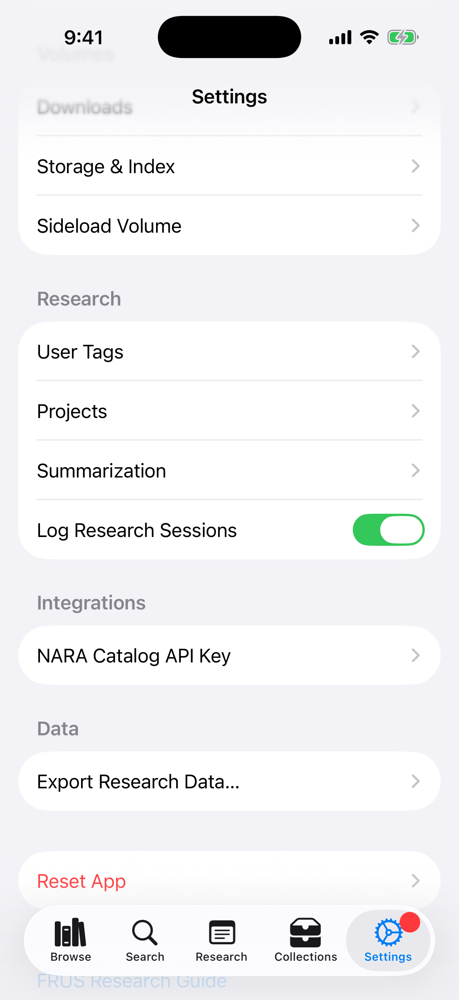

# FRUS Explorer for iOS and iPadOS — User Manual

> **Foreign Relations of the United States Explorer** — *Research the official record of U.S. foreign policy since 1861*

---

## Table of Contents

1. [Introduction](#1-introduction)
2. [Installation and First Launch](#2-installation-and-first-launch)
3. [The Main Interface](#3-the-main-interface)
4. [Browsing the Corpus](#4-browsing-the-corpus)
5. [Searching Documents](#5-searching-documents)
6. [Reading Documents](#6-reading-documents)
7. [Annotating and Tagging](#7-annotating-and-tagging)
8. [Cross-Reference Graph](#8-cross-reference-graph)
9. [Citation Lookup](#9-citation-lookup)
10. [Collections and Export](#10-collections-and-export)
11. [AI Summarization](#11-ai-summarization)
12. [Source Explorer](#12-source-explorer)
13. [Corpus Analytics](#13-corpus-analytics)
14. [Chronology](#14-chronology)
15. [Research Projects](#15-research-projects)
16. [Settings](#16-settings)
17. [iPad-Specific Features](#17-ipad-specific-features)
18. [Touch Gestures Reference](#18-touch-gestures-reference)
19. [The FRUS Research Guide](#19-the-frus-research-guide)

---

## 1. Introduction

FRUS Explorer brings the complete *Foreign Relations of the United States* documentary series to your iPhone and iPad as a fully offline, searchable research tool. The series — published since 1861 and now comprising more than 560 volumes — is the official declassified record of American foreign policy: diplomatic cables, policy memos, meeting transcripts, and intelligence reports from every era of U.S. history.

FRUS Explorer lets you:

- **Download and index** any subset of the corpus for instant full-text search, right on your device.
- **Read** documents in their original TEI-encoded form, with footnotes, editorial notes, and cross-references fully rendered for the iPhone and iPad screen.
- **Annotate** with research notes, inline highlights, and custom tags — all of which sync across your devices.
- **Summarize** long documents on-device using Apple Intelligence.
- **Export** curated collections of documents as formatted PDF, HTML, or Word (DOCX) documents, ready to share or print.
- **Cite** correctly using the State Department's recommended citation style, and share citations directly from the document view.
- **Visualize** how documents reference one another through an interactive, touch-friendly network graph.
- **Analyze** term frequency across the corpus with interactive charts, and jump fluidly between a chart and a search.
- **Browse by date** with the Chronology view — read every document from any span of years, grouped and charted by date.

All of your research data — notes, tags, collections, highlights, and projects — syncs automatically across every device signed into the same iCloud account, so you can start reading on your iPhone and pick up exactly where you left off on your iPad.

This manual covers FRUS Explorer on iPhone and iPad from the ground up. No familiarity with any other version of the app is assumed.

---

## 2. Installation and First Launch

### System Requirements

FRUS Explorer requires iOS or iPadOS 26 or later. Full-text search and document rendering work on all supported devices; AI summarization (Section 11) additionally requires a device with Apple Intelligence enabled.

### Installation

Install FRUS Explorer from the App Store. Search for "FRUS Explorer" or follow a direct link from the publisher.

`[SCREENSHOT: App Store page showing FRUS Explorer with Get/Install button]`

### Onboarding

The first time you launch FRUS Explorer, a short onboarding flow walks you through initial setup.

**Step 1 — Welcome**

A brief overview of the FRUS series appears, including the scope of the corpus (number of volumes, date range, total document count). You can proceed immediately, or tap the embedded link to read more about the series at history.state.gov in FRUS Explorer's built-in browser (see "The Embedded Browser" below).

`[SCREENSHOT: Onboarding welcome screen with corpus overview statistics on iPhone]`

**Step 2 — Add Volumes**

Choose how much of the corpus to download to your device now. You can always add or remove volumes later from **Settings → Volumes**.

| Option | Description |
|--------|-------------|
| **Entire Corpus** | All 560+ published volumes (several GB; downloading may take a while depending on your connection and how much free storage your device has) |
| **A Subseries** | One publication era, e.g., *1969–1976* (Nixon/Ford) or *1977–1980* (Carter) |
| **A Single Volume** | One specific volume chosen from a grouped picker |

`[SCREENSHOT: Onboarding scope picker with three options and subseries list visible]`

Estimated storage requirements appear before you confirm — useful on space-constrained iPhones. If you start the download while offline, it queues automatically and resumes once you're back online.

**Step 3 — Ready**

Optionally create your first research project — give it a name and a research question. Projects help you organize notes, tags, and collections around a single research effort (see Section 15). You can skip this step and create projects later.

`[SCREENSHOT: Onboarding "Ready" screen with optional project creation form]`

Tap **Finish**. FRUS Explorer opens to the Browse tab and begins downloading and indexing your selected volumes in the background — you can keep using the app while this happens.

### The Embedded Browser

Wherever FRUS Explorer shows a link to an external resource — onboarding, the About screen, the Research Guide, education content, Source Explorer, or NARA Catalog Lookup — it opens in a built-in browser sheet rather than leaving the app. This keeps you in your research session: dismiss the sheet with the close button or a downward swipe to return exactly where you were.

`[SCREENSHOT: Embedded browser sheet showing a history.state.gov page with a Done button]`

---

## 3. The Main Interface

FRUS Explorer on iPhone and iPad is organized around a **tab bar** with five tabs. Each tab is a self-contained area of the app; switching tabs preserves your place in each one, so you can move freely between browsing, searching, and your research workspace without losing your spot.

`[SCREENSHOT: iPhone tab bar showing Browse, Search, Research, Collections, Settings]`

| Tab | Icon | Purpose |
|-----|------|---------|
| **Browse** | books.vertical | Navigate the corpus by subseries, volume, and document; switch your active research project; jump to Corpus Analytics |
| **Search** | magnifyingglass | Full-text search across your downloaded volumes; look up a document directly by citation |
| **Research** | note.text | Your personal research workspace — all notes, highlights, and tagged documents in one place, organized by collection, tag, or highlight color |
| **Collections** | tray.2 | Build, edit, and export curated sets of documents |
| **Settings** | gear | iCloud status, display preferences, downloads and storage, tags, summarization, integrations, the Research Guide, and About |

### 3.1 The Indexing Banner

When volumes are downloading or being indexed for search, a banner appears just above the tab bar. It shows progress for the current volume (and, when several are queued, your position in the queue and an estimated time to completion). Tapping a name mentioned in the banner — such as a person discovered while indexing — can jump you straight to a search for that name.

`[SCREENSHOT: Indexing banner above the tab bar showing progress for a volume]`

When indexing finishes, the banner becomes a brief summary card offering to search the newly indexed volume. A small dot badge also appears on the **Browse** tab whenever downloaded volumes are still waiting to be indexed.

`[SCREENSHOT: Indexing summary card with "Search this volume" action]`

### 3.2 Live Activity (iPhone 14 Pro and later)

On iPhones with a Dynamic Island, starting a download presents a **Live Activity** — a persistent, glanceable progress indicator that stays visible from the Lock Screen, the Dynamic Island, and other apps, so you can track indexing progress without returning to FRUS Explorer.

`[SCREENSHOT: Dynamic Island showing FRUS Explorer indexing progress]`

`[SCREENSHOT: Lock Screen Live Activity card showing volume download progress]`

### 3.3 The Document Toolbar

When you open a document for reading, its toolbar gathers every contextual action — annotation tools, citation tools, navigation, and AI features — into the system overflow ("**•••**") menu at the top of the screen. Tap it to reveal:

| Action | What it does |
|--------|--------------|
| **Add Research Note** | Attach a note to this document |
| **Tag Document** | Apply or remove custom tags |
| **Create Highlight** | Enter highlight mode to mark up passages (see Section 7.2) |
| **Read / Research** (segmented control) | Switch between distraction-free Read mode and the Research panel layout (see Section 6.2) |
| **Citation** | View the formatted citation, or copy it (including Copy as… BibTeX/RIS) — see Section 9.3 |
| **Share** | Send this document to your Zotero library, export a Zotero file, or share the citation + link (see Section 9.3) |
| **Word Cloud** | Open a frequency word cloud for this document (see Section 13.4) |
| **Add to Collection** | File this document into one or more collections |
| **Cross-References** | View this document's outbound and inbound cross-references, and look any referenced person up in the NARA catalog |
| **Source Explorer** | Open this document's archival source note in Source Explorer |
| **Open in New Window** | (iPad, in a multi-window/Stage Manager session) open this document in its own window |
| **Summarize with AI** | Generate or view an on-device AI summary |
| **Show/Hide Notes Panel** | Toggle the notes panel alongside the document body |

`[SCREENSHOT: Document view with the "•••" overflow menu open, listing all toolbar actions]`

---

## 4. Browsing the Corpus

The **Browse** tab is where you navigate the FRUS corpus by its natural structure: subseries (publication eras), volumes, and individual documents.

### 4.1 Navigating the Hierarchy

Tap a subseries — for example, *1969–1976* — to see the volumes published within it. Tap a volume to see its table of contents: the documents it contains, each labeled with its document number, heading, and date.

`[SCREENSHOT: Volume table of contents showing a list of documents with dates]`

A **breadcrumb trail** at the top of the screen shows your current position in the hierarchy and lets you jump back to any earlier level with a tap.

`[SCREENSHOT: Breadcrumb trail showing Subseries > Volume > Document]`

Volumes you haven't downloaded yet are still browsable. Opening one shows a **Download Volume** button on its page (in place of the contents), and you can also long-press the volume in the list and choose **Download Volume** to queue it without opening the page. (See Settings → Volumes for managing downloads in bulk.) Anywhere you reach a document in an undownloaded volume — including a cross-reference inside another document — the app offers to download the volume rather than dead-ending.

### 4.2 Filtering to Downloaded Volumes

A toggle in the Browse toolbar limits the list to volumes you've already downloaded — handy when you want to browse only what's available offline, such as on a flight or in the field.

`[SCREENSHOT: Browse toolbar with the "Downloaded only" filter toggle highlighted]`

### 4.3 Switching Research Projects

A **project picker** in the Browse toolbar lets you set your active research context. Tap it to choose:

- **Global Context** — no active project; notes, tags, and highlights you create are not associated with any particular project
- Any of your existing projects, shown with a checkmark beside the active one
- **Manage Projects** — opens the full project management screen (see Section 15)

`[SCREENSHOT: Project picker menu open, showing Global Context and a list of projects with checkmarks]`

Whatever project is active follows you throughout the app — new notes, tags, and highlights you create are automatically associated with it, and your Research tab can be filtered to show only that project's material.

### 4.4 Jumping to Analytics and Chronology

An **Analysis Tools** menu (a chart icon) in the Browse toolbar gathers the corpus-wide tools so they open as sheets without leaving your place in the browser:

- **Chronology** — opens the **Chronology** browser (see Section 14) to read every document within a date range.
- **Corpus Analytics** — opens **Corpus Analytics** (see Section 13) to explore term-frequency trends.
- The corpus **Word Cloud** — opens a frequency word cloud for the whole corpus (see Section 13.4).

Grouping these three destinations under one always-reachable menu replaces the separate toolbar buttons used previously (which on iPad could collapse into an unreliable "•••" overflow).

`[SCREENSHOT: Browse toolbar showing the Analysis Tools menu (SF Symbol: chart.bar.xaxis) open with Chronology, Corpus Analytics, and Word Cloud entries]`

### 4.5 The People Browser

At the very top of the Browse screen, above the subseries list, is a **People** row. Tap it to open a reconciled, corpus-wide index of everyone named across the volumes you've indexed — a single alphabetical list rather than a per-volume one.

The same person often appears across many volumes under slightly different name forms ("Kissinger, Henry A.", "Kissinger, Henry", "Kissinger, Henry A. Laurence"). FRUS Explorer consolidates these into **one identity** so you don't have to chase the same person through a dozen separate entries. Each row shows:

- the person's **canonical name**;
- a subtitle combining their **role** and **active years** (e.g. *Secretary of State · 1973–1977*) where the volume's List of Persons supplied them;
- a **mention count** badge — the number of distinct documents that reference this identity across the whole corpus;
- a small **reconciled-identity** seal when the entry has been matched to the Office of the Historian's people authority file.

Use the **search field** at the top to filter the list by name.

Tap a person to open their **detail sheet**:

- **Find all mentions** runs a person-scoped search returning every document that references this identity (see Section 5).
- **Records in This Identity** lists each underlying `(volume, ref)` record that was folded into this person. If one of them is actually a different person, swipe or tap **Separate** to split it out — your correction syncs across your devices via iCloud and is reapplied whenever the index is rebuilt.
- When the app is uncertain whether two identities are the same person, it surfaces a **"possibly the same person"** suggestion with a **Merge** action so you can confirm.
- Reconciled identities that carry an authority id show a **View on VIAF** link to the external authority record.

> The consolidation is deliberately cautious: when in doubt it keeps identities **separate** (so you may occasionally see two entries for one person) rather than merging two different people. Your merge/separate corrections always take precedence.

---

## 5. Searching Documents

The **Search** tab provides full-text search across every volume you've downloaded and indexed, powered by the same search engine used for the State Department's own archive — ranked by relevance using the BM25 algorithm with English-language stemming (so searching for "negotiate" also matches "negotiation," "negotiated," and so on).

### 5.1 Basic Search

Type a word or phrase into the search field and results appear as you type, each showing a highlighted snippet of matching text, the document's citation, and its date. Tap a result to open the document, scrolled to the matching passage.

Results are shown a page at a time — 25 per page, with **‹ Page X of Y ›** controls in the results header — so a large result set stays fast to scroll. Up to 1,000 matches are loaded; if a query matches more, the header says so, and you can narrow your terms or use **Visualize in Corpus Analytics** (Section 5.5) to chart and tighten the result set.

### 5.2 Search Syntax

The search field supports a small query syntax for more precise results:

| Syntax | Effect |
|--------|--------|
| `word1 word2` | Matches documents containing both words (in any order) |
| `"exact phrase"` | Matches the exact phrase |
| `word1 OR word2` | Matches documents containing either word |
| `-word` | Excludes documents containing that word |

`[SCREENSHOT: Search field showing a phrase query in quotes with matching results]`

### 5.3 Filters

Tap the filter control to narrow your search by:

- **Volume or subseries** — restrict to one or more specific volumes
- **Date range** — restrict to documents dated within a span of years
- **Person** — restrict to documents mentioning a specific indexed person

`[SCREENSHOT: Search filter sheet showing volume, date range, and person filters]`

### 5.4 Timeline View

Toggle **Timeline** from the sort control to see your search results arranged chronologically along a timeline rather than as a ranked list — useful for tracing how a topic developed over a span of years.

`[SCREENSHOT: Search results in Timeline view, documents arranged along a date axis]`

### 5.5 Visualizing a Search in Corpus Analytics

Whenever a search returns results, FRUS Explorer offers to **Visualize in Corpus Analytics** — tapping this hands your search terms and any active date-range filter to the Analytics tab, pre-seeded so you can immediately chart the term's distribution across the corpus (see Section 13.3). When a search returns more results than can be displayed in full, the same handoff also carries the existing guidance about narrowing your date range before returning to search with a tighter result set.

`[SCREENSHOT: Search results banner offering "Visualize in Corpus Analytics"]`

### 5.6 Saving Searches

Tap the save icon to store your current query and filters for quick reuse later. Saved searches appear in a dedicated list accessible from the Search tab and sync across your devices via iCloud.

`[SCREENSHOT: Saved searches list]`

### 5.7 Finding a Document by Citation

Tap the citation-lookup button (a magnifying glass over quotation marks) in the Search toolbar to open **Citation Lookup** — paste or type a citation string (e.g., `FRUS 1969–1976, Volume I, Document 42`) and FRUS Explorer parses it and jumps directly to that document, even in a volume you haven't browsed to before. See Section 9 for more on citations.

`[SCREENSHOT: Citation Lookup sheet with a pasted citation string and a "Go" button]`

---

## 6. Reading Documents

Tapping any document — from Browse, Search, Research, or a Collection — opens it in the document view, where the original TEI-encoded text is rendered as readable, well-formatted prose: headings, datelines, paragraphs, footnotes, editorial notes, and cross-reference links all appear as the State Department originally published them, adapted for your screen.

### 6.1 Navigating Within a Document

Footnote markers and cross-reference links are tappable. Tapping a footnote marker scrolls to (or pops up) its note text; tapping a cross-reference link jumps to the referenced document if it's in your downloaded corpus, or offers to look it up otherwise.

### 6.2 Read Mode and Research Mode

The **Read / Research** segmented control in the document toolbar switches between two layouts:

- **Read** — a clean, distraction-free view of the document body, ideal for close reading. Read mode also enables **edge-tap page-turning** (see 6.3).
- **Research** — shows the document alongside your notes panel, so you can read and annotate side by side.

`[SCREENSHOT: Read/Research segmented control in the document toolbar]`

### 6.3 Edge-Tap Page-Turning (Read Mode)

While in Read mode, invisible tap zones along the left and right edges of the screen let you move to the previous or next document in the volume — much like turning pages in an e-book reader. Tap near the left edge to go back one document, or near the right edge to advance to the next one. This lets you read straight through a volume without returning to the table of contents or using the back button. (These tap zones are intentionally hidden in Research mode, where the edges of the screen are needed for the notes panel and other controls.)

`[SCREENSHOT: Document view in Read mode with annotated edge-tap zones for previous/next navigation]`

### 6.4 Display Preferences

Adjust font size, line spacing, and other reading preferences from **Settings → General → Display** (see Section 16). The same Display screen holds a **Chart Colors** stepper that sets the global default for how many distinctly coloured source volumes the Chronology and Corpus Analytics distribution charts show before the rest fold into a grey "Other" series (range 6–12, default 8). Either chart can override this for itself with its own **Chart colors** toolbar menu (Sections 13.1 and 14.2).

---

## 7. Annotating and Tagging

FRUS Explorer's research tools let you build a personal layer of analysis on top of the primary-source text — notes, highlights, and tags — all of which sync across your devices via iCloud.

### 7.1 Research Notes

From the document toolbar, choose **Add Research Note** to attach a free-form note to the current document. Notes appear in the notes panel (visible directly in Research mode, or toggled on in Read mode) and are collected across your whole library in the **Research** tab.

`[SCREENSHOT: Notes panel showing a research note attached to a document]`

If you have an active research project, new notes are automatically associated with it; from Global Context, notes aren't tied to any particular project.

### 7.2 Highlights

Choose **Create Highlight** from the document toolbar to enter highlight mode. Select a passage of text with your finger (or Apple Pencil on iPad) and choose one of four highlight colors — yellow, green, blue, or pink. Highlights appear as colored overlays directly in the text, are visible immediately without needing a separate "highlight mode" to view them, and survive document re-renders (such as display-preference changes) because their positions are tracked by stable text offsets rather than on-screen coordinates.

`[SCREENSHOT: Document body with yellow and blue highlights visible inline]`

`[SCREENSHOT: Highlight color picker showing the four available colors]`

Highlights you create can be annotated inline when you export a collection that contains the highlighted document — see Section 10.4.

### 7.3 Tags

Choose **Tag Document** from the document toolbar to apply one or more custom tags — short labels you define yourself (e.g., "Berlin Crisis," "needs follow-up," "key source"). Manage your full tag list, including colors and names, from **Settings → Research → Tags**. Tags let you build cross-cutting collections of documents that share a theme, regardless of which volume they come from.

`[SCREENSHOT: Tag picker sheet showing existing tags with a "Create new tag" option]`

### 7.4 The Research Tab

The **Research** tab is your single workspace for everything you've annotated. A sidebar lets you browse your material by:

- **All Notes** — every research note you've written, most recent first
- **By Collection** — documents grouped by the collections that contain them
- **By Tag** — documents grouped by the custom tags you've applied
- **By Highlight Color** — documents grouped by which highlight color appears in them

`[SCREENSHOT: Research tab sidebar showing All Notes, By Collection, By Tag, and By Highlight Color sections]`

Selecting any sidebar item shows the matching documents; tapping one opens it directly in the document view, scrolled to the relevant note or highlight.

---

## 8. Cross-Reference Graph

Many FRUS documents reference one another — a memo might respond to a cable, or a meeting record might cite an earlier policy paper. FRUS Explorer indexes these relationships and visualizes them as an interactive **network graph**, arranged chronologically so you can see the order in which references were written.

Open the graph from a document's **Cross-References** toolbar action. It opens full-screen (a sheet on iPad). Each node is a document, positioned left-to-right by date; arrows point from the citing document to the cited one, and larger nodes are more connected. A **legend** and an **info** button (ⓘ) explain the color, size, and direction encodings so meaning never depends on color alone.

`[SCREENSHOT: Cross-reference graph on iPhone showing nodes arranged along a date axis with direction arrows and a legend — the Cross-References toolbar action (SF Symbol: point.3.connected.trianglepath.dotted) labeled]`

**Reference list vs. canvas.** On iPhone, a segmented **List / Graph** control switches between the visual canvas and a scrollable reference list of the same connections (on iPad and Mac the list is a side panel you toggle). Selecting a node shows its details; tapping opens the document.

**Degree.** A degree control shows 1, 2, or 3 hops from the focus document. When a document has very few direct references, the graph auto-expands to 2 hops and says so.

**Touch interactions:**

| Gesture | Effect |
|---------|--------|
| Tap node | Select; show its title and details |
| Long-press node | Context menu: *Recenter Graph*, *Open Document*, *Archival Neighbors* |
| Pinch | Zoom |
| Two-finger drag | Pan |

Nodes in volumes you haven't downloaded are shown distinctly; selecting one offers to download the volume, and the graph updates once indexing finishes.

---

## 9. Citation Lookup

FRUS Explorer formats citations to match the State Department's own recommended style for the series, and gives you several ways to use them.

### 9.1 Viewing a Citation

From any open document, choose **View Citation** in the toolbar to see the fully formatted citation string in a popover, ready to read or screenshot.

`[SCREENSHOT: Citation popover showing a formatted FRUS citation string]`

### 9.2 Looking Up a Document by Citation

From the Search tab, tap the citation-lookup button to open **Citation Lookup**: paste or type any citation string and FRUS Explorer parses it — recognizing volume, document number, subseries, and other common citation formats — and opens the matching document directly, even one you haven't browsed to before.

`[SCREENSHOT: Citation Lookup sheet parsing a pasted citation and showing a matched document]`

### 9.3 Copying and Sharing Citations

The document toolbar separates the *citation itself* from *sending the document somewhere*:

- The **Citation** menu is for the reference text — **View Citation** (opens the formatted citation; from there you can also **Copy as…** BibTeX or RIS) and **Copy Citation**.
- The **Share** menu (the share icon, next to Citation) gathers the export and send actions:
  - **Send to Zotero Library** — pushes this document straight into your Zotero library over the Web API, with its tags and research notes (appears only when a Zotero account is connected; see Section 16).
  - **Export Zotero file (BibTeX / RIS)** — shares a Zotero-importable file via the system share sheet.
  - **Share Citation** — opens the share sheet with a single message combining the formatted citation *and* its canonical `history.state.gov` link, so whoever receives it can read the citation and open the original source online with one tap (works with Messages, Mail, Notes, AirDrop, third-party apps, and more).

`[SCREENSHOT: Document Share menu showing Send to Zotero Library, Export Zotero file, and Share Citation]`

---

## 10. Collections: Manager and Export

A **collection** is a curated, authored set of documents — for a research paper, a teaching unit, a briefing packet, or your own organized reading list. Collections work in two halves:

- The **manager** is the editorial place. It's where you decide *what's in* the collection and *how it's composed*: which documents, in what order, interleaved with your own section headings and prose, and how much of each document to show.
- **Export** is purely for *sharing*. By the time you export, every decision about the content already lives on the collection — export only chooses a **format** and a **destination**.

Everything in Sections 10.1–10.4 happens in the manager; 10.5 covers export.

### 10.1 The Collection Manager

Open the **Collections** tab and tap **New Collection**; give it a name and an optional description. Add documents either from the collection editor's search, or by choosing **Add to Collection** from any open document's toolbar. You can also **Add by Tag** to append every document carrying one of your tags.

`[SCREENSHOT: Collection manager showing a mix of documents, a section heading, and a prose block with reorder handles]`

Drag to reorder entries; the order you choose is the order they appear in every export.

### 10.2 Section Headings and Prose

A collection isn't limited to a flat list of documents. From the manager's **add** menu you can insert two kinds of editorial entry and place them anywhere in the order:

- **Section headings** — titles that group the documents beneath them into sections (e.g. "Opening Moves", "The Crisis Deepens"). They appear as headings in the export and in its table of contents.
- **Prose blocks** — your own connecting commentary, written in a **rich-text editor**: **bold**, *italic*, underline, and colour are all supported. Your formatting is preserved through export.

Headings and prose turn a collection from a document list into an authored reader.

### 10.3 Inspecting a Document's Data

Tap the **ⓘ** on any document entry to open its **inspector** — a read-only summary of everything the app knows about that document, gathered in one place: your research notes and highlights, the tags you've applied, its AI summary (if any), its archival source note, and its cross-reference count. Use it to decide what belongs in the collection and how to compose it.

### 10.4 Composition Settings

Composition settings are **saved on the collection** and edited in the manager's **Composition** section — so a collection always exports the same way, in any format, without re-choosing anything:

- **Default body depth** — full document text, an **AI summary only** (see Section 11), or a compact **index/outline** (citation, date, and notes, no body).
- **Footnote style** — all footnotes, only the archival source note, or none.
- **Table-of-contents label style** — list each document by its formatted citation, or by its header and dateline.
- **Include highlights** — when on, highlights you've made on the included documents are annotated inline in the export: coloured `<mark>` spans in HTML, background shading in PDF, and highlighted runs in DOCX (DOCX's limited palette renders blue as cyan and pink as magenta — the closest named colours).
- **Include research notes** — show your attached notes below each document's body.
- **Include word cloud** — prepend a frequency overview (PDF and HTML).
- **Summary prompt** — which summarization prompt to use when the body depth is "summary only".

**Per-entry and per-section overrides.** The default body depth is exactly that — a default. Any single document can override it (a mostly-summary reader with two documents shown in full), and any **section heading** can set a depth for all the documents beneath it. The effective depth is the most specific one that applies: the document's own override, else its section's, else the collection default.

### 10.5 Export

Tap **Export**, choose a format, and share. Because composition is already set, this sheet is just format + destination.

| Format | Best for |
|--------|----------|
| **PDF** | Print-ready output with consistent pagination — renders section headings and rich prose |
| **HTML** | Web-viewable output that preserves rich formatting — renders section headings and prose |
| **DOCX (Word)** | Editable output for Word, Pages, or Google Docs — section headings become Word headings (they appear in Word's table of contents) and prose keeps its formatting |
| **BibTeX** | A `.bib` file (one `@incollection` record per document) for LaTeX and reference managers such as JabRef |
| **FRUS Collection (shareable)** | A native **`.fruscollection`** file — an *editable* copy of the collection you can hand to a colleague (see below) |

**Send to Zotero.** A single **Send to Zotero…** menu handles reference-manager export. If you've connected a Zotero account (Section 16), **Send to Zotero Library** pushes the whole collection into your library over the Web API, carrying tags and research notes; otherwise it produces an **RIS file** for import into Zotero desktop (File → Import).

**Sharing an editable collection (`.fruscollection`).** Choosing the FRUS Collection format saves a small file that carries the collection's *source* — its document references, composition, section headings, and prose — not a rendered document. A colleague opens it right back into their own FRUS Explorer as a live, editable collection; because documents travel as references, the app offers to download any volumes they don't already have. Your research notes are **not** included unless you turn on the **Include my research notes** switch (off by default).

**Importing.** Bring a shared collection in with **Import Collection…** on the Collections screen, or simply open a `.fruscollection` file — from Files, an email attachment, or AirDrop — and FRUS Explorer switches to the Collections tab with the import added. Opening the same file again re-surfaces the collection it created rather than importing a duplicate (use **Import Collection…** if you want a second, independent copy). If a file can't be read, an alert explains why.

**Snapshotting a smart collection.** A *smart* collection — one linked to a saved search — resolves its documents from that search at export time, so its contents aren't fixed and can't be hand-edited. Choose **Create Static Snapshot** (from the collection's context menu) to capture the current results as a new, ordinary collection you can then edit, section, annotate, and share as a `.fruscollection`.

`[SCREENSHOT: Export sheet showing the format menu and the "Include my research notes" toggle]`

Once exported, the system share sheet appears so you can save the file, print it, or send it anywhere your device supports.

---

## 11. AI Summarization

FRUS Explorer can generate concise summaries of long documents entirely **on-device**, using Apple's on-device AI (Apple Intelligence) — no document text ever leaves your device for this purpose.

### 11.1 Summarizing a Document

Choose **Summarize with AI** from a document's toolbar. A summary is generated (this can take a few moments on first use for a given document) and displayed alongside the original text. Summaries are saved automatically and indexed for full-text search, so a later search can match text that appears only in a summary.

`[SCREENSHOT: Document view showing a generated AI summary panel beneath the toolbar]`

### 11.2 Summarization Prompts

FRUS Explorer ships with a standard summarization prompt, and you can create your own from **Settings → Research → Summarization** — for example, a prompt tuned to extract names and dates, or one that produces a brief for a specific kind of research question. Choose which prompt to use when generating a summary, and manage your saved prompts from the same Settings screen.

`[SCREENSHOT: Summarization prompt picker and prompt management screen]`

### 11.3 Summaries in Exports

When building a collection export, choosing **Summary only** as the body depth (Section 10.4) generates summaries on demand for any included document that doesn't already have one for the selected prompt — producing a compact briefing-style export instead of a full-text one.

### 11.4 Summarizing Many Documents in the Background

To summarize a large set of documents without sitting through them one at a time, open **Settings → Research → Summarization** and turn on **background summarization**, then pick a scope — an entire subseries, a single volume, a user tag, a saved search, or a date range. FRUS Explorer works through the queue conservatively, including for a period after you leave the app, and reports progress through a Live Activity (on supported iPhones) and the Settings screen. It's deliberately cautious about battery and heat, so a large batch may span several sessions; documents that already have a summary for the chosen prompt are skipped. Very long documents are handled automatically — they're summarized in sections and recombined, so even an unusually long policy paper completes rather than failing.

> **Note:** Background summarization is opt-in and runs only while the device has capacity; it is not a guaranteed-immediate operation. For a single document, **Summarize with AI** (Section 11.1) is always the fastest path.

---

## 12. Source Explorer

Every FRUS document is drawn from original archival material, and each carries a **source note** describing exactly where it came from — which National Archives record group, collection, and box, for instance. **Source Explorer** turns those source notes into a navigable view of the underlying archival record.

Open Source Explorer from a document's toolbar. It displays the parsed source-note information and offers a direct link to look the corresponding record up in the **National Archives (NARA) online catalog**, opened in FRUS Explorer's embedded browser. An **info** button (ⓘ) in the toolbar opens a popover explaining what the view shows and how to read an archival source note.

`[SCREENSHOT: Source Explorer view showing parsed archival source information with a NARA catalog link]`

Source Explorer picks the most precise resolution available for each note type: State Department decimal files route to the right period-specific NARA finding aid; lot files resolve through the NARA Catalog; presidential-library and CIA citations link to the appropriate finding-aid or CREST page; and **pre-1910 Central Files** — 1906–1910 Numerical File rolls and pre-1906 country-arranged diplomatic series — resolve from a **bundled index with no API key required**.

**Documents from This Collection.** Below the resolution, Source Explorer lists other indexed documents that cite the same archival source (the same lot file, central decimal file, record-group series, or presidential-library collection), so you can read a document alongside its archival neighbors. The section is always shown once a source note is parsed, with a loading state and a plain-language empty state explaining why there are none — it never silently disappears.

The same **Archival Neighbors** list is reachable without opening Source Explorer: long-press a node in the cross-reference graph, a search result, or a document in the volume's document list, and choose **Archival Neighbors**; the volume sources list also offers it per source entry.

`[SCREENSHOT: Source Explorer on iPhone showing the resolved source link and the "Documents from This Collection" list of archival neighbors]`

**Volume Sources list.** Recent volumes list, in their front matter, the archival collections their editors consulted. Open a volume's **Sources** section from the browser to see that list as an "About These Sources" note followed by a nested **Archival Collections** outline. Each collection that resolves to a National Archives record — a record group or a lot file — shows a **catalog link** (the columns icon) that opens the record in the embedded browser. Where a major collection is cited by more than one volume, a **Cited in N volumes** control lists those volumes, so you can trace a body of records across the series. This is volume-level provenance, complementing the per-document Archival Neighbors above.

If you have a NARA API key configured (see **Settings → Integrations**), Source Explorer can enrich lot-file and presidential-library lookups with live catalog data. Central-file, decimal-file, pre-1910, and CIA resolution work without a key.

---

## 13. Corpus Analytics

**Corpus Analytics** charts how often terms appear across the FRUS corpus over time — a quick way to spot when a topic rose or fell in official attention, or to compare how two terms trend against each other.

Open Analytics from the chart-icon button in the Browse tab toolbar (Section 4.4), by tapping a word in a **Word Cloud** (Section 13.4), or via the Search handoff described below.

### 13.1 Running an Analysis

Enter one or more terms and an optional date range, then tap to chart their frequency across the indexed corpus. Choose a **dimension** — Decade, Year, Month, Day, **Subseries**, or **By Volume**: the time dimensions chart frequency over time, while Subseries and By Volume break the same query down by where in the corpus it appears (omitting any subseries or volume where the term never occurs). On a Subseries or By Volume chart, tapping a bar drills into a Search scoped to that subseries or volume. The **By Year** and **By Decade** charts colour-code each bar by the volumes contributing the matches — the most-represented source volumes each get a colour, the rest fold into a grey "Other", and a legend below names each volume with its count — so you can see at a glance *which* part of the corpus is driving a term in any period (the same encoding the Chronology graph uses). The number of distinctly coloured volumes before the "Other" fold is **configurable** (6–12, default 8): a **Chart colors** menu in the Analytics toolbar sets it for this view, and a global **Chart Colors** default lives in **Settings → General → Display** (see Section 6.4). You can also set a **volume/subseries scope** — the same scope Search uses — so the chart and your searches cover the identical corpus subset. An **info** button (ⓘ) in the toolbar opens a popover explaining what the chart shows and how to read it.

### 13.2 From a Chart to a Search

Tap a point or segment on the chart to **View in Search** — this opens the Search tab with that term and the corresponding year range pre-filled as a date filter, letting you read the actual documents driving that data point.

`[SCREENSHOT: Analytics chart with a "View in Search" action on a selected data point]`

### 13.3 From a Search to a Chart

The relationship runs both ways: whenever a search returns results, Search offers **Visualize in Corpus Analytics** (Section 5.5) — tapping it opens Analytics pre-seeded with your search terms and date filter, so you can chart the term's distribution. When a search returns more matches than can be shown in full, the handoff additionally guides you to narrow your date range before returning to a more focused search.

### 13.4 Word Cloud

Where Analytics charts one term over time, a **Word Cloud** shows the most frequent terms in a body of material at a glance. You can open one for almost any scope: a single **document** (Share/More menu in the document toolbar), a **volume** or **subseries** (the context menu in the browser), a **collection**, a **user tag**, a **saved search**, a **date range**, or the whole **corpus**. An **info** button (ⓘ) in the toolbar opens a popover explaining what the cloud shows and how to read it.

`[SCREENSHOT: Word cloud for a volume on iPhone, with the lens bar above a packed spiral of sized terms]`

- **From a date range, via Chronology.** To build a date-range cloud on iPhone and iPad, open the **Chronology** browser (Section 14) for the span you want and tap **Word Cloud for this range** (a cloud icon) in its toolbar; the cloud is built from the documents in that date range. From a date-range cloud you can jump back the other way: its options menu (the "•••" / ellipsis menu in the toolbar) offers **View in Chronology**, which reopens the Chronology browser for the same range. (This item appears only for a date-range cloud.)

- **Two views.** A packed **spiral cloud** sizes each term by frequency (and rotates some terms to pack more in); a **List** view ranks the same terms with a weight bar and exact counts. The List view is also what VoiceOver reads, so the cloud is fully accessible.
- **Lenses.** A bar of lens chips narrows the cloud to a kind of term: **All terms**, **People / Places / Organizations** (recognised on-device), **Topics / Actions / Descriptors** (nouns / verbs / adjectives), **Concepts** (abstract ideas like *sovereignty* or *deterrence*), or **Sentiment** (positively- and negatively-charged words, coloured green and red). If a scope doesn't contain enough of a given kind of term, the cloud says so instead of showing a near-empty result.
- **Act on a term.** Tap any word to chart how often it appears across the whole corpus in **Corpus Analytics** (Section 13) — a fast way to tell whether a term that caught your eye was a passing mention or a sustained concern over the life of the series. The handoff is corpus-wide for every cloud; for a **volume** or **subseries** cloud the word's options menu adds **Analyze within this volume / this subseries** for a chart scoped to just that material. That menu also offers **Search for this term**, and lets you **hide** a word — either **in all word clouds** or only **in this lens** (managed afterwards in Settings → Research → Word Cloud) — switch lenses, **compare** the scope against another (corpus, a collection, or a tag) side by side, and **export** the cloud as a PNG image, a PDF, or a CSV of terms and counts.
- **Tuning.** Settings → Research → **Word Cloud** lets you set minimum word length and occurrence count, toggle plural-merging and the classification-marking / diplomatic-boilerplate filters, and maintain your own **hidden-word lists** (global, or per lens) — useful for trimming a recurring false positive without affecting other lenses.
- **Appearance.** An **Appearance** section in Settings → Research → **Word Cloud** controls how the cloud is drawn. A **font** picker chooses the typeface — **Rounded** (the default, original look), **Default**, **Serif**, or **Monospaced** — and a **density** picker — **Compact**, **Balanced** (default), or **Airy** — sets how tightly words pack (Compact fits more terms; Airy spaces them out for legibility). These are **device-local** preferences (they are not synced via iCloud) and apply everywhere a cloud is drawn: the interactive cloud, the side-by-side comparison columns, and PNG / PDF / collection-image exports.

Corpus- and subseries-wide clouds can take a moment the first time; on iPhone they're precomputed in the background and cached, so reopening them is instant.

---

## 14. Chronology

The **Chronology** browser lets you pick a date range and read every indexed document that falls within it, grouped into date sections — a corpus-wide complement to Search and Analytics. Where Analytics charts how often a *term* appears over time, Chronology shows you the actual *documents* from a span of dates, whatever their subject.

Open it from the **Analysis Tools** menu in the Browse tab toolbar (Section 4.4); it slides up as a sheet. An **info** button (ⓘ) in the Chronology toolbar opens a popover explaining what the view shows and how to read it.

A **Word Cloud for this range** button (a cloud icon) in the toolbar builds a word cloud from the documents in the date range currently displayed (drawing on the same documents as the list below, up to the same 5,000-document cap; see Section 13.4). It is disabled when the range contains no documents.

### 14.1 Choosing a Range

Set the **From** and **To** dates and tap **Show**. FRUS Explorer loads every document whose date interval overlaps the range and groups them into sections that auto-coarsen as the range widens — days for short ranges, months for multi-year ranges, years for very wide ranges. A document is never shown more precisely than its own date supports, and each section carries the document's date precision (day / month / year) and certainty (exact vs. approximate) from the TEI source. Very wide ranges can match far more documents than the list shows: the **document list is capped at 5,000**, but the distribution chart (Section 14.2) still reflects the **whole range**. The summary line reports the true total and says when the list is capped, so you can narrow the range to browse every document.

### 14.2 The Distribution Chart

A stacked bar chart above the list shows the document distribution, colored by volume, with a tappable legend that doubles as a per-volume filter. Each volume appears under a **concise, distinct label** — its topic plus a compact period/volume tag (e.g. *Southeast Asia · 1969-76 v20*) rather than its full title — so series are easy to tell apart. The number of distinctly coloured volumes before the rest fold into a grey "Other" series is **configurable** (6–12, default 8): a **Chart colors** menu in the Chronology toolbar sets it for this view, and a global **Chart Colors** default lives in **Settings → General → Display** (see Section 6.4). The chart is **anchored to the exact range you picked**, so it represents your chosen window rather than stretching to the uncertainty bounds of imprecise dates, and for very wide ranges it shows the **complete distribution** even when the document list below is capped (Section 14.1). Two companion sections keep the chart honest:

- **Spans this period** — wide-span documents (mostly editorial notes covering a whole multi-year range) are listed separately rather than smeared across the chart.
- **Extends beyond this range** — documents whose uncertain date reaches before or after your range are reported here, each annotated with the direction it overflows.

`[SCREENSHOT: Chronology distribution chart on iPhone with the legend and the "extends beyond this range" section visible]`

### 14.3 Reading and Searching the Range

Tap any document to open it. Dense date sections collapse to a preview with a "Show all N" expander. **Search in this range** hands the date range to Search as a filter so you can add keyword criteria over the same span.

---

## 15. Research Projects

**Projects** let you organize your notes, tags, highlights, and collections around a specific research effort — a paper, a course, a long-term interest — keeping that material separate from your general reading.

### 15.1 Creating and Managing Projects

Open **Manage Projects** from the project picker in the Browse tab toolbar (Section 4.3), or create your first project during onboarding. Give each project a name and an optional research question or description; you can edit these at any time.

`[SCREENSHOT: Project management screen showing a list of projects with edit and delete actions]`

### 15.2 Switching Active Projects

The project picker in the Browse toolbar shows your current context — either **Global Context** (no project) or the name of your active project — and lets you switch instantly. Whatever is active when you create a note, apply a tag, or make a highlight determines which project (if any) that material is filed under.

`[SCREENSHOT: Project picker showing the active project with a checkmark]`

### 15.3 Filtering Your Research by Project

In the **Research** tab, you can filter your notes, tags, and highlights to show only material associated with a specific project — useful when you're deep in one research effort and don't want material from other projects cluttering the view.

> **Note:** Unlike on other platforms, iOS and iPadOS manage projects through the Browse tab's project picker rather than through a dedicated Settings pane — Settings focuses on app-wide preferences, while project context is treated as part of your active browsing and research session.

---

## 16. Settings

The **Settings** tab gathers every app-wide preference, organized into clearly labeled sections.

| Section | Contains |
|---------|----------|
| **iCloud Sync** | Sync status for your research data (notes, tags, collections, highlights, projects), plus a **Sync Settings Across Devices** toggle that mirrors your word-cloud filters and stop lists, citation style, default document mode, and research-logging preference to your other devices that have it enabled. Off by default — turning it on adopts your existing iCloud settings; leave it off to keep this device's settings separate. (Device-specific preferences like download limits stay local.) |
| **General** | **Display** preferences (font size, line spacing, related reading options, and the **Chart Colors** default — 6–12, default 8 — for the Chronology and Corpus Analytics distribution charts; see Section 6.4) and **Search Defaults** (default filters and sort order for new searches) |
| **Volumes** | **Downloads** (queue and manage which volumes are on your device), **Storage** (see how much space the corpus occupies and free it up), **Index Health** (the merged search-index version, status, and an on-demand integrity check), and **Sideload** (import volume files manually, e.g., from a file you've obtained separately) |
| **Research** | **Tags** (create, rename, recolor, and delete your custom tags), **Summarization** (manage AI summarization prompts and turn on background summarization), **Word Cloud** (filtering criteria and custom hidden-word lists; see Section 13.4), and **Log Sessions** (diagnostic logging for troubleshooting) |
| **Integrations** | **NARA API Key** (your National Archives catalog key for Source Explorer) and **Zotero** (connect your Zotero account with a Web API key so **Send to Zotero Library** can push documents and collections straight into your library) |
| **Data** | Export your research data, and **Reset** options to clear cached or local app state |

Two standalone rows complete the tab:

- **FRUS Research Guide** — opens the standalone research-methodology guide as a sheet (see Section 19)
- **About** — version information, acknowledgments, and links (opened in the embedded browser where applicable)

---

## 17. iPad-Specific Features

iPad's larger screen and multitasking model unlock several capabilities beyond the core iPhone experience.

### 17.1 Inspector Panels

On iPad, several views present supplementary information — such as a document's notes, tags, or cross-references — in a side **inspector panel** rather than a full-screen sheet, so you can see your primary content and its supporting material at the same time. Show or hide an inspector with the inspector toggle in the relevant toolbar.

`[SCREENSHOT: iPad split view showing a document with an inspector panel open alongside it]`

### 17.2 Multi-Window and Stage Manager

On iPads that support Stage Manager, FRUS Explorer can open documents in their own windows — choose **Open in New Window** from a document's toolbar to pop it out, then arrange it alongside other FRUS Explorer windows or other apps. This is especially useful for comparing two documents side by side, or keeping a reference document visible while you work in another.

`[SCREENSHOT: Stage Manager session showing two FRUS Explorer document windows side by side]`

### 17.3 Keyboard and Trackpad Support

When a hardware keyboard or trackpad is connected, FRUS Explorer supports standard navigation shortcuts (such as moving between search results or document sections) and trackpad gestures for scrolling, selecting text for highlights, and navigating back and forward — letting iPad function as a capable laptop replacement for extended research sessions.

### 17.4 Apple Pencil

When using Apple Pencil to select text for a highlight (Section 7.2), selection is precise enough for fine-grained passages — useful for marking a single clause or a specific name within a longer sentence.

---

## 18. Touch Gestures Reference

| Gesture | Where | Effect |
|---------|-------|--------|
| **Tap** | Search result, document list row, graph node | Open the item |
| **Tap and hold (long-press)** | Document text | Begin a text selection for highlighting or copying |
| **Tap near screen edge** | Document body, Read mode | Turn to the previous (left edge) or next (right edge) document in the volume |
| **Swipe down** | Sheets (citation popover, export options, embedded browser, etc.) | Dismiss |
| **Pinch** | Cross-reference graph, Analytics chart | Zoom in or out |
| **Drag** | Cross-reference graph, Analytics chart, collection document list | Pan the view, or reorder a list item |
| **Swipe left on a row** | Lists (saved searches, notes, collection items) | Reveal quick actions such as delete |

---

## 19. The FRUS Research Guide

The **FRUS Research Guide** is a standalone, in-app guide to historical research methodology — covering how to approach the FRUS series as a primary source, how to build a research question, how to use citations rigorously, and other practical guidance for working with declassified diplomatic records.

Open it from **Settings → FRUS Research Guide**. It opens as a sheet you can read at your own pace, with internal links that open in the embedded browser (Section 2) so you never lose your place.

`[SCREENSHOT: FRUS Research Guide opened as a sheet, showing a methodology section with embedded links]`

You'll also find contextual links into the Research Guide from **Source Explorer** and **NARA Catalog Lookup** — for example, a link explaining how to interpret an archival record group while you're looking at one — so guidance appears exactly when it's useful, not just as a separate reference document.

---

*FRUS Explorer is an independent research tool and is not affiliated with or endorsed by the U.S. Department of State. The underlying FRUS document series is in the public domain.*
