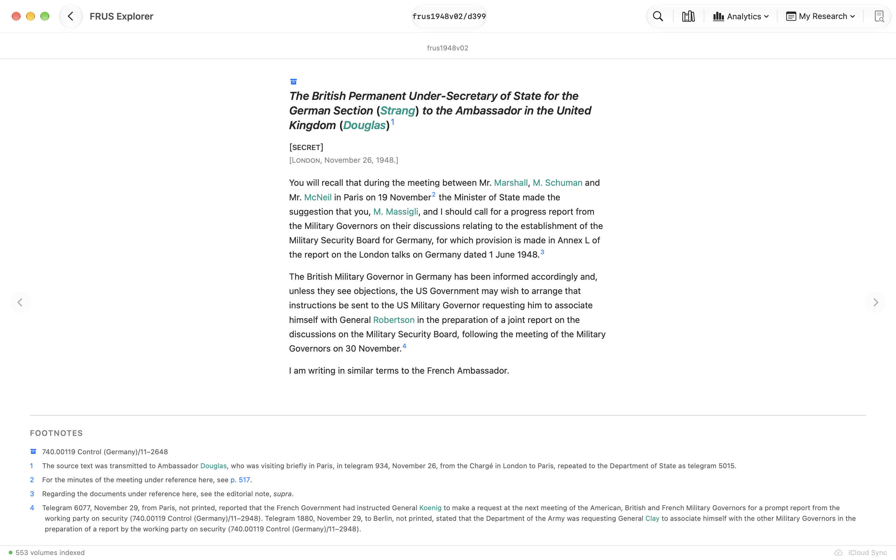
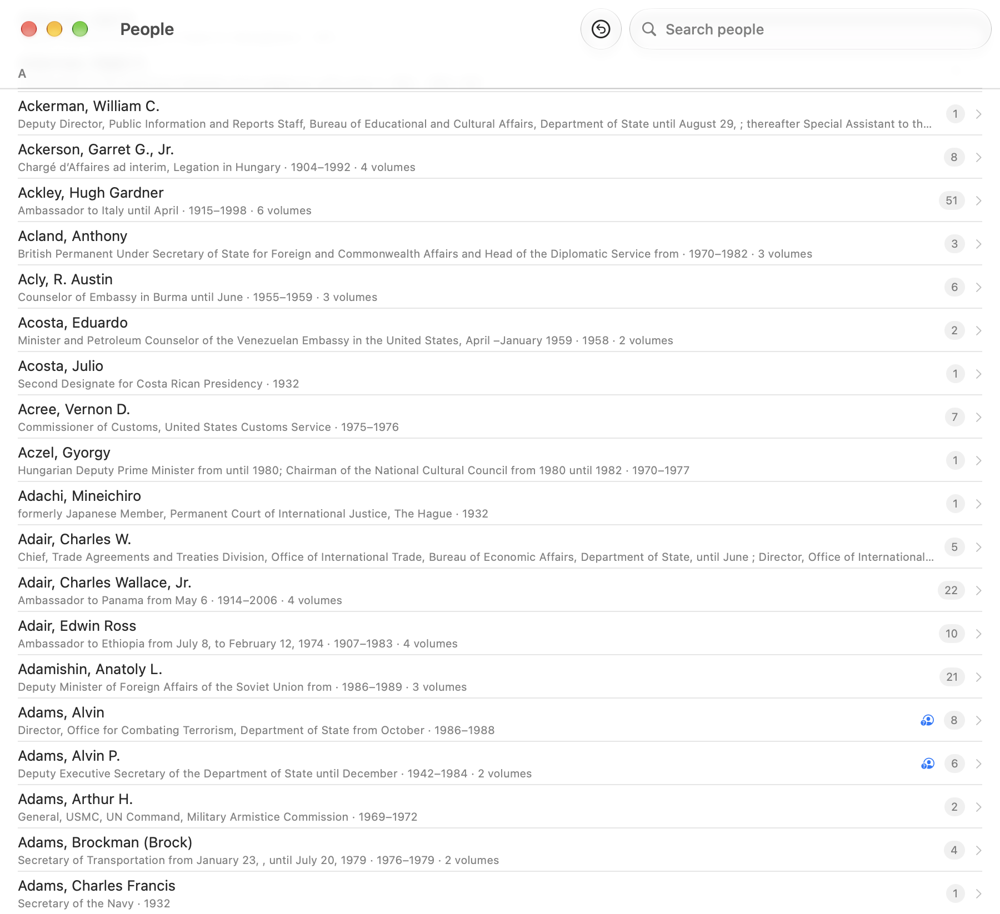
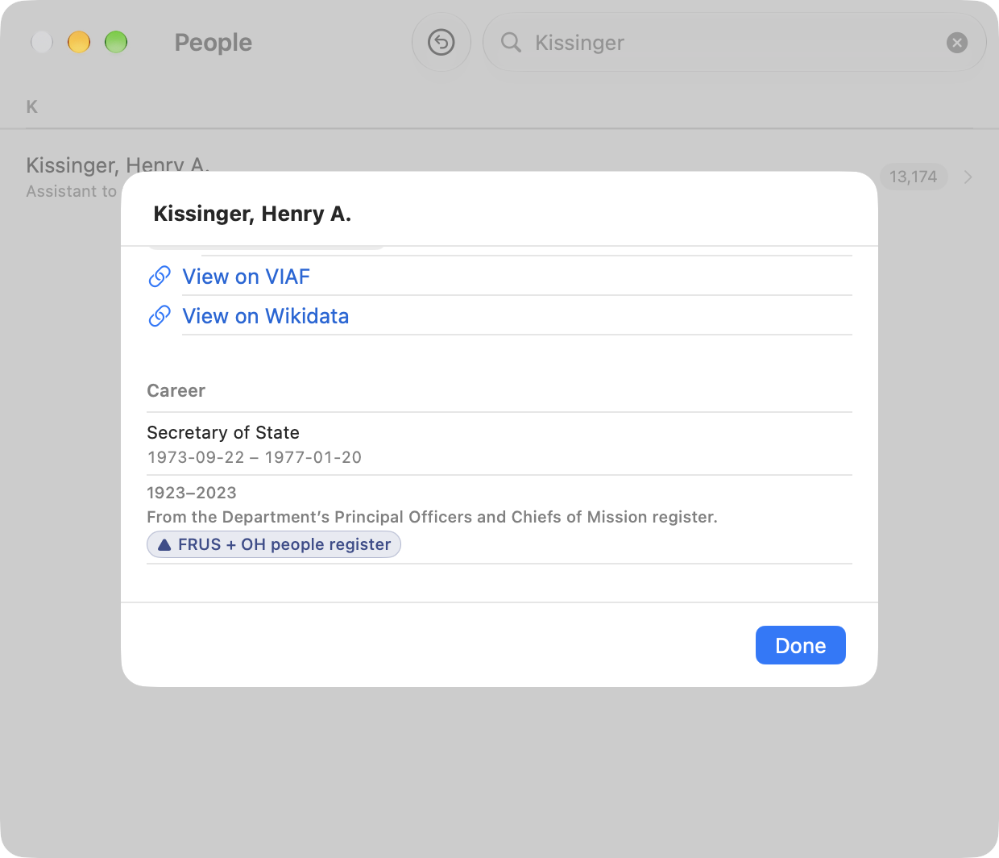
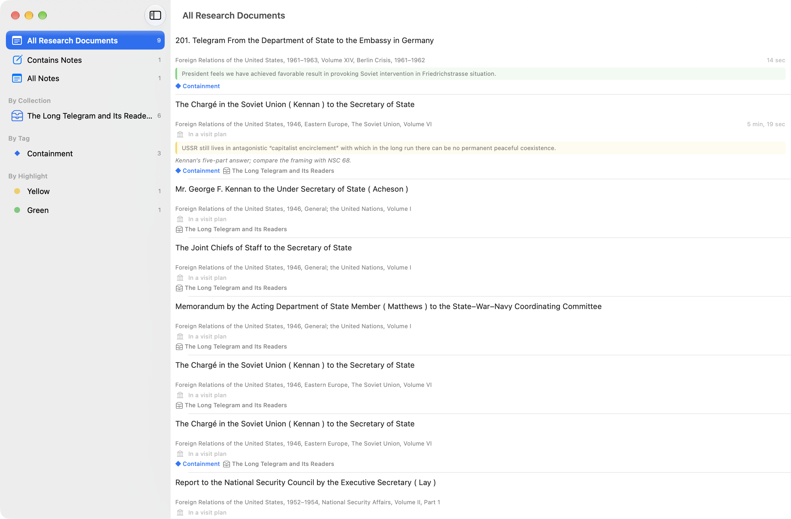
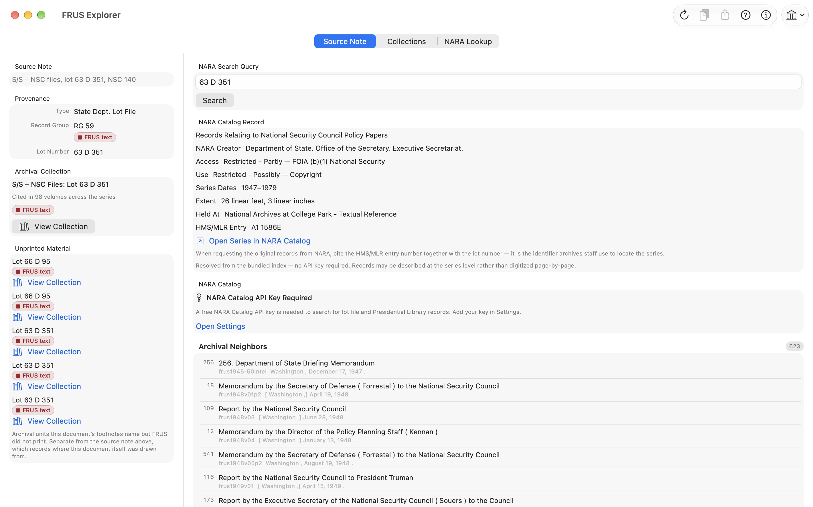
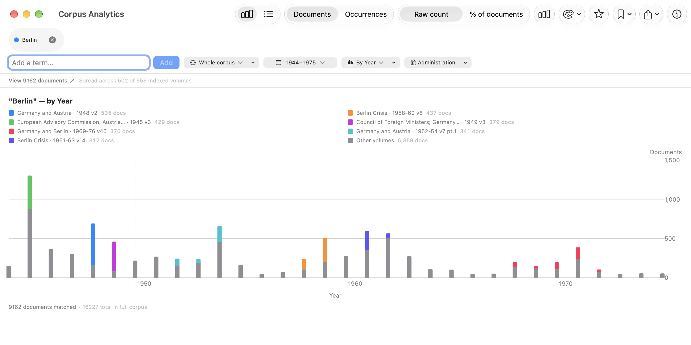
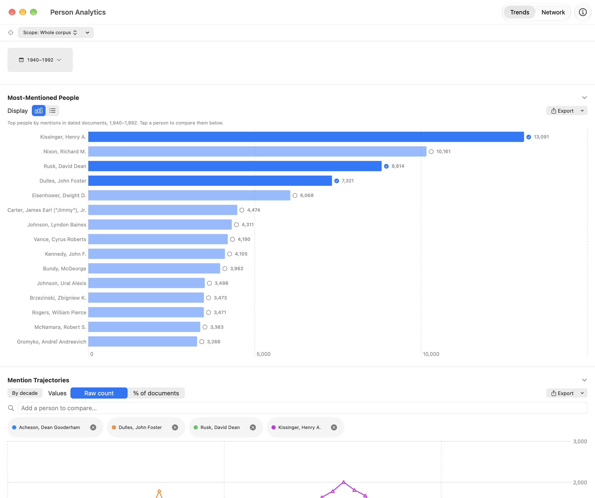
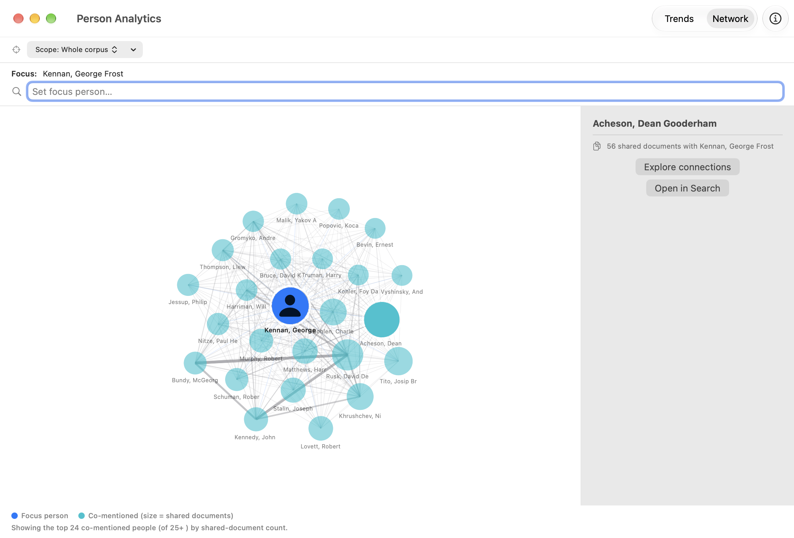
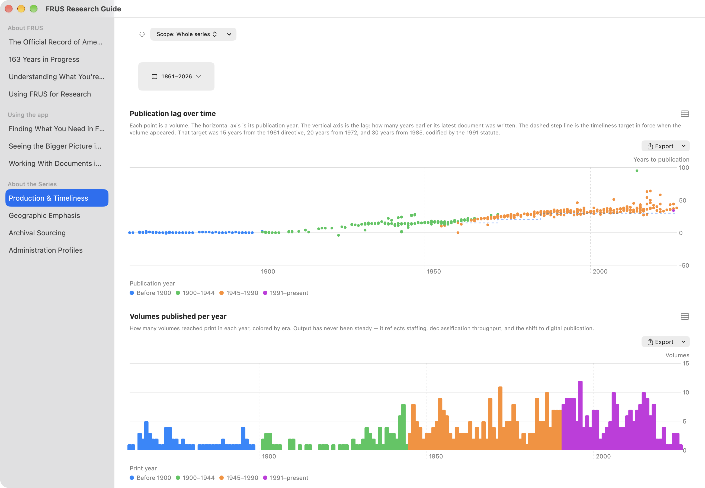

# FRUS Explorer for macOS — User Manual

> **Foreign Relations of the United States Explorer** — *Research the official record of U.S. foreign policy since 1861*

This manual is written for a first-time user coming to FRUS Explorer for graduate-level research and teaching. It assumes you know your way around historical research — footnotes, finding aids, Zotero, Chicago style — but that you have never opened this app before. The Mac app is the desk-workstation version of FRUS Explorer: the same corpus, annotations, and analytics as the iPad and iPhone app (covered in a separate [iOS manual](iOS-User-Manual.md)), presented as a windowed, keyboard-driven environment where a document, a search, a graph, and your notes can all be on screen at once. Your research data syncs between the two through iCloud, so nothing in this manual asks you to choose.

---

## Table of Contents

1. [Welcome: What FRUS Explorer Is](#1-welcome-what-frus-explorer-is)
2. [Getting Started](#2-getting-started)
3. [A First Session](#3-a-first-session)
4. [The Main Window and Its Windows](#4-the-main-window-and-its-windows)
5. [Building Your Library](#5-building-your-library)
6. [Browsing the Corpus](#6-browsing-the-corpus)
7. [Searching](#7-searching)
8. [Reading Documents](#8-reading-documents)
9. [Notes, Highlights, and Tags](#9-notes-highlights-and-tags)
10. [Projects](#10-projects)
11. [Citing and Reference Managers](#11-citing-and-reference-managers)
12. [Collections: Research Packets and Course Readers](#12-collections-research-packets-and-course-readers)
13. [AI Summaries](#13-ai-summaries)
14. [Source Explorer: From Source Note to Archive](#14-source-explorer-from-source-note-to-archive)
15. [Analytics](#15-analytics)
16. [History, the Research Guide, and About the Series](#16-history-the-research-guide-and-about-the-series)
17. [Settings Reference](#17-settings-reference)
18. [Workflows for Research and Teaching](#18-workflows-for-research-and-teaching)
19. [Keyboard Shortcuts](#19-keyboard-shortcuts)

---

## 1. Welcome: What FRUS Explorer Is

*Foreign Relations of the United States* is the State Department's official documentary record of American foreign policy — more than 550 volumes published since 1861, containing declassified diplomatic cables, policy memoranda, meeting minutes, and intelligence reports. If you work on the history of U.S. foreign relations, you have almost certainly used it, whether in the printed volumes or on history.state.gov.

FRUS Explorer puts the entire digitized series on your Mac as a fully **offline** research tool, and then builds a research workbench around it. Concretely, it lets you:

- **Download and index** any subset of the corpus — one volume, a publication era, or all 552 volumes — for instant full-text search, with no network connection needed afterward.
- **Read** documents rendered from their original TEI encoding, with footnotes, editorial notes, and cross-references intact and clickable.
- **Annotate** with research notes, colored highlights, and your own tags, all synced across your devices through iCloud.
- **Organize by project**, so the notes and collections for your dissertation chapter never mix with the ones for the course you're teaching.
- **Cite** in the State Department's recommended style, copy citations as BibTeX or RIS, and push documents straight into your **Zotero** library.
- **Build collections** — curated, ordered, sectioned sets of documents with your own connecting prose — and export them as PDF, HTML, or Word files. This is how you assemble a source packet for a seminar paper or a **course reader for your students**.
- **Trace provenance** with Source Explorer, which parses each document's archival source note and resolves it against the National Archives catalog — including the file-series and entry numbers you would quote on a pull slip at NARA.
- **Analyze at scale**: chart term frequency over 130 years, follow individual people across the whole series, map the citation network, see which archival collections each era's editors drew on, and export any chart as a publication-ready figure with its method recorded alongside.
- **Keep a defensible record** of your own work: the app can log every search you run with its scope and result count, and export that trail as a **method appendix** you can cite.

Two design commitments run through everything and are worth knowing on day one, because they will shape how you read the app's numbers:

- **Offline first.** Search, reading, annotation, analytics, and most archival resolution run entirely on your Mac; the series-wide reference data (the archival authority, the citation graph, the About the Series dashboards) ships inside the app.
- **Honest numbers.** When a figure covers only part of something — your indexed volumes rather than the whole series, the first 5,000 documents of a larger match, a capped result fetch — the app says so on the surface where the number appears, and its exports record the method. For a researcher, that footnote discipline is the difference between a number you can put in a paper and one you can't.

---

## 2. Getting Started

### 2.1 Requirements

FRUS Explorer requires **macOS 26 or later**. Full-text search and document rendering work on all supported Macs; AI summarization (Section 13) additionally requires an **Apple Silicon** Mac with Apple Intelligence enabled in System Settings.

### 2.2 Installation

Install from the **Mac App Store**, or from the **`.dmg`** distributed directly from the project website.

### 2.3 Onboarding

The first launch walks you through setup over a backdrop that is a **word cloud drawn from the series itself**, cycling through four views of the vocabulary — **Concepts**, **Topics**, **Actions**, and **Sentiment** (positive words green, negative red) — with a chip naming whichever you are looking at. The words are counted from the actual FRUS text at build time and shipped with the app, which is what makes the next step useful rather than decorative.

**Step 1 — Welcome.** A one-line introduction to the series. Click **Get Started**.

**Step 2 — Add Volumes.** Choose how much of the corpus to download now (you can always add or remove volumes later from Settings):

| Option | Description |
|--------|-------------|
| **Entire Corpus** | All 550+ published volumes (~several GB; downloading takes time depending on your connection) |
| **A Subseries** | One publication era — e.g., *1969–1976* (Nixon/Ford) or *1977–1980* (Carter) |
| **A Single Volume** | One specific volume, chosen from a grouped picker |

Pick a subseries and the cloud behind the panel becomes that era's vocabulary (*kissinger, nixon, soviet, capability, balance*) before you commit. Estimated storage requirements are shown before you confirm; if you're offline, the queue starts automatically once connectivity is restored.

**Step 3 — Ready.** Optionally create your first research project — a name and a research question. Projects organize notes, tags, and collections around one research effort (Section 10); you can skip this and create projects later. Click **Finish** — the main window opens and downloading and indexing begin in the background.

> **How much should you download?** The choice isn't binding — volumes add and remove freely later. A reasonable start: the **subseries covering your research period**, adding neighboring eras as your chronology firms up. On a Mac with the disk to spare, the whole corpus is the most powerful configuration — corpus-wide search and analytics sharpen with every volume you index. And a fair amount of the app works before you download anything: the About the Series dashboards, the archival collection authority, and the volume-level Top Subjects all ship inside the app.

---

## 3. A First Session

Fifteen minutes, one document, most of the core workflow. This assumes at least one volume has finished indexing (the status bar at the bottom of the main window tracks progress — Section 4.4).

1. **Browse to a document.** Open the Corpus Browser (**⇧⌘B**), click a subseries, a volume, a chapter, and a document. It opens in the main window, rendered as readable prose — heading, dateline, body, footnotes — styled to match history.state.gov.

2. **Move through the volume.** **⌥⌘↓** advances to the next document in reading order, **⌥⌘↑** goes back — or use the chevrons that appear when you hover at the document's left and right margins.

3. **Highlight a passage.** Select a sentence. A dark pill — the **floating selection bar** — appears at the selection. Click one of its four **color dots** and the passage is highlighted in that color, permanently and across your devices.

4. **Attach a note.** With text selected, click **Note** on the same bar (or press **⇧⌘N**) and type a thought. It files under your active project and is searchable later.

5. **Open the Research rail.** Press **⌘⇧R**. The rail slides in beside the document with six tiles — **Cite**, **Word Cloud**, **Sources**, **Graph**, **Related**, **Share** — above expandable **Summary**, **Notes**, **Tags**, and **Collections** sections. This is the per-document research surface; everything you do *about* a document starts here.

6. **Take the citation.** Click **Cite**: the formatted citation in the State Department's recommended style, with **Copy citation**, **Copy URL**, and **Copy as…** BibTeX or RIS. If you connect Zotero later (Section 11.3), the **Share** tile pushes the document straight into your library.

7. **Check where it came from.** Click the **source note** at the top of the document (or the rail's **Sources** tile). Source Explorer parses the archival citation — the lot file, decimal file, or presidential-library collection the original sits in — and resolves it against the National Archives catalog where it can (Section 14).

8. **Search.** Press **⌘S**. The Search window opens with the caret already in the query field; type a phrase in quotes and press Return. Results update as you refine; click one and the document opens in the main window — the Search window stays where it was, which is the Mac app's basic rhythm: tools in their own windows, documents in yours.

9. **Save what worked.** Click the **bookmark** button beside the search field to save the query with all its filters.

That is the loop — find, read, mark, cite — and the rest of this manual is depth on each part, plus the tools that operate on the corpus as a whole.

---

## 4. The Main Window and Its Windows

The Mac app is built around one **main window** (the document reader) surrounded by specialized tool windows you summon as needed. If you have the screen for it, a productive arrangement is the main window centered with Search on one side and your notes or a graph on the other.

### 4.1 The Toolbar

**Center — document title.** When a document is open, a compact `volumeId/documentId` title (e.g., `frus1969-76v01/d42`) appears here, updating as you navigate.

**Trailing edge — five controls.** The two ▾ entries are menus grouping the specialized windows:

| Control | Shortcut | Opens |
|---------|----------|-------|
| **Search** | ⌘S | The full-text Search window |
| **Browse** | ⇧⌘B | The Corpus Browser |
| **Analytics ▾** | — | **Corpus Analytics**, **Person Analytics**, **Cross-Reference Analytics**, **Archival Analytics**, **Semantic Analytics**, **Chronology**, and **Word Cloud** (Section 15) |
| **My Research ▾** | — | **Research** (⌘⌥R — every annotated document), **Collections** (⇧⌘K), and **Complete History…** (Section 16.2) |
| **Research rail** | ⌘⇧R | Show or hide the per-document Research rail (4.2) |

 <!-- TODO Phase E: re-capture for Research rail -->

### 4.2 The Research Rail

The **Research rail** (⌘⇧R) is the per-document research surface, a trailing panel beside the document. On a wide window it sits side-by-side with the text; below roughly 900 points of window width it becomes an overlay that slides in over the document. It opens with a **RESEARCH** header, then a **3×2 tile grid**:

| Tile | What it opens |
|------|---------------|
| **Cite** | The citation popover — formatted citation, copy, Copy as… BibTeX/RIS (Section 11) |
| **Word Cloud** | A word cloud of this document (Section 15.2) |
| **Sources** | Source Explorer for this document's source note (Section 14) |
| **Graph** | The cross-reference graph around this document, in its own window (Section 8.5) |
| **Related** | The Related Documents window — a ranked list of the documents most related to this one (Section 8.5) |
| **Share** | Zotero send, Zotero-file export, and citation sharing (Section 11) |

Below the tiles sit four expandable accordions — **Summary** (AI summaries, Section 13), **Notes**, **Tags**, and **Collections** (Sections 9 and 12).

The rail header's **ⓘ** button explains the six tools — and, at the bottom of that popover, carries the document's **Classification**: whether the app treats what you're reading as a *document* or an *editorial note*, with the control to correct it. FRUS's own tagging is occasionally wrong, and because the app trusts it, the mistake reaches the type badge, search's document-type filter, counts, and exports. **Reclassify as Document…** / **Reclassify as Editorial Note…** records your correction: the body restyles immediately, every filter and badge follows it on all your devices, and the popover then shows what FRUS tags it as so the disagreement stays visible. Fully reversible — **Restore FRUS's Classification** in the same popover, or manage every correction (with per-row Undo) under **Settings → Search → Classification Corrections…**. One caveat the confirmation dialog also states: the bundled series-analytics dashboards are computed from the published corpus and cannot see your corrections.

**Highlighting is not a rail button.** To highlight, **select text in the document body**: the **floating selection bar** (a dark pill) appears at the selection with four color dots — click one to save the highlight — plus **Excerpt**, **Look Up**, and **Note** actions. For a selection inside a footnote, the color dots and Excerpt are disabled; Look Up and Note remain available. The same bar, with the same behavior, appears on iPad and iPhone.

 <!-- TODO Phase E: re-capture for Research rail -->

### 4.3 The Document View

The central area displays the open document ("Select a document to begin" when none is). As you navigate — search results, cross-references, the browser — the window builds a navigation stack; the toolbar's back button steps back through it. **⌥⌘↑** / **⌥⌘↓** (or the hover-revealed margin chevrons) move through the volume in reading order.

 <!-- TODO Phase E: re-capture for Research rail -->

### 4.4 The Status Bar

The strip at the bottom of the main window is the app's background-work dashboard:

- **Indexing progress** — volume name and percentage during indexing; with several volumes queued it reads "*Indexing … (3/27)*" and stays for the life of the queue, the named volume changing as work moves along. Click it for the queue panel (remaining volumes, estimated time). When the queue finishes it becomes a brief "*27 volumes ready to search*" confirmation.
- **iCloud sync** — the current sync state: idle, syncing, succeeded, or an error with full detail in a tooltip. Two warnings may appear: **Zone Missing** (red — the private sync zone is absent; relaunch, or use **Settings → Data & Recovery → Fix iCloud Sync**) and **Not Signed In** (orange — sign in via System Settings → Apple ID to sync).
- **iCloud Keychain** — availability of NARA API key sync across your devices.

> **After an app update:** occasionally an update improves how documents are indexed and needs to rebuild the search index for volumes you already have. When that happens, re-indexing runs by itself on the first launch after updating — progress shows in the status bar, no re-download is needed, and search and reading remain available while it runs.

On a first launch, and on a launch where iCloud is still pulling your research down, the word cloud fills the otherwise-empty window behind the wordmark — clearing when the wait actually ends, with indexing progress always taking the screen ahead of it.

### 4.5 Separate Windows, and How They Behave

Specialized tools open in their own windows so a document can stay open while you work elsewhere. Windows are persistent — closing and reopening restores size and position — and three rules keep the multi-window arrangement predictable:

- **A window you ask for always comes forward.** Every toolbar button, menu item, and shortcut that opens a tool window raises it if it was already open behind another — nothing appears to "do nothing" because its window was buried, and a buried window is never silently retargeted to different content.
- **Documents open where you launched the tool.** Opening a document from a tool window — a search result, a graph node, a browser row, a Related Documents entry — opens it in the document window you launched that tool *from*, and that window comes forward. Open a second main window with **⌘N** and its tools route to it independently.
- **A fresh window when you want one.** **Open in New Window** from a search result's context menu, or **File ▸ Open Document in New Window** for the document you're reading — the way to set up a side-by-side comparison.

| Window | Opened by |
|--------|-----------|
| Search | ⌘S |
| Corpus Browser | ⇧⌘B |
| Cross-Reference Graph | Research rail **Graph** tile |
| Source Explorer | Click a document's source note, or the **Sources** tile |
| Archival Neighbors | Archival Neighbors actions (one window per archival source) |
| Related Documents | Research rail **Related** tile (one window per document) |
| Collections | ⇧⌘K |
| Research | ⌘⌥R |
| Citation Lookup | ⇧⌘F |
| Corpus / Person / Cross-Reference / Archival / Semantic Analytics, Chronology, Word Cloud | Analytics ▾ menu |
| Complete History | My Research ▾ menu |
| Project Home | ⌘P |
| FRUS Research Guide | Help menu |
| Settings | ⌘, |

**Picking up where you left off.** A main window with no document open offers **Continue reading** with the last document you had open — one click to return, nothing opens by itself. The offer comes from your reading history, so it survives reinstalls and follows you from your iPad; a document whose volume you have since removed is skipped rather than offered.

### 4.6 Discovery Tips

A few of the app's most useful controls are easy to miss. The first few times you reach one, a small tip appears beside it saying what it does — that facet rows are filters, the cross-reference graph's reference list, its layout picker. Each tip retires the moment you use the control it points at, and none block what you were doing. Bring them back with **Show Tips Again** in **Settings → Reading & Search → Display**.

---

## 5. Building Your Library

Your library — which volumes are on this Mac, and which are indexed — is the foundation everything else stands on. Search, analytics, and the People browser cover exactly the volumes you have indexed, and say so.

### 5.1 Downloading Volumes

Any volume not yet downloaded shows a download button in the Corpus Browser — click it to queue the volume, with progress in the status bar and in **Settings → Volumes & Storage**. Downloaded volumes index automatically on completion. For bulk additions, **Settings → Volumes & Storage → Add Volumes → Download from GitHub…** opens the full browse list (**Sideload XML File…** imports a volume file you obtained separately). And anywhere you reach a document in an undownloaded volume — a cross-reference, a citation-lookup result, a graph node — the app offers the download rather than dead-ending.

### 5.1a Side-Loaded Volumes

**Sideload XML File…** exists for volumes you obtained somewhere other than the published
catalog — a pre-release copy, a corrected file, a volume you archived yourself. A side-loaded
volume is a full citizen almost everywhere: it appears in Browse under its own subseries with a
real title (the app reads the volume's own TEI header, with the same parser that built the
catalog), it is searched, indexed, and browsable like any download.

Four things are deliberately different, and each is the honest consequence of the file not being
the catalog's:

- Its row in Browse carries a **Side-loaded** label, and subseries counts list side-loaded
  volumes separately — so the published count always matches the published series.
- Citations from it carry a note instead of a history.state.gov link: the app has no catalog
  record, so it **cannot confirm the document is published**, and a citation that claims less is
  safer than one that claims wrongly.
- **Check for Corrections** skips it — there is no published copy to compare against.
- Removing it is final: **the app cannot download it again.** The remove dialog says so; if you
  no longer have the file, keep the volume.

### 5.2 Browsing vs. Indexing

The two are distinct, and the app never makes you wait for the second to do the first. Once a volume is *downloaded* you can browse its full structure — front matter, chapters, compilations — immediately, indexed or not. *Indexing* is what enables full-text search, a chapter's document list, and the connections graph. If a volume isn't indexed yet (or a prior pass was interrupted — most likely on the large early annual volumes), a non-blocking banner at the top of its contents explains and offers **Index** / **Re-index**.

### 5.3 Managing Storage

**Settings → Volumes & Storage** is the single destination (Section 17.2 walks the whole pane). The essentials: a **Storage used** bar split into XML and index; **Free Up Space…**, which lists only volumes with nothing of yours attached, ordered by what you'd recover, and asks first; **Keeping Current → Check for Corrections**, which compares your copies against the published ones (the Office of the Historian does occasionally correct volumes — worth running before you cite something contentious), with updates preserving your notes, highlights, tags, and summaries. Your annotations are never touched by any storage or index operation — removing a volume removes the text, not your work.

---

## 6. Browsing the Corpus

Open the **Corpus Browser** with **⇧⌘B** (or **Find ▸ Corpus Browser…**) to navigate the series as a hierarchy — or through the sidebar's **Browse** section, by other ways in.

### 6.1 The Sidebar and Navigation Levels

The sidebar has two sections. **Browse** holds the cross-cutting doors: **All Volumes** — one catalog of every volume, searchable, with a control arranging it by **Title** (A–Z on each volume's distinctive title segment, since almost every full title begins with the same series boilerplate; early annuals file under **#**), **Published** (print year, newest first, in decade groups — the year from the title page, not a declassification date), **Era**, or **Length** (document count, largest first); **Administrations** — every presidency from Lincoln on with its reach, drilling to the volumes whose documents *cover* the term (dated to it, never by publication; a volume spanning two administrations appears under both, and post-corpus presidencies stay visible but dimmed); **Editors** — the volume editors by surname, each drilling to their volumes in publication order (spelling variants merge into one entry; the printed forms and citations are never altered); and **Archives** — the series by its printed source notes, in two side-by-side lenses: ten *provenance-type* doors (Central Decimal File, presidential libraries, lot files…) drilling to volume lists with per-volume shares, and the Source Explorer's own *collection* index, whose records now push their full detail in this window — citing-volume rows stay in your stack instead of jumping the sidebar; and **Clusters** — the corpus's 179 computed language groups, the same grouping the semantic map (Section 15.6) draws as regions, listed largest first with each cluster's four-term sampled label, document count, and era histogram. A cluster drills to its documents grouped by volume — paged, since the largest holds 38,652 — with the usual coverage line and Download/Index rows, plus **See on the semantic map** (opens the map zoomed to the cluster, region card ready) and **Save as Working Corpus** (capped at 7,500, truncation stated). The screen states its own limits: labels are sampled terms, not subject headings; about 28% of the corpus belongs to no cluster and cannot be reached here; era bars reflect volume coverage, not document dates. A **Your sets** section holds **Working Corpora** — your captured document sets, each opening as one always-rendering list grouped by volume, with a coverage line up top ("N of M documents indexed on this device"), real headings for indexed volumes, and gray identifier rows with **Download**/**Index** buttons for volumes this Mac doesn't hold (capture stays in Search results and the map's lasso; there is nothing to create here) — and **My Scopes** — your custom volume scopes, openable and now *editable and creatable* right here: a pushed editor renames a scope, removes members, and adds volumes through the catalog in picker mode; right-clicking any volume row anywhere in the browser offers *Add to Scope…* and *New Scope from Volume…*; and every volume list's toolbar has **Save as Scope…** to capture the whole slice (an administration's volumes, an editor's volumes) with the name pre-filled. **Subseries** below it is the classic era list.

[SCREENSHOT: Corpus Browser — the sidebar's Browse section with All Volumes selected and the catalog in the detail column.]

- **Subseries view** — the volumes a subseries contains: title, volume number, publication date, **document count**, and whether each is downloaded and indexed (the same row the iPhone and iPad lists use, so the two browsers can no longer drift apart).
- **Volume view** — front matter, chapters, and appendices, each chapter with its document count. A **Top subjects** section lists the subjects most characteristic of the volume — automatically detected topics (not editorial subject headings, so an occasional mistag is possible), grouped by category, and shown even before the volume is downloaded, so you can size up an unfamiliar volume before committing to it. Click a subject to see every other FRUS volume covering it across the corpus and jump straight to any of them; the sheet also offers **Archival profile of these volumes**, opening Archival Analytics on the collections those volumes draw on (Section 15.5).
- **Chapter view** — individual document listings with dateline, source note, and document number.

### 6.2 Filtering the Browser

A filter bar narrows the display by **date range** (slide to a period) and **subject tags** (the bundled subject-tag taxonomy).

### 6.3 The People Browser

The Corpus Browser toolbar includes a **People** button (a two-person icon): a reconciled, corpus-wide index of everyone named across the volumes you've indexed — one alphabetical list, not a per-volume one.

The same person often appears across many volumes under different name forms ("Kissinger, Henry A.", "Kissinger, Henry", "Kissinger, Henry A. Laurence"). FRUS Explorer consolidates these into **one identity**, so you aren't chasing one person through a dozen entries. Each row shows the canonical name; a subtitle with **role and active years** where a volume's List of Persons supplied them (*Secretary of State · 1973–1977*); a **mention count** — the number of distinct documents referencing this identity across your indexed corpus; and a **reconciled-identity seal** when the entry is matched to the bundled name-authority data. A search field filters by name.

Click a person for their detail panel:

- **Find all mentions** runs a person-scoped search returning every document that references this identity.
- **Records in This Identity** lists each underlying `(volume, ref)` record folded into the person; click **Separate** on any record that is actually a different person. Corrections sync via iCloud and are reapplied whenever the index is rebuilt.
- Where the app is uncertain whether two identities are the same person, it surfaces a **"possibly the same person"** suggestion with a **Merge** action. You can also merge two people yourself — **Merge with another person…** in the detail panel, or right-click a person's row — for the cases the deliberately cautious automatic grouping keeps apart; a confirmation names both people, and warns when they look like genuinely different people (each matched to a distinct authority entry).
- A **Corrections** toolbar button lists every merge and separation you've made, with **undo** for any of them.
- A **Subjects** section shows chips of the detected topics characteristic of the volumes where the person is mentioned — explicitly volume-level, not per-document tags.
- Reconciled identities carry **VIAF** and **Wikidata** links where those exist — which is most of them.

> The consolidation errs on the side of keeping identities **separate** — you may occasionally see two entries for one person, but you should not see two people merged into one. Your corrections always take precedence, and after any correction — or after adding or removing volumes — the People browser, Person Analytics, and any open person-filtered Search window re-resolve immediately.

**Career records.** Where a person is reconciled to the Department's own register of Principal Officers and Chiefs of Mission, the detail sheet gains a **Career** section: the posts they held, where, and the dates — Acheson's runs Assistant Secretary (1941) through Under Secretary to Secretary of State (1949–1953). Dates appear exactly as the register writes them (for early appointments, often a bare year); nothing is rounded or invented, and a note beside a post ("Left Tehran on", "Died at post") is the register's own. The register covers chiefs of mission and Department principals — 1,240 people in this release — so a person known only from a volume's text simply has no Career section.

**Volumes with no persons list.** Roughly half the corpus — 268 of 552 volumes, including every volume from the 1860s and 1880s and most from before 1930 — has no editor-published List of Persons at all. Those volumes say so. The people named in their documents are still found by searching; they simply were never gathered into a front-matter list.

To study *how* these people are mentioned over time — rankings, trajectories, co-mention networks — open **Person Analytics** (Section 15.3).

### 6.4 The Topic Index

The **Topics** window (beside People in the Window menu) lists every detected topic in the series — all 491, including the ones no volume ranks highly. A topic spread thinly across two hundred volumes never reaches any single volume's top subjects, and is otherwise almost impossible to find.

Each row shows the topic, its `Category · Sub-category`, and its reach in documents and volumes.

**Those figures describe the whole series, not your library.** A topic can reach 4,000 documents and return 60 here, because a search only reaches the volumes you have indexed. A topic's page shows both, labeled: *Documents in the series*, *Volumes in the series*, and *Indexed on this device* — and if that last one cannot be worked out it says **Not counted** rather than showing a zero, which would claim you have nothing on a topic your library may be full of.

The topic's page also lists its **Covering volumes** — complete membership across the series, including volumes you have not downloaded. Long lists preview the first few, with **Show all N volumes** to disclose the rest; click any volume to open it in the Corpus Browser.

**Find documents on this topic** opens Search filtered to that one topic — finer than the topic-area rows in the Facets panel (Section 7.5), where an area holds about five topics. Both filters can be active at once, and each carries its own token you can remove independently.

**All «area» topics** (for example *All Cold War topics*) returns to the index narrowed to the topic's own area, so a reader who found one Cold War topic can see its neighbors without scrolling all 491. The narrowing shows above the list as a chip — *Topic area: Cold War — 5 topics* — with a ✕ to restore the full index.

It opens as its own window, so the index stays available beside whatever you are reading. Reach it from the Window menu, from **Browse this topic in the index** on any topic chip's pivot sheet, or from **Browse all topics** in a search's Subjects facet.

---

## 7. Searching

Press **⌘S** for the Search window — the caret lands in the query field even if the window was already open behind something else, so you can start typing immediately. Search is full-text across every volume you've indexed, ranked by relevance (BM25) with English stemming, so *negotiate* also matches *negotiated* and *negotiating*. For a researcher the important properties are less the ranking than the accountability: the app shows you the exact query it ran, describes the whole result set rather than just the visible page, and can record every search as evidence of your method.

### 7.1 Running a Search

Type and press Return; results update in real time as you refine. FRUS Explorer searches across document full text, headings and source notes, **your research notes**, **generated summaries**, and user tag names — so your own annotation layer is searchable alongside the primary sources.

- Each result shows a highlighted snippet of 1–10 lines of context (**Result Preview** in the Filters panel; global default in Settings → Search).
- The result list is capped at **7,500** on the Mac; when a count matters to your argument, remember a capped fetch is a floor, not a total (the method appendix records it that way — Section 17.5).
- While a search runs, the sort bar shows "Searching…" and the previous results stay on screen so you can keep reading them.
- **When a search returns nothing**, the app does better than "try different keywords": it runs each of your terms on its own and names the one that matched nothing — so a typo, a stemming surprise, and a genuine historical absence stop looking alike. If every term matches on its own, it says that too: the *combination* is what appears in no single document. Either way the denominator is stated, because "0 results" means "0 in the volumes indexed on this Mac."

### 7.2 Query Syntax

| Syntax | Example | Effect |
|--------|---------|--------|
| Plain keywords | `berlin crisis` | Both words required (AND implied) |
| Quoted phrase | `"cold war"` | Exact phrase |
| Boolean AND / OR / NOT | `kissinger AND détente` · `vietnam NOT laos` | Explicit boolean logic |
| Grouping | `(aqaba OR tiran) AND navig*` | Parentheses nest to any depth |
| Prefix wildcard | `negoti*` | negotiate, negotiated, negotiating… (suffix wildcards like `*tion` are not supported) |
| Proximity | `NEAR("military guarantee" Europe, 30)` | Both operands within 30 words |
| Exact word | `=containment` | The literal word only — not *contain*, *containing*, *container* |

**Proximity (`NEAR`).** Two words merely co-occurring in a document tells you little — a hundred-page volume can mention almost anything twice. `NEAR` asks whether the ideas appeared *together*. Operands may be words, phrases, or prefixes (`NEAR(militar* europ*, 20)`); the distance defaults to 10; `NEAR/20(a b)` is accepted as an alternative spelling; and booleans cannot go *inside* a `NEAR` — write `NEAR(a b, 20) OR NEAR(c d, 20)` (if you do write the other form, the app searches your words as an ordinary grouped query rather than failing).

**Exact word (`=`).** Stemming is usually what you want, but a search for *containment* is really a search for *contain* — and on a corpus this size that can turn a handful of genuine hits into a five-figure count of *containers* and *containing*. Prefix a term with `=` for the literal word: it works per term (so `=containment polic*` mixes literal and stemmed), the result **count** narrows too (so a figure you cite is the figure you matched), and it is ignored where it cannot mean anything (excluded terms, prefixes, multi-word strings) — the query still runs, stemmed.

### 7.3 The Query Inspector

Under the search controls, a strip shows the **FTS5 expression your query actually became** — the string sent to the database, not a paraphrase. Expand it to see, per term: the **index form** it was reduced to, with a warning when that is broader than what you typed (`containment` is searched as `contain`); how many documents contain the term **across everything you have indexed** (free to compute, updates as you type); and, on request, the **exact count within your current filters** (a real query per term, so it sits behind a button). The gap between the two counts is itself information — a term common in the corpus but rare in your scope is telling you something about your scope. The expression line never hides; if you publish method appendices, it is the line you copy.

### 7.4 Filters

Click **Filters** to expand the controls:

| Filter | Description |
|--------|-------------|
| **Volume / Subseries scope** | One or more volumes, or a whole era. The Corpus Browser can hand a scope straight to Search via **Search this volume** |
| **My Volume Scopes** | Your named volume sets (Section 7.9). Applying one fills the volume picker with its **indexed** members and shows an honest "N of M volumes indexed" count; a scope with nothing indexed warns and applies nothing — it never silently falls through to a whole-corpus search |
| **By Subject · Detected Topics** | *Experimental.* A category → sub-category picker over the automatically detected volume topics, filling the volume picker with the indexed volumes where the topic is among the volume's most characteristic subjects |
| **Date Range** | Documents dated within a span (note the interaction with facet years — 7.5) |
| **My Tags** | Documents you have tagged. The list refreshes live as tags are created, renamed, or deleted anywhere — including syncs from another device |
| **Summaries** | *All*, *specific prompt*, or *none* (documents with no generated summary) |
| **Research Notes** | All documents, or documents with notes only |
| **Document Type** | Include or exclude editorial notes |
| **Front matter** | Include or exclude volume front-matter sections (preface, introduction, persons lists, sources) |
| **Result Preview** | Snippet length (1–10 lines) for this window |

Active filters appear as chips above the results; click a chip to remove it. The same volume/subseries scope is shared with Corpus Analytics, so a query can be charted and read against the identical corpus subset. The open-ended groups (Working Corpora, Volume Scopes, Detected Topics, My Tags) start collapsed — but a group always opens itself when a warning stands.

### 7.5 Facets

Click **Facets** in the sort bar for a panel that describes your **whole result set** rather than one row at a time — by year, volume, person, document type, archival provenance, and subject. Sections compute when you open them, not when you search, so the panel never slows a query you weren't going to inspect.

**Subjects are different from the other five, and the panel says so on the row.** They are detected topics from the Office of the Historian, matched by subject name and variants rather than read from the volume's own markup, and they reach about three-quarters of the corpus — so the section states how many of your matches carry a subject at all. A document with no subject row is not evidence it is not about that subject.

**Facet rows are also controls.** Clicking a year, volume, person, document-type, or subject row narrows the search through the same filters the Filters panel uses — the two can never disagree — and the narrowing appears as a clearable chip above the results. Three behaviors worth knowing:

- **Choosing more than one.** Years and Volumes build a selection: click a row once to **include**, again to **exclude**, a third time to clear (check mark, minus, nothing). The search doesn't re-run while you choose; click **Apply** and the whole selection runs as one search. Excluding without including anything means *everything else in this result set*; excluding every row you included leaves you with nothing, and the app does exactly that rather than quietly widening back out.
- **Years count starts.** The Years section counts a document under the year it *starts* in, and filters the same way — "1948 · 7,392" gives you exactly those 7,392 documents. The **Date Range** filter asks a different question — it keeps any document whose span *touches* your dates. If you use both, both apply.
- **The counts cover the whole match** — the result list is capped at 7,500 while these counts are not, and the panel says so. A truncated section reports that it was truncated; with Checklist Mode on, the panel reminds you it still describes every match, not just the rows still showing.

**Archival provenance is descriptive only** — it tells you how the match is sourced; there is no provenance filter, so those rows aren't clickable. The section does offer **Open archival profile of these results**, which opens Archival Analytics ranking the collections behind all the volumes your matches sit in — whole volumes, not the matches themselves (Section 15.5).

Each section carries its own sort order and page-size controls. Years, document type, and provenance open showing everything; Volumes and People open at the top 25 — a common-term search can span 552 volumes and more than sixteen thousand people — with a filter field that ignores accents and capitals (`agustsson` finds Ágústsson). Alphabetical sorting puts most people in last-name order, since FRUS records names as "Last, First."

### 7.6 Four Ways to Read a Result Set

The sort bar carries the readings as toggles (one active at a time, tinted while on; **Facets** is its own button beside them):

- All toggles off — the ordinary ranked **List**.
- The chart toggle — **Timeline**: the matches placed by date; pinch or scroll-wheel to zoom, drag to pan.
- The aligned-text toggle — **Concordance**: every occurrence of your term lined up on the term itself, so a screen of hits reads as usage rather than as a list (the KWIC view, if you've used corpus-linguistics tools).
- The grid toggle — **Collocates**: the words that keep company with your term, ranked against a corpus-wide reference (described with the Word Cloud's kindred Distinctive mode, Section 15.2).

They do not all count the same thing, and each panel names the set it used: the concordance shows **this page**; the timeline and collocates cover the results retained for this search; **Facets** reads the whole match. When you are about to quote a number, that distinction *is* the number.

### 7.7 Checklist Review Mode

Working systematically through a few hundred matches is a triage task, and **Checklist Mode** turns the list into a shrinking to-do list. Click the labeled **Checklist** button in the sort bar; with it on, a result disappears from the list — and from the timeline — as soon as you **open it** by any route, or when you right-click it and choose **Mark Reviewed**. A subtle "N reviewed hidden" banner counts what you've cleared; **All Results Reviewed** appears when nothing is left; clicking the button again brings everything back.

Checklist Mode is a per-session working aid: not saved, reset on relaunch, re-anchored when you run a genuinely new query. Changing a filter or scope on the *same* query keeps your reviewed marks, and the mode never alters your reading history — only what the list shows.

### 7.8 Saved Searches

The **bookmark** button beside the search field saves the current query with all its active filters (a dialog names it); the filled bookmark button opens your **Saved Searches** panel, where one click re-runs any of them — right-click a row to rename it, delete it, or open it in the Word Cloud. Saved searches sync across your devices and can drive *smart collections* that resolve at export time (Section 12.8).

Once you have run a saved search, the app watches it: when the index has grown so the search now matches more than it did at your last run, its row shows a **NEW** capsule and an exact **"+N since last run"** count. Re-running clears the badge on every device — your last run syncs with the search. A search you have never run shows no badge, and results *disappearing* (say, after removing a volume) is deliberately not flagged as "new".

### 7.9 Working Corpora and Volume Scopes

Two reusable kinds of scope, both managed in Settings and both built for reproducibility:

**A working corpus** is a fixed set of *documents* you capture once and then work inside. Run a search, then **Save as Working Corpus**: the current results freeze as a named set you apply from the search filters (**My Working Corpora**) — every later search then runs only inside it. The set is fixed at capture, which is what makes counts taken inside it reproducible: re-running the query later may find different documents, but the corpus will not change. Corpora sync whole to your other devices, and every screen that shows one states how much of it is indexed here ("142 of 267 documents indexed on this device"), so a corpus means the same thing everywhere. Manage them in **Settings → Research → Working Corpora**; you can also capture one graphically, by lassoing a region of the semantic map (Section 15.6).

**A volume scope** is a named, reusable set of *volumes* — every volume covering a crisis, a region, an administration, a syllabus — applied anywhere the app scopes work: the Search filters, the analytics scope menus, the Word Cloud picker, and the About the Series dashboards. Manage them in **Settings → Research → Volume Scopes**: the editor picks members from the whole manifest, grouped by subseries, with a title filter, per-subseries Add All / Remove All, and an honest footer ("N volumes selected · M indexed" — undownloaded members stay in the scope and take effect once indexed). The **Add Volumes By…** menu adds members in bulk by facet — **Subject…**, **Person…**, **Manifest Tag…**, or **Coverage Years / Editor…** — and facets only ever *add*, never remove. Applying a scope is a **snapshot**: it copies the scope's currently-indexed members into the target's volume picker, so later edits don't retroactively change a search until you re-apply. Wherever a scope has no indexed members yet, the app says so rather than quietly running unscoped under the scope's name.

### 7.10 From Search to Chart and Back

Any search that returns results offers a **Visualize in Corpus Analytics** banner: your terms and date filter open pre-seeded in the Analytics window, so you can chart the term's distribution and narrow the range before returning to a tighter search (Section 15.1). The relationship runs both ways — clicking a bar or point in Analytics offers **View in Search**, so you can read the documents behind any data point. Moving fluidly between the chart and the documents is the intended rhythm.

---

## 8. Reading Documents

Click any document — in search results, the corpus browser, or a cross-reference — to open it in the main window's document view.

### 8.1 Document Structure

Each rendered document shows its **header** (document number, classification header, participants, date), **dateline**, **source note** (the archival citation, clickable — Section 14), **body** (paragraphs, numbered footnotes, editorial notes, tables, and lists, faithfully rendered from the TEI source), and — when one exists — a **summary strip** above the body (Section 13). A document's tags live in the Research rail's Tags accordion, not in the rendered body.

### 8.2 Interactive Elements

| Element | Appearance | Action |
|---------|-----------|--------|
| Person reference | Underlined person name | Click to open the Person Index entry |
| Glossary term | Styled term | Click to open the Terms & Abbreviations entry |
| Cross-reference | Numbered or inline link | Click to jump to the referenced document; if its volume isn't downloaded, the app offers the download |
| Cross-reference to a footnote | Same as above | Opens the document *and* scrolls to the specific note, tinting it briefly. Editors frequently cite a note in another document, so this lands you on the note rather than the document's first line |
| Footnote | Superscript number as printed in the volume | Click to pop up the note; the list at the foot of the document repeats the same numbers |
| Source note | Archive-box mark (▤) where a footnote number would sit | Click to read it, or open Source Explorer (Section 14) |

**Footnote numbers are the volume's own.** A marker shows the number as printed, including the symbols some nineteenth-century volumes use (`*`, `†`, `‡`) and the numbers that run continuously across a printed page rather than restarting at 1 in each document — the norm before roughly 1930. A note cited as *FRUS 1915, p. 442 n. 47* is the note the app labels 47. The source note carries a mark rather than a number because the printed volume gives it none.

**Cross-references that cannot be followed.** Occasionally the printed volume cites a page, document, or volume that does not exist in the digital corpus. References that a corpus-wide validation dataset confirms cannot be followed render in **muted gray with a dotted underline and a small dagger (†)** instead of posing as working links — the printed text is preserved, nothing is removed. Click one for an **Unresolved Reference** sheet explaining why it can't be followed and what its apparent destination is. (The corpus-wide list is exportable as CSV or JSON — Section 17.5.)

### 8.3 Navigation History

The window tracks every document you open in the current session; the toolbar's back button steps back through the stack, and **⌥⌘↑** / **⌥⌘↓** move through the volume's own reading order. There is no Back/Forward key equivalent — anything you read earlier is also reachable from **Research ▸ History** (Section 16.1).

### 8.4 Related Documents

A cross-reference tells you what a document *cites*; **Related Documents** tells you what belongs *near* it. Click the **Related** tile in the Research rail for a ranked list of the indexed documents most related to the one you're reading, combining seven signals:

| Signal | What it connects |
|--------|------------------|
| **Archival provenance** | Drawn from the same lot file, central file — the dotted decimal form, the pre-1910 Numerical File case, or a CFPF film segment — or archival collection (the same keys Archival Neighbors uses) |
| **Cross-references** | Documents this one cites, and documents that cite it |
| **Close in date** | Written near the same time |
| **Corpus proximity** | Where the editors placed the two relative to each other — highest for documents printed side by side or in the same small chapter, easing off through compilation and volume to subseries (a same-volume pair reads between 60% and 100%, not a flat 100%) |
| **Shared people** | The same reconciled identities mentioned in both |
| **Shared topics** | The same detected topics, weighted so a rare topic counts for more than a common one |
| **Semantic similarity** | *Experimental, and off until you move its slider.* Language that reads alike, whether or not the words match |

Each row shows the document's header, volume, and dateline, plus **"why related" icon chips** naming the contributing signals, strongest first — the same icons the weights panel uses. A chip states only what its signal can honestly report: **cited 3×** for cross-references; for archival provenance, the container and its size — **Lot 54 D 270 · 1 of 1,063** — because sharing a six-document lot file is a finding and sharing one of seven thousand is a filing-cabinet coincidence. (Those two *find* candidates rather than scoring them, so no percentage; date, corpus proximity, shared people, shared topics, and semantic similarity report percentages, which for them are real measures.) A shared-topics chip names the topics themselves — **topics: Berlin blockade, Economic sanctions** — most distinctive first, because two documents sharing *Berlin blockade* is a finding and two sharing *War* is not.

Clicking a row opens the document in the main window while the Related Documents window **stays open beside it** — a work list you step through — and open windows restore across relaunch with their tuning intact. A **Scope** picker narrows the pool (This volume / This subseries / All volumes — the default, since cross-corpus reach is the point); **Adjust weights** exposes a slider per signal, re-ranking on release, with your tuning persisted as the seed for every Related window you open afterward and a **Reset** returning every slider to its default. The tuning records only the sliders you actually move, so a signal you leave alone follows the app's default even after that default changes. **Shared topics** is live and weighted below the editorial signals on purpose — detected topics are matched by name and variants, recall-oriented, and a few are wrong; **Semantic similarity** is experimental and starts at zero. Footers are honest: one counts the qualifying documents beyond the list; another appears when the candidate pool itself was cut on a very large archival container — *"Ranked from the first 120 of 1,063 documents that share this anchor's archival container"* — and narrowing the scope is what reaches the rest.

### 8.5 The Cross-Reference Graph

FRUS documents constantly reference one another — a memo responds to a cable; a meeting record cites an earlier policy paper. The app indexes these relationships and draws them as an interactive network in the **Cross-Reference Graph** window, opened from the rail's **Graph** tile.

- **Reading it.** Nodes are documents positioned left-to-right by date; arrows point from the citing document to the cited one; larger nodes are more connected; line weight and labels convey link strength; color distinguishes the focus, its direct neighbors, and more distant nodes. A legend and info popover explain every channel, so meaning never depends on color alone; a reset-viewport button re-frames; animations respect Reduce Motion.
- **The reference list.** A toggled side panel shows the same connections as a synchronized, scrollable list — the non-visual companion to the canvas. Selecting a node or edge folds its details (titles, dates, the shared footnote context) into the panel.
- **Degree.** Show 1, 2, or 3 hops from the focus; a document with very few direct references auto-expands to 2 hops and says so.
- **Node actions.** Hover for the full title; click to select; right-click for *Recenter Graph*, *Open in Main Window*, and *Archival Neighbors…*; scroll to zoom, drag the background to pan. Nodes in undownloaded volumes are drawn distinctly, and clicking one offers the download.
- **Inbound citations are complete, whatever you have downloaded.** The app ships the corpus-wide list of every cross-volume citation — 8,628 of them, into 5,740 documents from 184 volumes — so a document cited by six others across the series shows six inbound arrows even if you hold only two of those volumes. Citing documents from undownloaded volumes appear as nodes without titles, with a banner counting them; download a volume and its nodes fill in.
- **Teal nodes are the editors' archival citations** — material a footnote pointed to but FRUS did not print, so the walk ends there; there is no document behind one. They come in three kinds: State Department **lot files**, **presidential-library collections**, and the **central files cited by decimal number** (`681.8229/8–2950`) — the usual citation practice in the earlier volumes, and still most archival footnotes in the volumes covering the 1950s. Clicking a lot-file or library node opens the collection's record (14.5); a central-file node is labeled by the number alone, with no subject beside it — the filing schedule was renumbered in 1950, and the app will not guess which meaning applies. A citation that could not be matched to a known collection is left off rather than drawn as a guess.
- Page-number references ("see p. 427") resolve to their true target documents, and references confirmed unresolvable (8.2) are excluded — every edge you see leads to a real document.

For the same network at corpus scale, see **Cross-Reference Analytics** (Section 15.4).

---

## 9. Notes, Highlights, and Tags

Your annotations are a personal layer of analysis over the primary sources — and they are working data, not marginalia: notes are full-text searchable, tags drive filters and collections, and highlights can travel into your exports as marked passages and verbatim excerpts. Everything syncs via iCloud.

### 9.1 Research Notes

A research note is freeform text attached to a specific document. To add one: open the Research rail (⌘⇧R), expand **Notes**, and click **Add Note** (or press **⇧⌘N**); type and **Save**. To edit, click any note row in the accordion — or open the Research window (⌘⌥R) and double-click the document entry.

Notes file under the active project (Section 10). If *another* project has notes on the same document, a disclosure indicator appears at the bottom of the note area — click it to reveal those notes and optionally promote them to the current project. In collection exports, notes render as clearly separated **"Research Note"** blocks after the document body: your voice, kept typographically distinct from the document's own footnotes.

### 9.2 Highlights

Select any text in the document body; the **floating selection bar** appears at the selection. Click one of the four color dots — Yellow, Green, Blue, or Pink — and the highlight appears immediately as a colored background over the text (⇧⌘H highlights the selection from the keyboard). No mode to enter, no separate button.

Many researchers assign meanings to the colors — evidence for chapter 2 in yellow, historiographic leads in green — and the Research window's **By Highlight Color** grouping then works as a filing system. To attach a note to a passage you just highlighted, use the **Add Note to Highlight** button that appears in the rail's Notes accordion right after the highlight is created (the selection bar's **Note** action creates a document-level note instead).

**Stale highlights.** If the underlying TEI source of a document has been updated since you highlighted it, a warning banner appears at the top of the document and the affected highlights show in amber; delete them from the Research window if they no longer anchor correctly.

**The Research window** (⌘⌥R) gathers every annotated document in one place — highlights appear as colored strip excerpts beneath each document header, showing the verbatim highlighted text, with a sidebar grouping by collection, tag, and highlight color.

### 9.3 Tags

User tags are global labels you define — "Berlin Crisis," "needs follow-up," "week 6 reading" — distinct from the official subject tags of the FRUS taxonomy, and deliberately *not* project-scoped: they cut across research efforts, which makes them the natural way to gather material for a theme regardless of where it sits in the series or which project you were in when you found it.

To tag a document: open the rail's **Tags** accordion, click **+ Add Tag**, and either create a new tag from the **New Tag** field at the top of the picker (typing a name and clicking Add creates and selects it in one step) or choose from your existing tags beneath. The picker's title names the document you're tagging, and a tag created while the picker is open stays pinned to the top with a "New" badge until it closes. Applied tags appear as removable chips in the accordion (each with an **×**); the chips themselves are not clickable — to search by a tag, use the Search window's **Filters → My Tags**. Manage all tags — rename, merge, delete — in **Settings → Research → Tags**.

---

## 10. Projects

### 10.1 One Project per Paper or Course

A **project** is a named research effort — a seminar paper, a dissertation chapter, a course you're teaching — that keeps its material distinct. Every note, summary, and collection you create is tagged with the active project (highlights are the exception — they belong to the document), and your history is recorded against it. The payoff comes months later: the Research window filtered to one project shows only that paper's material, and the method appendix can be narrowed to exactly the searches run under it.

### 10.2 Creating a Project

**Settings → Research → Projects → New Project…** — a name, an optional research question, and optional defaults that pre-fill your working environment whenever the project is active:

- **Default date range** — pre-fills the date filter in Search and the corpus browser.
- **Default subject tags** and **default country tags** — pre-filter the browser to matching volumes.

For a project tied to a specific period — most dissertation chapters — the date-range default alone saves a filter step on every search.

### 10.3 Switching and Merging

Switch the active project from the menu bar (**Research ▸ Switch Project**) or the **Active Project** picker in Settings → Research → Projects; the change is instant, and all new annotations from that point belong to the new project. The Corpus Browser and Search windows show the active project's research question in a "Working on:" banner — a label, not a control. To fold one project into another, right-click it in Settings and choose **Merge into…**: all notes, summaries, collections, and history entries unify under the destination, and the source project is deleted.

### 10.4 Project Home and Leads

**Project Home** (⌘P) is the active project's dashboard, in its own window. Its **Leads** section suggests documents related to the ones you have already gathered under the project, ranked by the same signals as Related Documents (Section 8.4). Each lead shows the document's header, how many of your project's documents it relates to, and a few lines of what it actually says — its summary if it has one, otherwise its opening text — so you can judge it without opening it. Leads are the closest thing the app has to a research assistant: gather ten documents under a project and it will tell you what else belongs in the pile.

Clicking a lead, a recently visited document, or a note opens it in whichever document window you used last — and if no document window is open at all (Project Home is its own window, so you can close the main one and keep working), a new one opens. The click always goes somewhere.

Beside the Collections section header sits **Plan a Visit** — create-or-open for the project's **Archive Visit** (Section 14.8). A new plan seeds from the project's engaged documents (the same set that seeds the leads engine) with the research question as the inquiry's topic sentence; thereafter the button opens the existing plan, and **Re-seed from Project** in the plan's menu pulls in new engaged documents on request — never automatically.

---

## 11. Citing and Reference Managers

FRUS Explorer formats citations to the State Department's own recommended style for the series, and separates the *citation itself* from *sending the document somewhere*.

### 11.1 The Cite Tile

From any open document, the rail's **Cite** tile opens the citation popover: the formatted citation in your chosen style (switchable per view), with **Copy citation**, **Copy URL**, and a **Copy as…** menu (BibTeX / RIS, or **Save as .bib**). Paste into a footnote and move on.

### 11.2 The Share Tile

**Share** gathers the send actions:

- **Send to Zotero Library** — pushes the document straight into your Zotero library over the Web API, carrying its tags and your research notes (shown once a Zotero account is connected — 11.3).
- **Export Zotero file (RIS / BibTeX)** — writes a Zotero-importable file and opens it in Zotero if installed, or reveals it in Finder.
- **Share Citation** — the macOS share sheet with one message combining the formatted citation *and* its canonical `history.state.gov` link, so a colleague or student can read the citation and open the original online with one click — the quickest way to point a student at a specific document.

### 11.3 Connecting Zotero

**Settings → System → Connections → Zotero.** A link in the card creates a Web API key on zotero.org pre-configured with the permissions the app needs; paste it in and connect. The key lives in your keychain (syncing via iCloud Keychain), and once connected, both single documents (the Share tile) and whole collections (Section 12.9) push into your library over the Web API. Without a connected account, collection export falls back to an RIS file you open straight into Zotero desktop (File → Import).

### 11.4 Citation Lookup

If you have a citation — from a monograph's footnote, a syllabus, a colleague's email — and want the document, press **⇧⌘F** (or **Find → Citation Lookup…**). Citation Lookup opens in its own window with the paste field focused; Return runs the lookup.

- **Paste Citation** parses any citation text in real time — history.state.gov recommended style, Chicago footnote and bibliography forms, informal abbreviations (*FRUS 1955–57, vol. XIV, doc. 23*), and page-only citations — extracting the subseries year range, volume number, document number, page number, and volume title fragment. It round-trips the app's own citations: copy one from a document, paste it back, and it resolves to that document. For the pre-1906 *Papers Relating to Foreign Affairs* volumes, whose citations carry only the print year (e.g. 1864), the title fragment ("First Session … Part II") is what pins the exact part — paste the full citation rather than just the year.
- **Structured Entry** fills the fields manually instead.

Results rank by confidence, each labeled with what kind of match it is:

| Label | Meaning |
|-------|---------|
| Exact match | Document number matched directly |
| Matched by page number | Page range overlaps |
| Match — document number assigned digitally | Pre-1955 volumes, where document numbers were added digitally |
| Possible match — nearest is *N* | Fuzzy document-number match |
| Volume identified — download to find document | The volume isn't downloaded yet (a Download button appears) |
| Best guess | With an explanation |

Click a result and the document opens **in its own window** with working previous/next navigation — the lookup window and its match list stay visible while you work through several candidates.

> **For teaching:** citation lookup is a grading tool. A student's FRUS footnote pasted into lookup either resolves to a real document or it doesn't — and when it does, you're one click from the text they cited.

---

## 12. Collections: Research Packets and Course Readers

A **collection** is a curated, authored set of documents — the source base for a paper, a briefing packet, an annotated bibliography, or a **course reader** with your own sectioning and commentary. For anyone who teaches, this chapter is the heart of the app: a collection can carry section headings, connecting prose, verbatim excerpts, generated scholarly apparatus, and a title page, and export as a clean PDF, web page, or Word file your students can read.

Collections work in two halves, and the split keeps you honest about where decisions live: the **manager** (the Collections window, **⇧⌘K**) is the editorial place — *what's in* and *how it's composed* — while **export** chooses only a format and destination, because by then every content decision already lives on the collection.

### 12.1 The Collections Window

The window has no permanent sidebar; you switch collections from the **collection picker** at the left of the toolbar — a pop-up menu listing every collection with its document count, plus **New Collection…** (⌥⌘N), **Import Collection…**, and **Manage Collections…** (a sheet for renaming or deleting; right-click a collection there to **Duplicate** it, a fully independent copy including composition, sections, and prose). The middle column is the **Contents** outline; the **live preview** sits beside it. The rest of the toolbar carries the authoring verbs:

| Control | What it does |
|---------|--------------|
| **＋ Add** | Insert content: **Add Documents…** (⇧⌘A), **Add Section Heading**, **Add Note Block**, **Add Passages…** (highlight excerpts), an **Apparatus ▸** submenu of the five generated blocks, and **Add to Archive Visit…** — seeds a plan from this collection's documents (14.8) |
| **Sort** | Re-order documents chronologically, in one of two modes (12.4) |
| **⚙ Collection** | The collection-settings popover — name, private working note, title-page front matter, composition presets and settings (12.6) |
| **Export…** | The export sheet — format + destination (12.9) |
| **Document inspector** | Show or hide the trailing inspector for the selected document (12.5) |

**Which collections the window lists.** Every collection across all your projects, by default; with a project active, a banner offers **Scope to "\<project\>"**, and **Show All** brings the rest back (a per-session choice).

### 12.2 Adding Documents

Two routes:

- **While reading**: the Research rail's **Collections** accordion adds the open document to a collection (or creates a new one).
- **In bulk**: **＋ Add → Add Documents…** (⇧⌘A) opens a picker with four ways in:
  - **Search** the full text of your indexed volumes — each result with a matched-text snippet and the archival source note, so you can judge it before adding.
  - **Browse** any volume's document list, with Select All for whole volumes and a Download button for volumes you don't have.
  - **Citations** — paste footnotes, a bibliography, or history.state.gov links; each line resolves to its document, with ambiguous and unmatched lines flagged for review and a running **"N of M resolved"** count. The fastest way to turn an existing syllabus or a monograph's note apparatus into a collection.
  - **Tags** — every document carrying a tag of yours (tagged directly or through a research note).

Selections append in the order you picked them; repeats are allowed and show an **Also in collection** badge; finishing confirms with "Added N documents."

### 12.3 Composing: Headings, Prose, Excerpts, and Apparatus

From the **＋ Add** menu, insert editorial structure anywhere in the order:

- **Section headings** group the documents beneath them ("Opening Moves") and become headings in the export and its table of contents — in DOCX, real Word headings that appear in Word's own TOC. Sections **nest to three levels**: right-click a heading for **Indent** / **Outdent** (plus **Rename**, **Delete Heading Only** — contents stay, sub-headings move up — and **Delete Section**, which removes everything in it after confirming). Rows indent to show structure; each heading's chevron collapses its section while you work (display only); dragging a heading moves its **entire section as one block**. Exports mirror the nesting with stepped heading sizes and an indented table of contents.
- **Prose blocks** (note blocks) are your connecting commentary, written in a rich-text editor — bold, italic, underline, color, and hyperlinks from the visible formatting bar (links become real hyperlinks in HTML and Word, and print as visible URLs in PDF). This is where a course reader's head-of-section framing lives.
- **Excerpts** are frozen verbatim quotations, rendered in every export as styled block quotes with automatic source citations (and the source highlight's color as an accent bar). Because the excerpt stores the exact passage, it renders even when the source volume isn't downloaded. Three ways to create one: **Add Passages…** (pick from your highlights on the collection's documents, several at once); select a passage while reading and choose **Excerpt** on the floating selection bar; or **Insert as Excerpt** on any highlight row in a document's inspector. The quoted text itself is never edited — it stays exactly as the source prints it.
- **Apparatus blocks** are five kinds of *generated* scholarly apparatus — you never write their content; each is computed from the collection's membership at every export and in the live preview, so it always reflects the current contents (smart collections included): **Bibliography** (one citation per document, deduplicated, in series order), **Chronology** (documents in date order, each date at its true precision — "1969" for a year-only document, never a fabricated day — undated documents in a trailing group), **Sources & Archives** (the archival collections the documents were drawn from, grouped, with NARA Catalog links where resolved), **Persons Index** (the people mentioned, using the same cross-volume identities as the People browser; in collections of four or more documents, only people appearing in at least two), and **Thematic Index** (your tags mapped to the documents carrying them). A chronology inserts at the top, the rest at the end — but every block is an ordinary row you can drag anywhere, delete, or insert more than once, and a block with nothing to list prints one explanatory line rather than an empty section.

**Front matter.** The ⚙ Collection popover's **Title Page & Introduction** section holds a **subtitle**, an **author line** (the field suggests your active project's name as a placeholder — used only if you type it), an **introduction** written in the same rich-text editor and rendered as the opening prose after the table of contents, and an optional **colophon** — a closing line noting the collection was compiled with FRUS Explorer, with its document and volume counts. All optional. (A further option here, **Append the query log**, attaches your project's method appendix to the export — off by default; see Section 17.5 before switching it on.)

### 12.4 Sorting by Date

The **Sort** menu re-orders documents chronologically in one of two modes: **Across the Whole Collection** (one continuous chronology — documents may move past your headings) or **Within Each Section** (documents sort only inside their heading's section, so your sectioning survives). Both leave headings, prose, and excerpts where you placed them.

### 12.5 Document Rows and the Inspector

Each document row is a scannable report — title, volume, date, and small labeled chips that appear only when a value differs from the collection default, so an untouched row stays clean. The row's controls: a **⚙ Configure** pill (opens the inspector), a **book icon** that opens the document in the app's own reader (with your notes, highlights, and cross-references), an arrow that opens the published text on history.state.gov, and remove.

Open the **inspector** with the ⚙ pill, a double-click, or Return — it opens as a trailing panel beside the list, and once open, a single click on any other row moves it there. It gathers everything the app knows about that document and every control shaping what it contributes to the export:

- **Body depth** — Default / Full / Summary only / Index for this one document.
- **Research notes** — a checkbox per note chooses which travel into the export (all checked means all, including future notes); **New Note…** writes one inline.
- **Headnote** — an editable **Key takeaway** card printing a short italic abstract *above* the document's full body (distinct from *Summary only*, which replaces the body). **Generate** seeds it with an on-device AI summary, **Edit** rewrites it in your words, **Regenerate** drafts afresh; a chip records the true author — **AI draft**, **AI · edited**, or **Yours** — and exports honour it: AI-written headnotes carry the "AI-generated · Apple Intelligence" attribution, yours do not. For a course reader, a one-line headnote you wrote is often worth more than a page of introduction.
- **Export overrides** — per-document **Highlights**, **Research notes**, **Source note**, **Footnotes**, **Summary prompt**, and **Related documents**, each Default / On / Off; *Default* inherits the section's setting where its heading sets one, else the collection composition.
- **Per-highlight selection** — checkboxes choose which highlighted passages are annotated when highlights are on.
- **Related documents** — when on, exports append a short **"See also:"** line citing the documents this one cross-references *that are also in this collection* (never the full fan-out).

**Section defaults**: right-click a heading → **Section Defaults…** applies the same controls to every document in that section. The effective value anywhere is always the most specific: the document's own override, else its section's default, else the collection composition.

### 12.6 Composition Settings and Presets

Composition lives in the **⚙ Collection** popover and is **saved on the collection** — it always exports the same way, in any format:

| Setting | Options |
|---------|---------|
| **Default body depth** | *Full*, *Summary only* (requires Apple Intelligence; generates on demand), or *Index only* (citation, date, notes — no body) |
| **Include footnotes** / **Include source note** | Two independent toggles |
| **Table-of-contents label style** | Formatted citation, or header and dateline |
| **Include highlights** | Inline annotation — `<mark>` spans in HTML, background shading in PDF, highlighted runs in DOCX |
| **Include research notes** | Notes render below each document (deselect individual notes in the inspector) |
| **Include word cloud** | Prepend a frequency overview (PDF and HTML) |
| **Summary prompt** | Which prompt drives summary-only bodies |
| **Headnotes** | The collection-wide default for Key takeaway cards |

**Presets.** Four one-click presets at the top set every field for a common kind of artifact:

| Preset | What it builds |
|--------|----------------|
| **Teaching reader** | Full document text with source notes, a header-and-dateline table of contents, and a **Persons Index** and **Chronology** appended — built for close reading in a classroom |
| **Briefing packet** | **AI summaries** in place of full text, with a concept word-cloud overview — a fast, skimmable read |
| **Source dossier** | A compact index/outline body, footnotes and highlights off, citation-style table of contents — an archival finding aid |
| **Scholarly edition** | Full text, citation-style table of contents, and the complete apparatus |

Applying a preset overwrites the composition fields but is **non-destructive**: it adds any apparatus it calls for without removing blocks you've placed, and never touches your documents, sections, or prose. Adjust anything afterward — a preset is a starting point.

### 12.7 Live Preview

The preview sits beside the Contents outline by default (toggle with **⌥⌘P**), rendering the collection exactly as its HTML export and updating as you edit. PDF and Word carry the same content with their own pagination. Large collections initially render the first 20 documents, with a **Render All** bar stating the true total; a document whose volume isn't downloaded appears as a citation card, with a bar counting the missing volumes and offering **Download** — the cards swap for full documents when the volumes arrive.

### 12.8 Smart Collections

A collection linked to a **saved search** resolves its membership from that search at export time — a reading list that keeps itself current. The link is made in the collection editor: with a document open, use the rail's **Collections ▸ Add to Collection**, click **＋ New Collection**, and choose **Link to Saved Search…** in the editor's Smart Collection section. Because membership is dynamic, a smart collection can't be hand-edited or shared as a native file — right-click it and **Create Static Snapshot** to capture the current results as an ordinary collection you can then section, annotate, and share.

### 12.9 Export

Click **Export…** (⇧⌘E). A one-line summary of how the collection is composed sits at the top so you can confirm at a glance; below it, a grid of format cards:

| Format | Best for |
|--------|---------|
| **PDF** | Printing, archiving, posting to a course site — consistent pagination, renders headings and rich prose |
| **HTML** | Web viewing, browser printing with custom CSS, embedded links |
| **Word** | Editable `.docx` for Word, Pages, or Google Docs — section headings become real Word headings |
| **BibTeX** | A `.bib` file (one `@incollection` record per document) for LaTeX and JabRef |
| **RIS** | A `.ris` file for Zotero, EndNote, and other reference managers |
| **.fruscollection** | A native, *editable* copy of the collection for a colleague or student who has the app |

- **Send to Zotero Library**, below the grid, pushes the whole collection into your connected library over the Web API, with tags and research notes; with no account it falls back to an RIS file for desktop import.
- **Sharing an editable collection.** A `.fruscollection` file carries the collection's *source* — document references, composition, sections, prose — not a rendered document. A recipient opens it into their own FRUS Explorer as a live, editable collection, and because documents travel as references, the app offers to download any volumes they lack. **Your research notes are not included unless you switch on Include my research notes** (off by default). The format is forward-compatible: a collection using no newer features is written in a form older app versions open unchanged; one that uses newer features (nested sections, front matter) needs a current version, and older apps show a clear "file can't be read" error.
- **Importing.** **Import Collection…** in the window, or just **double-click a `.fruscollection` file** (or receive one by AirDrop) — the window opens with the import selected. Double-clicking the same file again re-opens that collection rather than importing a duplicate.

Exports always include the collection title and a linked table of contents; after exporting, a Finder reveal button opens the enclosing folder.

### 12.10 The Excerpt Check

Before a collection exports, **every stored excerpt is checked against the document it cites**. An excerpt is a frozen quotation, captured whenever you captured it, and volumes get reindexed, removed, and re-downloaded in between.

The check is a deterministic comparison, not a judgement. It forgives everything about presentation — line breaks, curly versus straight quotes, soft hyphens, capitalisation, and elisions marked with an ellipsis (whose fragments must still appear in order) — and forgives nothing about wording. A paraphrase does not pass.

It warns; it never blocks. A quotation from a volume you have since removed cannot be checked at all, and the export says so rather than calling it wrong: being unable to verify something is not the same as finding it false. If you hand a reader to students, this check is your proofreader of record for every quotation in it.

---

## 13. AI Summaries

FRUS Explorer integrates with Apple Intelligence to generate document summaries **on-device** — no document content is sent to any server. Summaries are stored locally and indexed for search. Treat them as what they are: a reading aid and a triage tool, never a substitute for the document, and the app labels them accordingly wherever they appear in something you export.

> **Requirement:** an Apple Silicon Mac with Apple Intelligence enabled in System Settings → Apple Intelligence & Siri.

### 13.1 Summarizing a Document

Open the Research rail (⌘⇧R), expand **Summary**, and click **Summarize this document**. Generation uses the oldest prompt in your list (normally *Standard Summary*); **Change prompt** picks another, regenerating the moment you click it. When a document has more than one summary, ‹ › chevrons and an *n*/*N* counter step through them, newest first.

### 13.2 Prompts

**Standard prompts** ship with the app: *Standard Summary* (a two-to-four-sentence overview of who is involved, what the document concerns, and its principal content or outcome), plus seven structured prompts returning named fields — *Meeting Record*, *Policy Decision*, *Analytical Report*, *Diplomatic Exchange*, *Crisis Event*, *Individual Role Trace*, and *Relevance Assessment*. The last is worth singling out for research triage: a prompt that assesses a document against a question.

**Your own prompts** are created in **Settings → Research → Summarization**: name it, choose **General** (free text) or **Structured** (define fields by name and type), write the instructions, save. The seven structured standards are offered as templates; **Start from Scratch** gives a plain prose prompt.

### 13.3 Long Documents

Documents too long for a single model call are chunked at paragraph boundaries, summarized independently, and combined — hierarchically for very long documents, partial summaries themselves reduced in stages — so even a million-character treaty text completes rather than failing. A **"Summarized in sections"** indicator appears when this has occurred.

### 13.4 Background Summarization

To summarize many documents at once: **Settings → Research → Summarization → New Batch Run…**. Choose a scope — a subseries, a volume, a tag, a saved search, a date range, or one of your volume scopes (the picker shows how many of the scope's volumes are downloaded; Run stays disabled until at least one is) — set the concurrency limit, and Run. Apple Intelligence generates one summary at a time internally, so a higher concurrency doesn't make the model faster — it helps when your Mac is busy with other work. Progress shows in Settings; the rest of the app stays fully responsive.

Honest expectations: **a large scope takes hours, not minutes**. Document length varies enormously — while a very long document is processed in parts, the progress line names the document and the part (*"d39 — part 12 of 131"*), so you can tell a long document from a stuck one. The count reported is summaries actually written: a finished run says *"497 summarized, 3 failed"* rather than claiming completion, documents that already have a summary for the chosen prompt are skipped and reported separately, and a re-run over a finished scope says *"Nothing to summarize."* Quitting the app stops a run; summaries already written are kept, and starting the same scope again picks up where it left off.

### 13.5 Promoting Summaries to Notes

Any summary can become the seed of a research note. Open the note editor for the document, and its **Generated Summaries** section (present when the document has at least one summary) offers **Insert into note**: the summary text becomes the note body if the note is empty, or is appended after a blank line. **Remove from note** unlinks the summary without deleting the inserted text — edit or remove that by hand. The workflow this enables: generate a structured summary, promote it, then correct and extend it in your own words — a fast first pass at document notes that ends as *your* writing.

---

## 14. Source Explorer: From Source Note to Archive

Every FRUS document was selected from original archival material, and each carries a **source note** naming exactly where the original sits — a State Department central-file number, a lot file, a presidential-library folder, a NARA record group. **Source Explorer** turns those notes into navigable archival information: what the citation means, where the records physically are, what to quote on a pull slip, and which other documents in your library came from the same box.

If your research will ever take you to College Park or a presidential library, this is the part of the app to learn well — it does much of an archive trip's paperwork before you travel (a worked plan is in Section 18.3).

**Coverage.** Source notes are extracted for **every era of the series**, including the modern volumes (roughly 1955 onward) that encode the note inside the document heading rather than as a standalone note. If a document has a source note in the published volume, FRUS Explorer has it.

Click the **source note at the top of any open document** (or the rail's **Sources** tile) to open the Source Explorer window. An info (ⓘ) popover explains how to read an archival source note — worth a first read if archival citation forms are new to you.

### 14.1 What Resolves, and How

Source Explorer classifies each note and applies the most precise resolution available for its type. The guiding principle is honest navigation: where a type cannot be pinned to a specific catalog record, it links to the correct finding-aid page rather than showing a guess, a generic error, or a blank.

| Provenance | Resolution | API key needed? |
|-----------|-----------|:---:|
| **State Dept. decimal files (1910–1963)** | The NARA finding-aid page for the decimal file series, plus the relevant **filing manual** PDF for the document's period where applicable | No |
| **State Dept. central files (post-1963)** | A NARA Catalog search pre-scoped to the RG-59 parent, with the subject-numeric code (e.g. `POL 27 VIET S`) as the query | No |
| **Pre-1910 Central Files** | A **bundled index**: 1906–1910 Numerical File citations link to the digitized microfilm roll (e.g. M862), and pre-1906 records resolve within the country-arranged diplomatic series across the full pre-1906 range, 19th-century datelines included — plus the chronological runs — Consular Instructions, Notes to and from Foreign Consuls, Domestic Letters, Letters Received, and the Special Agents series — matched by the document's date alone. For a pre-1906 document that prints the post's own **despatch serial** above its text (*No. 74*), the digitized-records section repeats it as a second handle for the rolls — they are browsed by eye, and the serial sits on the images beside the date. It is the post's own numbering, not a NARA identifier (about one pre-1906 document in ten carries one) | No |
| **Lot files** | A NARA Catalog query on the lot number in its normalised forms (e.g. `63D135`, `63 D 135`, `63 D135`), constrained to Record Group 59 | Yes |
| **Other NARA record groups** (RG 218, 306, 330, 84) | A catalog search constrained to the record group | Yes |
| **Presidential library** | Answered first from a **bundled catalog** of the eleven NARA presidential libraries — collections and series, with catalog links — no key, no network. Where the bundle answers, no live query is issued at all; where it doesn't, a keyword search runs with a caveat that the result is unverified | No (bundle) / Yes (fallback) |
| **Paris Peace Conference** (`Paris Peace Conf. 180.03401/101`) | These look like State decimal files and are not: they are **Record Group 256**, the American Commission to Negotiate Peace. Resolved offline to the record group, its decimal-file series, and NARA's index, classification manual, and key | No |
| **Named file series** (`Roosevelt Papers`, `J.C.S. Files`, `Moscow Embassy Files`) | Where the volume's own Sources section says where the series is held, that destination is shown **with the editors' sentence quoted beneath it**, so the claim is checkable rather than asserted. Joint Chiefs files resolve to RG 218, SWNCC to RG 353, and Foreign Service post files (a city's Embassy, Legation, Consulate, or Post Files) to RG 84 | No |
| **Repositories outside NARA** (Library of Congress, National Defense University, Center of Military History, university and historical-society collections) | No catalog query — there is no record for it to find. The panel names the institution, what it holds, and links to its finding aids (see below) | No |
| **CIA records** | A CREST database link, job number pre-populated when available | No |
| **Foreign archive** | The parsed text or citation, displayed | — |
| **Previously published** | For the four publication families that dominate these notes — the **Treaty Series**, the **Executive Agreement Series**, the ***Department of State Bulletin***, and the ***Public Papers of the Presidents*** (about four in five published notes) — the panel names the publication, extracts what to look for once there (the series number, the issue date and page, or the president, year, and page), and links to a verified digitized run or finding aid: the Library of Congress treaties research guide, the *Bulletin* run on the Internet Archive, or the *Public Papers* on GovInfo. Publications outside the four families show the citation as before | No |
| **Unrecognized** | The raw text with a general catalog search link | No |

When the catalog returns multiple candidates (up to 5 for lot files, 3 for presidential libraries), they display as a ranked list; when it returns none, a manual-search button appears pre-scoped to the right record group or institution.

**HMS/MLR entry numbers.** When a lot file resolves against the bundled index, the **NARA Catalog Record** box identifies the record the way NARA itself does: a **File Series** line naming the enclosing series (when the resolved record is a file unit), and an **HMS/MLR Entry** line with the entry number(s) — the identifier NARA staff ask researchers to quote, together with the lot number, when requesting the originals; a citation hint below the link says exactly that. Where the entry numbers describe the enclosing series rather than the specific unit, the line is labeled **HMS/MLR Entry (series)** with a note saying so. The same identifiers appear on resolved entries in a volume's Sources list (14.4).

**Honest lot resolution.** A class of lot citations that an earlier matching strategy resolved to the *wrong* records — chiefly presidential-library staff-file lots — is treated as unresolved and routed to the live lookup instead, so Source Explorer never shows a confident link to the wrong series.

**Renamed repositories.** Two institutions no longer exist under the names FRUS printed — worth knowing before you search:

| The citation says | The records are now at |
|---|---|
| **Naval Historical Center** | **Naval History and Heritage Command** — redesignated 1 December 2008; the Navy Archives is at the Washington Navy Yard |
| **U.S. Army Military History Institute** | **U.S. Army Heritage and Education Center**, Carlisle Barracks, Pennsylvania |

Searching either under the printed name finds nothing, so the panel says so outright.

**Where the evidence doesn't support a destination** — including a few named series the volumes describe but never locate, and a handful whose name means different records in different years — none is offered. A blank is more honest than a plausible guess, and this app chooses the blank.

### 14.2 Free-Text Lookup

Select any text in a document body — a lot number, a decimal identifier, an archival keyword — and choose **Look Up** on the floating selection bar: a lookup sheet appears pre-populated with your selection, with a choice of search strategies (lot file by record group, keyword within RG 59 or RG 84, or general catalog search). When your selection is inside a footnote, the lookup reads the whole footnote and offers any archival citations it recognizes there under **Detected in This Footnote** — handy when the citation you want spans more than you selected, or sits a few words from your cursor.

### 14.3 Archival Neighbors

Beneath the resolution, Source Explorer lists the other indexed documents citing the **same archival source** — the same lot file, decimal file, record-group series, library collection, or CIA job number — so you can read a document alongside the rest of its box. The section always appears once a note is parsed, with an honest empty state: *empty means no other document in your indexed volumes cites this source* (indexing more volumes may surface some), never that parsing failed.

On the Mac, Archival Neighbors is **its own window** — one window per distinct archival source, so you can keep several sources' neighbor lists open side by side (invoking the same source again focuses its existing window). The action is available from graph nodes, search results, browser document lists, and each entry in a volume's Sources list; clicking a neighbor opens it in the main window while the neighbors window stays put, and open windows restore on relaunch. A **scope control** — This volume / This subseries / All indexed volumes — narrows or widens the list; a document opens at All indexed volumes (cross-corpus reach is the point), the scope is part of the window's identity (it restores with it), and the same source at the same scope returns the same set no matter which surface opened it.

### 14.4 A Volume's Sources Section

Recent volumes list, in their front matter, the archival collections their editors consulted for the whole volume. Browse to a volume's **Sources** section: an "About These Sources" note, then a nested **Archival Collections** outline (record groups, lot files, named collections), with a separate **Published Sources** section for the bibliography of books and printed collections. Entries inherit context from their parent headings — a sub-file listed under a record group knows its record group, a folder under a library heading knows its library — so even deep entries resolve, with catalog links and the same File Series / HMS/MLR identifiers as the per-document view.

(The early-1950s volumes wrote their sources as alternating name-and-description paragraphs rather than an outline; the app reads them as the collection lists they are — 526 collections across those volumes, each shown with the editors' description beneath its name and resolving like any other. A repository heading like `Dwight D. Eisenhower Library, Abilene, Kansas` groups the collections beneath it against the bundled library catalog; book lists stay book lists.)

Each recognized entry carries an **Archival Neighbors** affordance that tells the truth about your local index: no count where the parser could not key the entry; a subdued **0** where a keyed entry matches nothing you've indexed (still clickable — more indexing may surface matches); a **count badge** opening the neighbors window where there are matches. Where an entry matches the bundled cross-volume **collection authority**, a **Collection · cited in N volumes** control opens the full collection record (14.5).

### 14.5 Archival Collections Across the Series

FRUS Explorer ships a corpus-wide authority of the **~4,400 archival collections** FRUS editors cite — each with its canonical name, the variant forms volumes actually print, its NARA catalog record where one resolved offline, its sub-series, and every citing volume. The Source Explorer window's **Collections** view (the segmented control at the top) lists the whole authority, searchable by name or alias and grouped by repository, with each collection's sub-series one disclosure away.

A **Collection** record shows two kinds of counts, deliberately distinct: the *series-wide* citing-volume list comes from the bundled authority and is independent of what you have downloaded, while **In Your Library** figures are always computed from your own indexed volumes ("N documents in M of your indexed volumes"), with an Archival Neighbors action for the local documents (the matcher retries with the authority's known alias forms before giving up). Below that, three sections answer questions the citing-volume list alone cannot:

- **Related Collections** — the collections cited alongside this one in the same volumes' source lists, ranked by *overlap coefficient* (the shared count divided by the smaller citing-volume list, so the handful of umbrella records doesn't head every list in the series — on raw shared count, the "Central Files" cluster, cited in 157 volumes, would top roughly one collection in three). Each row states the shared-volume count, draws a small meter, and opens that collection's own record — so you can follow a paper circuit, S/S–NSC files to Presidential Correspondence to the Whitman File, without going back to the list. Two thresholds keep it honest: a collection needs at least two citing volumes to have a list, and a related collection at least two shared — one shared volume is a coincidence of compilation, not a neighborhood.
- **Cited Over Time** — the citing volumes on a coverage-era axis, with a sentence generated from the chart itself: *enters the record with the 1948–1950 volumes, peaks across the 1958–1968 volumes, fades after the 1969–1976 volumes*. The sentence claims only what the bars show — a collection cited once per era has no peak and is not given one, and one still at its height in the last era shown does not "fade."
- **Divided at NARA** — a FRUS citation names a *lot file*, and the National Archives later distributed some lots across several catalog series; the citation cannot say which series holds a given document. Where the bundled index knows a lot was divided, this section lists **every** claiming series with its NAID, record group, coverage dates, and HMS/MLR entry numbers, and notes that the single catalog link above points at just one of them. Offline; no key involved. If you're about to request a divided lot at College Park, this section is the difference between one pull slip and the right several.

### 14.6 The NARA API Key

Lot-file lookups — and the presidential-library citations the bundled catalog cannot answer — use a free NARA Catalog API key, entered once in **Settings → System → Connections**; it is stored in iCloud Keychain and syncs to your devices. Everything else — central files, decimal files, pre-1910, Paris Peace Conference, named series, outside-NARA repositories, CIA — works with no key at all, and the **NARA Search Query** field remains available for searches of your own either way.

### 14.7 Classification Chips

When a source note records the original document's classification markings (*"Secret; Nodis"*, or *"No classification marking"*), the app separates them from the archival citation and shows them as a quiet capsule chip — in the Source Explorer window, next to the source footnote in the reading view, and on search results. The chip is historical metadata about how the record was originally handled, not a property of the published, declassified text — a distinction students in particular should hear once.

### 14.8 The Archive Visit Packet

Everything this chapter teaches document by document, the **Archive Visit** assembles in one pass — and since it is a saved plan, keeps assembling as your library grows. An Archive Visit is a persistent, synced research plan: documents seed it, the app derives **research targets** from their source notes and footnotes, and you prioritize, annotate, and export from the plan. Reach your plans from the **Research menu ▸ Archive Visits** (or the toolbar's My Research menu), and seed them from four surfaces: **Project Home ▸ Plan a Visit** (create-or-open — a new plan seeds from the project's engaged documents; Section 10.4), the Collections window's **＋ Add ▸ Add to Archive Visit…** (Section 12.1), **Source Explorer**'s section menu (per document, with a three-way choice: its archival source, its unprinted references, or both — the reference count shown before you choose), and **Archival Neighbors** (add the documents shown, as archival sources). A collection's detail page adds at the unit grain — **Add the N citing documents to an Archive Visit…** seeds every indexed document drawn from that unit, the count stated before anything is written.

The **Archive Visits window** works like the Collections window: a **plan picker in the toolbar** switches between plans (its menu also holds **New Archive Visit…** and **Manage Archive Visits…** — rename inline, duplicate, or delete from the Manage sheet), and the selected plan's editor fills the window. The **Targets | Documents** switcher sits in the title bar, filters live in the toolbar's **Filter** menu, and renaming is also in the editor's **⋯ menu ▸ Rename**.

The plan editor is a **target list**: targets grouped by repository with each repository's visit-planning links in the header, grouped inside by your own **priority tiers** (create, rename, reorder, and delete any number — deleting a tier moves its targets to Unprioritized and removes nothing), each row expandable to its verbatim seeding contexts. A **Documents** tab lists the seeds — each labeled by its document heading with the volume beneath, with the two contribution checkboxes, and a right-click to **open the document in the reader** or remove it; a stored target whose key no longer derives from the seeds is kept and labeled, never deleted. Exclusions, tiers, and notes travel to the exported packet.

The packet is organized around **research targets** — the archival units you would actually ask an archivist about: a central-file class (`762.00`), a lot file, a library collection. Each target itemizes the documents that seeded it **by claim**, kept deliberately apart: documents *published from* the file (with the file or folder designation their source note cites), and footnotes that *cite* the file without FRUS printing from it (quoted verbatim, with a note when the file was inherited from a preceding footnote's "*Ibid.*"). The two counts never merge into one number, because they are different kinds of evidence. Every seeding links to its document on history.state.gov.

What the packet delivers, grouped by repository:

1. **Visit-planning links** — each repository's own visit-planning and finding-aid pages, every link carrying the date it was last checked.
2. **The target list** — one row per target with the consultation metadata: the records line staff ask you to quote (record group · entry number · series title · NAID · years, with the catalog link); an access line wherever NARA records a restriction — for a lot NARA divided across several catalog series, the line names the worst *measured* status, the series it belongs to, and how many claimant series carry no recorded status, because a divided lot has more than one answer; a per-document marker wherever a cited record is digitized or filmed and must be read in that form instead of pulled; and, on central-file targets, NARA's own rule that central-file citations carry no box number.
3. **The advance inquiry** — a draft email per facility, with the confirmed address and inquiry email for College Park and your project's research question as the editable topic sentence. Citations the app could not resolve appear as **help-me-locate lists quoting each citation verbatim** — source notes and footnote citations each under their own ask, because NARA's own advice is that poorly described records are resolved by writing ahead, not at the reading-room desk — and a divided lot becomes a **question for the archivist**, which is what it is. Each facility's draft has its own **Copy** in the Options menu, ready to paste into an email. Presidential-library material gets a confirm-before-you-travel prompt with each library's pages instead of a drafted letter — at collection grain the packet cannot name a series, and it never implies a precision the data lacks.

A **coverage report** closes every export: how many targets resolved, how far the footnote scan reached (on a pre-1946 reading list an empty footnote channel is the filing practice, not a gap — lot files and presidential libraries are post-war practice), the digitized-substitute denominators, and how much of the restriction picture is actually measured.

The **Options** menu can also scope the export to a **single repository** — a self-contained artifact for one archivist, with the coverage report still describing the whole plan — and can append NARA's citation forms for your packet's series types ("Citing Foreign Affairs Records", quoted verbatim and attributed as NARA's; your publisher's rules govern). The appendix is off by default.

Two honesty rules run through every section: an institutional fact nobody has verified is **omitted, never printed undated**, and availability is never promised — the packet says "confirm with staff" where confirmation is the truth. **Share** exports the packet as plain text (the inquiry drafts survive pasting into a mail client); **Share as PDF** exports the same text paginated for printing. The packet is generated in English by design — its letters address U.S. archives staff and its quotations are NARA's own words.

[SCREENSHOT: the Archive Visit sheet in the Collections window — a generated packet with a target's two claim lists visible, the Options menu open showing the repository scope, and the Share buttons.]

---

## 15. Analytics

Reading documents one at a time is half the app; the other half reads the corpus as a whole. Each analytics window answers a different kind of question:

| Window | The question it answers |
|--------|------------------------|
| **Corpus Analytics** (15.1) | How often does this *term* appear, when, and where in the series? |
| **Word Cloud** (15.2) | What vocabulary characterizes this body of material? |
| **Person Analytics** (15.3) | Who dominates the record, when, and alongside whom? |
| **Cross-Reference Analytics** (15.4) | Which documents does the series itself keep citing? |
| **Archival Analytics** (15.5) | Which bodies of records did the editors draw on, era by era? |
| **Semantic Analytics** (15.6) | Which documents *read* alike, regardless of metadata? |
| **Chronology** (15.7) | What are the actual documents from this span of dates? |

All open from the main window's **Analytics ▾** menu, each in its own window you can leave beside a document. Except where noted (Archival Analytics' Collections mode, and the About the Series dashboards), analytics read **your local index** — they cover the volumes you have indexed, sharpen as you add more, and say what they cover. Every chart can leave the app as a citable figure or as data with its method attached (15.8) — which is what makes these usable in a seminar paper rather than just interesting to look at. Every chart is also an **Audio Graph**: with VoiceOver on, the rotor's Audio Graphs action plays the series as sound and steps through its axes and data points — the same numbers the chart draws, not a summary of them.

### 15.1 Corpus Analytics

Corpus Analytics charts how often terms appear across your indexed corpus — the fastest way to see when a topic rose or fell in official attention, or to compare two terms. Open it from Analytics ▾, by clicking any word in a word cloud, or via a search's **Visualize in Corpus Analytics** banner.

Type a term (the full search syntax applies, including quoted phrases) and configure:

- **Group by** — Decade, Year, Month, Day, **Subseries**, or **By Volume**. The time dimensions chart frequency over time; Subseries and By Volume break the same query down by where in the corpus it appears (using the same publication-era buckets as the Corpus Browser). On a Subseries or By Volume chart, clicking a bar drills into a Search scoped to that slice.
- **Stacked color** — the By Year and By Decade charts color each bar by the volumes contributing the matches, with a legend naming each and the rest folding into a gray "Other" — so you can see *which part of the corpus* drives a term in any period. The number of distinct colors before the fold is configurable (6–12, default 8) via the **Chart colors** toolbar menu, with a global default in Settings → Display.
- **Raw count or % of documents** — a normalization toggle on the By Year and By Decade axes divides each period's matches by the number of documents the series published in that period. Because the corpus is far larger in some eras than others, a term can show a rising raw count while its *share* is falling; the normalized view separates "the series grew" from "this topic grew." Quote the normalized number in a paper unless you have a reason not to.
- **Documents or Occurrences** — a **Measure** picker on the same two axes. *Documents* counts each matching document once; *Occurrences* counts every mention (by word stem, as the axis label notes). The two can move in opposite directions, and the difference is a finding: searching `"Article 43"`, documents fall from 34 in 1948 to 11 in 1949 while occurrences *rise* from 77 to 92 — a single 1949 document discusses it 54 times. Read as documents, a topic disappearing; read as occurrences, a topic concentrating. The picker is disabled **with a stated reason** wherever no honest count exists — exact-word (`=`) searches, phrases, wildcards, proximity queries, multi-term comparisons — and Occurrences and % of documents cannot both be active: occurrences divided by documents is a rate that can exceed 100%, not a share of anything.
- **Scope and years** — the **Scope** menu (whole corpus, a subseries, a volume, one of your **My Volume Scopes** — each with an honest "N of M indexed" count, disabled when nothing is indexed — or a **By Detected Topic** facet) and the **Year Range** slider narrow every figure; an **Administration** preset sets the range to a president's years in office in one click — the fastest way to frame "how often was this term used under Ford?". The same scope is shared with Search, so a chart and a reading list can cover the identical corpus subset.
- **Chart or table** — a segmented control switches between the chart (with optional trend line) and a scrollable data grid.
- **To the documents** — click a bar, point, or table row and **View in Search** opens the Search window pre-filtered to that term and period. Never quote a spike you haven't read into.

### 15.2 Word Cloud

Where Analytics charts one term over time, a **word cloud** shows the most frequent terms in a body of material at a glance — and, in its more scholarly mode, the terms most *distinctive* of it. Open the Word Cloud window from Analytics ▾ (it opens over the whole corpus, with an in-window **scope picker** retargeting it to any subseries, volume, collection, tag, saved search, volume scope, detected topic, or date range — choosing Date Range reveals inline start/end pickers right in the scope bar), from the rail's **Word Cloud** tile for a single document, from the per-row buttons on the Corpus Browser's subseries and volume rows, or from a volume scope's row in Settings.

- **Two views.** A packed spiral cloud sizes terms by weight; a **List** view ranks the same terms with exact counts — and is what VoiceOver reads.
- **Frequency or Distinctive.** *Frequency* sizes words by how often they appear here — which, for most FRUS material, surfaces the vocabulary every volume shares. **Distinctive** compares this scope against a bundled reference of the whole corpus and sizes each word by how much *more* it is used here than across the series, using log-likelihood **keyness**, the corpus-linguistics standard. A line under the control states what the ranking could see — how many of the scope's words were eligible, and the corpus frequency below which a word is *unpriced* (a rare word scores as though the corpus never used it, so a high score on one deserves care). Distinctive shows both a log-likelihood score and an effect size, which answer different questions (the ⓘ popover explains); it lists only words used *more* here than corpus-wide; words occurring fewer than three times in the scope are never ranked; and it is unavailable for the People/Places/Organizations lenses, where no corpus baseline exists. If your settings count words differently from the reference (turning off **Hide common diplomatic words** is the usual cause), Distinctive steps aside with an explanation rather than ranking against a mismatched baseline.
- **Lenses.** Chips narrow the cloud to a kind of term: All terms, People / Places / Organizations (recognized on-device), Topics / Actions / Descriptors (nouns / verbs / adjectives), Concepts (abstract ideas like *sovereignty* or *deterrence*), or Sentiment (positively and negatively charged words, green and red). A scope without enough of a given kind of term says so.
- **Act on a term.** Click any word to chart it in Corpus Analytics — the fastest way to tell a passing mention from a sustained concern. The word's menu also offers a scoped chart (within this volume/subseries), **Search for this term**, and **hide** — in this cloud only, in all clouds, or in this lens (persistent lists managed in Settings → Word Cloud, with a **Show N hidden words** control restoring everything). You can also **compare** the scope against another (corpus, a collection, or a tag) side by side, and **export** the cloud as PNG, PDF, or CSV (15.8).
- **Collocates.** The Search window's **Collocates** reading (Section 7.6) is this machinery pointed the other way: not *does X appear near Y* but *what appears near X*. It collects the words within a chosen window (±5 to ±50) of every match across your whole result set and ranks them against the same corpus reference, showing each word's concentration near your term, both raw counts, and whether the reference is deep enough to price it. **Rank by** switches between *Evidence* (log-likelihood) and *Concentration* (the multiple) — they genuinely disagree, and which you want depends on the question.
- **Tuning and appearance.** Settings → Word Cloud sets minimum word length and count, plural-merging, the classification-marking and diplomatic-boilerplate filters, and your hidden-word lists; an **Appearance** section sets font and packing density (device-local preferences, applying to the interactive cloud, comparison columns, and exports).
- **Date ranges and Chronology.** From Chronology, **Word Cloud for this range** builds a cloud from the displayed range's documents (up to the same 5,000-document cap); from a date-range cloud, the options menu's **View in Chronology** opens the Chronology browser over the same range.

A corpus-wide cloud reads every indexed document, which on a full library takes several minutes — the window says so, and you can leave and come back; counts are cached after computation, so returning to a cloud you have already built is usually fast.

### 15.3 Person Analytics

Person Analytics turns the People browser's reconciled identities (Section 6.3) into data: who is written about, when, and alongside whom. Open it from Analytics ▾; a segmented control switches its two modes, and the shared **Scope** and **year-range** bars narrow every figure.

**Trends** is two collapsible sections, each with its own controls:

- **Most-Mentioned People** — a ranking of the people named in the most documents within your year range, switchable between chart and table. Who dominated the record in the early Cold War versus détente is one Administration preset apart.
- **Mention Trajectories** — pick up to five people and chart their mention counts on the same axes (per-year or per-decade; raw counts or share of documents). With exactly two people selected, a **Relationship dynamics** chart appears: how many documents name *both* in each period — a proxy for when their dealings intensified.

**Network** draws a **co-mention ego-network**: a focus person at the center, surrounded by the people they are most often mentioned alongside — a person's immediate "cast" at a glance.

Note for anyone quoting numbers: Person Analytics counts mentions over *dated* documents only, so its absolute counts are not directly comparable with Corpus Analytics — the CSV export says so (15.8).

### 15.4 Cross-Reference Analytics

Where the per-document graph (Section 8.5) shows one document's neighborhood, Cross-Reference Analytics steps back to the whole citation network of your indexed corpus — four collapsible sections:

- **Most-Referenced Documents** — ranked by inbound citations (in-degree); chart or table. A fast way to surface the memos and decisions a whole era kept coming back to.
- **Citation Degree Distribution** — a histogram of citation counts: a handful of heavily-cited landmarks, a long tail. An **Out-degree** toggle overlays how many references documents *make*.
- **Volume Citation Heat Matrix** — the most-connected volumes as a grid, each cell shaded by how many cross-references run from one volume to another — which compilations lean on which.
- **Landmark Documents (Influence)** — an offline **PageRank** ranking, weighting a citation more heavily when it comes from a document that is itself well-cited. The very highest-influence landmarks are frequently in volumes you *haven't* downloaded; the list names them from the manifest ("Document N — *volume title*") with a download hint rather than an opaque key.

A **Scope** bar, **year-range** bar, and **Administration** preset narrow the analysis. The figures are **source-anchored**: a citation is counted and filtered by its *citing* document's volume and date, with the cited target unrestricted — so a heavily-cited foundational document stays visible in the rankings even when it sits outside your slice (the heat matrix is the exception, filtering on both endpoints). The document-level figures include same-volume citations; page-number references count alongside document-number ones; references confirmed unresolvable are excluded, with a caption disclosing how many — so the counts you see are built from references that actually lead somewhere.

### 15.5 Archival Analytics

Corpus Analytics tracks terms and Person Analytics tracks people; **Archival Analytics** tracks *where the documents came from*. Clustered across the whole series, the source notes answer a question the volumes never state directly: which bodies of records each era's editors actually worked in. It opens in its own window; a **Collections · Network · Flows · Your Library** picker splits the surface into four modes.

**Collections** is corpus-wide and needs nothing downloaded — it reads the bundled archival authority, so it works on a fresh install. Its controls:

- **Scope** narrows the mode to a volume set — a subseries, a volume, a saved scope, a detected topic, or (via the **Administration** chip) one president's volumes. One thing to know: unlike every other analytics surface, this mode's figures come from bundled corpus-wide data, so a scope covers the **whole series** — "the 1969–1976 subseries" means all of it, not the part you hold. Two doors open a scope for you from questions you were already asking: **Open archival profile of these results** in the search Facets panel, and **Archival profile of these volumes** on a volume's Top subjects. Both scope by *whole volumes*, and say so.
- **Era** — five spans of the years the volumes *cover*: Through 1947, 1948–1960, 1961–1968, 1969–1976, 1977–1992.
- **Show** — **Named collections** (a body of records with a custodian, like the Johnson Library's National Security File) or **Central-file classes** (a subject heading inside State's filing system, like `763.72` for the European War or `POL 27 VIET S`). Different kinds of thing, never mixed in one chart. Classes rank at one depth — decimal numbers stand for themselves, subject-numeric designators group to category and number (`POL 27`), with **Inside these families** opening any grouped row to the exact designators a pull slip needs. Where the bundled schedule covers the era (through 1949), a decimal class reads in words — `793.94` as *China and Japan* — with the number kept, because the number is what a pull slip needs; outside that era the key stays bare, deliberately: the classification was renumbered in 1950, and a confident wrong gloss on an archival citation is worse than a plain number you can look up.
- **Count by** — **Documents** (published documents drawn from a unit), **Volumes** (volumes that drew on it at all), or **Unprinted pointers** (editorial footnotes pointing at material FRUS did *not* print). All three are correct and give different answers — one lot file supplies 1,063 documents to five volumes, another 624 to ninety-eight. Unprinted pointers is a genuinely different body of evidence, never added to the other two: roughly a thousand collections that supplied documents have no pointers, and about a hundred and eighty appear *only* under pointers. On the classes lens the same count carries a stated caveat — most central-file citations name the file the citing document itself came from, about three in five, so they are counted but are not movement between archives.
- The **Central Files umbrella** chip: the State Department's central files are cited by 157 volumes and supply over seventeen thousand documents — more than twice the next-largest collection — so its bar would flatten every other one. It is hidden by default, the chart states how many it withheld in the era you're viewing, and one click shows it.

Above the chart, a line gives the era's own denominator — how many source notes its volumes carry, and how much of that the drawn rows account for (often a small share, and that asymmetry between eras is a finding about the series, not a gap in the app). Bars are colored by **who holds the records** — Department of State, State lot files, presidential libraries, other institutions — and read across the eras a real historical change appears: State's own files lead the 1950s, the Kennedy and Johnson national security files overtake them in the 1960s, and by the 1970s Nixon's NSC Files supply more than three times what the State central files of the same years do. The documentary record of American foreign relations moves out of the Department and into the White House. Bars are live: a collection opens its full record (Section 14.5), a file number opens Archival Neighbors for that class, and **Show all N units in this era** lifts the twelve-row display cap.

**Your Library** asks the same question about *your* volumes, counted from your own index: the provenance composition of every source note you've indexed, the same composition split by era, and your most-cited collections (clicking a row opens Archival Neighbors in its own window). The footer states your indexed-volume count against the series total, and that these are *source notes*, not documents.

**Network** puts one collection at the center and arranges everything co-cited with it in four quadrants by custodian, distance encoding link strength against three dashed guide rings. The layout is deterministic — the same collection always draws the same picture, so two people comparing screens are comparing the same thing. **Link strength** switches between shared volumes and shared documents (different questions, both worth asking); a slider hides weak links; each quadrant draws at most its six strongest partners, with the panel stating how many were held back. The **Central Files** chip can expand that one umbrella circle into the actual decimal classes or subject-numeric groups co-cited with your focus, drawn as rounded squares inside a dashed outline — the shape is the point: a class is a heading inside a filing system, not a body of records, and the two are never drawn alike. Click a wedge to isolate a custodian; click a node for what the link is made of; scroll to zoom, drag to pan, double-click to reset.

**Flows** asks: when an editor annotated one published document by pointing at another, which archive did the pointer lead to? Choose a **Focus** collection and the view becomes a fan — the focus on the left, destinations on the right, ribbons thickened by reference count. Read one thing before reading a ribbon: **about 95% of these references are footnotes** — a ribbon says *the editors, annotating material from this collection, sent the reader to material from that one*, not that the two archives cite each other; the caveat block states the exact share, computed from the data. A **References** picker switches between two bodies of evidence — **Between printed documents**, and **To unprinted material** (footnotes naming material FRUS did not print, read from three kinds of citation: lot files, presidential-library collections, and the central-file numbers the earlier volumes cite by — the channel whose absence once kept those decades nearly invisible here. Most central-file citations point at the citing document's own file rather than another — about three in five, and closer to three in four before 1946 — so they are counted where a class is ranked but never drawn as movement between archives; the ⓘ states the shares). **Outgoing / Incoming** flips the fan (the two are not mirror images — the heaviest pair in the series runs 449 references one way and 317 the other); nothing is silently dropped (the tail folds into a dashed block that states its size and opens to the full list); coverage is uneven and the gap is itself the finding — only 254 of 552 volumes contribute references, because the cross-reference style these are harvested from postdates 1945.

Every card offers **View as table** and an **Export** menu; the CSV carries a `#`-commented method block — era, unit, weight, your indexed-volume count, app version, date — followed by the caveats that make the numbers readable, including what the Central Files filter withheld and why the three weights count different populations. The Collections ranking can also leave as a figure (PNG/PDF); Your Library, Network, and Flows export data only (the Network and Flows drawings are hand-rendered, and no figure path has been proven against them).

### 15.6 Semantic Analytics

Semantic Analytics tracks none of the above: it measures how the *language* sits. Every document in the series — all 314,483 — is placed on a single map by the shape of its wording, so documents that read alike land near each other whether or not they share a volume, a date, or a citation. Regions are named by the vocabulary that distinguishes them, so you can read the map before you touch it. The placements come from an experimental machine reading of the text — treat the map as a hypothesis generator, not a finding.

- **Color by** Regions, Era, Downloaded (what is on this Mac), or **Provenance** — the last showing each volume's plurality source-note category, with carefully stated caveats: it is a volume-level plurality (for 73 of 522 covered volumes the winner holds under half the notes), 55 volumes are "won" by *Other/Unclassified* (meaning the parser could not classify their notes), and volumes resting on ten notes or fewer take their own gray *Too few source notes* color rather than being folded in.
- **Click a point** to see which document it is; if its volume is on this Mac, **Open Document** sends it to the window you launched the map from — or opens a new document window when none is open — leaving the map where it is.
- **Lasso** a region (the toolbar toggle) and keep everything inside it as a **working corpus** to search within (Section 7.9) — the capture card states how much of the selection this Mac can actually search, because the map draws all 552 volumes and your index holds fewer.
- **Pick two poles** — click a document, *Axis: from here*; click another, *…to here* — and the plane re-projects onto the axis between those two documents' volumes, with the vertical axis becoming each volume's coverage year: left-to-right for your axis, up-and-down for time.
- **Scope** (the same control as everywhere else) does *not* shrink the map: the rest of the corpus stays in gray while the documents in scope keep their color — so what you are reading is where that segment falls in a layout it played no part in producing. A subseries that lands in one place is a different finding from one that scatters. Mind the grain: every scope resolves to **whole volumes**, so scoping to a detected topic lights every document in the volumes carrying that tag, not the documents about the topic — the line under the chip says "every document in N volumes" for exactly this reason.
- **Export** (the toolbar share menu) delivers the map as a publication **figure** (PNG or PDF) — the dark point layer rendered off-screen at plate resolution through the map's own Metal pipeline, with region labels composited on and the methods caption beneath — or as the **regions CSV**. A figure taken while an axis slice is active carries no region labels (a region's center belongs to the map plane), and its methods statement says so.
- **Two cautions, stated in the window itself**: the plane preserves *local* similarity only — neighboring points are meaningfully alike, but distance and direction between far-apart regions mean nothing — and the model was not measured on nineteenth-century prose, so placements in the earliest volumes are a declared unknown.

### 15.7 Chronology

Chronology is the corpus by date: pick a range and read every indexed document that falls within it, grouped into date sections — the complement to Search (which needs a term) and Analytics (which returns counts). Open it from Analytics ▾.

- **Choosing a range.** Set From and To and click Show. Sections auto-coarsen as the range widens — days, then months, then years — and a document is never shown more precisely than its own TEI date supports (a year-only document lands in a year section rather than pretending to be January 1); each section carries the date's precision and certainty. The **document list caps at 5,000**, but the distribution chart still reflects the whole range, and the summary reports the true total and says when the list is capped.
- **The distribution chart.** A stacked bar chart colored by volume, its legend doubling as a per-volume filter, each volume under a concise label (*Soviet Union · 1981-88 v6*). The chart is anchored to the exact range you picked, and the **Chart colors** menu sets how many volumes get distinct colors before folding into "Other" (6–12, default 8). Two companion sections keep it honest: **Spans this period** collects wide-span documents (chiefly editorial notes) rather than smearing them across the chart, and **Extends beyond this range** reports documents whose uncertain dates reach past your window, each annotated with the direction. A **hover magnifier** breaks any bar down one level finer — a year into months, a month into days, a day by volume — without changing the axis, and works even on very wide ranges where the list is capped.
- **Acting on the range.** Click any document to open it in the main window. **Search in this range** hands the range to the Search window as a date filter; **Word Cloud for this range** builds a cloud from the range's documents.

### 15.8 Exporting a Chart for Publication

Every analytics chart can leave the app as a **figure** (PNG or PDF) or as the **data behind it** (CSV) — and both carry a methods statement, so a figure you publish two years from now still says what it counted. This is the export path to use for anything headed into a paper, a talk, or a syllabus.

- **Where.** Corpus Analytics carries an **Export** menu in the window toolbar; Person and Cross-Reference Analytics put an Export button in each section's controls row, so it is always unambiguous which chart you are exporting; word clouds export from their options menu. Every export runs through a standard **save panel** — you name the file and choose the folder, nothing is written until you click Save.
- **What.** The **CSV is the complete artifact**: a `#`-commented preamble naming the figure, your terms, the grouping, the scope, the year range, the value mode, the app version, and the export date — followed by the full method and caveats, then the table. Numbers, Excel, R, and pandas all skip `#` lines automatically, so the data opens cleanly while the method travels with it. The **PNG** is a 1,200-point-wide plate at 2×; the **PDF** is the same plate as vector art, placeable directly into a Pages or LaTeX document.
- **Before you publish a figure alone**: the figure's caption strip is deliberately short, and the caveats that qualify the numbers — the dating rule, the fact that counts cover only the volumes indexed on *this Mac*, what a percentage is a percentage *of* — live in the CSV. The figure says so in small type at its foot. Submit the pair together; the CSV is where a referee finds your method.
- **The heat matrix is a special case.** On screen a cell's value lives in its shading and a hover tooltip; the exported figure renders the *whole* grid at once, **prints each cell's count**, and gives the row labels room to read in full — so an exported matrix can be checked, not just admired. Its CSV is an edge list with both volumes' full titles. The matrix shades with your **system accent color**, so two people exporting the same matrix can produce differently colored figures; the printed counts do not change.
- **Not every chart offers a figure** — some are deliberately data-only because a picture would be less honest than the numbers: Corpus Analytics offers figures on the time axes but not By Subseries or By Volume (the items appear dimmed); Landmark Documents is CSV-only; the Person Network graph doesn't export; Archival Analytics' Network and Flows export data only. A word-cloud CSV records the scope, the document count, the stop lists, your tuning — and how many words you hid by hand, since that is an editorial choice a reader could not otherwise infer; a **Distinctive** cloud's CSV carries keyness columns and names the measure, so the file can't be mistaken for a frequency ranking once it leaves the app.
- **Two numeric footnotes**: Person Analytics counts mentions over dated documents only (not comparable with Corpus Analytics' absolute counts), and in % of documents mode a period with no corpus total is dropped from the chart but listed with an empty share in the CSV — so you see the gap rather than wonder about it.
- Files are named for the chart and dated (`FRUS-Analytics-Berlin-By-Year-2026-07-24.csv`), so repeat exports stay distinguishable in a downloads folder. If an export fails, the app says so rather than doing nothing.

---

## 16. History, the Research Guide, and About the Series

### 16.1 The History Menu

FRUS Explorer keeps a running record of every document you open and every search you run. **Research ▸ History** surfaces the last ten of each — choose a document to reopen it, or a search to re-run it with its original query and filters intact. This record is what **Settings → Research → Research Sessions → Log Research Sessions** governs (17.4): with the switch off, nothing new is recorded and these lists stop growing.

### 16.2 The Complete History Window

**Complete History…** (from the toolbar's My Research ▾ menu or Research ▸ History) shows the full research trail in a dedicated window: documents visited, searches executed, and collections exported, newest first, in three sections. It is the same screen the iPad and iPhone show under Research → History, so a trail that started on one device is legible on the other. For a graduate student this is more than a convenience: it is the raw material of a methods statement (see the method appendix, 17.5).

- **Project scope** — *All Projects*, *Not in a Project*, or one project by name. An entry is filed under whichever project was active *when it was recorded* — switching projects later re-files nothing — so this is the control for reconstructing what you actually read while writing one paper.
- **Search history…** — a free-text filter over what is loaded: a visited document's title, volume id, and document id; a search's query text; an export's collection name and format.
- **Delete** — right-click any row to remove that one entry. Deletions sync, and there is no undo. (To clear the whole trail, use **Delete Recorded Sessions…** in Settings.)
- **Collections Exported** records what left the app — format, document count, collection name — because nothing else remembers an export happened. It matters most for the Zotero web send, which writes into your live Zotero library: this row is the app's only memory of it. These rows are records, not shortcuts; delete is their only action.
- Long lists load 500 entries per section, with **Show More** and an honest header ("Showing 500 of 12,904") while anything is unloaded; the search field filters what is *loaded*, so Show More widens what a search can reach.

### 16.3 The FRUS Research Guide

The **FRUS Research Guide** is a standalone, in-app guide to historical research methodology: how to approach the series as a primary source, how to frame a research question against it, how to cite rigorously, and how to work with declassified diplomatic records. If you are teaching with the app, the Guide doubles as assignable methods reading; if the series is newer to you than the app is, start here.

Open it from **Help → FRUS Research Guide**; it opens in its own window you can keep beside your work. Contextual links into it also appear where guidance is most useful — Source Explorer links to an explanation of record groups while you're looking at one — and its internal links open in the embedded browser (16.5), so you never lose your place.

### 16.4 About the Series — Four Offline Dashboards

Alongside the methodology chapters, the Guide carries **About the Series**: four interactive dashboards portraying the series *itself* — how it's produced, what it covers, where its documents come from. They are entirely offline, drawing on bundled aggregate data, so they render before you've downloaded a single volume; for a graduate seminar on the historiography of the series, they are lecture material ready-made.

- **Production & Timeliness** — how promptly FRUS reaches print: a publication-lag scatter (each volume by print year against the years it took to publish), overlaid with the **evolving timeliness-target step line** — no formal target before 1961, then 15 years (the 1961 presidential directive), 20 (1972), and 30 (the 1985 directive, codified by the 1991 statute) — plus volumes-per-year bars and the series' cumulative growth curve.
- **Geographic Emphasis** — every volume's editorial place tags resolved to the State Department's six regional bureaus, charted as a stacked share over time: watch emphasis shift from Europe and the Western Hemisphere toward the postwar diversification into Asia, the Near East, and Africa. With overall regional totals and the most-covered countries.
- **Archival Sourcing** — the provenance mix over coverage decades: the central decimal file giving way to lot files, presidential libraries, and the Central Foreign Policy File; overall composition and note density beside it. A **Categories** filter hides categories with the shares re-basing to what's shown (a footnote flags the re-based reading; the last visible category can't be hidden), and its **Scope** control narrows the charts exactly — the bundled aggregate records each volume separately, so a subset of volumes re-totals precisely. A **Which collections carried this scope** ranking below the charts names the individual bodies of records the in-scope volumes drew on (reading the archival authority — a different population from the charts above, as its caption says — with State's central files withheld and their size stated, because one undifferentiated record would flatten every other bar).
- **Administration Profiles** — whose foreign policy the series documents: each dated document attributed to the administration in office when its events took place (Nixon and Ford distinct; Cleveland's two terms separate), with documents per administration and volumes per administration-year colored by party, coverage spans, and per-administration volume lists with each volume's share. An **Include editorial notes** toggle folds in the range-dated editorial-note documents (attributed by any overlap, so counts are not mutually exclusive — a stated caveat; left off, you are looking at the firmer point-dated record).

**Shared controls**: a **Scope** control (whole series, a subseries grouped into decade submenus, one of your volume scopes — counted at manifest grain here, downloaded or not, since these dashboards read bundled series-wide data — or a detected topic), an editable **year range** (defaults roughly 1861–1993 for coverage-based views, 1861–2026 for production-based ones; **Reset** clears scope and range together), a per-chart **View as table** pop-up (a native Table on macOS) with **Copy CSV**, and a per-chart **Export** menu offering CSV and figures with the same methods discipline as 15.8. Each dashboard carries an **About these figures** note stating exactly what it measures and its limits.

### 16.5 The Embedded Browser

Wherever FRUS Explorer links to an external resource — onboarding, About, the Research Guide, Source Explorer, a NARA Catalog lookup — the link opens in a built-in browser sheet rather than launching Safari. Dismiss the sheet and you are exactly where you were, with your document, search, or guide content untouched behind it.

---

## 17. Settings Reference

Open Settings with **⌘,**. The window is a sidebar of panes in four groups — **Library**, **Research**, **Reading & Search**, and **System** — with sub-screens opening as sheets. (The Mac sidebar has no search field — that is an iOS/iPadOS affordance — so navigate by group.)

### 17.1 The Settings Map

| Group | Pane | What it holds |
|-------|------|----------------|
| **Library** | **Volumes & Storage** | The whole corpus on this Mac behind one door (17.2) |
| **Research** | **Projects** | The active-project picker, Project Home, and the management list (Section 10) |
| | **Tags** | Rename, merge, delete — each row shows what's attached before you delete |
| | **Working Corpora** | Your saved fixed document sets, each row stating how much of the set this Mac can reach and how it was captured — including whether the originating search hit its ceiling (Section 7.9) |
| | **Volume Scopes** | Named, reusable volume sets — the editor, facet-based adding, live indexed coverage, and a per-scope Word Cloud button (Section 7.9) |
| | **Summarization** | Apple Intelligence availability, your prompts, and New Batch Run… (Section 13) |
| | **Word Cloud** | Filtering criteria with a live **Sample** ("Keeps N of M terms"), the hidden-words editor, and the Appearance section (15.2) |
| | **Notes** | Recent notes, with All Notes opening the full filterable list |
| | **Research Sessions** | What the app records about your reading, whether it records, and deletion (17.4) |
| **Reading & Search** | **Display** | Text size, the Chart Colors default, citation style, the default document mode, and Show Tips Again |
| | **Search** | Default scope, default document type, and result snippet length (1–10 lines) |
| **System** | **iCloud Sync** | The **Sync Settings Across Devices** toggle — mirrors your word-cloud filters and stop lists, citation style, default document mode, and research-logging preference to your other devices; off by default. (Live sync status is in the main window's status bar, not here) |
| | **Connections** | NARA Catalog and Zotero (17.3) |
| | **Data & Recovery** | Getting your work out, diagnostics, and recovery (17.5) |
| | **About** | Version, what FRUS is, the Research Guide, attribution, legal notices |

### 17.2 Volumes & Storage

One destination for the corpus on this Mac. It opens with a **Storage used** bar split into XML and index, and a status line. Then: **Add Volumes** (Download from GitHub…, Sideload XML File…); **Downloaded Volumes** (per-volume re-index and remove); **Needs Attention** (only when volumes were interrupted mid-index); **Keeping Current** (Check for Corrections; Refresh Available List — updates preserve your notes, highlights, tags, and summaries); **Storage & Index** (**Free Up Space…**, which lists only volumes with nothing of yours attached, ordered by what you'd recover, and asks first; **Index Remaining**; **Rebuild From Scratch** — none of the three touches notes, highlights, or tags); and **Advanced** (index health, Check Integrity, the Spotlight index).

**Compacting the index.** The search index doesn't shrink on its own: reindexing frees rows inside the database file but the file keeps its size. When the reclaimable space is worth it, the usage bar says so — *"3.5 GB of this is free space left by reindexing"* — and offers **Compact Database**. Search is unavailable while it runs (usually seconds); nothing you have written is touched; and the offer appears only when there's room to do it safely, since the rewrite needs space for a second copy before replacing the first — where there is not, the pane says how much would be needed rather than hiding the number.

### 17.3 Connections

Two outside services, neither required — each card shows its connection state at a glance, and both keys live in your keychain, syncing to your devices via iCloud Keychain. **NARA Catalog**: a free API key that lets Source Explorer resolve lot files and the presidential-library citations the bundled catalog can't answer (Section 14.6) — the card links to where you get one. **Zotero**: your Zotero account connection for the Web-API sends (Section 11.3).

### 17.4 Research Sessions

**Settings → Research → Research Sessions** is where you see what the app records about your work, decide whether it records, and delete it.

**Log Research Sessions** governs the whole research trail — the documents you open, the text of the searches you run, and the collections you export. There is one record of each, shared by the History menu, the Complete History window, a project's Recents, and the Session Log (sessions aren't stored; they're derived from event times, a 30-minute gap starting a new one). Turning the switch off stops all of that recording — and because those surfaces are built from the record it governs, they thin out and eventually empty while it's off; that is the switch working, not a fault. Anything recorded before stays until you delete it. **Delete Recorded Sessions…** clears the whole trail — documents opened, searches run, collections exported — leaving notes, highlights, tags, and collections untouched.

### 17.5 Data & Recovery

**Settings → System → Data & Recovery** answers three questions: how do I get my work out, what does the app think is wrong, and how do I put it back together.

**Contents** lists what the app holds — notes, tags, highlights, collections, prompts, projects, archive visit plans, and your research trail as three counts — so an export or a reset has a visible size before you commit.

**Export as JSON** writes one file with your notes, tags, highlights, collections, custom prompts, projects, and archive visit plans (each plan whole: its seeds, tiers, and per-target notes), together with your whole research trail: every document you opened, every search you ran *with its result count*, every collection you exported. The trail is not optional, deliberately — a search that returned nothing is evidence, and an export that dropped it could not stand as a record of how you worked. Each entry carries the project active when it was recorded, so a file exported mid-project reads back as the method behind it. **Export Notes as Markdown** writes one file per note, Obsidian-compatible — the bridge to a Zettelkasten or note-graph workflow. AI summaries are excluded by default (a toggle includes them), and each included summary records who wrote it — the model, the model then edited by you, or you — so the file you hand to another tool never presents machine text and your own writing as the same thing. Because the JSON contains the text of every search you ran, look before you share it.

**Export Query Log as a Method Appendix** writes the same trail as a methods statement rather than as data: a Markdown table you can paste into a paper, and a CSV to re-derive from. Each row is one search with the scope it ran under, how many volumes were indexed at the time, and what it returned.

The reason to keep it is the zeros. *"I searched for this and found nothing"* is an assertion; the same sentence with a date, a scope, and a denominator is evidence — the only form of it a reader can check. Counts that hit the app's row ceiling are written as **"at least 7,500"**, never as 7,500 — a ceiling-capped fetch is a floor, not a total. The CSV carries a `count_basis` column saying which each row is, because a spreadsheet will otherwise sum a column of floors into a number nobody measured. Searches recorded before the app kept this detail print marked *"as reported"* rather than being dropped.

A collection can carry the same appendix, narrowed to the project it was exported under — the **Append the query log** option in its Title Page & Introduction settings. It is off by default, because the appendix contains the text of every search you ran under that project, which is exactly the thing not to attach to a shared PDF by accident.

**Reports → Broken Cross-References** exports the corpus-wide list of unresolvable cross-references (Section 8.2) as CSV or JSON. **Diagnostics** holds the redacted iCloud **Sync Log** (event types, timing, and error codes only — never your content; it stays on this Mac) and the **iCloud Schema** status (whether iCloud has been told about everything this version saves — an "Update pending" is a problem with the app, not your account, with **Copy Report** for a bug report). **Recovery** is a ladder ordered by cost, each rung stating what it deletes:

| Rung | What it does | What it deletes |
|------|--------------|-----------------|
| **Fix iCloud Sync** | Clears the local copy so the app re-downloads from iCloud | Nothing — iCloud is untouched |
| **Reset This Device** | Clears downloaded volumes and the search index | Volumes and index only; iCloud data survives |
| **Erase Everything…** | Its own screen, behind two confirmations | Every note, tag, collection, project, and recorded session — plus saved searches, working corpora, volume scopes, archive visit plans, leads, and person-identity and document-classification corrections — on every device |

---

## 18. Workflows for Research and Teaching

Everything above is reference; this chapter is recipes — the features assembled into the shapes graduate work actually takes. Each step names the section that documents it.

### 18.1 A Seminar Paper, Start to Finish

1. **Create a project** named for the paper and make it active (Section 10) — with a default date range, so every search opens pre-scoped to your period.
2. **Download the era** — the subseries covering your period (Section 5).
3. **Map the terrain before searching.** Skim the relevant volumes' **Top subjects** (6.1), run the era's **word cloud** in Distinctive mode (15.2) to see what vocabulary sets it apart, and open **Chronology** (15.7) over your months to read what was actually crossing the wire.
4. **Search deliberately.** Use phrases and `NEAR` rather than bags of words (7.2); read the **Query Inspector** once per query so you know what actually ran (7.3); open **Facets** to see the whole match before reading page one (7.5).
5. **Triage with Checklist Mode** (7.7) — work the result set down to what you'll actually read, with the Search window on one side of the screen and the main window on the other.
6. **Mark as you read**: highlights by color scheme, notes for anything you'd want to find in three months, a tag per emerging theme (Section 9).
7. **Build the collection** as your working source base (Section 12), and let **Leads** (10.4) suggest what the pile is missing.
8. **Cite as you write**: the Cite tile per footnote, or Send to Zotero and let Zotero do the formatting (Section 11).
9. **Keep the receipts**: your searches are being recorded (17.4), and the **method appendix** (17.5) is ready if the paper needs to defend its source base — or if the seminar asks how you searched.

### 18.2 Reproducible Claims for a Thesis or Dissertation

Quantitative or quasi-quantitative claims about the record ("mentions of X collapse after 1963") need to survive a committee. The tools that make them defensible:

- **Fix the denominator.** Capture a **working corpus** (7.9) before you start counting; counts inside it mean the same thing next month regardless of what you download later.
- **Chart shares, not raw counts**, where eras differ in size — the **% of documents** toggle (15.1) — and check the **Documents vs. Occurrences** distinction before calling a topic dead (the `"Article 43"` example in 15.1 is the cautionary tale).
- **Export the CSV beside every figure** (15.8). The CSV carries the method block a referee will ask for; the figure alone does not.
- **Mind the stated gaps**: analytics cover your indexed volumes and say so; capped counts are floors (`count_basis` in the method appendix); Person Analytics and Corpus Analytics count different populations.
- **Export the method appendix** (17.5) when you write the methodology section — especially for the searches that found *nothing*, which are findings only if you can state their scope and date.

### 18.3 Preparing an Archive Visit

Before travel to College Park or a presidential library:

1. **Build the Archive Visit** (14.8): from Project Home click **Plan a Visit**, or seed a plan from the Collections window (**＋ Add ▸ Add to Archive Visit…**), Source Explorer, or Archival Neighbors. This automates what used to be this recipe's first six steps — the plan resolves every source note and footnote citation into research targets with the RG / entry / series / NAID lines staff ask you to quote, lets you prioritize them into your own tiers, drafts the advance inquiries, and marks restricted series and mandatory substitutes on the targets and documents they belong to.
2. Add a **NARA API key** first (14.6) so lot-file lookups run at full precision before the packet is built.
3. Read the packet's **Access restrictions** chapter before booking anything — a fully restricted series can change whether the trip is worth taking, and the advance-inquiry draft is where to raise it.
4. Send the **advance inquiry** well ahead (the checklist says how far), including the help-me-locate items — NARA's own guidance is that poorly described records are resolved by writing ahead, not at the reading-room desk.
5. For anything you want to dig into beyond the packet: **Divided at NARA** (14.5) lists every claiming series for a divided lot; **Archival Neighbors** windows (14.3) — one per source, side by side — show what else came from the same boxes; **Unprinted pointers** in Archival Analytics (15.5) maps what the editors cited but did not print; and the **outside-NARA repositories** (14.1) cover holdings elsewhere.
6. Build a **Source dossier** collection (12.6) of your target documents and export it — a finding aid you can carry into the reading room, with each document's source note attached; the packet's target list (shared as PDF) rides beside it.

### 18.4 Building a Course Reader

1. **Create a collection**; add documents by search, by browsing, or — fastest from an existing syllabus — by pasting its citations into the **Citations** tab of Add Documents (12.2).
2. **Section it by week or theme** with nested headings (12.3), and write short **prose blocks** framing each section.
3. **Excerpt** the passages you want discussion to center on (12.3) — they render as styled block quotes with automatic citations.
4. Apply the **Teaching reader** preset (12.6): full text with source notes, a header-and-dateline table of contents, and a Persons Index and Chronology appended.
5. Add **headnotes** (12.5) — a one-line Key takeaway above each document. Write them yourself or seed them with AI and edit; exports attribute AI-drafted text explicitly, so your reader is honest about authorship.
6. Add **front matter** (12.3): a subtitle, your name, an introduction.
7. **Check the preview** (12.7), then **export PDF** for the course site or **Word** if you want to restyle it (12.9). The **excerpt check** (12.10) verifies every quotation against its source on the way out.

### 18.5 Sharing With Students and Colleagues

- **A single document**: the Share tile's **Share Citation** sends the formatted citation plus its history.state.gov link — recipients need nothing installed (11.2).
- **A reading list into Zotero**: export the collection as RIS, or push it over the Web API if the group shares a library (12.9).
- **A live, editable collection**: export **.fruscollection** and send it — a student or colleague with the app opens it as their own editable copy, is offered any volumes they lack, and never sees your research notes unless you explicitly included them (12.9). For a class assignment, this means each student can receive the same document set and annotate it independently.
- **A figure for slides**: any analytics chart exports as PNG at slide-friendly resolution; the heat matrix's exported plate prints every cell's count so it can be checked, not just admired (15.8).

### 18.6 Analytics in the Classroom

Ready-made demonstrations that need nothing but the app and a screen:

- **The shape of official attention**: chart a term by year, toggle % of documents, and click into the documents behind the spike (15.1) — a live lesson in why raw counts mislead.
- **Who the record orbits**: Person Analytics' Network mode around a secretary of state; trajectories comparing two rivals; the relationship-dynamics chart for a pair (15.3).
- **How the archive itself changed**: Archival Analytics' era rankings — the documentary record moving from the State Department's central files into the White House's national security files (15.5) — is a historiography seminar in one chart.
- **What the series keeps citing**: Cross-Reference Analytics' landmarks — the memos an era kept coming back to (15.4).
- **The series as a publishing project**: the About the Series dashboards (16.4) — publication lag against the statutory targets, geographic emphasis over time — work offline, mid-lecture, with nothing downloaded.

---

## 19. Keyboard Shortcuts

### Global

| Action | Shortcut |
|--------|----------|
| Open Search window | ⌘S |
| Find in the document you're reading | ⌘F |
| Find next / previous match | ⌘G / ⇧⌘G |
| Open Citation Lookup | ⇧⌘F |
| Open Corpus Browser | ⇧⌘B |
| Open Research window | ⌘⌥R |
| Open Collections window | ⇧⌘K |
| Open Project Home | ⌘P |
| New main (document) window | ⌘N |
| Open Complete History window | My Research ▾ → Complete History…, or Research ▸ History |
| Open FRUS Research Guide | Help menu |
| Open Settings | ⌘, |

There is no Back or Forward key equivalent: the toolbar's back button steps out of the window's navigation stack, and anything you read earlier is reachable from **Research ▸ History**.

### In the Search Window

| Action | Shortcut |
|--------|----------|
| Run search | Return |
| Clear search | Escape |
| Open document from result | Return (with a result selected) |

### In a Document

| Action | Shortcut |
|--------|----------|
| Show or hide the Research rail | ⌘⇧R |
| Add a research note | ⇧⌘N |
| Highlight the selection | ⇧⌘H |
| Previous document in the volume | ⌥⌘↑ |
| Next document in the volume | ⌥⌘↓ |

### In a Collection

| Action | Shortcut |
|--------|----------|
| New collection | ⌥⌘N |
| Add documents to the collection | ⇧⌘A |
| Show or hide the live preview | ⌥⌘P |
| Export the collection | ⇧⌘E |

---

*FRUS Explorer is an independent research tool and is not affiliated with the U.S. Department of State or the Office of the Historian. The FRUS series itself is published under a public domain license.*
