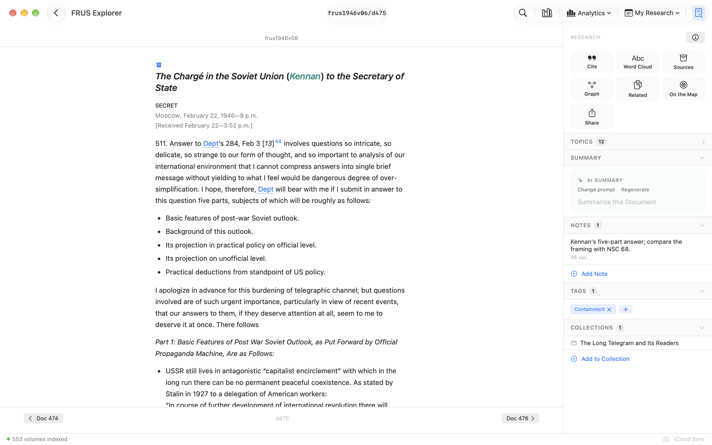
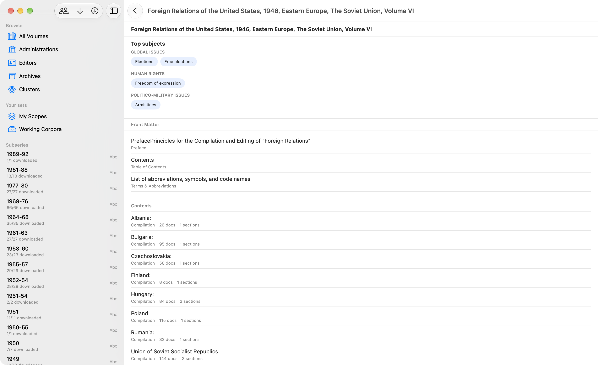
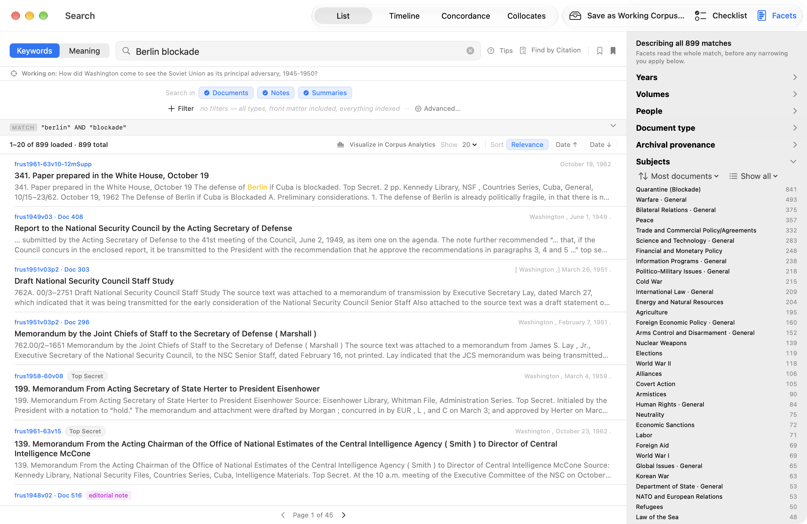
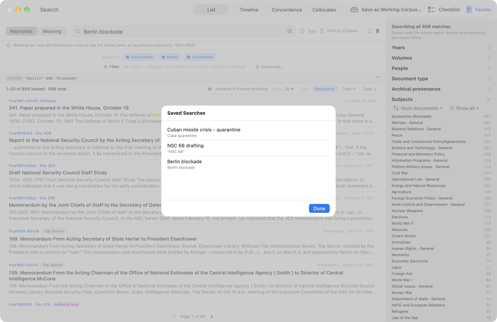
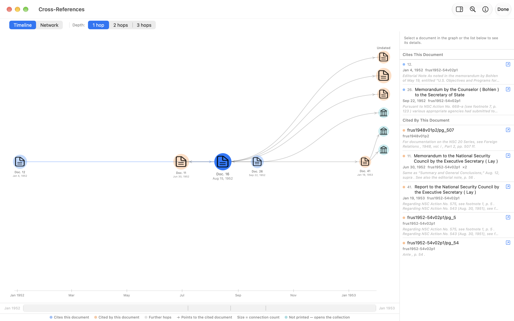
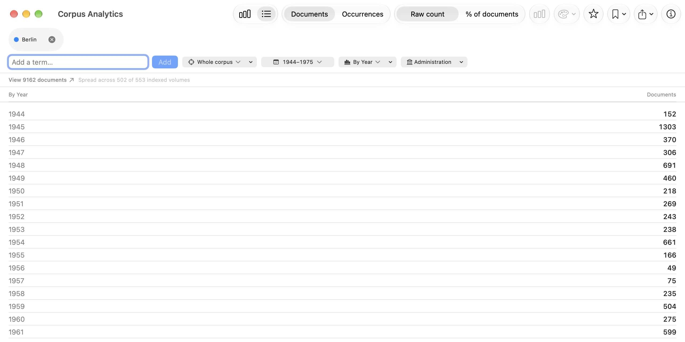
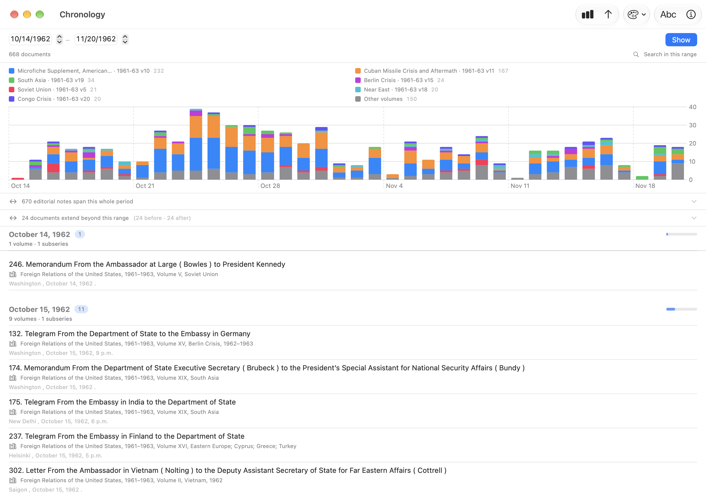

# FRUS Explorer for macOS — User Manual

> **Foreign Relations of the United States Explorer** — *Research the official record of U.S. foreign policy since 1861*

---

## Table of Contents

1. [Introduction](#1-introduction)
2. [Installation and First Launch](#2-installation-and-first-launch)
3. [The Main Window](#3-the-main-window)
4. [Browsing the Corpus](#4-browsing-the-corpus)
5. [Searching Documents](#5-searching-documents)
6. [Reading Documents](#6-reading-documents)
7. [Annotating and Tagging](#7-annotating-and-tagging)
8. [Cross-Reference Graph](#8-cross-reference-graph)
9. [Citation Lookup](#9-citation-lookup)
10. [Collections and Export](#10-collections-and-export)
11. [AI Summarization](#11-ai-summarization)
12. [Source Explorer](#12-source-explorer)
13. [Analytics](#13-analytics)
14. [Chronology](#14-chronology)
15. [Projects and Tags](#15-projects-and-tags)
16. [Settings](#16-settings)
17. [Reading History and the Research Guide](#17-reading-history-and-the-research-guide)
18. [Keyboard Shortcuts](#18-keyboard-shortcuts)

---

## 1. Introduction

FRUS Explorer brings the complete *Foreign Relations of the United States* documentary series to your Mac as a fully offline, searchable research tool. The series — published since 1861 and now comprising more than 560 volumes — is the official declassified record of American foreign policy: diplomatic cables, policy memos, meeting transcripts, and intelligence reports from every era of U.S. history.

FRUS Explorer lets you:

- **Download and index** any subset of the corpus for instant full-text search.
- **Read** documents in their original TEI-encoded form, with footnotes, editorial notes, and cross-references fully rendered.
- **Annotate** with research notes, highlights, and custom tags.
- **Summarize** long documents using on-device Apple Intelligence.
- **Export** curated collections of documents as formatted PDF or HTML.
- **Cite** correctly using the State Department's recommended citation style.
- **Visualize** how documents reference one another through an interactive network graph.
- **Analyze** term frequency across the corpus with interactive charts.
- **Browse by date** with the Chronology view — read every document from any span of years, grouped and charted by date.

All research data (notes, tags, collections, highlights) syncs automatically across your devices via iCloud.

---

## 2. Installation and First Launch

### System Requirements

FRUS Explorer requires macOS 26 or later. Full-text search and document rendering work on all supported Macs; AI summarization (Section 11) additionally requires an Apple Silicon Mac with Apple Intelligence enabled.

### Installation

Install FRUS Explorer from the Mac App Store or from the `.dmg` distributed directly from the project website.

`[SCREENSHOT: Mac App Store page showing FRUS Explorer with Install button]`

### Onboarding

Onboarding is now a **word cloud** drawn from the series itself, with the controls floating
above it in a compact panel. The cloud cycles every few seconds through four views of the
vocabulary — **Concepts**, **Topics**, **Actions**, and **Sentiment** (positive words green,
negative red) — and a small chip in the corner names whichever you are looking at.

The words are real: they are counted from the actual FRUS text at build time and shipped
with the app, so the cloud appears **before you have downloaded anything**. That is what
makes step 2 useful rather than decorative — pick *A Subseries* and choose 1969–76, and the
cloud becomes that era's vocabulary (*kissinger, nixon, soviet, capability, balance*)
before you commit to the download.

When you launch FRUS Explorer for the first time, an onboarding flow walks you through initial setup.

**Step 1 — Welcome**

A brief overview of the FRUS series appears, including the scope of the corpus (number of volumes, date range, total document count). You can proceed immediately or follow the link to learn more about the series at history.state.gov.

`[SCREENSHOT: Onboarding welcome screen with corpus overview statistics]`

**Step 2 — Add Volumes**

Choose how much of the corpus to download now. You can always add or remove volumes later from Settings.

| Option | Description |
|--------|-------------|
| **Entire Corpus** | All 560+ published volumes (~several GB; downloading may take time depending on connection speed) |
| **A Subseries** | One publication era, e.g., *1969–1976* (Nixon/Ford) or *1977–1980* (Carter) |
| **A Single Volume** | One specific volume chosen from a grouped picker |

`[SCREENSHOT: Onboarding scope picker showing three options with subseries list visible]`

Estimated storage requirements are shown before you confirm. If you are offline at first launch, the download queue will start automatically once connectivity is restored.

**Step 3 — Ready**

Optionally create your first research project — give it a name and a research question. Projects let you organize notes, tags, and collections around a single research initiative (see Section 15). You can skip this step and create projects later.

`[SCREENSHOT: Onboarding "Ready" screen with optional project creation form]`

Click **Finish**. FRUS Explorer opens its main window and begins downloading and indexing in the background.

---

## 3. The Main Window

`[SCREENSHOT: Annotated full-width view of the macOS main window with all four layers labeled]`

The main window has four distinct areas.

### 3.1 Toolbar

The toolbar runs across the top of the window.

**Center — Document Title**

When a document is open, a compact `volumeId/documentId` title (e.g., `frus1969-76v01/d42`) appears here, updating automatically as you navigate. This condensed format keeps the title short enough that the toolbar's other controls don't collapse into the overflow chevron — the main window also enforces a 980×600 minimum size for the same reason.

**Right-side toolbar — trailing tools**

The toolbar's trailing edge carries five controls; the two ▾ entries are menus that group the specialized windows:

| Control | Shortcut | Opens |
|--------|----------|-------|
| **Search** | ⌘F | Full-text search window |
| **Browse** | ⇧⌘B | Corpus browser (volume hierarchy) |
| **Analytics ▾** | — | A menu of the analytics windows: **Corpus Analytics**, **Person Analytics** (Section 13.5), **Cross-Reference Analytics** (Section 13.6), **Chronology** (Section 14), and **Word Cloud** (Section 13.4) |
| **My Research ▾** | — | A menu: **Research** (⌘⌥R — the Research window listing all annotated documents) and **Collections** (⇧⌘K) |
| **Research rail** | ⌘⇧R | Show or hide the per-document Research rail (Section 3.2) |

The old titlebar **Graph** and **Info** buttons have been removed. The cross-reference graph now opens from the Research rail's **Graph** tile (Section 3.2), and a document's citation and metadata are reached through the rail's **Cite** tile.

 <!-- TODO Phase E: re-capture for Research rail -->

### 3.2 The Research Rail

The per-document research surface is the trailing **Research rail**, toggled with the **Research rail** toolbar button or **⌘⇧R**. (The always-visible "research strip" that older builds showed directly beneath the toolbar has been retired — everything it carried now lives in the rail.) On a wide window the rail sits side-by-side with the document; below roughly **900 pt** of window width it becomes a trailing overlay panel that slides in over the document.

The rail is headed by a **RESEARCH** label and has two parts:

- A **3×2 tile grid** of one-tap actions:
  - **Cite** — Open the citation popover (formatted citation, copy, and Copy as… BibTeX/RIS; see Section 9.3).
  - **Word Cloud** — Open a word cloud for this document (Section 13.4).
  - **Sources** — Open the Source Explorer for this document's source note (Section 12).
  - **Graph** — Open the cross-reference graph for this document (Section 8). *(This is where the old titlebar Graph button went.)*
  - **Related** — Open the **Related Documents** window: a ranked list of documents related to this one by archival provenance, cross-references, date, and shared people (Section 6.4).
  - **Share** — A menu that sends this document to your Zotero library, exports a Zotero file, or shares its citation (Section 9.3).
- A stack of expandable **accordions** — **Summary**, **Notes**, **Tags**, and **Collections** — that hold this document's generated summaries (Section 11), your research notes (Section 7.1), its user tags (Section 7.3), and the collections it belongs to (Section 10).

**Highlighting is no longer a rail button.** To highlight, **select text in the document body**: a **floating selection bar** (a dark pill) appears at the selection with four **colour dots** — click a dot to save the passage as a highlight in that colour — plus **Excerpt**, **Look Up**, and **Note** actions (Sections 7.2, 12.1.1, 10.2a). For a selection **inside a footnote** the colour dots and Excerpt are disabled (you can still Look Up or add a Note). This floating bar replaces the old Highlight button and its colour-picker popover, and it now behaves the same on macOS and iOS.

 <!-- TODO Phase E: re-capture for Research rail -->

### 3.3 Document View

The large central area displays the currently open document. If no document is open, a placeholder ("Select a document to begin") is shown.

Documents are rendered from TEI XML into native SwiftUI, matching the typography and structure of the history.state.gov website. As you navigate — through search results, cross-references, or the corpus browser — FRUS Explorer maintains a full navigation history. Use the standard macOS Back (⌘[) and Forward (⌘]) gestures or the toolbar arrows to move through your reading history.

 <!-- TODO Phase E: re-capture for Research rail -->

### 3.4 Status Bar

The status bar at the bottom of the main window provides at-a-glance information about background tasks:

- **Indexing progress** — Volume name and percentage complete during initial indexing. When several volumes are queued it reads "*Indexing … (3/27)*" and stays put for the life of the queue — the volume it names changes as work moves along, but the row itself does not appear and disappear between volumes. Click it for the queue panel (remaining volumes, estimated time, and the **Learn** link). When the last volume is done the row becomes a brief "*27 volumes ready to search*" confirmation.
- **iCloud sync** — Current CloudKit sync state: idle (checkmark), syncing (spinner), succeeded, or sync error with full error detail in a tooltip. Two additional warnings may appear:
  - **Zone Missing** (red) — the iCloud private sync zone is absent; records cannot upload or download. Force-quit and relaunch to trigger zone recreation, or use Reset iCloud Sync in Settings.
  - **Not Signed In** (orange) — iCloud account is unavailable; data will not sync until you sign in via System Settings → Apple ID.
- **iCloud Keychain** — Availability of NARA API key sync across devices.

> **One-time re-index after this update.** This build advances the search-index format (to index version 22) and rebuilds the cross-reference index: cross-references confirmed unresolvable by the corpus-wide validation dataset are marked so they no longer pose as working links (Section 6.2), and a long-standing defect where some cross-volume page references pointed at the wrong document in graphs and analytics is repaired. The first launch after updating automatically re-indexes the volumes you have already downloaded — you'll see indexing progress in the status bar for a while, and no re-download is needed. Search and reading remain available while it runs.

`[SCREENSHOT: Status bar detail showing indexing progress indicator]`

### 3.5 Separate Window Scenes

FRUS Explorer opens specialized tools in their own windows so you can keep a document open in the main window while working elsewhere. Windows are persistent — closing and reopening them restores their previous size and position. Launching a tool whose window is already open brings that window to the front rather than opening a duplicate or leaving it buried behind other windows — including word-cloud windows relaunched from Settings.

**Documents open where you launched the tool.** When you open a document from a tool window — a search result, a cross-reference graph node, a Corpus Browser row, a Related Documents entry — it opens in the document window you launched that tool *from*, and that window comes forward. Open a second main window with **⌘N** and its tools route to it independently of the first. To deliberately open a document in a *fresh* window instead, use **Open in New Window** from a search result's context menu, or **File ▸ Open Document in New Window** for the document you're reading.

| Window | Shortcut |
|--------|----------|
| Search | ⌘F |
| Corpus Browser | ⇧⌘B |
| Cross-Reference Graph | (Research rail **Graph** tile) |
| Source Explorer | (click source note link) |
| Archival Neighbors | (Archival Neighbors action; one window per archival source) |
| Related Documents | (Research rail **Related** tile; one window per document — Section 6.4) |
| Collections | ⇧⌘K |
| Research | ⌘⌥R |
| Analytics | (Analytics ▾ menu → **Corpus Analytics**) |
| Person Analytics | (Analytics ▾ menu → **Person Analytics**, or `frus.personAnalytics`) |
| Cross-Reference Analytics | (Analytics ▾ menu → **Cross-Reference Analytics**, or `frus.crossRefAnalytics`) |
| Chronology | (Analytics ▾ menu → **Chronology**) |
| History | (History menu → "Complete History…") |
| FRUS Research Guide | (Help menu) |
| Settings | ⌘, |

---

## 4. Browsing the Corpus

Open the **Corpus Browser** (⇧⌘B) to navigate the FRUS series as a hierarchy.

### 4.1 Navigation Levels

**Corpus view** — The top level lists every publication subseries, together with totals for volumes, documents, and the date range covered.

`[SCREENSHOT: Corpus-level view showing subseries list with document counts]`

**Subseries view** — Click a subseries to see the volumes it contains. Each volume entry shows its title, editors, publication date, and whether it has been downloaded and indexed.

`[SCREENSHOT: Subseries view for "1969-1976" showing volumes with download status badges]`

**Volume view** — Click a volume to see its front matter, chapters, and appendices. Each chapter entry shows the number of documents it contains.

A **Top subjects** section on the volume view lists the subjects most characteristic of that volume — derived from experimental subject data and grouped by category — and it appears even before the volume is downloaded, so you can size up an unfamiliar volume's themes before committing to it. Click a subject to see the *other* FRUS volumes across the whole corpus that cover the same subject (downloaded or not) and jump straight to any of them in the browser. (These are automatically detected topics, and the profiles behind them — which also power the detected-topic filters in Search, Analytics, and the Word Cloud — were vetted for era consistency in this update, removing a handful of anachronistic mistags.)

`[SCREENSHOT: Volume detail view showing chapter list with document counts]`

`[SCREENSHOT: Volume view's Top subjects section, with one subject's list of other volumes covering the same subject open]`

**Chapter / Compilation view** — Click a chapter to see individual document listings with their dateline, source note, and document number.

`[SCREENSHOT: Chapter view listing documents with datelines]`

### 4.2 Downloading Volumes

Any volume that has not been downloaded shows a download button. Click it to add the volume to the download queue. Progress appears in the status bar and in **Settings → Volumes & Storage**. Downloaded volumes are indexed automatically on completion.

**Browsing vs. indexing.** Once a volume is *downloaded* you can browse its full structure — front matter, chapters, and compilations — straight away, whether or not it has finished indexing. If a volume isn't indexed yet (or a prior indexing pass was interrupted — most likely on the large early annual volumes), a non-blocking banner at the top of its contents explains this and offers to **Index** / **Re-index** it. Indexing is what enables full-text **search**, opening a chapter's **document list**, and the connections graph — so those wait until indexing completes, but the volume's structure never does. (This matches iOS, which has always browsed downloaded volumes without requiring an index.)

`[SCREENSHOT: Volume entry in browser with the download button highlighted]`

### 4.3 Filtering the Browser

A filter bar at the top of the Corpus Browser lets you narrow the display by:

- **Date range** — Slide to restrict volumes to a particular period.
- **Subject tags** — Pick from the bundled subject-tag taxonomy to show only volumes tagged with relevant topics.

### 4.4 The People Browser

The Corpus Browser toolbar includes a **People** button (a two-person icon). Click it to open a reconciled, corpus-wide index of everyone named across the volumes you've indexed — a single alphabetical list rather than a per-volume one.

The same person frequently appears across many volumes under slightly different name forms ("Kissinger, Henry A.", "Kissinger, Henry", "Kissinger, Henry A. Laurence"). FRUS Explorer consolidates these into **one identity**, so you don't have to chase the same person through a dozen separate entries. Each row shows:

- the person's **canonical name**;
- a subtitle combining their **role** and **active years** (e.g. *Secretary of State · 1973–1977*) where the volume's List of Persons supplied them;
- a **mention count** — the number of distinct documents referencing this identity across the whole corpus;
- a **reconciled-identity** seal when the entry has been matched to the bundled name-authority data.

Use the **search field** to filter the list by name; click a person to open their detail panel.

- A **Subjects** section shows chips of the detected topics this person's coverage clusters in — subjects characteristic of the volumes where the person is mentioned, weighted by how often they appear there. Click a chip to see the FRUS volumes covering that subject and jump to any of them in the browser. The section is explicitly **volume-level** ("subjects characteristic of the volumes where this person is mentioned — not per-document tags") and appears only when the person's volumes have subject profiles.
- **Find all mentions** runs a person-scoped search returning every document that references this identity (see Section 5).
- **Records in This Identity** lists each underlying `(volume, ref)` record that was folded into this person; click **Separate** on any record that is actually a different person to split it out. Your correction syncs across your devices via iCloud and is reapplied whenever the index is rebuilt.
- When the app is uncertain whether two identities are the same person, it surfaces a **"possibly the same person"** suggestion with a **Merge** action.
- You can also merge any two people **yourself**, for cases the cautious automatic grouping keeps apart: choose **Merge with another person…** in a person's detail panel — or right-click the person's row for the same command — and pick the other person from a searchable list. A confirmation names both people before anything changes, and warns you when they look like genuinely different people (each matched to a distinct entry in the bundled name-authority data).
- A **Corrections** toolbar button in the People browser lists every merge and separation you've made and lets you **undo** any of them. Corrections sync across your devices via iCloud.
- Reconciled identities that carry an authority id show a **View on VIAF** link to the external authority record.

> The consolidation is deliberately cautious: when in doubt it keeps identities **separate** rather than merging two different people. Your merge/separate corrections always take precedence.

---

## 5. Searching Documents

Press **⌘F** to open the Search window, or click the Search toolbar button.

### 5.1 Basic Search

Type your query into the search field and press Return. Results update in real time as you refine the query.

FRUS Explorer searches across:
- Document full text
- Headings and source notes
- Your research notes
- Generated summaries
- User tag names

**While a search runs**, the sort bar shows "Searching…" and the previous results stay on screen so you can keep reading them. On the *first* search in a window — when there are no previous results, and the list would otherwise be blank — the drifting word cloud (Section 3.4) fades in behind it after a moment, showing the common vocabulary of whatever you scoped the search to. Quick searches never show it. The words are the *scope's* ambient vocabulary, not your results; the cloud never paints over a list you're reading.

Each result shows a highlighted snippet of the matching text. You can control how much context that snippet shows — anywhere from **1 to 10 lines** — from the **Result Preview** control in the Filters panel (Section 5.3). The length starts from a global default set in **Settings → Search** (Section 16); the main Search window and the Collections *Add Documents* sheet (Section 10.2a) each keep their own override of that default.

### 5.2 Query Syntax

| Syntax | Example | Effect |
|--------|---------|--------|
| Plain keywords | `berlin crisis` | Matches documents containing both words (AND implied) |
| Quoted phrase | `"cold war"` | Exact phrase match |
| Boolean AND | `kissinger AND détente` | Both terms required |
| Boolean OR | `kissinger OR rodgers` | Either term |
| Boolean NOT | `vietnam NOT laos` | Excludes term |
| Prefix wildcard | `negoti*` | Matches negotiate, negotiated, negotiating, etc. |
| Grouping | `(aqaba OR tiran) AND navig*` | Parentheses nest to any depth |
| Proximity | `NEAR("military guarantee" Europe, 30)` | Both operands within 30 words of each other |
| Exact word | `=containment` | The literal word only — not *contain*, *containing*, *container* |

English stemming is applied automatically, so searching for *negotiate* also matches *negotiated* and *negotiating*.

**Proximity search (`NEAR`).** Two words appearing in the same document tells you very little
— a hundred-page volume can mention almost anything twice. `NEAR` asks the sharper question:
did these ideas appear *together*? `NEAR("military guarantee" Europe, 30)` matches only
documents where that exact phrase falls within thirty words of *Europe*.

- Operands may be words, exact phrases, or prefixes: `NEAR(militar* europ*, 20)`.
- The distance is optional and defaults to 10: `NEAR(aid guarantee)`.
- Booleans cannot go inside a `NEAR` — write `NEAR(a b, 20) OR NEAR(c d, 20)`, not
  `NEAR(a OR b, 20)`. If you do write the latter, the app searches your words as an
  ordinary grouped query rather than failing.
- The keyword may be typed in any case, and `NEAR/20(a b)` is accepted as an alternative
  spelling of the distance.

**Exact-word search (`=`).** Search is stemmed, which is usually what you want: *negotiate*
also finds *negotiated*. But it means a search for **containment** is really a search for
*contain*, and quietly returns documents about containing a threat, shipping containers, and
anything else sharing that root. On a corpus this size that can turn a handful of genuine
hits into a five-figure count.

Prefix a term with `=` to search for the literal word instead:

| You type | You get |
|---|---|
| `containment` | containment, contain, contains, containing, container, contained |
| `=containment` | containment |

- It is **per term**, so real queries can mix: `=containment polic*` searches the literal word
  *containment* alongside the stemmed prefix *polic\**.
- The result **count** narrows too, not just the list — so a figure you cite is the figure you
  actually matched.
- It applies to whatever your scope covers. With summaries switched off, a literal match
  inside a summary will not rescue a document, because the search never looked there.
- `=` is ignored where it cannot mean anything: on an excluded term (`-=word`), on a prefix
  (`=negoti*`), and on anything that is not a single word (`="co-operate"`). The query still
  runs, stemmed.

**Facets.** Click **Facets** in the sort bar to open a panel that describes your whole
result set rather than one row at a time — by year, volume, person,
document type and archival provenance.

- Sections compute when you open them, not when you search, so the panel never adds latency
  to a query you were not going to inspect.
- Clicking a year, volume, person or document-type row **narrows the search** through the
  same filters the Filters sheet uses — so the two can never disagree, and the narrowing
  appears as a clearable chip in the filter row above the results.
- The counts describe the **whole match**, not the page. The result list is capped (7,500 on
  macOS) while these counts are not, and the panel says so.
- Where a section is showing only its largest rows, it tells you how many there are in total.
  A common-term search can span 552 volumes and thousands of people; the panel will not
  pretend otherwise.
- **Archival provenance is descriptive only.** It tells you how the match is sourced, but
  there is no provenance filter to narrow to, so those rows are not clickable.
- With Checklist Mode on, the panel reminds you that it still describes every match, not just
  the rows still showing.

**The Query Inspector.** Under the search controls is a strip showing the **FTS5 expression
your query actually became** — the string that went to the database, not a paraphrase of it.
Expand it with the chevron to see, for each term:

- the **index form** it was reduced to, with a warning when that is broader than what you
  typed (`containment` is searched as `contain`);
- how many documents contain it **across everything you have indexed**, which is free to
  compute and updates as you type;
- and, on request, the **exact count within your current filters** — that one runs a real
  query per term, so it is behind a button rather than automatic.

The two counts are both shown because the gap between them is information: a term that is
common in the corpus but rare in your scope is telling you something about your scope.

The expression line never hides. If you publish method appendices, it is the line you copy.

**When a search returns nothing**, the app no longer says "try different keywords." It runs
each of your terms on its own and names the one that matched nothing — so a typo, a stemming
surprise and a genuine historical absence stop looking alike. If every term matches on its
own, it says that too: the combination is what appears in no single document. Either way the
denominator is stated, because "0 results" means "0 in the volumes indexed on this device."

> **Note:** Suffix wildcards (e.g., `*tion`) are not supported. Use prefix wildcards only.

### 5.3 Advanced Filters

Click **Filters** in the Search window to expand additional filter controls.

`[SCREENSHOT: Search window with the Filters panel expanded, showing all filter options]`

| Filter | Description |
|--------|-------------|
| **Volume / Subseries scope** | Restrict the search to one or more specific volumes or an entire subseries. The corpus browser can also hand a scope directly to Search via **Search this volume**, so you arrive pre-scoped |
| **My Volume Scopes** | Your named, reusable volume sets (Section 5.8). Applying a scope fills the volume picker with its **indexed** members and shows an honest "N of M volumes indexed" count; a scope with no indexed members shows a warning and applies nothing — it never silently falls through to a whole-corpus search |
| **By Subject · Detected Topics** | *Experimental.* **Filter by detected topic…** opens a two-level picker (category → sub-category) over automatically detected topics — not editorial subject headings, so they may include mistags. Picking a topic fills the volume picker with the indexed volumes where that topic is among the volume's most characteristic subjects, through the same indexed-members guard as volume scopes |
| **Date Range** | Restrict results to documents dated within a range |
| **My Tags** | Restrict to documents you have tagged yourself. The tag list refreshes **live** (188-D parity with iOS): create, rename, or delete a tag anywhere in the app — or receive one synced from another device — and the **Advanced…** filter reflects it the next time you open it, with no relaunch. Selecting a tag applies immediately and lights the **Tagged** chip above the results |
| **Summaries** | *All*, *Specific prompt*, or *None* (documents with no generated summary) |
| **Research Notes** | *All documents* or *Documents with notes only* |
| **Document Type** | Include or exclude editorial notes |
| **Front matter** | Include or exclude volume front-matter sections (preface, introduction, persons lists, sources) from results |
| **Result Preview** | How many lines of matched-text context each result snippet shows (1–10). Overrides the global default from Settings → Search for this Search window only |

All active filters are shown as chips at the top of the results list; click any chip to remove that filter. The same volume/subseries scope is shared with **Corpus Analytics** (Section 13), so a query can be charted and read against the identical corpus subset.

### 5.4 Timeline View

Toggle **Timeline** in the Search window to display results on a chronological axis rather than a ranked list. This view is useful for understanding the temporal distribution of documents matching a query.

`[SCREENSHOT: Timeline view showing documents plotted chronologically with zoom controls]`

Pinch or use the scroll wheel to zoom the timeline; drag to pan.

### 5.5 Saving Searches

Click **Save Search** to bookmark the current query and all active filters. Saved searches appear in a sidebar in the Search window for instant re-running.

Saved searches can also be linked to Collections to create *smart collections* that auto-populate at export time (see Section 10.4).

### 5.6 Visualizing a Search in Corpus Analytics

Any search that returns results offers a **Visualize in Corpus Analytics** banner. Clicking it opens the Analytics window (Section 13) pre-seeded with your search terms and any active date-range filter, so you can chart the term's distribution across the corpus and narrow the date range before returning to a more focused search. When a query returns more results than the Search window can display in full, the banner additionally shows the existing guidance about narrowing the range.

`[SCREENSHOT: Search results banner offering "Visualize in Corpus Analytics" above a capped result list]`

### 5.7 Checklist Review Mode

When you're working systematically through a long result set — deciding which of a few hundred matches to read — **Checklist Mode** turns the list into a shrinking to-do list. Click the labeled **Checklist** button in the sort bar (next to the timeline toggle; it's enabled once a search has results, and highlights while the mode is on) to turn it on.

With it on, a result disappears from the list — and from the timeline — as soon as you **open it** by any route (in the main window or a new window), or when you explicitly mark it reviewed by **right-clicking the row** and choosing **Mark Reviewed**. A subtle **"N reviewed hidden"** banner shows how many you've cleared, and when nothing is left an **All Results Reviewed** message appears. Click the checklist button again to bring every result back.

Checklist Mode is a per-session working aid: it isn't saved, it resets when you relaunch, and it re-anchors when you run a genuinely new query (clearing the previous query's reviewed marks). Changing a filter or scope on the *same* query keeps your reviewed marks intact, and the mode never alters your reading history — only what the list shows.

`[SCREENSHOT: The macOS Search window in Checklist Mode — the "N reviewed hidden" banner above a partially-reviewed results list, with the checklist button highlighted in the sort bar]`

### 5.8 Custom Volume Scopes

A **volume scope** is a named, reusable set of volumes — every volume covering a crisis, a region, or an administration — that you define once and apply anywhere the app scopes an analysis: the Search filters (the **My Volume Scopes** section, Section 5.3), the Corpus, Person, and Cross-Reference Analytics scope menus (Section 13), the Word Cloud scope picker (Section 13.4), and the About the Series dashboards (Section 17.3a). Scopes sync to your other devices via iCloud.

Manage scopes in **Settings → Research → Volume Scopes** (Section 16):

- **New Scope** opens the editor: name the scope and pick its members from the **whole manifest**, grouped by subseries, with a title filter field and per-subseries **Add All** / **Remove All**. Volumes you haven't downloaded stay in the scope and take effect once indexed.
- The **Add Volumes By…** menu adds members by facet — **Subject…** (detected topics), **Person…** (volumes where a person is mentioned), **Manifest Tag…**, or **Coverage Years / Editor…** (a year range optionally narrowed by editor, or — leaving both years blank — every volume with a matching editor regardless of coverage dates). Facets only ever *add* matching volumes; they never remove volumes already selected.
- A footer keeps an honest running count: "N volumes selected · M indexed".
- Each scope row in the pane shows its live coverage ("N of M volumes indexed") with **Edit** and **Delete** actions, plus a **Word Cloud** button that opens a cloud of the scope's indexed volumes (Section 13.4).

Applying a scope is a **snapshot**: it copies the scope's currently-indexed members into the target's volume picker, so later edits to the scope don't retroactively change a search until you re-apply it. Wherever a scope has no indexed members yet, the app says so — a warning in Search, a disabled "none indexed yet" entry in the analytics menus — rather than quietly running an unscoped analysis under the scope's name.

`[SCREENSHOT: The Volume Scopes editor on macOS — the subseries-grouped volume list with the title filter, the Add Volumes By… facet menu open, and the "N volumes selected · M indexed" footer]`

---

## 6. Reading Documents

Click any document — in search results, the corpus browser, or a cross-reference — to open it in the main window's document view.

`[SCREENSHOT: Full document view showing rendered TEI content with labeled regions]`

### 6.1 Document Structure

Each rendered document shows:

- **Header** — Document number, classification header, participants, and date.
- **Dateline** — Location and date at the top of the document body.
- **Source Note** — Archival provenance, shown below the dateline.
- **Body** — Paragraphs, numbered footnotes, editorial notes, tables, and lists, all faithfully rendered from the TEI source.
- **Summary Strip** — If a generated summary exists for this document, it appears in a strip above the body (see Section 11).
- **Tags Section** — Subject tag chips and your user tag chips appear at the bottom. Click any tag to run a search filtered to that tag.

### 6.2 Interactive Elements Within Documents

| Element | Appearance | Action |
|---------|-----------|--------|
| Person reference | Underlined person name | Click to open Person Index entry |
| Glossary term | Styled term | Click to open Terms & Abbreviations entry |
| Cross-reference | Numbered or inline link | Click to jump to the referenced document; if its volume isn't downloaded, the app offers to download it |
| Source note | Text at top of document | Click to open Source Explorer (Section 12) |

`[SCREENSHOT: Document close-up showing a person reference, glossary term, and cross-reference link all visible]`

**Unresolvable cross-references.** Not every printed cross-reference can be followed: occasionally the printed volume cites a page, document, or volume that does not exist in the digital corpus. FRUS Explorer ships a corpus-wide validation dataset of these, and a reference it confirms cannot be followed renders in **muted grey with a dotted underline and a small dagger (†) marker** instead of looking like a working link. Click one to open an **Unresolved Reference** sheet explaining why it can't be followed and what its apparent destination is. Valid references are unchanged, and the printed text is always preserved — nothing is removed from the document. (This list can also be exported as CSV or JSON — see Section 16.)

`[SCREENSHOT: A document with an unresolvable cross-reference in muted grey with the dagger marker, and the Unresolved Reference sheet open explaining why it can't be followed]`

### 6.3 Navigation History

FRUS Explorer tracks every document you open in the current session. Use **⌘[** (Back) and **⌘]** (Forward) to move through your reading history, just as in a web browser.

### 6.4 Related Documents

Click the **Related** tile in the Research rail (⌘⇧R) to open the **Related Documents** window — a ranked list of the indexed documents most related to the one you are reading, combining five signals:

- **Archival provenance** — drawn from the same lot file, central file, or archival collection (the same keys Archival Neighbors uses, Section 12.1.2).
- **Cross-references** — documents this one cites, and documents that cite it.
- **Close in date** — written near the same time.
- **Same volume or subseries** — editorial proximity in the series.
- **Shared people** — the same reconciled identities mentioned in both.

Each row shows the document's header, volume, and dateline, plus small **"why related" icon chips** marking the signals that contributed to its rank, strongest first — the same icons and names the weights panel uses, so a chip is easy to decode. Clicking a row opens the document in the main window while the Related Documents window **stays open beside it** — it's a work list you step through, exactly like an Archival Neighbors window — and open windows are restored across relaunch, with their tuning intact.

- **Scope** — a segmented picker narrows the candidate pool to **This volume**, **This subseries**, or **All volumes** (the default: cross-corpus reach is the point). A scoped list that comes up empty invites you to widen back out.
- **Adjust weights** — a disclosure panel with a slider per signal (0–1). Drag a slider and the list re-ranks when you release it; your tuning **persists** and seeds every Related Documents window you open afterward. A sixth signal, **Shared topics**, is visible but disabled — "Available when detected-topic data ships (experimental)."
- When more documents qualify than the list shows, a trailing line counts the overflow ("N more related — raise a weight or narrow the scope to refine").

`[SCREENSHOT: The Related Documents window on macOS — the This volume / This subseries / All volumes scope picker and Adjust weights disclosure above a ranked list with "why related" icon chips]`

---

## 7. Annotating and Tagging

### 7.1 Research Notes

Research notes are freeform text attached to a specific document. They sync across all your devices via iCloud.

**To add a note:**
1. Open the document.
2. Open the Research rail (⌘⇧R) and expand its **Notes** accordion, then click **Add Note** (or press ⌘⌥N).
3. Type your note in the editor that appears.
4. Click **Save**.

`[SCREENSHOT: Research note editor open in the Research rail's Notes accordion with note text being entered]`

**To edit an existing note:** Click any note row in the Research rail's **Notes** accordion — the note editor opens with the selected note pre-loaded. You can also open the Research window (⌘⌥R) and double-click the document entry.

Notes are associated with the active project (see Section 15). If another project has notes for the same document, a disclosure indicator appears at the bottom of the note area — click it to reveal those notes and optionally promote them to the current project.

### 7.2 Highlights

Select any text in the document body. A **floating selection bar** (a dark pill) appears at the selection, carrying four **colour dots** — click a dot to save the selected passage as a highlight in that colour. (No separate Highlight button or colour-picker popover is involved; the same floating bar appears on macOS and iOS.)

`[SCREENSHOT: Text selected in a document with the floating selection bar showing its four colour dots, Excerpt, Look Up, and Note actions]`

**To create a highlight:**
1. Select the passage you want to highlight (click and drag or double-click a word).
2. In the **floating selection bar** that appears at the selection, click one of the four **colour dots** (Yellow, Green, Blue, or Pink).
3. The highlight appears immediately as a colored background over the selected text.

Highlights appear as colored background fills directly in the document body — no special mode is required to see them. The floating selection bar's **Note** action lets you attach a note to a passage you have just highlighted. (When your selection is inside a footnote, the colour dots and Excerpt are disabled, but Look Up and Note remain available.)

**Managing highlights:** All highlights for a document are visible in the document view itself. A **stale highlight** warning banner appears at the top of the document if any highlights were created from an older version of the document's content — this can happen if the underlying TEI source has been updated. Stale highlights are shown in amber; you can delete them from the Research window.

**Research window integration:** Highlights appear in the Research window (⌘⌥R) as colored strip excerpts beneath the document header, showing the verbatim highlighted text. The sidebar includes a "By Highlight Color" section grouping documents by which colors you have used — useful when you use different colors to mark different thematic categories.

### 7.3 User Tags

User tags are global labels you define. They are not the same as the official subject tags from the FRUS taxonomy.

**To tag a document:**
1. Open the Research rail (⌘⇧R), expand its **Tags** accordion, and click the **+ Add Tag** button next to the existing tag chips.
2. Create a new tag from the **New Tag** field at the **top** of the picker — type a name and click **Add**, which creates the tag and selects it in one step — or choose from your existing tags listed beneath.
3. Click **Done** to apply.

The picker's title names the document you are tagging (e.g. **Tags — Doc 42**, or the document's id where a volume has no document numbers), so you always know which document a batch of tags lands on. Any tag you create while the picker is open stays **pinned to the top of the list with a "New" badge** until the picker closes — no scrolling back down to find the tag you just made.

`[SCREENSHOT: Tag picker sheet titled "Tags — Doc 42" with the New Tag field at the top and a just-created tag pinned beneath it with a New badge]`

Tags appear as **removable chips** in the Research rail's **Tags** accordion. Each chip has an **×** button — click it to remove that tag directly without opening the tag picker. A **+** button next to the chips adds more tags. Click any tag chip (without the × button) to run a search filtered to documents with that tag. Manage all your tags — rename, merge, delete — in **Settings → Research → Tags**.

---

## 8. Cross-Reference Graph

FRUS documents frequently reference one another. The **Cross-Reference Graph** visualizes these connections as an interactive, chronologically arranged network.

Open the graph for any document by clicking **Graph** in the toolbar. The graph opens in its own window.

### 8.1 Reading the Graph

The graph is laid out as a **chronological timeline**: nodes are positioned left-to-right by document date, so you can see the order in which references were written. The visual encoding is consistent throughout, and the **legend** (and the info popover) explains every channel so meaning never depends on color alone:

- **Direction** — Arrows point from the citing document to the cited one.
- **Node size** — Larger nodes are more connected (more references in and out).
- **Edges** — Line weight and labels convey how strongly two documents are linked; a date axis runs beneath the layout.
- **Color** — The focus document, its direct (1°) neighbors, and more distant nodes are distinguished by color.

A **reset-viewport** button re-frames the graph, and animations respect the system **Reduce Motion** setting.

### 8.2 The Reference List

Toggle the **reference list** panel (the sidebar toggle in the toolbar) to see the same connections as a synchronized, scrollable list — the non-visual companion to the canvas. Selecting a node or edge folds its details (titles, dates, the shared footnote context) into this panel; clicking a node opens it automatically. On a compact iPhone width the canvas and list are alternatives chosen with a segmented **List / Graph** picker instead of a side panel.

`[SCREENSHOT: Reference list panel open beside the graph, showing selected-node details and the inbound/outbound reference rows — the list toggle (SF Symbol: sidebar.trailing) labeled]`

### 8.3 Degree and Sparse Graphs

Use the **Degree** picker to control how many hops from the focus document are displayed: 1st degree (direct references only), 2nd, or 3rd. When a document has very few direct references, the graph **auto-expands to 2 hops** and notes that it has done so, so a sparse network still tells a story.

`[SCREENSHOT: Graph with the degree picker control visible and second-degree nodes shown in a distinct color and size]`

### 8.4 Node Actions and Undownloaded Volumes

| Action | Effect |
|--------|--------|
| Hover | Shows the full document title and metadata |
| Click | Selects the node; opens its details in the reference list panel |
| Right-click | Context menu: *Recenter Graph*, *Open in Main Window*, *Archival Neighbors* (documents from the same archival source — lot file, central file, series, or library; Section 12) |
| Scroll | Zoom |
| Drag (background) | Pan |

Nodes in volumes that have not been downloaded are shown distinctly. Clicking such a node prompts you to download the volume; the graph updates when indexing completes. An **info** button (ⓘ) opens a popover explaining what the graph shows and how to read it.

> **Page-number references now resolve.** Cross-references that cite a target by page rather than by document number (e.g. "see p. 427") now resolve to the correct target document, so they appear as real edges in the graph and are counted in Cross-Reference Analytics (Section 13.6). This improvement required a search-index change; the first launch after updating performs a one-time re-index of your downloaded volumes (see Section 3.4).

> **Unresolvable references are excluded.** Cross-references that the corpus-wide validation dataset confirms cannot be followed (Section 6.2) are left out of the graph, so every edge you see leads to a real document.

---

## 9. Citation Lookup

If you have a citation from a footnote, bibliography, or note and want to find the actual document, use **Citation Lookup**.

Access it via **Document → Citation Lookup** in the menu bar, or press **⌘⇧F**. Citation Lookup opens in its **own window**: the form uses the same grouped style as the rest of the app's Mac forms, the paste field takes focus as the window opens, and pressing **Return** runs the lookup.

`[SCREENSHOT: Citation Lookup window showing the two-mode grouped form — Paste Citation tab active with a sample citation entered]`

### 9.1 Input Modes

**Paste Citation** — Paste any citation text. FRUS Explorer parses it in real time, extracting subseries year range, volume number, document number, page number, and the volume **title fragment**. Supported formats include:

- history.state.gov recommended style
- Chicago footnote and bibliography
- Informal abbreviated forms (*FRUS 1955–57, vol. XIV, doc. 23*)
- Page-only citations

This includes the app's **own** formatted citations — copy a citation from a document and paste it back and it resolves to that same document. For the pre-1906 *Papers Relating to Foreign Affairs* volumes, whose citations carry only the print year (e.g. 1864) rather than a coverage year, the title fragment ("First Session … Part II") is what pins the exact part, so paste the full citation rather than just the year.

**Structured Entry** — Fill in fields manually: subseries/year, volume number, document number or page number, and an optional title fragment.

### 9.2 Results

`[SCREENSHOT: Citation Lookup results list showing three candidates with confidence labels]`

Results are ranked by confidence:

| Label | Meaning |
|-------|---------|
| Exact match | Document number matched directly |
| Matched by page number | Page range overlaps |
| Match — document number assigned digitally | Pre-1955 volumes where document numbers were added digitally |
| Possible match — nearest is *N* | Fuzzy document-number match |
| Volume identified — download to find document | Volume not yet downloaded |
| Best guess | Explanation provided |

Click any result to open that document **in its own document window** — with working previous/next navigation — so the lookup window and its match list stay visible while you work through several candidates. On indexed volumes, a document-number citation resolves directly to that document. If the volume is not downloaded, a **Download** button appears in place of the open link.

### 9.3 Copying and Sharing Citations

Two Research-strip buttons separate the *citation itself* from *sending the document somewhere*:

- **Cite** opens the citation popover — the formatted citation in your chosen style (switchable per-view), with **Copy citation**, **Copy URL**, and a **Copy as…** menu (BibTeX / RIS, or **Save as .bib**).
- **Share** opens a popover that gathers the export and send actions:
  - **Send to Zotero Library** — pushes this document straight into your Zotero library over the Web API, with its tags and research notes (shown only when a Zotero account is connected; see Section 16).
  - **Export Zotero file (RIS / BibTeX)** — writes a Zotero-importable file and opens it in Zotero (if installed) or reveals it in Finder.
  - **Share Citation** — opens the macOS share sheet with a single message combining the formatted citation *and* its canonical `history.state.gov` link, so the recipient can both read the citation and open the original source online with one click (Mail, Messages, Notes, AirDrop, third-party apps, and more).

`[SCREENSHOT: Citation popover (Cite) showing the formatted citation with Copy and Copy as… controls]`

`[SCREENSHOT: Document Share popover showing Send to Zotero Library, Export Zotero file, and Share Citation]`

---

## 10. Collections: Manager and Export

A **collection** is a curated, authored set of documents — a source packet, a teaching reader, an annotated bibliography. Collections work in two halves:

- The **manager** (the Collections window) is the editorial place: it's where you decide *what's in* the collection and *how it's composed* — which documents, in what order, interleaved with your own section headings and prose, and how much of each document to show.
- **Export** is purely for *sharing*: it chooses a **format** and a **destination**. Everything about the content already lives on the collection.

Open the Collections window with **⇧⌘K**.

Collections are switched from a **toolbar collection picker** — the pop-up menu at the left of the window's toolbar, listing your collections with document counts (a checkmark marks the current one) and offering **New Collection…**, **Import Collection…**, and **Manage Collections…**. The rest of the toolbar carries the authoring verbs — **＋ Add**, **Sort**, **⚙ Collection** (the collection-settings popover), **Export…**, and a **Document-inspector** toggle (Section 10.2).

`[SCREENSHOT: Collections window on macOS — the toolbar collection picker at the left, the Contents outline (rows with labeled override chips and a ⚙ Configure pill) beside the live preview, and the toolbar's ＋ Add · Sort · ⚙ Collection · Export · inspector-toggle]`

### 10.1 Creating a Collection

1. Click **+** in the Collections window.
2. Enter a name.
3. Click **Create**.

**Collection name, note, and front matter live in the ⚙ Collection popover.** A collection's name, an optional free-text **note**, its title-page **front matter**, and its whole **composition** are all edited in one place — the **⚙ Collection** popover in the toolbar (Section 10.3) — so the outline column stays devoted to the contents. (On iPad the same settings live behind the ⚙ Collection *sheet*; on iPhone, behind a **Collection settings** row.)

**Which collections the window lists.** By default the Collections window lists **every** collection, across all of your projects. When you have an active project, a banner above the collection list notes this and offers **Scope to “\<project\>”** to narrow the list to just that project's collections; **Show All** brings the rest back. This scope choice is per-session — reopening the window returns to showing everything. (This matches the iOS/iPad Collection Manager.)

### 10.2 The macOS toolbar and collection picker

The Collections window has **no permanent sidebar**. You switch collections from the **collection picker** at the left of the toolbar — a pop-up menu showing every collection with its document count (a checkmark on the current one), plus **New Collection…**, **Import Collection…**, and **Manage Collections…** (a sheet for renaming or deleting collections; right-click a collection there to **Duplicate** it — a full editable copy including its composition, sections, and prose). The single middle column is the **Contents** outline; the **live preview** sits beside it. Everything you do to compose a collection is reached from the toolbar:

| Control | What it does |
|---------|--------------|
| **＋ Add** | Insert content: **Add Documents…** (the bulk picker, ⇧⌘A), **Add Section Heading**, **Add Note Block**, **Add Passages…** (highlighted-passage excerpts), and — below a divider — an **Apparatus ▸** submenu of the five generated blocks (Bibliography, Chronology, Sources & Archives, Persons Index, Thematic Index) |
| **Sort** | Re-order documents chronologically in one of two modes (Section 10.2b) |
| **⚙ Collection** | Open the **Collection settings** popover — the collection's name, note, title-page front matter, the composition **presets**, and the three composition groups (Sections 10.1, 10.3) |
| **Export…** | Open the export sheet (format + destination; Section 10.6) |
| **Document inspector** | Show or hide the trailing **inspector** column for the selected document (Section 10.2a) |

`[SCREENSHOT: The macOS Collections toolbar — the collection picker expanded (collections with counts + New/Import/Manage) and the ＋ Add · Sort · ⚙ Collection · Export · inspector-toggle controls]`

### 10.2a Composing: Documents, Section Headings, Prose, and Excerpts

With a collection selected, add documents in two ways:

- **Individually**: Open any document, open the Research rail (⌘⇧R), and expand its **Collections** accordion. Choose an existing collection or create a new one.
- **In bulk**: Choose **Add ▾ → Add Documents…** (⇧⌘A) for a picker with four ways in — **Search** the full text of your indexed volumes, where each result shows a matched-text **snippet preview** and the archival source note so you can judge it before adding (a snippet-length control sets how many lines of context to show, following the global default in Settings → Search with a per-sheet override); **Browse** any volume's document list (with a Download button for volumes you don't have yet, and Select All for whole volumes); **Citations** — paste footnotes, a bibliography, or history.state.gov links, and each line is resolved to its document, with ambiguous and unmatched lines clearly flagged for review; and **Tags**, which gathers every document carrying a tag of yours (whether tagged directly or through a research note). Selections from all four tabs are appended to the end of the list in the order you picked them; adding a document that's already in the collection is allowed, and repeats show a subtle **Also in collection** badge. The **Citations** tab shows a running **"N of M resolved"** count (and how many lines still need review) as it matches your pasted references, and finishing an add briefly confirms with an **"Added N documents"** message so you know it landed.

A collection isn't limited to a flat document list. From the **Add ▾** menu you can insert three kinds of editorial entry and place them anywhere in the order:

- **Section headings** — titles that group the documents beneath them (e.g. "Opening Moves"). They appear as headings in the export and its table of contents; in DOCX they become Word headings that show up in Word's own table of contents.
- **Prose blocks** — your own connecting commentary, written in a **rich-text editor** with **bold**, *italic*, underline, and colour, applied from the **visible formatting bar above each editor** (with a **Link** button for attaching a URL to selected text — links become real hyperlinks in HTML and Word exports, and print as visible URLs in PDF). Your formatting is preserved through PDF, HTML, and DOCX export.
- **Excerpts** — frozen verbatim quotations from a document, rendered in every export as a styled block quote with an automatic source citation (and the source highlight's colour as an accent bar). An excerpt keeps the exact passage you captured, so it renders even when the source volume isn't downloaded.

**Three ways to create an excerpt.** (1) Choose **Add ▾ → Add Passages…** to pick from your highlights on the collection's documents, several at a time. (2) While reading any document, select a passage and choose **Excerpt** from the floating selection bar, then choose the collection. (3) Open a document entry's **inspector** (below) and click **Insert as Excerpt** on any highlight row. However created, excerpt rows move and delete like prose blocks; the quoted text itself is never edited — it stays exactly as the source prints it.

**Apparatus blocks.** The **Add ▾** menu's **Apparatus** submenu inserts five kinds of *generated* scholarly apparatus. Unlike prose or excerpts, you never write their content — each block is computed from the collection's documents at every export and in the live preview, so it always reflects the current membership (smart collections included):

- **Bibliography** — one full citation per document, deduplicated and sorted in series order (volume, then document number).
- **Chronology** — the documents in date order, each date shown at its true precision ("1969" for a year-only document, never a fabricated day), with undated documents in a trailing *Undated* group.
- **Sources & Archives** — the archival collections the documents were drawn from (from their source notes), grouped by collection with the citing documents listed beneath, and linked to the NARA Catalog where the collection is resolved.
- **Persons Index** — the people mentioned across the collection, using the same cross-volume identities as the People browser; in collections of four or more documents, only people mentioned in at least two documents are listed.
- **Thematic Index** — your tags (applied directly or through research notes) mapped to the collection documents that carry them.

A chronology is inserted at the top (front matter), the rest at the end (back matter) — but every block is an ordinary row you can drag anywhere, delete, or insert more than once. In a **smart collection** the documents come from the saved search, so blocks always render at those default positions — chronology first, the rest at the end — computed from the full result set. Blocks render in all three rich formats (PDF, HTML, DOCX) as titled sections listed in the table of contents; a block with nothing to list prints a single explanatory line rather than an empty section.

**Nested sections.** Sections can nest up to **three levels** — a part containing chapters containing sub-sections. Right-click a heading for its context menu: **Indent** and **Outdent** change its level (with **Rename**, **Delete Heading Only** — its contents stay and any sub-headings move up a level — and **Delete Section**, which removes the heading *and* everything in it, after confirming). Rows indent to show the structure, and each heading has a **chevron** that collapses or expands its section while you work (a display convenience only — never saved to the collection). Dragging a heading moves its **entire section as one block**; documents still move one row at a time. Exports mirror the nesting with stepped heading sizes and an indented, nested table of contents in every format.

**Front matter.** The **⚙ Collection** popover's **Title Page & Introduction** section holds compact **subtitle** and **author line** fields for the exported title page (the author field suggests your active project's name as a placeholder — used only if you type it), an **introduction** — written in the same rich-text editor as prose blocks and rendered as the opening prose of the body, after the table of contents and before the first document — and an optional **colophon**, a closing line noting the collection was compiled with FRUS Explorer, with its document and volume counts. All are optional; left blank, exports look exactly as before.

Reorder any entry by dragging rows within the collection list.

`[SCREENSHOT: Collection detail with documents, a section heading, and a prose block, drag handles visible]`

Each **document row** is a scannable **report**: its title, volume, date, and small **labeled override chips** (body depth, note count, "Highlights off", "Headnote", "See also") — a chip appears only when a value differs from the collection default, so an untouched row stays clean. Everything editable lives in the inspector, so the list reads at a glance and the row's only controls are a labeled **⚙ Configure** pill (opens the inspector), open-on-history.state.gov, and remove.

**The inspector: per-document control surface.** Open a document row's inspector with its **⚙ Configure** pill, a **double-click**, or the **Return** key — on the Mac it opens as a trailing panel beside the list, so the outline stays visible while you edit. Once the inspector is open, a **single click on any other document row moves the inspector to that row** (a single click with the inspector closed still just selects the row, preserving ordinary list navigation). The inspector is now **document-only** — the collection-wide settings live in the ⚙ Collection popover (10.1, 10.3), not repeated here. It gathers everything the app knows about that document — your notes and highlights, its tags, its AI summaries, its archival source note, and its cross-reference count — and it is where you **shape what that one document contributes to the export**:

- **Body depth** — the per-document body-depth override (Default / Full / Summary only / Index) now lives here, at the top of the export overrides, as the parent setting the others refine.
- **Research notes** — a checkbox for each of the document's notes selects which travel into the export; leaving them all checked means **all** (including notes you add later), and unchecking every note turns notes off for the document. A **New Note…** action writes one inline.
- **Headnote** — an editable **Key takeaway** card that prints a short italic abstract *above* the document's full body (different from the *Summary only* body depth, which replaces the body). Click **Generate** to seed it with an on-device AI summary of the document, **Edit** to rewrite it in your own words, or **Regenerate** for a fresh AI draft. A small chip shows where the text came from — **AI draft**, **AI · edited**, or **Yours** — and exports honour it: an AI-written headnote carries the "AI-generated · Apple Intelligence" attribution, while one you wrote or edited does not. Whether a document shows a headnote at all follows the collection's **Headnotes** default (10.3), which each document can override Default / On / Off. (Generate and Regenerate need the document's volume indexed and Apple Intelligence available; a headnote you type yourself needs neither.)
- **Export overrides** — per-document **Highlights**, **Research notes**, **Source note**, **Footnotes**, **Summary prompt**, and **Related documents** controls, each **Default / On / Off**. *Default* inherits the section's setting when its heading sets one, else the collection's composition. Every one of these settings — footnotes included — applies to all three rich export formats (PDF, HTML, Word) and the live preview.
- **Per-highlight selection** — each highlight row has a checkbox; when highlights apply to this document, only checked passages are annotated. Leaving everything checked means "all, including future highlights"; unchecking every passage turns highlights off for the document.
- **Excerpts** — every highlight row offers **Insert as Excerpt**, and an "Excerpts in This Collection" list shows the quotations this document already contributes.
- **Related documents** — when turned on, exports append a small **"See also:"** line after the document, citing the documents it cross-references *that are also in this collection* (never the full cross-reference fan-out, so the line stays meaningful inside your artifact).

**Section defaults.** Right-click a section heading and choose **Section Defaults…** (or use its **⚙ Configure** pill) for the same controls applied to every document in that section — the effective value for any document is always the most specific one: its own override, else its section's default, else the collection composition.

Research notes attached to a document still render as trailing **"Research Note"** blocks after the document body in every format — they are your voice, kept typographically separate from the document's own footnotes.

### 10.2b Sorting by Date

The toolbar's **Sort** menu re-orders the documents in the collection chronologically. It offers two modes:

- **Across the Whole Collection** — sorts every document by its date into one continuous chronology, regardless of which section it sits in. Documents may move past your section headings.
- **Within Each Section** — sorts documents by date *inside* each heading's section only, so no document ever crosses a heading. The sections stay in the order you arranged them; the documents within each are put in date order.

Both modes leave your section headings, note blocks, and excerpts where they are. The same two modes are available on the iPad and iPhone from the collection editor's toolbar.

`[SCREENSHOT: The macOS toolbar Sort menu open, showing the two modes — Across the Whole Collection and Within Each Section]`

### 10.3 Composition Settings

The **Composition** settings live in the **⚙ Collection** popover — its three grouped sections (Document content, Your annotations, Analysis & apparatus). They are **saved on the collection**, so it always exports the same way in any format:

| Setting | Options |
|---------|---------|
| **Default body depth** | *Full* (complete body), *Summary only* (requires Apple Intelligence; generates summaries on demand), or *Index only* (citation, date, and notes — no body) |
| **Include footnotes** / **Include source note** | Two independent toggles (formerly one three-way choice): keep or drop each document's footnotes, and separately append its archival "Source:" line — "all footnotes *and* the source note" is now expressible |
| **Table-of-contents label style** | Formatted citation, or header and dateline |
| **Include highlights** | Annotate your highlights inline — `<mark>` spans in HTML, background shading in PDF, highlighted runs in DOCX |
| **Include research notes** | Show attached notes below each document. Research notes now export **by default** when notes are enabled; deselect individual notes in the entry inspector (10.2a) to leave them out |
| **Include word cloud** | Prepend a frequency overview (PDF and HTML) |
| **Summary prompt** | Which prompt to use when the body depth is *Summary only* |
| **Headnotes** | The collection-wide default for whether each document shows a **Key takeaway** headnote above its body (10.2a); any document overrides it in the inspector |

Every generated summary in an exported collection — a summary-only body or a headnote — is labelled as AI-generated content attributed to Apple Intelligence (in HTML, PDF, DOCX, and the live preview alike), so readers of the artifact always know which passages a model wrote.

**Presets.** At the top of the ⚙ Collection popover, four **one-tap presets** set every field above at once for a common kind of artifact — **Teaching reader** (full text with source notes, a header-and-dateline table of contents, and a Persons Index and Chronology, for close classroom reading), **Briefing packet** (AI summaries in place of full text with a concept word-cloud overview, for a fast skimmable read), **Source dossier** (a compact index/outline body with footnotes and highlights off and a citation table of contents, an archival finding aid), and **Scholarly edition** (full text with a citation table of contents and the complete apparatus — Bibliography, Chronology, Sources & Archives, Persons Index, Thematic Index). Applying a preset overwrites the composition fields but is **non-destructive**: it adds any apparatus it calls for without removing blocks you've already placed, and never touches your documents, sections, or prose. Adjust any setting afterward — a preset is a starting point.

`[SCREENSHOT: The macOS ⚙ Collection popover — the one-tap presets grid and the three composition groups (Document content · Your annotations · Analysis & apparatus)]`

**Per-entry and per-section overrides.** The body depth above is a *default*. Any single document can override it, and any **section heading** can set a depth for the documents beneath it. The effective depth is the most specific that applies — the document's own override, else its section's, else the collection default — so one collection can mix full documents, summaries, and citation-only entries. Highlights, research notes, source notes, footnotes, and the summary prompt override the same way — from the document inspector and the heading's **Section Defaults** (see 10.2a).

### 10.4 Smart Collections

Link any saved search to a collection by clicking **Link Search** in the collection detail view. The collection becomes *smart*: at export time, FRUS Explorer resolves the saved search and includes all matching documents automatically, keeping it current as you add notes and tags.

Because a smart collection's membership is resolved dynamically, it can't be hand-edited or shared as a native file. Right-click it and choose **Create Static Snapshot** to capture the current results as a new, ordinary collection — which you can then reorder, section, annotate, and export like any other.

`[SCREENSHOT: Collection detail showing the "Link Search" button and a linked saved search name displayed as a badge]`

### 10.5 Live Preview

A **live preview** sits side-by-side with the Contents outline **by default** — the collection rendered exactly as its HTML export, updating as you edit; toggle it from the **Collection** menu (⌥⌘P). The preview shows the **HTML export**; PDF and Word exports carry the same content, but their pagination differs. To keep editing responsive, large collections initially render only the **first 20 documents** — a bar above the preview says how many there are in total and offers **Render All** when you want everything. A document whose volume isn't downloaded appears as a **citation card** in the preview; a bar above the page counts the missing volumes and offers a **Download** button, and the preview swaps the cards for the full documents automatically once the volumes arrive.

### 10.6 Export

Click **Export** in the Collections window. Because composition is already set, this sheet is just format + destination. A one-line **summary of how the collection is composed** (for example, "Exports an AI summary of each document, with headnotes, your notes, and a word-cloud overview") sits at the top; below it a **grid of format cards** — each with a short descriptor — lets you pick one, and the button reads **Export {Format}** for the card you chose. Change the composition in the **⚙ Collection** popover.

| Format | Best for |
|--------|---------|
| **PDF** | Printing, archiving, sharing with colleagues who don't have FRUS Explorer — renders section headings and rich prose |
| **HTML** | Web-based viewing, browser printing with custom CSS, embedding links — renders section headings and prose |
| **Word** | Editable `.docx` for Word, Pages, or Google Docs; section headings become Word headings and prose keeps its formatting |
| **BibTeX** | A `.bib` file (one `@incollection` record per document) for LaTeX and reference managers such as JabRef |
| **RIS** | A `.ris` file for Zotero, EndNote, and other reference managers — a plain file (the **Send to Zotero Library** row does the account-based Web-API sync) |
| **.fruscollection** | A native **`.fruscollection`** file — an *editable* copy of the collection you can hand to a colleague (see below) |

**Send to Zotero.** Below the format grid, a separate **Send to Zotero Library** row handles account-based reference-manager export. With a Zotero account connected (Section 16), it pushes the whole collection into your library over the Web API, carrying your tags and research notes; with no account it falls back to writing an **RIS file** you open straight into Zotero desktop (File → Import).

**Sharing an editable collection (`.fruscollection`).** The FRUS Collection format saves a small file carrying the collection's *source* — its document references, composition, section headings, and prose — not a rendered document. A colleague opens it right back into their own FRUS Explorer as a live, editable collection; because documents travel as references, the app offers to download any volumes they don't already have. Your research notes are **not** included unless you turn on **Include my research notes** (off by default). The file format upgrades itself automatically: a collection that uses no newer features (nested sections, front matter) is written in the original format that **older versions of the app open unchanged**. Once a collection uses newer features, versions of the app older than this one can no longer open the file (they show a clear "file can't be read" error — ask your colleague to update); future versions will always open today's files, degrading gracefully where needed.

**Importing.** Bring a shared collection in with **Import Collection…** in the Collections window, or simply **double-click a `.fruscollection` file** (or receive one via AirDrop) — the Collections window opens with the imported collection selected. Double-clicking the same file again re-opens that collection rather than importing a duplicate (use **Import Collection…** if you want a second, independent copy). If a file can't be read, an alert explains why.

The export always includes the collection title and a linked table of contents. After exporting, a Finder reveal button opens the enclosing folder.

`[SCREENSHOT: Export sheet showing the format-card grid (PDF selected), the separate Send to Zotero Library row, and the Export PDF button]`

---

## 11. AI Summarization

FRUS Explorer integrates with Apple Intelligence to generate on-device summaries of documents. Summaries are stored in the local database and indexed for search. No document content is sent to any server.

> **Requirement:** AI summarization requires an Apple Silicon Mac with Apple Intelligence enabled in System Settings → Apple Intelligence & Siri.

### 11.1 Summarizing a Document

1. Open a document.
2. Click **Summarize** — either in the summary strip above the document body, or in the **Summary** accordion of the Research rail (⌘⇧R).
3. A prompt picker sheet appears. Choose a prompt (see below) and click **Run**.

`[SCREENSHOT: Prompt picker sheet showing standard prompts and a "Create Prompt" button]`

The summary appears in the strip above the document. If a previously generated summary exists, clicking **View Others** shows all summaries for this document grouped by prompt.

### 11.2 Prompt Types

**Standard prompts** — Shipped with FRUS Explorer:

- *General Summary* — A one-paragraph overview of the document's content.
- *Structured Summary* — Key participants, subject, decisions, and significance as structured fields.

**User prompts** — Create your own in **Settings → Research → Summarization**:

1. Click **+** to create a new prompt.
2. Give it a name.
3. Choose **General** (free text output) or **Structured** (define fields by name and type).
4. Write your prompt instructions.
5. Save.

**Templates** — Eight built-in templates are available as starting points: General Summary, Diplomatic Exchange, Policy Decision, Analytical Report, Meeting Record, Crisis Event, Individual Role Trace, and Relevance Assessment.

`[SCREENSHOT: User prompt creation form showing the schema builder for a Structured output type]`

### 11.3 Long Documents

Documents that are too long for a single model call are automatically chunked (at paragraph boundaries, hard-splitting any oversized passage so no piece exceeds the model's context window), each chunk summarized independently, and then combined. For very long documents the combination is **hierarchical** — partial summaries are themselves reduced in stages until a single final summary remains — so even an unusually long policy paper completes rather than failing with a context-window error. A **"Summarized in sections"** indicator appears in the summary strip when this has occurred.

### 11.4 Background Summarization

To summarize many documents at once, use the **Background Summarizer** in **Settings → Research → Summarization → New Batch Run…**.

1. Choose a scope: an entire subseries, a single volume, a user tag, a saved search, a date range, or one of your saved volume scopes (**My Volume Scopes** — Section 5.8; the picker shows how many of the scope's volumes are downloaded, and Run stays disabled until at least one member volume is downloaded).
2. Set the concurrency limit (how many documents are summarized in parallel).
3. Click **Run**.

Progress is shown non-intrusively in the Settings window. The main window and all other tools remain fully responsive while summarization runs.

`[SCREENSHOT: Background Summarizer settings pane showing scope picker, concurrency slider, and progress indicator]`

### 11.5 Promoting Summaries to Notes

Any summary can be promoted into a research note. Click **Use as Draft** in the summary strip. The summary text becomes the initial content of a new note, which you can then edit and save normally.

---

## 12. Source Explorer

Every FRUS document carries a source note that identifies the archival record behind the published text — a State Department lot file, a presidential library folder, or a NARA record group. The **Source Explorer** resolves that note into links to the relevant archival description.

**Coverage.** Source notes are extracted for **every era of the series**, including the modern volumes (roughly 1955 onward) that encode the note inside the document heading rather than as a standalone note — a form earlier releases of the app missed entirely. If a document has a source note in the published volume, FRUS Explorer has it.

Click the source note at the top of any open document to open the Source Explorer window. An **info** button (ⓘ) in the toolbar opens a popover explaining what the view shows and how to read it.

**Classification chips.** When a source note records the original document's classification markings (e.g. *"Secret; Nodis"* or *"No classification marking"*), FRUS Explorer separates them from the archival citation and shows them as a quiet **capsule chip** — in the Source Explorer window beside the raw note, next to the source footnote in the reading view, and on search result rows. The chip is historical metadata about the record as it was originally handled, not a property of the published (declassified) text.

### 12.1 Resolution by Provenance Type

Source Explorer classifies each source note and applies the most precise resolution strategy available for that type. The guiding principle is honest navigation: if a type cannot be resolved to a specific catalog record, Source Explorer links directly to the correct finding-aid page rather than showing a generic error or a blank state.

| Provenance | Resolution | API key needed? |
|-----------|-----------|:---:|
| **State Dept. decimal files (1910–1963)** | NARA finding-aid page for the 1910–1963 decimal file series. The Source Explorer also links to the relevant **filing manual** PDF for the document's period (where applicable), so you can understand how records were classified and organized | No |
| **State Dept. central files (post-1963)** | NARA Catalog search pre-scoped to the RG-59 parent description; subject-numeric code (e.g. `POL 27 VIET S`) used as the query | No |
| **Pre-1910 Central Files** | Resolved from a **bundled index** (no API call or key): 1906–1910 Numerical File citations link to the digitized microfilm roll (e.g. M862), and pre-1906 records resolve within the country-arranged diplomatic series across the full pre-1906 range, including 19th-century (18xx) datelines | No |
| **Lot files** | NARA Catalog API `variantControlNumber_is` query with three normalised forms of the lot number (e.g. `63D135`, `63 D 135`, `63 D135`), constrained to Record Group 59 | Yes |
| **Other NARA record groups** (RG 218, 306, 330, 84) | NARA Catalog API search with record group number constraint | Yes |
| **Presidential library** | NARA Catalog keyword search combining library name and collection keywords; up to 3 candidates shown; zero-result path links to the institution's own finding-aid portal (e.g. jfklibrary.org, lbjlibrary.org, nixonlibrary.gov) | Yes |
| **CIA records** | CIA CREST database link with job number pre-populated when available | No |
| **Foreign archive** | Displays parsed text | — |
| **Previously published** | Displays parsed citation | — |
| **Unrecognized** | Shows raw text with a general NARA Catalog search link | No |

When the API returns multiple candidates (up to 5 for lot files and 3 for presidential libraries), they are displayed as a ranked list. Click any candidate to open its NARA Catalog record in your browser. When zero results are returned, a manual-search button appears pre-scoped to the correct record group or institution.

**File series names and HMS/MLR entry numbers.** When a lot file resolves against the app's bundled index, the **NARA Catalog Record** box now identifies the record the way NARA itself does: a **File Series** line names the enclosing series (when the resolved record is a file unit rather than the series itself), and an **HMS/MLR Entry** line gives the entry number(s) — the identifier NARA staff ask researchers to quote when requesting the original records. When the entry numbers belong to the enclosing series rather than the specific file unit, the line is labeled **HMS/MLR Entry (series)** and a note says so. A citation hint below the link reminds you to cite the HMS/MLR entry number together with the lot number. The same identifiers appear on resolved entries in a volume's Sources list (Section 12.1.3).

**Honest lot resolution.** A class of lot citations that an earlier fallback matched to the *wrong* NARA records — chiefly presidential-library staff-file lots — is now treated as unresolved and routed to the live NARA Catalog lookup instead, so the Source Explorer never shows a confident link to the wrong series.

`[SCREENSHOT: Source Explorer showing a resolved State Dept. lot file with multiple NARA Catalog candidates listed]`

`[SCREENSHOT: Source Explorer showing a decimal file citation with the matched 1945–1949 period finding-aid link and a brief explanation of the filing system]`

### 12.1.1 Free-Text NARA Catalog Lookup

You can also run a free-text NARA Catalog query using any text you select in a document body — useful when the automatic parser cannot identify the source type, or when you want to search with different keywords.

Select the relevant text (a lot number, decimal file identifier, archival keyword, etc.), then choose **Look Up** from the floating selection bar that appears at the selection (the same floating bar on both macOS and iOS). A lookup sheet appears pre-populated with your selection. Choose a search strategy (lot file by record group, keyword search within RG 59 or RG 84, or general catalog search), edit the query if needed, and tap **Search**.

When you select text **inside a footnote**, the lookup additionally reads the whole footnote and offers any archival citations it recognises there under **Detected in This Footnote** — tap one to fill the search field with that citation (a lot file, record group, or repository) and pre-select a matching strategy. This is handy when the citation you want spans more text than you selected, or sits a few words away from your cursor in the note.

`[SCREENSHOT: NARA Catalog Lookup sheet showing the pre-populated query field, the "Detected in This Footnote" candidate citations, and the strategy picker]`

### 12.1.2 Documents from This Collection (Archival Neighbors)

Beneath the resolution, Source Explorer lists **other indexed documents that cite the same archival source** — the same lot file, central decimal file, record-group series, or presidential-library collection — so you can read the document alongside its archival neighbors. The section is always shown when a source note has been parsed, with an explicit loading state and an honest empty state: *empty means no other document in your indexed volumes cites this source* — indexing more volumes may surface some — never that the app failed to parse the note. Click any neighbor to open it.

**Archival Neighbors is its own window on macOS.** The same list is exposed as an **Archival Neighbors** action on cross-reference graph nodes (Section 8.4), search results, the browser document list, and each entry in the volume sources list. On macOS each of those actions opens a dedicated **Archival Neighbors window** — one window per distinct archival source, so you can keep several sources' neighbor lists open side by side (invoking the same action again focuses the existing window). Clicking a neighbor opens it in the main window's document view while the neighbors window stays open, and open windows are restored on relaunch.

**Scope the neighbor list.** The window (and the inline section's dedicated actions) carries a scope control — **This volume**, **This subseries**, and **All indexed volumes** — so you can narrow a large cross-corpus list to just the volume or subseries you are reading, or widen it back out. A document opens at **All indexed volumes**, because the cross-corpus reach is the point of neighbors; a volume front-matter source entry opens scoped to **This volume**. The scope is part of the window's identity, so a scoped list restores to the same scope on relaunch, and — because every surface routes through one query — the *same* archival source at the *same* scope returns the *same* set of other documents no matter which action opened it (a document window excludes the document you started from; the others have nothing to exclude). Collection records and decimal-class sub-series span the whole series and so are always shown across all indexed volumes. Switching scope re-runs the query in place.

`[SCREENSHOT: Source Explorer "Documents from This Collection" section listing archival-neighbor documents that share the same lot file]`

### 12.1.3 Volume Sources List — Collection Links and Cross-Volume Provenance

The provenance above is per document. Recent volumes also describe, in their front matter, the archival collections their editors consulted for the *whole* volume. Browse to a volume's **Sources** section to see that list: an "About These Sources" note, followed by a nested **Archival Collections** outline of record groups, lot files, and named collections (a separate **Published Sources** section lists the bibliography — books and printed collections, which are deliberately not treated as archival collections). Entries inherit context from their parent headings — a sub-file listed under a record group knows its record group, a folder listed under a presidential-library heading knows its library — so even deep outline entries resolve.

Each collection that resolves to a National Archives record — a record group or a lot file — carries a **catalog link** (the columns icon) that opens the record in the embedded browser, the same authority records the Source Explorer links to for individual documents. Resolved entries also show the identifiers researchers need on site: a **File Series** line naming the enclosing series and an **HMS/MLR Entry** line with the entry number(s) NARA staff use to locate the records (labeled **HMS/MLR Entry (series)** when the numbers describe the enclosing series rather than the specific file unit) — the same enrichment the per-document Source Explorer shows (Section 12.1).

Each recognized entry also carries an **Archival Neighbors** affordance in one of three states, so the row tells the truth about your local index: an entry the parser could not key shows no count; a keyed entry with **no matching documents** shows a subdued **0** (meaning *no documents in your indexed volumes cite this collection* — the row stays clickable, and indexing more volumes may surface matches); and a keyed entry with matches shows a **count badge** that opens the neighbors window. Because the opened list can retry with the collection's known alias forms, it may occasionally find *more* documents than the badge predicted. Where an entry matches the bundled cross-volume **collection authority**, a **Collection · cited in N volumes** control opens the full Collection view (Section 12.1.4); entries the authority does not track keep the simpler cited-in-volumes sheet. Together with per-entry **Archival Neighbors** (Section 12.1.2), the Sources list gives you both volume-level and document-level views of where a volume's records came from.

`[SCREENSHOT: A volume's Sources section showing the Archival Collections outline with a NARA catalog link and a "Collection · cited in N volumes" control on a major collection]`

### 12.1.4 Browse by Collection

FRUS Explorer ships a corpus-wide authority of the ~4,400 archival collections FRUS editors cite — each with its canonical name, the variant citation forms volumes actually print, its National Archives catalog record where one resolved offline, its sub-series, and every citing volume. The Source Explorer window has a **Collections** view (the segmented control at the top) listing the whole authority, searchable by name or alias and grouped by repository, with each collection's sub-series one disclosure away.

Any collection row — there, in a volume's Sources list, or in a document's Source Explorer when its source note matches — opens the **Collection** view. It shows the canonical identity and aliases, the NARA Catalog link, and two kinds of counts that are deliberately distinct: the *series-wide* citing-volume list comes from the bundled authority and is independent of what you have downloaded, while the **In Your Library** figures are always computed from *your own indexed volumes* ("N documents in M of your indexed volumes"). The **Archival Neighbors** action lists those local documents; when a citation's own wording misses, the matcher retries with the authority's known alias forms before giving up.

`[SCREENSHOT: The Source Explorer window's Collections view with the repository-grouped list on the left and a Collection detail sheet showing aliases, catalog link, and local counts]`

### 12.2 NARA API Key

Lot file and presidential library lookups require a free NARA Catalog API key. Enter your key once in **Settings → System → Connections**; it is stored in iCloud Keychain and syncs automatically to all your devices. Central file, decimal file, and CIA resolution work without a key.

`[SCREENSHOT: Settings pane for NARA API key entry with a "Need a Key?" link]`

---

## 13. Analytics

The **Analytics** window charts how often a search term appears across the corpus over time.

Open it from the main window's **Analytics ▾** menu (choose **Corpus Analytics**), or by clicking a word in a **Word Cloud** (Section 13.4).

### 13.1 Configuring a Chart

1. Type a search term in the field at the top of the window. The same query syntax as the Search window is supported (see Section 5.2), including quoted phrases (Analytics and Search now agree on phrase queries).
2. Choose a **dimension**: Decade, Year, Month, Day, **Subseries**, or **By Volume**. The time dimensions chart frequency over time; **Subseries** and **By Volume** break the same query down by where in the corpus it appears, omitting subseries or volumes where the query never occurs. The **Subseries** grouping uses the same publication-era buckets as the Corpus Browser, so early annual, conference, and supplement volumes bucket consistently between the two. The **By Year** and **By Decade** charts colour-code each bar by the volumes contributing the matches — the most-cited source volumes each get a colour, the rest fold into a grey "Other", and a legend names each volume with its count — so you can see which part of the corpus drives a term in any period (the same encoding the Chronology graph uses). The number of distinct colour-coded volumes shown before the remainder fold into "Other" is **configurable** (6–12, default 8): use the **Chart colors** menu in the toolbar to set the count for this view, or set the app-wide default in the Display settings pane (Section 16). 
3. Choose a **grouping**: All subseries combined, or broken out by subseries.
4. Drag the **Year Range** slider to zoom in on a particular period, and set an optional **volume/subseries scope** — the same scope Search uses, so you can chart and read the identical corpus subset. The Scope menu also offers **My Volume Scopes** — your named volume sets (Section 5.8), each entry showing an honest "N of M indexed" count and disabled with "none indexed yet" when no member is indexed — and an experimental **By Detected Topic** submenu (category → sub-category over the automatically detected volume topics, with the same indexed counts and zero-indexed entries disabled). An **Administration** preset menu beside the year-range bar sets the range to a presidential administration's years in office in one click — the fastest way to frame a question like "how often was this term used under Ford?". (Person and Cross-Reference Analytics now offer the same **Scope** and **year-range** controls — Sections 13.5–13.6; Cross-Reference Analytics also carries the Administration preset.)

On a **Subseries** or **By Volume** chart, clicking a bar drills straight into a Search scoped to that subseries or volume.

**Raw count vs. share of the corpus.** On the **By Year** and **By Decade** charts, a **% of documents** normalization toggle changes what the bars measure. Off (the default), each bar is a **raw count** of matching documents in that period. On, each bar becomes the term's **share of the corpus** in that period — the fraction of all documents published in that year or decade that match your term. Because the corpus is far larger in some eras than others, a term can show a rising raw count while its *share* is actually falling; the normalized view separates "the series grew" from "this topic grew."

`[SCREENSHOT: A By-Year Corpus Analytics chart with the "% of documents" normalization toggle engaged, reading the term as a share of the corpus per year]`

**Documents or occurrences.** On **By Year** and **By Decade** a **Measure** picker chooses what the
bars count. **Documents** (the default, and what every other axis shows) counts each matching
document once, however many times your term appears in it. **Occurrences** counts every mention. The
two can point in opposite directions, and the difference is a finding rather than a technicality:
searching `"Article 43"`, the number of documents falls from 34 in 1948 to 11 in 1949 while
occurrences *rise* from 77 to 92 — because a single 1949 document discusses it 54 times. Read as
documents that year looks like a topic disappearing; read as occurrences it looks like a topic
concentrating.

Occurrences are counted by **word stem**, so a search for `containment` counts `contains` and
`container` too — the same breadth the document count has always had, just more visible when you are
counting mentions. The axis label says so.

The measure is offered only where an honest count exists, and the picker is **disabled with a
stated reason** otherwise rather than silently showing documents. It is unavailable for exact-word
(`=word`) searches, because the index stores stems and cannot separate one exact spelling's mentions
from another's; for phrases, wildcards and proximity searches, which match several index terms at
once; and for queries with more than one term, where adding up each term's occurrences would present
two different quantities as one. Comparing terms shows documents for the same reason. **Occurrences**
and **% of documents** cannot both be active: a share's denominator is documents, and occurrences
divided by documents is a rate that can exceed 100%, so it is not a share of anything.

`[SCREENSHOT: The By-Year Measure picker set to Occurrences, and the disabled picker with its stated reason beneath an exact-word query]`

An **info** button (ⓘ) in the toolbar opens a popover explaining what the chart shows and how to read it.

### 13.2 Chart vs. Table

Toggle between **Chart** (bar chart with optional trend line) and **Table** (scrollable data grid) using the segmented control at the top right.

### 13.3 From a Chart to a Search

Click a bar, point, or table row to **View in Search** — this opens the Search window with that term and the corresponding year range pre-filled as a date filter, so you can read the actual documents behind that data point. The relationship runs both ways: any Search that returns results can hand its terms and date filter back to Analytics via "Visualize in Corpus Analytics" (Section 5.6), making it easy to move fluidly between charting a trend and reading the documents that drive it.

`[SCREENSHOT: Analytics chart with a "View in Search" action on a selected bar]`

### 13.4 Word Cloud

Where Analytics charts one term over time, a **Word Cloud** shows the most frequent terms in a body of material at a glance. Open one from several places:

- Choosing **Word Cloud** from the main window's **Analytics ▾** menu opens the Word Cloud window over the whole corpus, with an in-window **scope picker** to retarget it to any subseries, volume, collection, tag, saved search, custom **volume scope** (the **My Volume Scopes** menu, with each scope's indexed count; scopes with nothing indexed yet are listed but disabled — Section 5.8), **detected topic** (the experimental **By Detected Topic** category → sub-category menu), or **date range**. Choosing **Date Range** reveals inline start/end date pickers in the scope bar, so you can adjust the range right there in the window.
- The **Word Cloud** tile on a document (in the Research rail — Section 3.2), and the per-row buttons in the Corpus Browser's subseries and volume rows, open a cloud for that specific scope.
- The **word-cloud button** on a row in Settings → Research → **Volume Scopes** opens a cloud of that scope's indexed volumes (disabled until at least one member volume is indexed).

`[SCREENSHOT: Word Cloud window on macOS — the scope bar, the lens chips, and a packed spiral of sized terms]`

- **Two views.** A packed **spiral cloud** sizes each term by frequency (rotating some terms to pack the space); a **List** view ranks the same terms with a weight bar and exact counts, and is what VoiceOver reads.
- **Frequency or Distinctive.** A **Size words by** control under the lens chips chooses what the sizes mean. **Frequency** sizes each word by how often it appears here — which, for most FRUS material, surfaces the vocabulary every volume shares. **Distinctive** compares this scope against a bundled reference of the whole corpus and sizes each word by how much *more* it is used here than across the series, using log-likelihood **keyness**, the corpus-linguistics standard. A line under the control states what the ranking could see: how many of this scope's words were eligible, and the corpus frequency below which a word is *unpriced* — a rare word scores as though the corpus never used it, so a high score on one deserves care. Distinctive shows both a log-likelihood score and an effect size, and they answer different questions — see the ⓘ popover. Distinctive lists only words used **more** here than corpus-wide; a word this scope conspicuously avoids is a real finding it does not show. Words occurring fewer than three times in the scope are never ranked. Distinctive is unavailable for the People / Places / Organizations lenses (names are not counted corpus-wide, so there is no baseline), and it steps aside with an explanation if your settings count words differently from the reference — turning off **Hide common diplomatic words** is the usual cause, and the message names it.
- **Lenses.** A row of lens chips narrows the cloud to a kind of term: **All terms**, **People / Places / Organizations** (recognised on-device), **Topics / Actions / Descriptors** (nouns / verbs / adjectives), **Concepts** (abstract ideas like *sovereignty* or *deterrence*), or **Sentiment** (positively- and negatively-charged words, coloured green and red). When a scope lacks enough of a given kind of term, the cloud says so rather than showing a near-empty result.
- **Act on a term.** Click a word to chart how often it appears across the whole corpus in **Analytics** (Section 13) — a fast way to tell whether a term that caught your eye was a passing mention or a sustained concern over the life of the series. The handoff is corpus-wide for every cloud; for a **volume** or **subseries** cloud the word's options menu adds **Analyze within this volume / this subseries** for a chart scoped to just that material. That menu also offers **Search for this term**, and lets you **hide** a word — **in this word cloud** only (a temporary hide: the word returns the next time the cloud is generated), **in all word clouds**, or only **in this lens** (the two persistent lists are managed afterwards in Settings → Word Cloud); a **Show N hidden words** control restores everything you've hidden. It can also **compare** the scope against another (corpus, a collection, or a tag) side by side, and **export** the cloud as a PNG, PDF, or CSV — see Section 13.7, which also explains what the export records about how the cloud was built. A **Distinctive** export carries keyness columns (the score, the effect size, and both raw counts) rather than occurrences, and its provenance names the measure, so a file cannot be mistaken for a frequency ranking once it leaves the app.
- **Date-range clouds and Chronology.** A word cloud can be scoped to a date range in two ways. From **Chronology** (Section 14), the **Word Cloud for this range** toolbar button (a cloud icon) builds a cloud from the documents in the range currently displayed; it draws on the same documents as the Chronology list, up to the same 5,000-document cap, and is disabled when the range contains no documents. From a date-range cloud, the options menu (the "…"/ellipsis menu in the toolbar) adds a **View in Chronology** item that opens the Chronology browser for the same date range. (That item appears only for a date-range cloud.)
- **Tuning.** Settings → Word Cloud sets minimum word length and occurrence count, toggles plural-merging and the classification-marking / diplomatic-boilerplate filters, and maintains your own **hidden-word lists** (global, or per lens). A separate **Appearance** section sets the cloud's **font** — *Rounded* (the default), *Default*, *Serif*, or *Monospaced* — and its **density** — *Compact* (fits more terms), *Balanced* (default), or *Airy* (spaces terms out for legibility). These are **device-local** preferences (they are not synced via iCloud) and apply to the interactive cloud, the side-by-side comparison columns, and PNG / PDF / collection image exports.
- **Collocates (Search).** A **Collocates** panel answers the inverse question — not *does X appear near Y* but **what appears near X**. It collects the words within a chosen window (±5 to ±50) of every match across your whole result set, not just the page, and ranks them against the same bundled corpus reference the word cloud's Distinctive mode uses. Each row shows how much more often the word appears near your term than across the corpus, both raw counts, and whether the corpus reference is deep enough to price it. **Rank by** switches between *Evidence* (log-likelihood) and *Concentration* (the multiple) — they genuinely disagree, and which one you want depends on the question. A line above the list states how many matches in how many documents the scan read, and says so plainly when a budget stopped it short.
- **Info.** An **info** button (ⓘ) in the toolbar opens a popover explaining what the cloud shows and how to read it.

Corpus- and subseries-wide clouds are cached on disk after the first computation, so reopening them is fast.

### 13.5 Person Analytics

Where Corpus Analytics charts a *term* and the Word Cloud shows a *scope's* most frequent words, **Person Analytics** turns the corpus's people into data — who was written about, when, and alongside whom. Open it from the main window's **Analytics ▾** menu (choose **Person Analytics** — Section 3.1), or the `frus.personAnalytics` window scene. It works over your local index; if no volumes are indexed yet, the window shows a short placeholder until an index is available.

A segmented control at the top switches between two modes. A **Scope** bar and a **year-range** bar sit above both modes and narrow every figure — the most-mentioned ranking, the trajectories, the relationship chart, and the co-mention network — to a chosen subseries or volume and a span of years (the same controls Corpus and Cross-Reference Analytics use), so you can focus the analysis on one project's material.

**Trends.** The default mode looks at *how much* people are mentioned over time, as two **collapsible chart sections** — click a section's heading to expand or collapse it (remembered between visits) — each carrying **its own controls** right beneath the heading, so it's clear which chart a control affects (the shared window toolbar now holds only the Trends / Network switch):

- **Most-Mentioned People** — a ranked view of the people written about most in a chosen span, so you can see who dominates the record in, say, the early Cold War versus détente. Its **chart / table** toggle lives in this section.
- **Mention Trajectories** — search for and pick **up to five people** and chart their mention counts over time on the same axes. This section's **By decade** (per-year vs. per-decade) and **Values** (raw counts vs. share of documents) controls govern this chart. Pick exactly **two people** and a **Relationship dynamics** chart appears below, showing how often the two are named *together* in the same documents across the series — a proxy for when their dealings intensified.

`[SCREENSHOT: Person Analytics window on macOS, Trends mode — the most-mentioned-by-era ranking above a multi-person mention-trajectory comparison]`

**Network.** The second mode draws a **co-mention ego-network graph**: choose a **focus person** and the graph places them at the center surrounded by the people they are most often mentioned alongside, so you can see a person's immediate "cast" at a glance.

`[SCREENSHOT: Person Analytics window on macOS, Network mode — a co-mention ego-network graph around a focus person with the top co-mentioned partners]`

An **info** button (ⓘ) explains what each view shows and how it is computed. The people here use the same reconciled cross-volume identities as the People browser (Section 4.4).

### 13.6 Cross-Reference Analytics

The Cross-Reference Graph (Section 8) shows the neighborhood of *one* document. **Cross-Reference Analytics** steps back to the whole citation network — which documents matter most, how references are distributed, and which volumes talk to each other. Open it from the main window's **Analytics ▾** menu (choose **Cross-Reference Analytics** — Section 3.1), or the `frus.crossRefAnalytics` window scene. It works over your local index and shows a placeholder until an index is available.

The window presents four **collapsible chart sections** — click a section's heading to expand or collapse it (remembered between visits) — and the two sections with their own controls host them in the section rather than a shared toolbar:

- **Most-Referenced Documents** — the documents with the highest **in-degree** (cited by the most other documents). This section's **chart / table** toggle lives here.
- **Citation Degree Distribution** — how citation counts are spread across the corpus: most documents have few references, a handful have many. This section's **Out-degree** toggle overlays the out-degree distribution (how many citations documents *make*).
- **Volume Citation Heat Matrix** — a matrix of the **top connected volumes**, each cell shaded by how many cross-references run from one volume to another, revealing which compilations lean on which.
- **Landmark Documents (Influence)** — an offline **PageRank** ranking that surfaces "landmark" documents whose influence comes from being cited *by other well-cited documents*. The most influential landmarks are frequently in volumes you **haven't downloaded**; the list shows those with a manifest-derived "Document N — *volume title*" and a "in a volume you haven't downloaded" hint (rather than an opaque key), and non-document citation targets (page/front-matter references, footnote anchors, and back-of-book index entries) are no longer ranked as landmarks.

Because **page-number cross-references now resolve** to their target documents (Section 8), citations that a footnote expressed as "see p. 427" are counted here alongside document-number references, so the in-degree, histogram, matrix, and PageRank all reflect the fuller citation graph. The three document-level figures — most-referenced, the degree distribution, and PageRank — also count **same-volume citations** (a document citing another in the same volume), which were previously dropped; counts and rankings rise accordingly. The heat matrix still counts only citations *between* volumes, by definition.

**Scoping the network.** A **Scope** bar and a **year-range** bar narrow the analysis to a subseries or volume and a span of years; an **Administration** preset menu beside the year bar sets the range to a presidential administration's years in office in one click (the same preset Corpus Analytics offers — Section 13.1). These figures are **source-anchored**: a citation is attributed to — and filtered by — its *citing* (source) document's volume and date, while the cited target is left unrestricted. That keeps a heavily-cited foundational document in the rankings even when it falls outside your current slice, and it stops scoping from collapsing the graph (many citation targets are undated editorial notes or unresolved page references). The volume-to-volume heat matrix is the exception, filtering on *both* endpoints' volumes plus the source date.

When any cross-references confirmed unresolvable by the corpus-wide validation dataset (Section 6.2) fall within the current scope, a caption discloses "*N unresolvable references are excluded from this analysis*" — so the counts you see are always built from references that actually lead somewhere.

`[SCREENSHOT: Cross-Reference Analytics window on macOS — most-referenced documents, the degree-distribution histogram, the volume-to-volume heat matrix, and the PageRank influence list, narrowed by the Scope and year-range bars]`

An **info** button (ⓘ) explains what each measure means and how it is computed.

### 13.7 Exporting a Chart for Publication

Every analytics chart can leave the app as a **figure** (PNG or PDF) or as the **data behind it** (CSV) — and both carry a short methods statement, so a figure you publish two years from now still says what it counted.

**Where the control is.** In **Corpus Analytics** the **Export** menu sits in the window toolbar. **Person Analytics** and **Cross-Reference Analytics** show several charts at once, so each *section* carries its own **Export** button in the controls row beneath its heading — it is always unambiguous which chart you are exporting. Every menu offers **Chart data (CSV)…**, and most also offer **Figure (PNG)…** and **Figure (PDF)…**. Choosing any of them opens a standard **save panel**, so you name the file and choose its folder; nothing is written until you click Save, and a cancelled panel leaves no file behind.

**What each format is for.** The **CSV** is the complete artifact: a `#`-commented preamble naming the figure, your terms, the grouping, the scope, the year range, the value mode, the app version and the export date — followed by the full method and caveats, and then the table itself. Most spreadsheet and statistics tools skip `#` lines automatically, so the numbers open cleanly in Numbers, Excel, R, or pandas while the method travels with them. The **PNG** is a 1,200-point-wide plate on a white background at 2× resolution; the **PDF** is the same plate as vector art, so it stays sharp at any size in a typeset page and can be placed directly into a Pages or LaTeX document.

**Read this before you publish a figure alone.** A figure's caption strip is deliberately short — the title, then one line of scope, year range, value mode, app version and date. The caveats that qualify the numbers — the dating rule and its volume-start-year fallback, the fact that counts cover only the volumes indexed on *this Mac* rather than the whole series, what a percentage is a percentage *of* — live in the **CSV**. The figure says so in small type at its foot. If you are submitting a figure for publication, export the CSV alongside it and keep the pair together; that file is where a reader (or a referee) finds your method.

**Not every chart offers a figure.** Some are deliberately data-only, because a picture of them would be less honest than the numbers: **Corpus Analytics** offers figures on the time axes (Decade, Year, Month, Day) but not on **By Subseries** or **By Volume**, where the PNG and PDF items appear dimmed; **Cross-Reference Analytics** offers CSV only for **Landmark Documents (Influence)**, which is a ranked table rather than a chart; and the Person **Relationship dynamics** series has its own **Export relationship CSV** button. The Person **Network** graph cannot be exported.

**The heat matrix is a special case.** On screen a cell's value is carried by its shading plus a hover tooltip, and the matrix scrolls in both directions. The exported figure therefore renders the *whole* grid at once, **prints each cell's count**, and gives the row labels room to read in full — so an exported matrix can be checked, not just admired. Its CSV is an edge list of the pairs that have references between them, with both volumes' full titles; the figure draws the remaining pairs blank. Note that the matrix shades with your **system accent colour**, so two people exporting the same matrix can produce differently coloured figures; the printed counts do not change.

**Two things worth knowing about the numbers.** Person Analytics counts mentions over *dated* documents only, with no volume-start-year fallback, so its absolute counts are not directly comparable with Corpus Analytics — the CSV says so. And in **% of documents** mode, Corpus Analytics silently drops any period with no corpus total from the chart; the CSV still lists that period, with an empty share, so you can see the gap rather than wonder about it.

**Filenames.** Files are named for the chart and stamped with the date, e.g. `FRUS-Analytics-Berlin-By-Year-2026-07-24.csv`, so repeat exports of the same chart stay distinguishable in a downloads folder. If an export fails, the app says so rather than doing nothing.

**Word clouds export too.** A cloud's **Options (…)** menu offers **CSV…**, **Image (PNG)…**, and **PDF…**, delivered through the same save panel. Its CSV ranks every visible term with its count and its share of the words counted in the scope, above a preamble that records the scope, how many documents it covered, which stop lists were applied, your tuning settings — and, importantly, **how many words you hid by hand**, since that is an editorial choice a reader could not otherwise infer. The exported image adds a line under the cloud's title naming the document count, the number of terms shown, the app version and the date. A cloud is not dated material, so it carries no dating rule or year range. Cloud files are named `FRUS-WordCloud-…`.

`[SCREENSHOT: The Export menu open in the macOS Corpus Analytics toolbar, showing Chart data (CSV), Figure (PNG), and Figure (PDF)]`

`[SCREENSHOT: An exported heat-matrix PNG showing the full grid with printed cell counts, the shading legend, and the caption strip]`

---

## 14. Chronology

The **Chronology** browser lets you pick a date range and read every indexed document that falls within it, arranged into date sections — a corpus-wide complement to Search and Analytics. Where Analytics charts how often a *term* appears over time, Chronology shows you the actual *documents* from a span of dates, whatever their subject.

Open it from the main window's **Analytics ▾** menu (choose **Chronology** — Section 3.1), or the `frus.chronology` window scene.

### 14.1 Choosing a Range

Set the **From** and **To** dates with the range pickers at the top, then click **Show**. FRUS Explorer loads every document whose date interval overlaps the range and groups them into sections that auto-coarsen as the range widens — individual days for short ranges, months for multi-year ranges, years for very wide ranges. A document is never shown at a finer precision than its own TEI date supports, so a year-only document lands in a year section rather than pretending to be January 1. A summary line reports the document count. Very wide ranges can match far more documents than the list shows: the **document list is capped at 5,000**, but the distribution chart (Section 14.2) still reflects the **whole range**, and the summary reports the true total and notes when the list is capped — narrow the range to browse every document.

Each document's section carries its **date precision** (day / month / year) and **certainty** (exact vs. approximate), read from the TEI `<date>` attributes, so you always know how firmly a document is dated.

### 14.2 The Distribution Chart

Above the list, a stacked bar chart shows the document distribution across the range, colored by volume. The legend names each volume by a **concise, distinct label** — its topic plus a compact period/volume tag (e.g. *Soviet Union · 1981-88 v6*) rather than the full title — alongside its count, and doubles as a filter (click a volume to restrict the list to it). The chart's x-axis is **anchored to the exact range you picked**, so it always represents your chosen window rather than stretching to the uncertainty bounds of imprecise dates, and for very wide ranges it shows the **complete distribution** even when the document list below is capped (Section 14.1).

The number of distinct colour-coded volumes shown before the remainder fold into a single grey "Other" series is **configurable** (6–12, default 8): use the **Chart colors** menu in the toolbar to set the count for this view, or set the app-wide default in the Display settings pane (Section 16). A **Word Cloud for this range** toolbar button (a cloud icon) builds a word cloud from the documents currently displayed (Section 13.4); it is disabled when the range contains no documents. An **info** button (ⓘ) in the toolbar opens a popover explaining what the chart shows and how to read it.

- **Spans this period** — Wide-span documents (chiefly editorial notes that FRUS stamps with a whole multi-year range) are separated into their own collapsible section rather than smeared across the day-level chart.
- **Extends beyond this range** — Documents whose *uncertain* date interval begins before or ends after your range are reported in a dedicated section (each annotated "begins YYYY · before range" / "ends YYYY · after range") instead of distorting the chart.
- **Hover magnifier** — Hovering a bar reveals a floating card breaking that slice down one level finer (a year into months, a month into days, a day by volume), without changing the axis. This works for any range, including very wide ones where the document list is capped (Section 14.1) — the breakdown is computed from the same aggregate counts as the chart.

`[SCREENSHOT: Chronology distribution chart with the hover magnifier card showing a finer month-by-month breakdown of the hovered year]`

### 14.3 Reading and Searching the Range

Click any document in the list to open it in the main window. Dense date sections (a summit or crisis with many documents) collapse to a preview with a "Show all N" expander and a per-section density bar. The **Search in this range** button hands the current date range to the Search window as a date filter, so you can layer keyword criteria onto the same span.

---

## 15. Projects and Tags

### 15.1 Projects

A *project* is a named research initiative with optional default filters. Every note, highlight, summary, and collection you create is tagged with the active project, making it easy to keep separate research threads distinct.

**Creating a project:**

Open **Settings → Research → Projects** and click **+**. Give it a name, an optional research question, and optional defaults:

- **Default date range** — Pre-fills the date filter whenever you open Search or the corpus browser under this project.
- **Default subject tags** — Pre-filters the browser to show only volumes tagged with these subjects.
- **Default country tags** — Similar pre-filter for country.

`[SCREENSHOT: Project editor in Settings showing name, research question, and default fields]`

**Switching projects:**

The active project is shown in the toolbar of the Corpus Browser. Click it to switch. The change is instant — all new annotations from that point forward belong to the newly selected project.

**Merging projects:**

In **Settings → Research → Projects**, click the ellipsis (…) button next to a project and choose **Merge into…**. Select the destination project from the list. All notes, highlights, summaries, and collections from the source project are unified under the destination project, and the source project is deleted. The active project switches to the destination automatically if the source was active.

**Cross-project notes:**

When you read a document that has notes from a different project, a disclosure indicator appears at the bottom of the note area. Expand it to read those notes. Click **Add to This Project** on any note to make it visible under both projects.

### 15.2 User Tags

User tags are global (not project-scoped). They complement projects by letting you mark documents with thematic labels that cut across multiple research initiatives.

Manage all user tags in **Settings → Research → Tags**:

- **Rename** — Update the tag name everywhere it is applied.
- **Merge** — Combine two tags into one.
- **Delete** — Remove the tag from all documents.

---

## 16. Settings

Open Settings with **⌘,** or via **FRUS Explorer → Settings**. The window is a sidebar of
thirteen panes in four groups — **Library**, **Research**, **Reading & Search**, and **System** —
and the window title tells you which pane you are in.

`[SCREENSHOT: the macOS Settings window — the grouped sidebar and a pane open beside it]`

The Mac and the iPhone show the same tree, from the same source, with two deliberate differences:
**iCloud Sync** is a pane here and an inline section at the top of the list on iOS; and the Mac
sidebar has no search field, so you navigate it by group. Sub-screens open as sheets with a
**Done** button rather than pushing, because the Settings window carries no navigation chrome of
its own.

| Group | Pane | Contents |
|-------|------|----------|
| **Library** | **Volumes & Storage** | The whole corpus on this Mac behind one door. See Section 16.1. |
| **Research** | **Projects** | The active-project picker and Project Home, then the list where you rename, merge and delete projects. |
| | **Tags** | Rename, merge and delete user tags; each row carries what is attached to it. |
| | **Volume Scopes** | Create, edit and delete your named volume sets (Section 5.8). **New Scope…** opens the editor with its subseries-grouped volume picker and **Add Volumes By…** facets; each row shows live indexed coverage and a Word Cloud button. Scopes sync via iCloud. |
| | **Summarization** | Apple Intelligence availability, your standard and custom prompts, and **New Batch Run…**, which opens the run sheet. |
| | **Word Cloud** | Filtering criteria (minimum word length and occurrences, plural-merging, classification-marking and diplomatic-boilerplate filters), a live **Sample** of what your settings keep with a "Keeps N of M terms" line, one hidden-words editor scoped to every cloud or to a single lens, and an **Appearance** section setting the cloud's font and density — device-local, not synced (Section 13.4). |
| | **Notes** | Your five most recent research notes, with **All Notes** opening the full list with project, tag and text filters. Identical to the iOS pane. |
| | **Research Sessions** | The **Log Research Sessions** switch and a plain statement of what it records; the **Session Log**, expandable to what you did in each session; and **Delete Recorded Sessions…**. Despite its name the switch governs the whole research trail — the documents you open, the text of the searches you run, and the collections you export. There is one record of each, shared by the **History** menu and Complete History window (Section 17), a project's **Recents**, and the Session Log, which is not stored but worked out from those records' times with a gap of 30 minutes starting a new session. Turn the switch off and those surfaces thin out and eventually empty; that is the switch working. **Delete Recorded Sessions…** now clears the whole trail — every document opened, search run and collection exported — leaving notes, highlights, tags and collections untouched. |
| **Reading & Search** | **Display** | Document text size, the **Chart Colors** default (6–12, default 8) for the Chronology and Corpus Analytics charts, citation style, and the default document mode. |
| | **Search** | Default search scope, default document type, and **Result Preview** — how many lines of matched context a result shows (1–10). Honoured by the Search window (Section 5.1) and the Collections **Add Documents** previews (Section 10.2a), each of which can override it locally. |
| **System** | **iCloud Sync** | The **Sync Settings Across Devices** toggle, which mirrors your word-cloud filters and stop lists, citation style, default document mode and research-logging preference to your other devices that have it enabled. Off by default. Live sync status is in the main window's status bar, not here. |
| | **Connections** | The NARA Catalog and Zotero (Section 16.2). |
| | **Data & Recovery** | Export, reports, diagnostics and the recovery ladder (Section 16.3). |
| | **About** | Version, what FRUS is, resources including the **FRUS Research Guide**, attribution, and the full legal notices. |

### 16.1 Volumes & Storage

One destination for the corpus on this Mac. It opens with a **Storage used** bar broken into XML
and index, and a line saying how many volumes you have and whether anything needs attention.

- **Add Volumes** — **Download from GitHub…** opens the browse list; **Sideload XML File…**
  imports a volume file you obtained separately.
- **Downloaded Volumes** — the first few, then **Show all** for the complete list, where an
  individual volume can be re-indexed or removed.
- **Needs Attention** — shown only when volumes were interrupted mid-index.
- **Keeping Current** — **Check for Corrections** compares your copies against the published ones;
  **Refresh Available List** asks again without reopening Settings. Updating re-downloads and
  re-indexes a volume; notes, highlights, tags and summaries are preserved.
- **Storage & Index** — **Free Up Space…** opens a sheet listing only volumes with nothing
  attached, ordered by what you would recover, and asks before removing anything. **Index
  Remaining** indexes what is downloaded but not searchable. **Rebuild From Scratch** deletes and
  re-parses the whole index. None of the three affects notes, highlights or tags.
- **Advanced** — index health and an on-demand **Check Integrity**, and the Spotlight index.

`[SCREENSHOT: Settings → Volumes & Storage — the storage bar, Downloaded Volumes, Keeping Current, and Storage & Index]`

### 16.2 Connections

**Settings → System → Connections** holds the two outside services. Neither is required, and each
card shows whether it is connected before you open it. Both keys are held in your keychain and
travel with iCloud Keychain to your other devices.

**NARA Catalog.** A free API key from the National Archives, used by Source Explorer to resolve lot
files and Presidential Library records. Open the card and follow **Get a free key from NARA**.
Without a key, Source Explorer falls back to the strategies that need none.

**Zotero.** Connect your account with a Web API key so **Send to Zotero Library** can push
documents and whole collections — with your tags and research notes — into your library. A link in
the card creates a key with the right permissions.

`[SCREENSHOT: Settings → System → Connections — the two service cards, and the Zotero editor showing the Connected as state]`

### 16.3 Data & Recovery

**Settings → System → Data & Recovery** answers three questions: how do I get my work out, what
does the app think is wrong, and how do I put it back together.

**Contents** lists what the app is holding — notes, tags and assignments, highlights, collections,
custom prompts, projects, and your research trail as three counts (**Documents Visited**,
**Searches Executed**, **Collections Exported**) — with a count against each, so an export or a
reset has a visible size before you commit to it.

**Export as JSON** writes one file with your notes, tags, highlights, collections, custom prompts
and projects, together with your whole research trail: every document you opened, every search you
ran *with the number of results it returned*, and every collection you exported. The trail is not
optional, and that is deliberate — a search that returned nothing is evidence, and an export that
dropped it could not stand as a record of how you worked. Each entry carries the project that was
active when it was recorded, so a file exported mid-project can be read back as the method behind
it. **Export Notes as Markdown** writes one file per note, Obsidian-compatible. Generated AI
summaries are excluded by default and can be included with a toggle.

Because the JSON file contains the text of every search you ran, look before you share it — the
same reason the Contents list shows you the size of the trail first. To empty the trail rather
than export it, use **Delete Recorded Sessions…** in Settings → Research → Research Sessions
(Section 16).

**Reports → Broken Cross-References** exports the corpus-wide list of cross-references that do not
resolve, as CSV or JSON (Section 6.2).

**Diagnostics → Sync Log** summarizes itself on its row — "Last event 12:04 · no errors today" —
and opens a local, on-device, **redacted** log of recent iCloud sync events. It records **only**
event types, timing, error codes, and the names of the app's own record types and fields when
iCloud rejects one: never record or account identifiers, and nothing about the content of your
notes, tags or collections. The log stays on this Mac and is not synced.

When a failure cannot be described any further than "something went wrong", the row says so —
"2 errors today, 1 with no detail". That is a real distinction rather than a hedge: an error the
app could describe names what iCloud objected to and is usually actionable, while one it could
not is worth reporting with **Export…** attached.

**Diagnostics → iCloud Schema** answers a question the Sync Log cannot: whether iCloud has been
told about everything this version of the app saves. iCloud will not accept a kind of record it
has not been taught, so a version that adds one has to have that addition published before those
records can upload. The row says **Up to date** or **Update pending**; the sheet behind it
explains what that means for your data, lists anything outstanding, and offers **Copy Report** for
a bug report. An "Update pending" is a problem with the app rather than with your account — there
is nothing to do from here except report it, and everything else keeps syncing meanwhile. The row
appears only when iCloud sync is running on this Mac.

**Recovery** is a ladder ordered by what it costs you, and each rung says so on its own row:

| Rung | What it does | What it deletes |
|------|--------------|-----------------|
| **Fix iCloud Sync** | Clears the local copy so the app re-downloads from iCloud | Nothing — nothing in iCloud is touched |
| **Reset This Device** | Clears downloaded volumes and the search index | Volumes and index only; your iCloud data survives |
| **Erase Everything…** | Its own screen, behind two confirmations | Every note, tag, collection, project and recorded session, on every device |

`[SCREENSHOT: Settings → System → Data & Recovery — the Contents counts, the export rows, and the Recovery ladder]`

---

## 17. Reading History and the Research Guide

### 17.1 The History Menu

FRUS Explorer keeps a running record of every document you've opened and every search you've run. The **History** menu in the menu bar surfaces the last ten of each for quick access:

- Recently viewed documents — choose one to reopen it directly
- Recently run searches — choose one to re-run it with its original query and filters intact

This record is what **Settings → Research → Research Sessions → Log Research Sessions** governs
(Section 16). With that switch off nothing new is recorded, so both lists here — and the
Complete History window below — stop growing and eventually empty as you delete what is already
there. Turn it back on and they refill from that point forward.

`[SCREENSHOT: History menu open, showing recent documents and recent searches]`

### 17.2 The Complete History Window

Choose **Complete History…** from the History menu (or open the `frus.history` window directly) to see your full research trail in a dedicated window — not just the last ten of each: documents visited, searches executed, and collections exported, in three sections.

This window is now the **same screen iPhone and iPad show** under Research → History, so a trail that started on your iPad is legible here and the reverse. Its controls moved out of the toolbar and into the top of the window, and two are new:

- **Project scope** — *All Projects*, *Not in a Project*, or a specific project by name (see Section 15.1), useful for reconstructing the research trail behind a particular paper or question. A history entry is filed under whichever project was active *when it was recorded*; switching projects later does not re-file anything retroactively.
- **Search history…** *(new)* — a free-text filter over what is loaded. It matches a visited document's title, its volume id, and its document id; for searches, the query text; for exports, the collection's name and the format.
- **Delete** *(new)* — right-click any row and choose **Delete** to remove that one entry. This is the first way the app has offered to remove a recorded search; deletions sync, and there is no undo. To clear the whole trail at once, use **Delete Recorded Sessions…** in Settings → Research → Research Sessions.

**Collections Exported** *(new)* is the third section. It records what left the app — the format, how many documents, and the collection's name where it was known — because nothing else in the app remembers that an export happened. It matters most for the Zotero web send, which puts items into your live Zotero library: this row is the app's only memory of it. These rows are records rather than shortcuts, so clicking one does nothing; **Delete** is the only action.

`[SCREENSHOT: Complete History window showing the project scope picker and search field above a scrollable list of visited documents and searches]`

From the first two lists, you can reopen a document or re-run a search with a single click — the same way you would from the History menu's short lists.

**On long lists**, each section loads its most recent 500 entries, with a **Show More** button at the end when there are more; while a section is showing less than everything, its header says so ("Showing 500 of 12,904"). The search field filters what is *loaded*, so on a very long history **Show More** widens what a search can reach. (The window used to hold every entry in memory at once and re-draw the whole list on each iCloud sync; it no longer does.)

### 17.3 The FRUS Research Guide

The **FRUS Research Guide** is a standalone, in-app guide to historical research methodology — covering how to approach the FRUS series as a primary source, how to frame a research question, how to cite material rigorously, and other practical guidance for working with declassified diplomatic records. It also includes an **About the Series** category of offline dashboards that characterize the series itself (Section 17.3a).

Open it from **Help → FRUS Research Guide** (or the `frus.researchGuide` window scene). It opens in its own window that you can keep open for reference alongside your main research window. Internal links open in FRUS Explorer's embedded in-app browser (Section 17.4) so you never lose your place.

`[SCREENSHOT: FRUS Research Guide window showing a methodology section with embedded links]`

You'll also find contextual links into the Research Guide from **Source Explorer** and **NARA Catalog Lookup** — for example, a link explaining how to interpret an archival record group while you're looking at one — so guidance appears exactly when it's useful, not just as a separate reference document.

### 17.3a About the Series — Series Analytics Dashboards

The Research Guide now includes an **About the Series** category: four interactive dashboards that characterize the FRUS series *as a publishing project* — how promptly it appears, what it covers, where its documents come from, and which administrations it documents. These dashboards are **fully offline** and draw on bundled aggregate data, so they render **without any downloaded volumes** — you can read them mid-onboarding, before your first index finishes.

- **Production & Timeliness** — a publication-lag **scatter** plotting each volume by its publication year (x) against the years it took to publish (y), overlaid with an **evolving timeliness-target step line**: no formal target before 1961, then **15 years** from the 1961 directive, **20** from 1972, and **30** from the 1985 directive and 1991 statute. Companion charts show **volumes per print year** (bars) and a **cumulative-volumes** curve.
- **Geographic Emphasis** — how the series' attention is distributed across the six State Department **regional bureaus**, shown as regional **share over time** (stacked), **region totals**, and the **top-covered countries**.
- **Archival Sourcing** — the **provenance mix** of the documents over coverage decades — the shift from the central decimal file toward lot files, presidential libraries, and the Central Foreign Policy File — plus **overall composition** and **note density by decade**. A **Categories** filter menu shows or hides individual archival categories, **re-basing** the mix to just the categories shown (a footnote flags the re-based reading; the last visible category can't be hidden).
- **Administration Profiles** — coverage by **president** (Nixon and Ford are treated as distinct; Cleveland's two terms are separate): **documents per administration** and **volumes per administration-year** colored by **party**, each administration's **coverage span**, and a per-administration **volume list** giving each volume's **document proportion**. A **year-range bar** narrows the view to the administrations whose term overlaps the chosen years. An **include/exclude editorial-notes** toggle and an **any-overlap attribution** caveat make the counting method explicit (range-dated documents can be attributed to more than one administration).

**Cross-cutting controls.** Every dashboard carries a **Scope** control — **Whole series** (the default), **By Subseries** with the subseries gathered into decade submenus, **My Volume Scopes** (your named volume sets, Section 5.8 — at this manifest grain each entry shows its volume count, whether downloaded or not, since these dashboards draw on bundled series-wide data rather than your index), or the experimental **By Detected Topic** category menu — so any dashboard can be re-read against a single publication era or a scope of your own, and an **editable start/end year range** so you can zoom to a period of interest (defaults are roughly **1861–1993** for coverage-based views and **1861–2026** for production-based views). The **Reset** affordances on the scope and year bars clear **both together**, returning the dashboard to the whole series over its full span in one click. Every chart also offers a **View as table** pop-up — a native **Table** on macOS and iPad, a list on iPhone — with **Copy CSV**, so you can lift any dashboard's underlying numbers into a spreadsheet or paper.

`[SCREENSHOT: The Research Guide "About the Series" category on macOS showing the Production & Timeliness dashboard — the publication-lag scatter with the evolving timeliness-target step line]`

`[SCREENSHOT: A Series Analytics dashboard's "View as table" pop-up on macOS — a native Table of the chart's data with a Copy CSV button]`

### 17.4 The Embedded Browser

Wherever FRUS Explorer shows a link to an external resource — onboarding, About, the Research Guide, education content, Source Explorer, or NARA Catalog Lookup — it opens in a built-in browser sheet rather than launching Safari. This keeps you in your research session: dismiss the sheet to return exactly where you were, with your document, search, or guide content untouched in the background.

`[SCREENSHOT: Embedded browser sheet showing a history.state.gov page with a Done button]`

---

## 18. Keyboard Shortcuts

### Global

| Action | Shortcut |
|--------|----------|
| Open Search window | ⌘F |
| Open Citation Lookup | ⌘⇧F |
| Open Corpus Browser | ⇧⌘B |
| Open Research window | ⌘⌥R |
| Open Collections window | ⇧⌘K |
| Open Complete History window | (History menu → "Complete History…") |
| Open FRUS Research Guide | (Help menu) |
| Open Settings | ⌘, |
| Back in document history | ⌘[ |
| Forward in document history | ⌘] |

### In the Search Window

| Action | Shortcut |
|--------|----------|
| Run search | Return |
| Clear search | Escape |
| Open document from result | Return (with result selected) |

### In a Document

| Action | Shortcut |
|--------|----------|
| Add / edit research note | ⌘⌥N |
| Copy citation | ⌘⌥C |
| Open cross-reference graph | ⌘⌥G |

---

*FRUS Explorer is an independent research tool and is not affiliated with the U.S. Department of State or the Office of the Historian. The FRUS series itself is published under a public domain license.*
